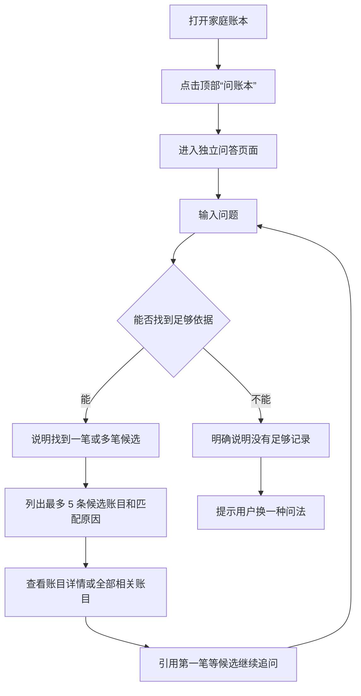

# “问账本”RAG 问答需求

## 问题背景

当前账本已经支持按月份、具体日期、付款人、收支类型和类目筛选，也能查看月度统计。这些能力适合条件明确的查询，但用户只记得大概金额、用途、时间或备注线索时，仍很难从历史记录中找回目标账目。

“问账本”第一版优先解决“模糊找账”，并辅助完成有明确范围的简单金额汇总或比较。它不是通用聊天、趋势分析或理财建议工具；每个回答都必须来自当前家庭的真实账目，并提供可以核对的原始记录。已有统计页继续承担多月份趋势查看，避免两套功能重复。

## 用户流程

## 需求

**入口与会话**

- R1. 账本首页顶部提供“问账本”入口，点击后进入独立页面；它不替代现有月份、日期、付款人、类型和类目筛选。
- R2. 问答页面采用连续聊天形式，支持当前页面内追问；用户可以补充线索，也可以用“第一笔”“第二笔”引用上一轮候选账目继续询问。
- R3. 用户退出问答页面后结束本次会话；问题和回答不进入产品内的长期历史记录。
- R4. 两名家庭成员都可使用同一份家庭账本提问，但各自的提问过程互不可见。
- R21. 首次进入页面时显示功能边界、当天剩余次数和可填入输入框的示例问题；示例不能直接提交，避免误消耗次数。

**可回答范围**

- R5. 第一版以模糊找账为核心，并支持能够由账目直接计算的简单金额汇总或比较；多月份趋势变化继续使用现有统计页，不在问答中重复实现。
- R6. 可读取的账目信息仅包括金额、日期、付款人、收入或支出、类目和文字备注。
- R7. 第一版不读取凭证图片，不提供消费建议、预算建议、理财建议，也不推测用户消费原因。
- R8. 默认检索当前家庭的全部未删除账目，不受用户进入问答页前所选月份和筛选条件影响；已删除账目不参与回答。
- R22. 每次新问题和连续追问都必须重新核对当前账目；不能把上一轮模型回答当成新的事实来源。

**回答与依据**

- R9. 找账回答先说明找到一笔还是多笔候选，再按当前回答内稳定的“第 1 笔”到“第 5 笔”列出候选账目；超过 5 条时提供“查看全部”。不能在存在多笔合理候选时冒充已经找到唯一答案。
- R10. 候选账目、参与计算的账目和全部结果均可进入原账目详情，用户能够核对日期、金额、类目、付款人和备注。
- R11. 金额汇总或比较必须明确说明所使用的时间范围和统计口径；金额合计由账本数据直接计算，模型只能组织表达，不能自行心算或改写计算结果。
- R12. 找不到足够依据或只命中日期等单一弱线索时，明确显示“账本里没有足够记录”，并建议补充金额、用途或大概月份；不得为了凑结果展示关联很弱的账目，也不得使用常识补充、猜测原因或编造账目。
- R28. 日期范围和收入或支出类型属于硬条件，不能为了找到结果而放宽；金额、类目和文字备注可以按照用户的模糊表达做适度匹配。
- R29. 每条候选账目都要显示简短匹配原因，例如“金额接近 200 元”“备注与火锅相关”；不展示容易让用户误以为精确可靠的匹配百分比。
- R30. 模糊条件放宽后必须展示账目的真实金额、日期、类目和备注，不能把实际记录改写成用户原先描述的内容。
- R31. 上一轮候选只用于理解“第一笔”等指代；继续追问时仍要核对该账目当前是否存在以及内容是否变化。
- R32. 用户提出多月份趋势问题时不消耗每日次数；页面说明此能力由现有统计页提供，并给出可点击的“查看统计”入口，不自动跳转打断用户。
- R33. 被引用的候选账目已经删除或发生变化时，回答必须说明记录已变化或无法继续查看，不能继续展示缓存中的旧内容作为当前事实。
- R34. “简单金额汇总或比较”仅包括按明确条件计算一个总额，或比较两个明确时间范围或两名成员的总额；不生成多阶段趋势、原因分析、预测或建议。

**额度与可用性**

- R13. 每个家庭每天最多提交 10 次有效问题，两名成员共享这 10 次；每次连续追问也计为一次。正常答案和“没有足够记录”都属于已完成提问并计数。
- R14. 空白、过长或明显不属于账本的问题应在提交前提示，不消耗每日次数；模型或云端网络调用未完成时不得扣除次数。若云端已经完成回答、仅手机未收到响应，相同提交重试必须返回原结果并仍只计一次。
- R15. 页面清楚显示当天剩余次数。次数用完后，问答入口仍可进入，但不能继续提交，并说明次日恢复。
- R16. 优先使用云开发提供的模型体验额度。体验额度耗尽或模型不可用时，停止问答并说明原因，不得自动开通付费、自动购买资源或影响记账、筛选、统计等原有功能。
- R17. 提交中必须防止重复点击；超时或网络失败时保留当前问题，允许用户重试。
- R23. 页面必须分别覆盖初始、正在回答、正常答案、没有依据、服务失败、当天次数用完和平台体验额度耗尽状态，不能用同一条含糊提示代替。

**数据与隐私**

- R18. 每次提问只能读取当前微信身份所属家庭的账目，不能接受前端传来的家庭编号或成员身份作为可信依据。
- R19. 返回内容不得包含家庭内部编号、成员内部编号或数据库内部字段。
- R20. 应用主动写入的业务日志不得包含问题、回答或检索到的账目内容；为了限制次数而保存的信息只能记录家庭、日期和次数，不能记录提问正文。平台自身日志是否包含这些内容必须在发布前核实。
- R24. 首次使用前应明确告知用户：相关账目信息会发送给云端模型用于本次回答；用户不同意时可以退出且不影响账本其他功能。
- R25. 每次只向模型提供完成当前回答所需的最少账目，不发送凭证图片、内部编号或无关账目。
- R26. 账目备注和用户问题都只能作为待处理内容，不能改变身份校验、读取范围、每日次数或“不允许猜测”等规则。
- R27. 模型访问凭据只能保存在云端安全配置中，不得写入小程序、文档或版本库。
- R35. 为连续追问和断网重试临时保留的信息只能用于当前会话，并应自动失效；用户退出后不能在产品中重新打开，不能转化为长期问答历史。

## 成功标准

- 用户能够用“去年买电饭煲是哪一笔”“帮我找两百元左右的火锅消费”等模糊表达，在前 5 条候选中找到目标账目并理解每条候选的匹配原因。
- 用户能够完成“上个月餐饮花了多少”等简单金额计算；“最近三个月有什么变化”等趋势需求会被引导到现有统计页，而不是生成重复或猜测性分析。
- 对同一批账目重复提问时，金额计算准确，时间范围、付款人和收支类型没有混淆。
- 回答下方的候选账目能进入正确详情，“查看全部”不会遗漏实际匹配或参与计算的账目。
- 存在多笔相似结果时不会断言其中一笔就是目标；用户可以用“第一笔”等表达继续确认。
- 趋势问题不会浪费每日次数，用户可以自行点击进入现有统计页。
- 连续追问会根据最新账目重新计算；会话期间新增、编辑或删除账目后，不继续沿用已经过期的回答。
- 无依据问题不会得到猜测性回答；询问理财建议或家庭账本以外内容时会被明确拒绝。
- 两名成员同时提问时，每日 10 次限制不会被绕过，也不会读取其他家庭的数据。
- 模型额度耗尽、网络失败或问答服务关闭时，原有账本功能继续正常使用，不产生自动付费。
- 退出问答页再进入时，不展示上一次的提问和回答。
- 首次使用提示能让用户在发送账目之前知道数据用途；拒绝后不会消耗次数或影响原账本。

## 范围边界

- 不读取或识别凭证图片。
- 不提供预算、消费评价、理财或投资建议。
- 不在问答页提供多月份消费趋势分析；此类需求继续使用现有统计页。
- 不分析两名成员谁“花得合理”，不做关系评价。
- 不保存跨页面、跨天的聊天记录。
- 不支持语音提问。
- 不替代现有账本筛选和统计。
- 不保证体验额度永久存在；额度和模型规则以云开发控制台当时显示为准。

## 关键决定

- 使用标准 RAG：先从当前家庭账本中取得相关记录，再让模型根据这些记录回答。
- 输入开放、回答受限：用户可以自然提问，但系统只能回答有账本依据的事实。
- 模糊找账优先：当前筛选和统计已经覆盖明确条件查询，问答首先解决“只记得部分线索”的找回问题。
- 硬条件与软线索分开：日期和收支类型不可放宽，金额、类目和备注允许适度模糊，既提高找回率又避免越找越偏。
- 多候选而非替用户决定：相似账目最多列出 5 条并解释匹配原因；证据弱时宁可要求补充线索，也不展示牵强结果。
- 聊天式交互：保留连续交流体验，并允许引用上一轮候选；账目本身仍以可点击卡片呈现。
- 趋势留在统计页：问答只保留简单金额计算，避免重复建设已有能力。
- 独立页面而非首页常驻输入框：避免让已有账本首页更加拥挤，并给连续追问和依据列表留出空间。
- 当前页面内连续追问：保留自然交流体验，同时避免长期保存聊天记录和持续增加上下文消耗。
- 每个家庭每天 10 次：以少量用户和体验额度为前提，先控制消耗，再根据真实使用观察是否调整。
- 第一版排除凭证图片：先降低额度消耗与隐私风险，验证文字账目问答是否真的有人使用。
- 小规模试用优先：先观察真实问题能否得到有依据的回答；如果大多数问题仍靠现有筛选即可完成，或“没有足够记录”的比例过高，则不继续扩大范围。

## 依赖与假设

- 当前云开发环境能够领取或使用模型体验额度；具体可用模型、剩余额度和有效期需要在实施前通过控制台确认。
- 用户持续填写类目、付款人和金额；文字备注可能为空，因此没有备注时只能依据明确字段回答。
- 初期家庭数量和每日提问量较少，10 次上限足以覆盖试用。

## 待实施阶段确认

- 选择控制台当前可用且适合中文短问答的内置模型，并核实体验额度、有效期和额度耗尽后的实际返回状态。
- 建立一组代表性问题和固定账目样本，用来验证金额、日期、成员、类目和连续追问是否准确。
- 确认“服务失败不扣次数”和两名成员同时提交时的次数处理方式，避免重复扣减或超额使用。
- 确认模型调用过程中不会把完整问题和家庭账目写入平台日志；若平台日志不可关闭，需要在发布前重新评估隐私说明和可接受范围。
- 确认全部历史账目增长后的检索范围、响应时间和单次发送上限，避免家庭使用时间越长，问答越慢或额度消耗越大。
- 用固定样本确定“关联很弱”的拒绝边界，保证只命中日期等单一线索时不会返回大量无关候选。

## 本轮考虑过的方向

- 以快速计算为主：与当前筛选和统计能力重复较多，不作为第一优先级。
- 同时提供完整趋势分析：价值存在，但会扩大第一版范围并与统计页重叠，本轮暂不采用。
- 完全严格匹配：结果更可预测，但用户只记得大概金额或用途时很容易查不到，因此改为“硬条件严格、软线索模糊”。
- 自动选出唯一账目：界面简单，但容易把相似记录误认成目标，改为展示候选并让用户确认。

## 下一步

需求无待用户决定的问题。下一步同步更新 `docs/prd/010-ledger-rag-qa-prd.md` 和现有实施计划，使开发范围以本轮“模糊找账优先”的决定为准。
