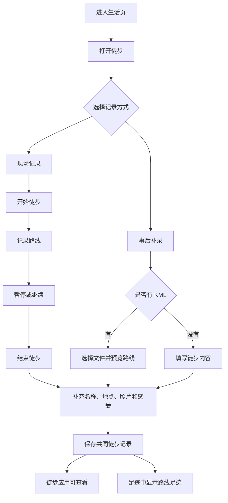

# “生活”入口与共同徒步记录需求

## 问题说明

睦录目前通过事项、账本和足迹保存两个人的共同生活，但“足迹”主要记录去过的地点和回忆，不能完整表达一次徒步走过的路线、耗时、距离和爬升成果。用户希望增加一个“生活”入口，逐步承载减肥、骑行、徒步和追星等共同生活应用，并先完成可以实际使用的徒步记录。

第一版既要支持徒步时现场记录，也要允许事后补录和导入 KML 路线。一次同行徒步只形成一条共同记录，保存后同时出现在徒步应用和现有足迹中。

## 使用流程

## 需求

**“生活”入口**

- R1. 底部增加第五个入口“生活”，页面用于展示两个人共同使用的生活应用，不展示陌生人动态或公开内容。
- R2. 第一版固定展示“徒步、减肥、骑行、追星”四张应用卡片，不提供添加、移除、排序或个人常用列表。
- R3. “徒步”卡片可以进入使用；减肥、骑行和追星卡片明确显示“即将开放”，不提供无内容的跳转入口。

**共同徒步记录**

- R4. 徒步记录属于当前家庭，保存成功后双方都能查看、补充照片、修改文字内容和更换 KML 路线。
- R5. 两个人同行时只产生一条共同记录，由其中一人负责现场记录；另一位成员在保存完成前看不到实时路线或当前位置。
- R6. 徒步首页提供“开始徒步”和“补录徒步”两个明确入口，并展示双方已经保存的共同徒步记录；没有记录、加载失败和重复点击时均有明确反馈。
- R7. 现场记录和无路线补录支持填写名称、日期、地点、照片和感受，照片数量沿用现有足迹的最多 3 张规则。KML 导入只要求存在有效路线，文件缺少日期、地点或其他内容时仍可保存，并在缺失位置显示“暂无数据”。

**现场记录**

- R8. 用户主动点击“开始徒步”并同意位置用途后才开始记录；打开生活页、徒步页或查看历史记录时不得自动获取或持续记录位置。
- R9. 记录中展示当前路线、距离和有效徒步时长，并提供“暂停、继续、结束”操作；暂停期间不累计时长和平均速度，也不补画暂停期间缺失的路线。
- R10. 第一版以小程序保持打开时稳定记录为交付标准。没有后台定位能力时，用户离开小程序后不得声称仍在记录；返回后应明确提示记录曾中断，并允许继续或结束。中断前后的路线分段展示，不得把无法确认的两个位置直接连成一段虚假路线。
- R11. 只有当前小程序账号实际通过对应类目与接口审核、用户也明确授权后，才开放锁屏或离开小程序后继续记录；权限不可用时不影响前台记录、手动补录和 KML 导入。
- R12. 现场记录被意外关闭或手机重启时，在记录者本机保留未完成路线；再次打开后优先提示“继续记录”或“结束并保存”。记录过程中主动退出时也要先提示继续、暂存或放弃，放弃必须再次确认。未完成路线不会自动共享给另一位成员，也不会自动进入足迹。

**事后补录与 KML 导入**

- R13. 事后补录不强制提供路线。用户可以只填写名称、日期、地点、距离、时长、照片和感受；没有路线或海拔时明确显示“暂无数据”。
- R14. 微信小程序内从聊天会话选择 KML 文件。文件先在记录者本机读取并展示路线预览和能够识别的成果数据，用户确认保存前不上传路线、不生成共同记录。
- R15. KML 只要包含可识别的有效路线即可保存；缺少日期、时长、平均速度或海拔时，对应位置显示“暂无数据”，不强迫用户补填，也不猜测结果。
- R16. KML 一律按外部不可信文件处理，不访问文件中引用的外部地址，不执行文件内容。文件无法读取、没有有效路线、内容损坏或超过已公布限制时，不生成记录，保留当前填写内容并说明失败原因，允许重新选择文件。
- R17. 保存后双方都可以重新导入 KML 更换路线。更换前必须预览新路线和将被更新的成果数据；只有用户确认且保存成功后才替换旧路线。失败或取消时继续保留原路线、名称、日期、地点、照片和感受。

**成果与路线足迹**

- R18. 有相应数据时展示距离、时长、平均速度、累计爬升、最高海拔和最低海拔；没有可信数据时显示“暂无数据”，不能用默认值冒充实际成果。
- R19. 平均速度只使用有效徒步时长计算，手动暂停的时间不计入；第一版不自动判断用户是否正在休息。
- R20. 徒步保存成功后自动成为一条“路线足迹”，无需再次确认或重复填写。足迹地图总览只显示一个样式明确的“徒步路线”标记，不铺开完整路线；足迹列表显示徒步卡片，点击标记或卡片后进入详情查看完整路线、徒步成果、照片和感受。没有路线的手动补录使用所选地点显示普通的徒步标记。
- R21. 徒步应用和足迹展示的是同一条共同记录，不产生两份需要分别维护的内容；任一入口修改后另一入口保持一致。
- R22. 双方都可以删除共同徒步记录。删除前必须二次确认，删除后徒步列表和足迹中同时停止展示，不保留只剩一边的记录；后续清理期限沿用现有足迹的 30 天规则。

**隐私、权限与失败保护**

- R23. 只有当前家庭成员能查看和修改已保存的徒步记录，成员身份和家庭归属必须由云端按当前登录身份重新确认，不能相信手机提交的成员或家庭编号。成员离开家庭后不能继续访问原家庭的徒步路线、照片或感受。
- R24. 位置权限被拒绝或后台记录能力不可用时，页面说明受影响的能力，并继续提供手动补录和 KML 导入，不能阻塞整个徒步应用。
- R25. 保存、结束、替换路线和删除期间防止重复操作；操作失败时保留能够恢复的路线与填写内容，并提供重试或返回选择。两个人同时修改同一条记录时，不得用后提交的旧页面静默覆盖新内容，应提示记录已变化并保留当前草稿供用户刷新后重试。
- R26. 徒步路线和未完成记录不得用于实时查看另一位成员位置，也不扩展为公开分享、好友排行榜或安全监控功能。
- R27. 普通运行日志不得记录完整路线坐标、KML 原文、照片内容或徒步感受；排错信息只保留错误类型、文件大小、路线点数量等不直接暴露行踪的必要信息。
- R28. 现场定位信号过弱、长时间没有取得有效位置或路线出现明显中断时，页面要持续显示当前状态；用户仍可暂停、结束或保留未完成记录，不能把未知位置计算成真实路程和爬升。

## 成功标准

- 用户能从底部“生活”入口找到徒步应用，并清楚区分可用应用与“即将开放”应用。
- 用户能完成“开始—暂停—继续—结束—补充内容—保存”的现场记录流程，保存后双方都能查看同一条共同记录。
- 用户能在没有路线文件时补录旧徒步，也能从微信聊天选择有效 KML 并在保存前预览路线。
- 同一条徒步在徒步应用和足迹中的路线、成果、照片和感受保持一致，修改或删除后不会出现两边内容不一致。
- 足迹地图总览能通过专属标记识别徒步记录，且多条路线不会在总览中同时铺开；进入详情后可以查看完整路线。
- 没有位置权限、没有后台记录资格、KML 缺少部分数据或现场记录被中断时，用户仍能理解当前状态并保住已有内容。
- 第一版不依赖后台定位审批也能完成前台记录、事后补录、KML 导入和共同回看。

## 范围边界

- 第一版不实现减肥、骑行和追星功能，只展示“即将开放”卡片。
- 不做陌生人动态、公开路线、好友关系、排行榜、点赞或评论。
- 不向另一位成员实时共享徒步中的位置和路线。
- 不做自动休息判断、热量计算、每公里速度、运动训练建议或健康建议。
- 不提供手动画路线；没有现场路线时可保存无路线记录，或者由用户导入 KML。
- 不承诺锁屏或离开小程序后继续记录；只有账号和用户权限均满足时才作为增强能力开放。
- 不接入需要自动付费的地图、运动或文件处理服务。

## 关键决定

- 入口命名为“生活”：比“广场”更符合两个人共同生活工具的定位，也不会暗示公开社区。
- 所有应用固定展示：第一版不增加应用安装和个人排序概念，降低理解与维护负担。
- 一次徒步一条共同记录：避免两个人同行时产生重复路线和重复回忆。
- 保存后自动进入足迹：徒步成果与共同回忆只维护一次，并在两个入口保持一致。
- 足迹总览使用路线标记：总览保持清晰，完整路线只在详情中展开。
- 支持无路线补录：旧徒步不会因为没有现场记录或 KML 而无法保存。
- 后台记录按资格开放：前台记录是基本能力，后台记录不作为未经审核时的发布承诺。

## 依赖与假设

- 微信小程序只能从客户端聊天会话选择文件，用户可能需要先把 KML 发送到文件传输助手或聊天中。
- 后台持续定位需要当前账号通过微信规定的服务类目审核并开通相应接口；当前账号是否具备资格必须在微信公众平台实际确认。
- KML 文件可能只包含路线点，也可能附带海拔或时间；产品按实际可识别内容展示，不假设所有文件结构相同。
- 当前项目只声明了主动选择地点所需的位置用途，尚未具备持续记录和后台定位的完整声明；开发前必须补齐与最终开放能力一致的用途说明，并以微信后台实际审核结果为准。
- 页面和真机需要分别验证，因为地图路线、文件选择、定位中断和锁屏行为不能只靠普通页面检查确认。

## 待后续安排确认

### 开始开发前必须确认

- 无。

### 制定实施安排时确认

- [关联 R11][需要核验] 当前小程序账号是否具备后台持续定位所需类目和接口权限；不具备时隐藏该增强能力。
- [关联 R14-R17][需要核验] 第一版明确支持的 KML 路线写法、坐标处理、文件大小与路线点数量上限，以及超限时的友好提示。
- [关联 R9、R12][需要核验] 微信前后台切换、异常退出和重启后能够可靠保留的现场记录范围，并据真机结果确定中断提示细节。
- [关联 R18-R19][需要核验] 现场海拔噪声和累计爬升的合理处理方式，避免把定位漂移计算成真实爬升。

## 下一步

需求确认后，进入分阶段实施安排；先完成“生活”入口和无后台依赖的完整徒步闭环，再单独验证后台记录增强能力。
