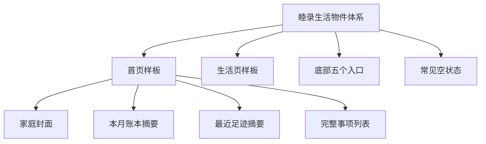

# 睦录温馨生活视觉体系需求

## 问题说明

睦录现有页面已经具备统一的奶油白、薄荷绿和蜜桃珊瑚配色，但大量内容都由白色卡片、普通线性图标和文字组成。页面清楚可用，却缺少能够让人联想到“两个人共同生活”的独特视觉语言。

本次改造的目标不是更换主题色或增加大量装饰，而是在不减少现有信息、不改变现有功能的前提下，通过生活物件图标、小场景插画、真实头像和克制的反馈，让小程序更温馨、更有睦录自己的辨识度。

## 页面关系

## 需求

**统一视觉语言**

- R1. 保留现有奶油白、薄荷绿、深薄荷绿和少量蜜桃珊瑚的主题，不增加新的主色。
- R2. 新增图标和小插画统一采用圆润线稿与少量平面色块，整体年轻、温暖，但不做成儿童插画。
- R3. “两个人”的表达只用于家庭、共同事项、共同足迹等重点场景，通过双杯、并排拖鞋、共同钥匙、双脚印等成对物件表现；每组成对物件都遵循“两个略有差异的物件并排，加一个共同小勾或两点光芒”的睦录印记，延续现有 Logo。编辑、删除、筛选等普通操作继续使用单个清晰图标。
- R4. 底部“首页、账本、足迹、生活、我的”五个入口保留原含义和文字，统一重画为同一套圆润线稿；选中状态只增加少量品牌色块，不使用难以理解的新隐喻。
- R5. 主标题、金额、按钮和列表使用清楚易读的正常文字；手写感仅用于家庭封面、小标签或插画旁的短句。

**首轮样板范围**

- R6. 首轮改造首页、生活页、底部五个入口，以及当前确实存在的事项、账本和足迹空状态；账本和足迹首轮只修改空状态区域，不改其正常内容、筛选、列表和操作流程。确认整体视觉方向后再决定是否扩展到完整账本页、足迹页、我的及各个填写和详情页。
- R7. 首轮样板必须形成一套可复用的视觉规则，不能让首页、生活页和空状态分别采用互不相关的画风。
- R7.1. 样板阶段额外检查高密度事项列表、高密度账目列表和含照片足迹三种压力场景，只验证视觉规则能否延展，不把对应页面的整体改造纳入首轮。

**首页**

- R8. 首页顶部使用紧凑的家庭封面，以家庭资料和两位成员头像为主要内容，双杯、共同钥匙等生活物件只作陪衬；家庭封面不得挤占过多首屏空间。
- R8.1. 单成员家庭只展示当前真实成员头像，另一侧使用淡化占位和“等另一位加入”提示，并保留邀请入口；不得用虚构头像或品牌双人形象冒充已加入成员。成员头像缺失或加载失败时沿用现有默认头像。
- R9. 首页内容顺序固定为：家庭封面、本月账本摘要、最近足迹摘要、事项列表、已完成事项入口。
- R10. 本月账本摘要继续显示本月支出和本月收入，不得退化成只有图标和标题的入口。
- R11. 最近足迹摘要继续显示地点数量、最近地点和日期；有封面照片时继续展示照片，没有照片或加载失败时使用同风格的品牌占位画面，并保留进入足迹页的入口。
- R12. 事项列表继续完整显示，并保留“优先处理、快到期、快没了、待处理”的现有分组；不得为了画面简洁只展示少量事项或隐藏后续内容。
- R13. 事项行保持紧凑清楚：生活物件图标位于左侧，事项名称为主要信息，成员头像、时间和状态为辅助信息；不为每一行增加大图片或厚重卡片。
- R13.1. 首页家庭封面、账本摘要、足迹摘要、事项行和已完成事项入口沿用现有点击目标与返回行为；视觉改造不得改变入口含义、增加额外步骤或把不可用状态伪装成可点击。

**生活页**

- R14. 生活页采用“共同生活小架子”的整体构图，不继续使用整齐重复的普通卡片网格。
- R15. 当前可用的徒步入口必须最醒目，使用成对徒步鞋、路线或相片等生活物件表达；尚未开放的入口放在下方并明确弱化，不能比可用入口更抢眼。
- R15.1. 生活页固定分为页面说明、当前可用工具和即将开放工具三个层级；当前可用工具整项可点击，即将开放工具不可点击并显示“即将开放”。首轮仍以徒步为唯一主要入口，未来出现多个可用工具时再单独确认排序规则。
- R16. 生活页仍然是当前家庭私密使用的共同生活工具入口，不增加公开动态、陌生人内容或伴侣监督暗示。

**空状态与反馈**

- R17. 事项、账本和足迹的空状态使用两至三个生活物件组成的小场景，例如便签板与笔、小票夹与硬币、相片与双脚印；不为当前不存在空状态的生活页制作无效素材，也不使用完整房间或大幅户外插画。
- R18. 空状态插画必须服务于下一步操作，标题、说明和主要按钮仍然清楚可见，不能只承担装饰作用。
- R19. 首轮只在本次改造的页面加入克制的小反馈：页面内容首次进入时轻微出现，按钮按下时轻微回弹；不修改首轮范围外的事项详情页，因此事项完成盖章延后到详情页改造阶段。动效不得叠加，离开页面立即结束，操作失败时不显示成功反馈，结束后不改变内容布局；无法确认系统减少动态效果偏好时，应提供不依赖动画也能理解的静态反馈。

**完整状态与真实体验**

- R20. 改造后的页面继续覆盖加载、失败、空数据、正常数据和重复点击保护，不能只设计理想状态。
- R20.1. 首页各区块继续独立呈现状态：家庭资料失败可以整页重试；账本摘要或足迹摘要失败时只影响对应区域并保留入口；事项加载失败时不隐藏已经成功显示的家庭、账本和足迹内容；重复点击沿用现有保护，不因新动效延长等待。
- R21. 新增图片和图标必须控制数量与体积，优先使用小尺寸、可复用素材；不能为了温馨感明显拖慢首屏加载。
- R22. 视觉稿只用于确认氛围和层级，最终页面必须以真实中文内容、真实列表密度、常见小程序窄屏和系统字体放大场景进行检查。
- R23. 窄屏或较大系统字体下，家庭名、地点和事项名称允许合理换行，辅助信息可以移动到下一行；金额和主要状态不得被装饰物遮挡或截断。所有主要点击区域保持易于触碰，装饰性图片不承担唯一含义，并从辅助说明中隐藏。

## 成功标准

- 用户进入首页时能首先感受到“这是我们共同生活的空间”，同时无需寻找就能看到本月账本、最近足迹和全部待办事项。
- 首页、生活页、底部入口和空状态看起来属于同一个品牌，不像拼接了不同来源的图标和插画。
- 增加温馨感后，金额、事项、时间、负责人、按钮和状态仍然清楚，列表浏览效率不低于改造前。
- 未开放的生活应用不会抢走徒步入口的注意力。
- 常见窄屏、较大系统字体、无照片、加载失败和空数据情况下，没有明显遮挡、溢出或无法操作的问题。
- 使用同一设备和同一组高密度数据，对照改造前后查找最紧急事项、确认负责人和时间、查看本月支出三个任务；不得出现明显误读，首屏可见信息不能因装饰大幅减少。
- 页面检查、相关自动检查、微信小程序构建和包体积检查通过，并在微信开发者工具中完成首页、生活页、列表、空状态和轻微反馈的实际视觉确认。
- 底部五个入口先用真实显示尺寸验证选中与未选中状态；用户能够结合文字快速辨认，并保留现有图标作为首轮验收结束前的回退方案。
- 首轮样板只有在用户确认页面气质正确、关键信息没有减少、列表查找没有明显变慢且真实设备显示正常后，才进入全站扩展；部分满足时先调整样板，未满足时回退，不长期保留无法继续扩展的两套视觉。

## 范围边界

- 本次不改变现有主题色和 Logo。
- 本次不新增账本、事项、足迹或生活应用的业务功能。
- 首轮不整体改造账本、足迹、我的及所有填写和详情页面；账本与足迹只允许修改已明确纳入的空状态区域和视觉压力测试稿。
- 不使用传统爱心、拥抱人物、婚礼元素、带烟囱房屋、排名、打卡或监督式视觉。
- 不使用大量通用生活照片、完整房间插画、复杂渐变、强阴影或持续动画。
- 不因为视觉调整减少首页现有账本、足迹和事项信息。

## 关键决定

- 选择圆润线稿与少量色块，因为它能在温馨感、清晰度和小尺寸表现之间取得平衡。
- 只在重点共同场景使用成对物件，避免所有功能图标都被强行情侣化。
- 成对物件固定使用“两个略有差异的物件并排，加一个共同小勾或两点光芒”的睦录印记，以延续现有 Logo 并避免通用生活插画感。
- 底部入口保留熟悉含义后统一重画，优先保证第一次使用时容易理解。
- 首页以家庭资料和两人头像为视觉中心，不依赖用户必须先上传足迹照片。
- 单成员家庭使用真实头像和“等另一位加入”占位，不虚构第二位成员。
- 首轮先完成一套样板再扩展全站，降低整站同时调整造成的返工风险。
- 温馨感主要放在页面顶部、空状态和操作反馈中；列表继续以清楚、紧凑和好用为首要目标。

## 待实施阶段确认

- 核对底部五个新图标和首轮生活物件在实际小尺寸下是否清楚，无法辨认的图形应在制作阶段替换。
- 依据首轮素材的实际大小确定最终压缩尺寸，并重新检查主包体积。
- 使用真实页面数据确认家庭封面的最大高度、事项列表密度和较大系统字体下的排版。

## 下一步

2026-09-20，用户已确认 `docs/prd/018-warm-life-visual-system-prd.md`。下一步进入结构化实施计划；当前尚未开始修改页面。
