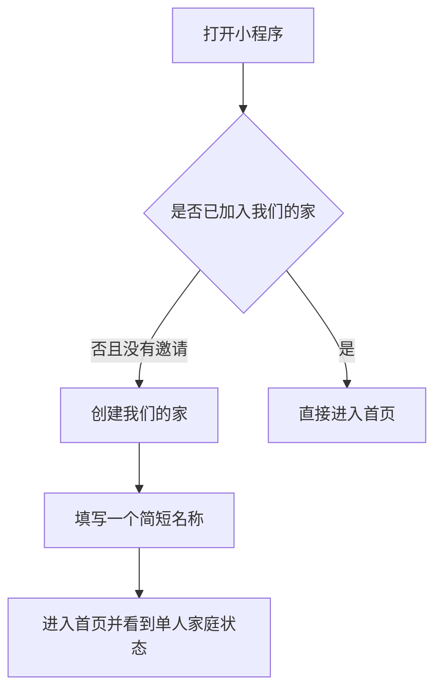
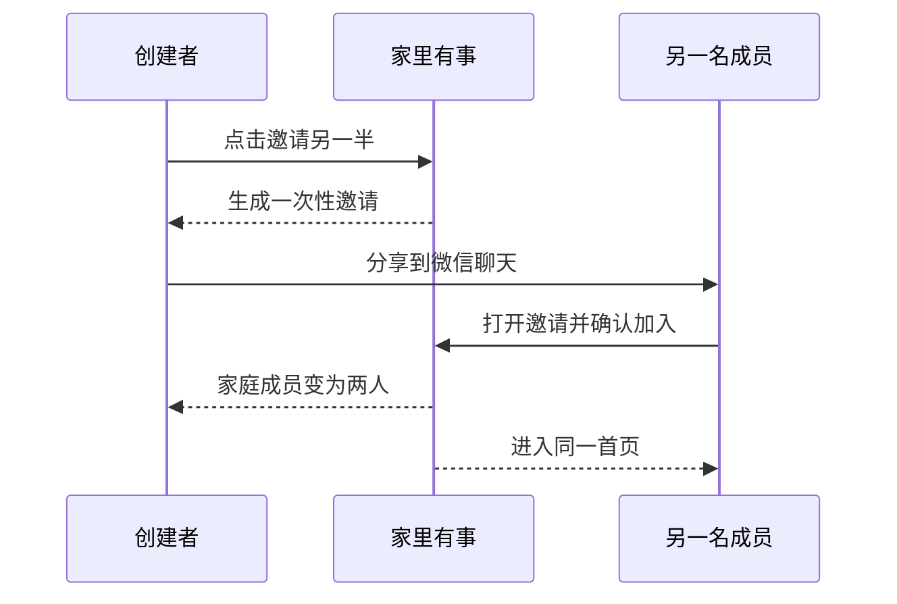

# 家里有事 MVP 产品设计方案

## 一、产品要解决的问题

同居情侣或年轻夫妻的生活事项，常常散落在聊天记录、脑子里和临时提醒里。结果是：一方不断提醒，另一方不知道优先级；纸巾、洗衣液等快用完才发现；房租、会员、滤芯等到期后才处理。

“家里有事”不把两个人变成互相监督的人，而是让两个人共同看到、共同认领、共同完成家里的事情。

## 二、第一版的目标

让两名家庭成员在第一次使用后，可以顺畅完成下面这件事：

```text
创建我们的家 → 邀请另一半 → 添加一件事 → 认领或指定 → 完成 → 双方看到结果
```

第一版是否有效，只看这条流程能不能被真实情侣连续使用，而不追求功能数量。

## 三、目标用户与使用场景

### 目标用户

- 已同居的情侣。
- 新婚或共同生活的年轻夫妻。
- 两个人会共同购买日用品、安排家务、处理租房和生活事务。

### 高频场景

| 场景 | 用户想解决的事 | 产品应提供的帮助 |
| --- | --- | --- |
| 家里快没东西 | 纸巾、洗衣液、垃圾袋快用完 | 记下一条，另一方能看到并认领 |
| 有待办小事 | 退货、维修、报销、联系房东 | 明确谁来做、做到哪一步 |
| 有到期事项 | 房租、会员、滤芯、证件 | 提前显示，避免遗忘 |
| 不想反复提醒 | 一方不想承担“记得所有事”的压力 | 让事项公开可见，由双方处理 |

## 四、产品原则

- 记录一件事应足够快，常见事项不超过几步。
- 首页先告诉用户“现在该处理什么”，不堆砌统计数字。
- 默认使用温和、中性的文字，避免“谁没做”“谁拖延了”等评价。
- 两个人拥有同样的查看和处理能力，不做积分、排名和惩罚。
- 任何家庭资料只对这两名成员可见。

## 五、MVP 范围

### 要做

- 创建一个仅含两名成员的“我们的家”。
- 通过微信分享邀请另一名成员加入。
- 新增、认领和完成事项。
- 三类事项：快没了、待处理、快到期。
- 截止日期、负责人和备注。
- 首页优先展示、基础空状态和关键操作记录。
- 网络失败、重复操作和无权限时的清楚提示。

### 暂不做

- 记账、分账、支付和购物。
- 情侣测试、积分、排行榜、惩罚和贡献度统计。
- 公开社区、评论、陌生人社交。
- AI 建议、识图、扫描小票、地图和定位。
- 图片或视频上传、复杂提醒、多家庭和儿童账号。
- 重复事项、模板管理、编辑、转交、重新打开和完整历史记录。

## 六、核心概念

| 名称 | 产品中的含义 |
| --- | --- |
| 我们的家 | 两个人共享事项的唯一空间，第一版最多两人 |
| 事项 | 一件需要共同记住或处理的生活小事 |
| 负责人 | 当前主要处理该事项的人，也可以暂时无人负责 |
| 认领 | 成员主动接下无人负责的事项 |
| 操作记录 | 创建、认领、完成等关键变化 |

### 事项类型与状态

| 类型 | 适合记录的内容 | 首页位置 |
| --- | --- | --- |
| 快没了 | 纸巾、洗衣液、垃圾袋、宠物用品 | 其他事项 |
| 待处理 | 退货、维修、报销、预约、联系房东 | 其他事项 |
| 快到期 | 房租、会员、滤芯、保修、证件 | 其他事项 |

事项状态固定为：**待处理 → 已认领 → 已完成**。

指定负责人等同于已认领。任何一名家庭成员都可以完成事项，系统会记录实际完成者；这样不会因为负责人暂时不方便而卡住。第一版暂不提供“处理中”、转交和重新打开。

## 七、关键用户流程

### 1. 第一次使用



当前按阶段交付：PRD 003 先完成创建家庭、单人家庭首页和初始形象；邀请入口在邀请功能实现后再开放，不在创建家庭阶段展示不可用入口。

### 2. 邀请另一半



设计决定：邀请只在家庭未满两人时可用，有效期为 24 小时。创建者可以作废旧邀请后重新发送；云端只允许第一个有效确认者加入，家庭满两人后其余邀请自动失效。

受邀者从微信分享直接进入“确认加入某个家”，不会先看到创建家庭。受邀者已经在另一个家、邀请过期、邀请已被使用或家庭已满时，页面说明原因且不允许误建第二个家。

### 3. 添加与完成事项

1. 用户在首页点“快速添加”。
2. 选择类型，填写事项名称；其余内容均可稍后补充。
3. 可选择负责人、截止日期和备注。
4. 保存后，对方下次打开或刷新首页即可看到该事项。
5. 无负责人时，任一成员可认领；两名成员都可以完成。
6. 完成后，事项从待处理列表移到已完成记录。

## 八、页面设计

### 1. 创建或加入家庭页

**页面目的：** 让第一次进入的用户在一分钟内进入一个共同的家。

- 没有邀请时，主按钮：创建我们的家。
- 从邀请链接进入时，主按钮：确认加入这个家。
- 创建时只填写家庭名称，默认可用“我们的小家”。
- 已在家庭中的用户不再看到创建入口。

### 2. 首页

**页面目的：** 一眼看到最值得处理的事，并能快速新增。

首页固定包含：

- 优先处理：截止时间是今天或已逾期的未完成事项。
- 其他事项：按“快没了、待处理、快到期”三个类型显示。
- 底部固定“快速添加”按钮。

同一事项在首页只显示一次：已逾期或今天到期的事项优先进入“优先处理”；其他事项才按类型显示。排序规则为截止日期由近到远；没有日期的事项排在同类最后。

空状态不显示空白列表，而是用简短文字引导“先记下一件”。

### 3. 添加与编辑事项页

**页面目的：** 让用户不需要思考太多就能记下一件事。

必填：事项名称、类型。

可选：负责人、截止日期、备注。

默认值：新事项默认为“待处理”、无负责人。

### 4. 事项详情页

**页面目的：** 清楚显示一件事现在由谁处理、下一步能做什么。

- 顶部显示名称、类型、状态和截止时间。
- 无负责人：显示“我来处理”。
- 已认领：显示负责人；两名成员都能看到“完成”。
- 已完成：显示完成时间和实际完成者。
- 下方只显示创建、认领和完成三类记录。

### 5. 我们的家页

**页面目的：** 查看两个人和邀请状态。

- 显示两名成员及加入状态。
- 未满两人时显示邀请入口；已满两人时不再显示。
- 已完成事项入口。

第一轮体验期间不提供退出家庭和移除成员，避免误操作造成协作中断。两人均可查看家庭成员和邀请状态。

## 九、关键交互与提示

| 情况 | 提示方式 |
| --- | --- |
| 保存成功 | “已记下，对方下次打开或刷新首页就能看到” |
| 认领成功 | “这件事交给你了” |
| 完成成功 | “完成啦，辛苦了” |
| 家庭已满 | “这个家已经有两位成员了” |
| 邀请已失效 | “邀请已失效，请让对方重新发一份” |
| 无权查看 | “你还没有加入这个家” |
| 网络失败 | “暂时没连上，请稍后重试” |
| 重复点击 | 保持一个结果，不产生重复事项或重复记录 |

网络失败时保留用户已经填写的内容，并提供重试。创建家庭阶段先显示真实的单人家庭状态，不展示尚未开放的邀请入口；邀请功能上线后，刚创建家庭且尚未邀请时，首页主按钮再调整为“邀请另一位成员”。已发出邀请时显示“等待对方加入”和重新发送入口；两人都加入但还没有事项时，显示“先记下一件事”。

## 十、验收标准

- 两个微信账号可进入同一个家。
- 任一方新增事项后，另一方能看到。
- 双方都能认领和完成事项。
- 非成员无法查看或修改家庭内的事项。
- 首页中同一事项只展示一次，优先规则符合本方案。
- 在没有自建服务器的情况下，完整流程可用。

## 十一、权限与数据保护

- 每次查看、添加、认领和完成，都由云端根据当前微信账号确认其确实属于该家庭。
- 页面提交的家庭编号和用户身份不作为判断依据。
- 操作记录由系统生成，用户不能伪造或修改。
- 邀请确认和家庭人数校验在同一次云端处理里完成，避免两个受邀者同时加入。
- 新增和完成操作需要防止重复提交，确保一件事不会被重复创建或重复完成。

## 十二、首轮体验观察

邀请 5 至 10 对情侣试用七天，只观察以下问题：

- 创建家庭后，有多少人成功邀请另一半。
- 被邀请的人是否真的产生过添加、认领或完成行为。
- 有多少家庭中两个人都至少做过一次有效操作。
- 有多少事项由一人添加、另一人认领或完成。
- 每个家一周新增多少事项。
- 哪一类事项最常用。
- 用户觉得哪一步麻烦，或者为什么不愿意邀请另一半。

初步有效信号：10 对用户中至少 5 对连续使用 7 天，且至少两人各完成一次有效操作；每个家庭平均每周新增 5 件以上事项作为辅助指标。

## 十三、后续开发顺序

- [ ] 先完成创建家庭、单人家庭首页和初始形象。
- [ ] 再完成邀请和加入家庭。
- [ ] 再完成新增、认领和完成事项。
- [ ] 接着补齐首页优先规则、基础操作记录和空状态。
- [ ] 最后加入错误提示，邀请真实用户体验。
- [ ] 根据试用结果，再决定是否加入重复事项、模板和编辑功能。
