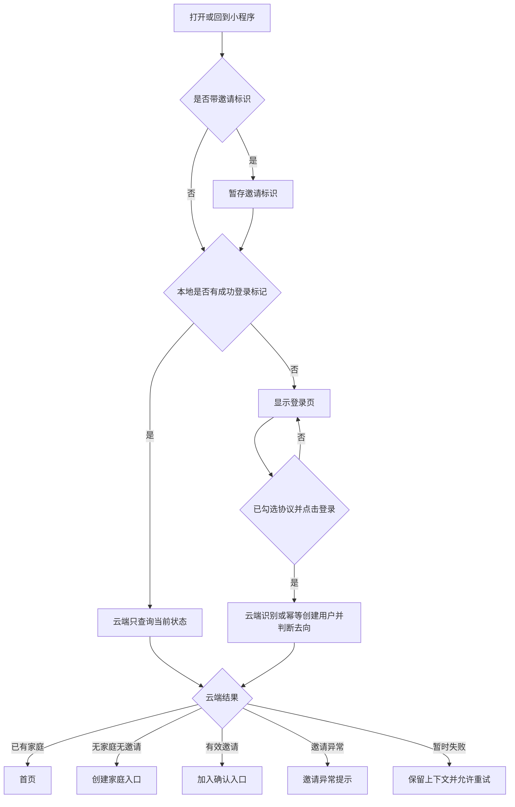

# feat: 建立登录与启动分流

## 概述

为“家里有事”增加第一个可实际使用的登录模块：未登录用户先看到温暖、明确的登录页，主动勾选协议并点击登录后，才由微信云端识别或创建应用内用户，再根据邀请和家庭状态进入正确页面。已有登录记录的用户再次打开时自动恢复；邀请失效、网络失败和重复点击都有明确结果。

本计划以 `docs/prd/001-login-prd.md` 为唯一产品依据，只处理登录及其必要入口，不展开创建家庭、加入家庭和首页业务。

## 问题与边界

当前项目只有示例首页，匿名用户可以直接进入；没有用户身份、登录页面、启动分流、云函数或邀请状态处理。若只制作一个漂亮页面而不建立可信的云端判断，后续家庭数据会缺少可靠的身份边界。

### 本次包含

- 登录页及品牌展示、协议勾选、处理中和失败状态。
- 微信云开发初始化和一个统一的登录/入口状态云函数。
- 最小用户资料的幂等识别或创建。
- 普通进入、邀请进入、已有家庭、邀请异常和已登录重开的分流。
- 创建家庭、加入确认和邀请异常的最小占位入口，用于完整验证登录流程。

### 本次不包含

- 手机号、微信昵称、头像、游客模式或账号密码。
- 用户协议和隐私政策正式正文及查看页面；这是正式发布前的独立必做项。
- 创建家庭、确认加入家庭、事项首页的实际业务功能。
- 退出或切换家庭；已有家庭的用户打开其他邀请时，只提示不能加入并返回自己的首页。
- 短信、邮箱、通知、埋点和完整账号注销。

## 需求对应

- R1-R4：未登录用户只见登录页，页面沿用现有 Logo、品牌颜色和确认文案。
- R5-R10：主动勾选协议后才能登录；登录中阻止重复操作；不获取手机号、昵称或头像。
- R11-R13：云端返回加入确认、首页或创建家庭三类正常去向。
- R14：取消、网络失败或云端失败时停留并可重试，不产生重复用户。
- R15：邀请信息跨登录保留并由云端复核；失效、已使用、已满员时不误入创建家庭。
- R16：有成功登录记录的用户重开时自动查询当前状态并进入正确页面。

## 已确认的项目现状

- `src/main.ts` 已安装 Pinia；现有 `src/stores/task.ts` 使用组合式 store，可作为状态组织方式参考。
- `src/App.vue` 已使用应用启动生命周期，但当前只输出日志。
- `src/pages.json` 只有 `pages/index/index`，目前没有登录或家庭入口页面。
- `src/manifest.json` 已配置微信 AppID 和 `cloudfunctions/`，但云端目录只有说明文件。
- `src/uni.scss` 与 `docs/brand/visual-standard.md` 已提供本页面需要的颜色、圆角和 Logo 规范。
- 项目已有类型检查和微信小程序构建命令；已有 `@dcloudio/uni-automator`，但尚无项目测试配置和测试文件。
- `docs/solutions/` 不存在，本模块没有可复用的历史经验。

## 关键技术决定

- **按钮代表产品登录意愿，不代表索取微信资料。** 用户点击后才调用云函数；不使用手机号、昵称、头像，也不使用已收回能力的用户资料接口。
- **微信身份只在云端取得。** 云函数从可信调用上下文取得当前用户身份；客户端不传也不保存微信身份、用户编号或家庭编号。
- **一个入口统一决定去向。** 云函数只接受可选邀请标识和调用意图，返回有限状态；前端不能自行判断邀请有效、是否已有家庭或家庭是否已满。
- **首次登录与恢复登录分开。** 首次主动登录允许幂等创建最小用户；重开恢复只查询，发现用户不存在时返回登录页，避免清理本地数据后自动创建身份。
- **邀请优先复核，但不能覆盖已有家庭。** 带邀请进入时先由云端校验；当前用户已有家庭则提示不能加入其他家庭，不消费邀请，随后返回自己的首页。
- **邀请只校验，不在本模块完成加入。** 有效邀请只进入加入确认占位页；真正加入和消费邀请由后续“加入家庭”需求负责，并再次校验。
- **启动页承担安全导航。** `App.vue` 只初始化云端、合并启动参数和触发状态查询；首个登录启动页在自身可见后消费一次性导航意图，再执行最终跳转，避免应用启动期间直接跳页造成白屏或重复导航。
- **最终跳转统一清空旧页面栈。** 登录完成或恢复完成后使用同一种最终跳转方式，避免用户返回登录页；同一启动周期复用一个在途请求，只消费一次导航结果。
- **页面保持轻，行为集中管理。** 登录页负责展示与触发，登录状态、邀请上下文、云端调用和去向集中在登录 store 与服务中。
- **三类集合默认拒绝客户端直连。** 用户、家庭和邀请只允许云函数读取或修改，小程序页面不能绕过云函数直接访问。
- **邀请标识按凭证保护。** 邀请使用服务端生成的高强度不透明值，云端只保存不可逆摘要；前端仅在本次登录与重试窗口保留原值，日志、错误提示和页面地址均不记录原值。

## 云端请求与响应契约

| 项目 | 允许值 | 约束 |
|---|---|---|
| 契约版本 | 当前单一版本 | 前后端版本不匹配时不继续分流，返回可重试错误 |
| 调用意图 | `login`、`resume` | `login` 允许幂等创建用户；`resume` 只查询、绝不写入 |
| 邀请标识 | 可选的不透明文本 | 云端限制格式与最大长度，拒绝空白、超长或异常值；不接受客户端判断结果 |
| 业务结果 | 入口状态表中的有限状态 | 只由云端产生，不返回微信身份或完整数据库记录 |
| 页面动作 | 固定目的页或“不跳转” | 路由层只消费页面动作；暂时失败始终不跳转 |
| 提示原因 | 有限文案编号 | 前端映射为用户文案，不展示内部错误 |
| 是否可重试 | 是或否 | 决定页面是否保留当前上下文和重试入口 |

`ALREADY_IN_HOME` 是一个明确的组合结果：只展示一次“已经加入一个家庭”的提示，随后进入自己的首页；它不进入加入页，也不消费邀请。`TEMPORARY_FAILURE` 没有页面动作，只恢复当前页的可操作状态。

## 最小数据边界

| 集合 | 本模块需要的数据 | 约束与权威来源 |
|---|---|---|
| `users` | 服务端生成的稳定身份键、创建时间 | 稳定身份键唯一且不返回前端；主动登录使用原子幂等写入，冲突后读取已有记录 |
| `households` | 家庭标识、最多两名成员的稳定用户键 | 成员列表是“用户是否已有家庭”和“家庭是否已满”的唯一依据；本模块只读 |
| `invitations` | 邀请摘要、家庭标识、过期时间、使用状态 | 邀请摘要唯一；不保存原始邀请值；本模块只读且不得改变使用状态 |

三个集合的客户端读写默认全部拒绝。服务端在完成所有只读判断后，才幂等确保用户记录存在；任何邀请或家庭查询失败都不先写用户。即使响应丢失，重试也只会读回同一条用户记录。

## 入口状态表

| 云端结果 | 条件 | 页面结果 | 是否创建用户 |
|---|---|---|---|
| `NEED_LOGIN` | 恢复查询找不到应用内用户 | 登录页 | 否 |
| `CREATE_HOME` | 用户无家庭且无邀请 | 创建家庭占位页 | 主动登录时允许 |
| `JOIN_CONFIRM` | 邀请有效、未使用、家庭未满、用户无家庭 | 加入确认占位页 | 主动登录时允许 |
| `HOME` | 用户已有家庭且没有冲突邀请 | 现有首页 | 主动登录时允许 |
| `ALREADY_IN_HOME` | 已有家庭用户打开其他家庭邀请 | 提示后回自己的首页 | 否 |
| `INVITE_INVALID` | 邀请格式异常、不存在或无权使用 | 邀请异常页，统一提示“邀请无效” | 不写用户，不泄露邀请是否存在 |
| `INVITE_EXPIRED` | 邀请已过期 | 邀请异常页 | 主动登录时允许最小用户资料 |
| `INVITE_USED` | 邀请已使用 | 邀请异常页 | 主动登录时允许最小用户资料 |
| `HOME_FULL` | 邀请对应家庭已满 | 邀请异常页 | 主动登录时允许最小用户资料 |
| `TEMPORARY_FAILURE` | 网络、云函数或数据库暂时不可用 | 保持当前页并重试 | 不产生额外写入 |

## 本地状态清理规则

| 结果 | 成功登录标记 | 待处理邀请原值 | 展示原因 |
|---|---|---|---|
| `NEED_LOGIN` | 清除 | 保留至用户完成登录或主动结束 | 清除旧错误 |
| `CREATE_HOME`、`HOME` | 保留 | 清除 | 清除 |
| `JOIN_CONFIRM` | 保留 | 只交给加入确认入口临时使用，加入流程结束后清除 | 清除 |
| `ALREADY_IN_HOME` | 保留 | 提示一次后清除 | 提示一次后清除 |
| `INVITE_INVALID` | 不改变 | 进入异常页后清除 | 只保留统一无效原因，不区分格式错误或不存在 |
| `INVITE_EXPIRED`、`INVITE_USED`、`HOME_FULL` | 保留 | 进入异常页后清除 | 仅保留有限原因编号 |
| `TEMPORARY_FAILURE` | 不改变 | 保留以便重试 | 保留可重试错误 |

## 高层流程

> 下面只说明各部分如何配合，不是要求照抄的实现代码。

## 页面与组件边界

- `src/pages/login/index.vue`：页面组合层，连接登录状态、品牌区、协议区、主按钮和错误反馈。
- `src/components/auth/LoginBrandHero.vue`：只展示 Logo、产品名、主文案和辅助说明，无业务状态。
- `src/components/auth/AgreementCheckbox.vue`：接收勾选状态并上报变化，不直接发起登录。
- `src/pages/invite-status/index.vue`：展示邀请无效、失效、已使用、家庭已满等有限原因和重新邀请提示。
- `src/stores/auth.ts`：登录与启动状态的唯一前端来源，提供恢复、主动登录、重试和清理邀请上下文等动作。
- `src/services/auth-cloud.ts`：封装微信云端初始化与调用，页面不直接依赖微信云端细节。
- `src/services/entry-router.ts`：将有限状态映射为固定页面，保持为可单独测试的纯逻辑。

## 实施单元

- [x] **单元 1：建立登录契约与测试基础**

**目标：** 先固定状态、去向和错误边界，使页面、store 与云函数不会各自发明不同规则。

**对应需求：** R8-R16。

**依赖：** 无。

**文件：**
- 新建：`src/types/auth.ts`
- 新建：`src/services/entry-router.ts`
- 新建：`tests/unit/entry-router.spec.ts`
- 新建：`jest.unit.config.cjs`
- 新建：`jest.e2e.config.cjs`
- 修改：`package.json`
- 修改：`package-lock.json`

**做法：**
- 定义调用意图、有限入口状态、邀请异常原因和前端可用的最小结果；结果不包含微信身份或可越权使用的家庭资料。
- 将状态到页面的映射写成纯逻辑，覆盖首页、登录页、创建家庭入口、加入确认入口和邀请异常页。
- 将项目已经间接使用的兼容测试版本提升为明确开发依赖，分别增加单元测试和微信小程序页面自动化入口；页面自动化沿用已有 `@dcloudio/uni-automator`，不依赖 HBuilderX。

**遵循：**
- `src/types/task.ts` 的独立类型文件方式。
- 官方 uni-app 自动化测试对 Jest 版本的兼容要求，但本单元只先运行纯逻辑测试。

**测试场景：**
- 正常：每个正常状态映射到唯一页面。
- 边界：未知或缺失状态拒绝跳转，回到可重试状态。
- 边界：携带格式异常或数据库中不存在的邀请时统一进入 `INVITE_INVALID`，绝不降级为“无邀请”。
- 冲突：已有家庭与其他邀请同时出现时映射到提示后回首页，不进入加入确认。
- 安全：结果对象即使携带额外用户或家庭字段，路由逻辑也不读取这些字段。

**完成判断：**
- 所有状态有且只有一个明确结果，单元测试可以独立运行并通过。

- [x] **单元 2：建立可信的云端登录入口**

**目标：** 用一个云函数完成身份取得、最小用户识别或创建、邀请复核和家庭状态判断。

**对应需求：** R8、R10-R15。

**依赖：** 单元 1；微信云开发环境已创建并与当前 AppID 关联。

**文件：**
- 新建：`cloudfunctions/resolve-login/index.js`
- 新建：`cloudfunctions/resolve-login/package.json`
- 新建：`cloudfunctions/resolve-login/entry-state.js`
- 新建：`tests/unit/resolve-login.spec.ts`
- 修改：`cloudfunctions/README.md`

**做法：**
- 从云函数可信调用上下文取得当前微信身份，不接收客户端传入的用户、家庭或“邀请有效”结论。
- `resume` 只查询；`login` 先完成家庭和邀请的只读判断，再以服务端稳定身份键原子幂等创建最小用户资料。同一人重复或并发调用不会产生多条用户记录，写入冲突时读取已有记录继续返回。
- 前端只可传可选的邀请标识；云端检查邀请存在性、有效期、使用状态、家庭人数和当前用户家庭归属。
- 邀请格式异常、查询不到或调用者无权使用时统一返回 `INVITE_INVALID`；外部提示不区分具体原因，格式校验失败时不查库、不创建用户。
- 本模块不消费邀请、不增加家庭成员；有效邀请只返回加入确认结果，后续加入模块必须再次校验。
- 区分可展示的业务结果和暂时故障；日志采用白名单，只允许记录调用意图、有限结果码、耗时和内部关联编号，禁止记录整个事件、上下文、原始错误、完整身份、邀请原值或数据库记录。
- 按“最小数据边界”落实三个集合，不提前设计完整家庭模型；集合安全规则默认拒绝小程序客户端直连。

**遵循：**
- `cloudfunctions/README.md` 的“所有权限判断在云端完成”。
- 微信云开发动态环境和可信调用上下文模式。

**测试场景：**
- 正常：首次主动登录创建一条最小用户记录并返回创建家庭入口。
- 正常：已有用户分别得到首页、创建家庭或加入确认结果。
- 幂等：同一身份同时或连续登录只保留一条用户记录。
- 部分失败：用户判断完成前的邀请或家庭查询失败不写用户；成功写入后响应丢失再重试仍只有一条用户记录。
- 邀请：有效、过期、已使用、家庭已满分别返回预期状态；任何异常邀请都不创建成员关系。
- 非法邀请：格式错误、超长、不存在和无权使用都得到相同对外结果，不写用户、不返回家庭资料。
- 只读不变量：五类邀请结果调用前后，邀请状态、家庭成员和家庭人数逐项不变；只有主动登录可以新增或复用一条用户记录。
- 冲突：已有家庭用户打开其他邀请时返回不能加入并保留原家庭，不消费邀请。
- 安全：伪造的客户端用户或家庭字段不影响云端判断。
- 安全：小程序端直接读取或写入三个集合均被拒绝；异常参数和日志不泄露家庭信息、身份或邀请原值。
- 错误：数据库或云端调用失败返回暂时失败，不把失败伪装成“无家庭”。

**完成判断：**
- 云函数本地逻辑测试通过；上传到测试环境后能从真实调用上下文识别当前用户，且返回值不暴露微信身份。

- [x] **单元 3：接入启动恢复与统一分流**

**目标：** 让首次进入、邀请进入和已登录重开都经过同一套状态管理，不再直接暴露示例首页。

**对应需求：** R1、R11-R16。

**依赖：** 单元 1、单元 2；提供测试环境编号。

**文件：**
- 新建：`src/config/cloud.ts`
- 新建：`src/services/auth-cloud.ts`
- 新建：`src/stores/auth.ts`
- 新建：`src/pages/login/index.vue`
- 新建：`src/pages/invite-status/index.vue`
- 新建：`src/pages/create-home/index.vue`
- 新建：`src/pages/join-home/index.vue`
- 新建：`tests/unit/auth-store.spec.ts`
- 修改：`src/App.vue`
- 修改：`src/pages.json`

**做法：**
- 仅在微信小程序环境初始化微信云开发；环境编号不是密钥，但要使用明确的测试环境，前端不加入 AppSecret 或其他密钥。
- 应用启动和回到前台时合并邀请标识；邀请标识只在登录中断恢复窗口临时保存，按“本地状态清理规则”结束或交接该流程。
- 只有本地存在成功登录标记时才自动执行 `resume`；首次进入只展示登录页，不自动创建用户。
- store 对恢复和登录请求做单飞控制；多次 `onShow` 不并发调用，也不重复跳转。
- `App.vue` 不直接跳页；登录启动页在可见后消费 store 的一次性导航意图。同一启动周期共享请求与导航标记，避免 `onLaunch` 和紧随其后的 `onShow` 双调用、双跳转。
- 已有成功登录标记的用户恢复查询期间，登录启动页只显示 Logo 和加载反馈，不显示登录按钮、协议、示例首页或家庭内容；查询失败后切换到安全的重试状态。
- 云端暂时失败时保留邀请标识、协议勾选和当前页面，允许用户重试；不能根据旧的 `hasHome` 本地值猜测去向。
- 成功进入最终页面后清除处理中状态；邀请异常保留必要原因，避免重试时误走创建家庭。
- 四个页面先建立可构建的最小页面壳并完成注册，使本单元结束时每个状态都有真实落点；视觉与完整交互留给下一单元。

**遵循：**
- `src/stores/task.ts` 的组合式 Pinia 组织方式。
- `src/App.vue` 只负责应用级生命周期和全局初始化；页面级内容仍放在页面组件中。

**测试场景：**
- 首次进入：无本地登录标记时不调用创建用户接口，停在登录页。
- 重开：有成功标记时只查询并跳到最新家庭状态。
- 邀请：启动参数在登录、取消、失败和重试之间保持，最终状态后按规则清理。
- 生命周期：连续触发启动/回前台只产生一个在途请求和一次最终跳转。
- 清理：每个入口结果都按状态清理表更新登录标记、邀请原值和提示原因，冲突邀请不会在下次回前台重复提示。
- 恢复异常：本地有标记但云端没有用户时清除无效标记并回登录页。
- 恢复等待：云端查询未完成时不显示登录操作或任何家庭数据，失败后才显示重试入口。
- 网络异常：请求失败后保留上下文，重试成功后到正确入口。

**完成判断：**
- store 单元测试覆盖状态转换；匿名用户无法在状态未确认时进入首页。

- [x] **单元 4：完成登录页与邀请异常反馈**

**目标：** 按已确认品牌标准交付温暖、清楚、可重试的登录界面。

**对应需求：** R1-R10、R14-R15。

**依赖：** 单元 3。

**文件：**
- 修改：`src/pages/login/index.vue`
- 修改：`src/pages/invite-status/index.vue`
- 新建：`src/components/auth/LoginBrandHero.vue`
- 新建：`src/components/auth/AgreementCheckbox.vue`
- 新建：`tests/e2e/login-page.spec.js`

**做法：**
- 登录页使用 `src/static/brand/logo.png`、品牌变量和已确认文案，不增加大幅插画、强阴影或复杂渐变。
- 协议组件只传递勾选状态；当前阶段协议文字不可点击，并在计划验收中明确其发布前限制。
- 未勾选时显示明确提示且不调用云端；处理中按钮同时显示等待状态并禁用。
- 登录失败、网络失败和恢复失败都保留页面内容与重试入口；错误文案不展示内部错误或身份信息。
- 邀请异常页只展示失效、已使用、家庭已满的可理解原因，以及“联系对方重新邀请”的下一步。
- 未知、伪造或无权使用的邀请统一显示“邀请无效”，不区分邀请是否真实存在。
- 关键文字、勾选区和按钮保持足够对比与触摸区域；Logo 提供可读说明。

**遵循：**
- `docs/brand/visual-standard.md` 和 `src/uni.scss`。
- `src/pages/index/index.vue` 现有轻提示方式。
- Vue 3 `<script setup lang="ts">`、状态下传和事件上报的组件边界。

**测试场景：**
- 页面：Logo、产品名、两段文案、协议勾选和主按钮完整显示。
- 未勾选：点击按钮只提示协议要求，云端调用次数为零。
- 处理中：连续点击只产生一次调用，按钮有反馈且不可重复触发。
- 成功：三类正常结果分别进入固定入口，不能返回登录页。
- 失败：网络和云端失败显示友好提示，保留邀请上下文并可重试。
- 恢复：已登录用户查询期间只看到品牌加载状态，不会短暂看到登录按钮或家庭内容。
- 邀请异常：三种原因文案正确，不提供创建家庭捷径。
- 视觉：常见微信小程序屏幕宽度和系统字体放大下，主按钮与协议区域仍可操作。

**完成判断：**
- 登录页在微信开发者工具中与品牌标准一致；自动化用例能操作勾选和按钮，真实云端失败也能恢复。

- [ ] **单元 5：补齐目的入口并做端到端验收**

> 执行记录（2026-08-13）：目的入口、首页保护、本地测试、页面预览和双端构建已完成。真实云函数上传、数据库拒绝规则、三个微信身份及微信开发者工具自动化验收仍等待测试云环境编号，因此本单元暂不勾选完成。

**目标：** 用最小占位页面闭合所有登录去向，确认真实微信云端与页面分流能共同工作。

**对应需求：** R11-R16及全部验收标准。

**依赖：** 单元 1-4。

**文件：**
- 新建：`tests/e2e/login-flow.spec.js`
- 修改：`src/pages/create-home/index.vue`
- 修改：`src/pages/join-home/index.vue`
- 修改：`src/pages/index/index.vue`
- 修改：`src/pages.json`
- 修改：`README.md`

**做法：**
- 创建家庭和加入确认页面只显示当前已到达的入口和“后续模块开发”的说明，不实现表单、加入动作或家庭写入。
- 首页在登录状态未确认或无家庭时不能展示演示数据；状态正确时保持现有内容，不扩展首页业务。
- 在微信开发者工具的测试环境准备代表性用户、家庭和邀请数据，逐条验证入口状态表。
- 固定使用三个隔离测试身份：已有家庭用户、受邀用户、无家庭用户；准备有效、过期、已使用和满员邀请，验收后按清单清理测试数据。
- 完整验收前先确认三个测试身份的来源、切换方式、初始数据和重置步骤；若无法稳定取得三种身份，不得宣称跨账号与邀请冲突场景已经验收完成。
- README 只补充云环境准备、云函数部署和登录模块验证方式，不写密钥。

**遵循：**
- 当前 `src/pages/index/index.vue` 的页面结构和项目中文文档要求。

**测试场景：**
- 普通新用户：登录后到创建家庭入口。
- 有家庭用户：首次登录和重开均到首页。
- 有效邀请：登录后到加入确认入口；用户在点击登录前离开再返回时仍保留邀请。
- 放弃登录：本方案不调用会弹出授权窗口的微信资料接口，因此没有平台“取消授权”回调；用户点击前离开不写用户，点击后只处理成功或失败。
- 邀请变化：登录过程中邀请变为过期、已使用或家庭已满时到异常提示。
- 冲突邀请：已有家庭用户打开其他邀请，看到不能加入提示后回自己的首页，邀请未被消费。
- 故障恢复：断网、云函数未部署或环境错误时不创建重复用户，恢复后可重试成功。
- 数据安全：前端篡改用户、家庭或邀请状态不能改变云端结果。
- 数据隔离：三个测试身份的用户记录和家庭关系互不覆盖；小程序端直接读写三个集合均被拒绝。
- 凭证保护：篡改、重放、过期和异常邀请参数不泄露家庭信息；页面、本地清理后和云端日志中没有完整邀请原值。

**完成判断：**
- 类型检查、单元测试和微信小程序构建通过。
- 微信开发者工具完成编译、模拟器操作、真实云函数日志核对和至少一次真机登录验证。
- 单元测试和页面自动化均有独立入口；若当前微信开发者工具无法被自动化稳定驱动，保留同一场景的逐步人工清单和截图、日志证据，并明确哪些场景未自动化。
- 所有 PRD 验收项逐条有结果，目标占位页不会被误认为已经完成家庭功能。

## 系统影响

- **启动入口：** 登录页成为首个可见入口；现有首页从公开示例页变为有家庭用户的目的页。
- **状态生命周期：** 本地只保存“曾成功登录”和临时邀请上下文；真实用户、家庭和邀请状态每次由云端确认。
- **错误传递：** 云端业务状态转换为友好页面结果；基础设施错误统一保持当前页并重试，不暴露内部信息。
- **数据写入：** 本模块只允许主动登录幂等创建最小用户资料，不创建家庭成员关系，不消费邀请。
- **数据库访问：** 三个集合拒绝小程序客户端直连，所有身份和家庭判断都经过云函数。
- **平台范围：** 微信云开发调用只在微信小程序生效；其他编译目标不承诺登录能力。
- **不变内容：** 现有事项类型、任务 store 和首页事项展示不在本次重构范围内。

## 风险与处理

| 风险 | 处理 |
|---|---|
| 微信云开发环境尚未创建或未与 AppID 关联 | 开工前从微信开发者工具确认测试环境编号，并先部署最小云函数验证调用 |
| CLI 构建未自动携带云函数目录 | 将前端构建与云函数上传视为两个明确步骤，不依赖构建命令自动部署云函数 |
| 重复请求创建多个用户 | 前端单飞 + 云端确定性唯一身份 + 幂等写入，测试连续与并发调用 |
| 启动和回前台重复分流 | store 统一串行化，同一状态只执行一次最终跳转 |
| 邀请信息丢失导致误建家庭 | 临时持久化邀请标识，最终结果前不清除，云端每次重新校验 |
| 本地状态被篡改 | 本地状态只影响是否展示登录页，不能决定用户、家庭和邀请权限 |
| 数据库直连绕过云端权限 | 三个集合默认拒绝客户端读写，并在真实小程序中验证拒绝结果 |
| 邀请标识泄露或重放 | 使用不透明高强度标识和云端摘要，限制输入，缩短前端保存窗口，最终状态立即清理，日志不记录原值 |
| 云端日志泄露身份或家庭数据 | 只记录白名单字段，错误响应使用有限状态码，并在验收时核查真实日志 |
| 当前协议没有正式正文 | 开发预览保留不可点击文字；正式发布前必须另开需求补正文、入口和版本同意记录 |
| 测试版本被误发布 | 本计划只允许部署测试环境；正式环境发布前必须有协议正文、可访问入口、协议版本和服务端同意时间记录 |
| 自动化测试与当前 Vite 工程兼容性不足 | 纯逻辑和 store 先用独立单元测试；页面自动化若受工具限制，保留同名场景并以开发者工具完整人工验收补足，不引入 HBuilderX |

## 开工前条件

- 在微信开发者工具中确认已创建测试云环境，并提供环境编号。
- 在云数据库中创建本模块需要的最小集合，测试数据与正式数据分开。
- 将三个集合的客户端直接读写设为拒绝，并确认服务端稳定身份键的唯一约束或等价原子写入能力。
- 确认当前小程序基础库支持微信云开发。
- 确认至少三个可切换测试身份，或微信开发者工具提供等价、可复现的身份模拟；先验证身份隔离，再开始完整跨账号验收。
- 不需要安装 HBuilderX；开发、构建和单元测试继续在 VS Code 终端完成，云函数上传和小程序交互验证使用微信开发者工具。
- 当前成果只部署测试环境；未完成正式协议和服务端同意记录前不得发布到正式环境。

## 延后事项

- 正式用户协议、隐私政策、可点击入口和协议版本同意记录。
- 真正的创建家庭、接受邀请、邀请消费与家庭人数原子校验。
- 退出家庭、切换家庭、账号注销和资料删除策略。
- 完整的操作分析和登录转化指标。

## 资料来源

- 产品依据：`docs/prd/001-login-prd.md`
- 品牌依据：`docs/brand/visual-standard.md`
- 项目云端边界：`cloudfunctions/README.md`
- [DCloud：App.vue 与应用生命周期](https://uniapp.dcloud.net.cn/collocation/App)
- [DCloud：页面与页面生命周期](https://uniapp.dcloud.net.cn/tutorial/page)
- [DCloud：页面路由](https://uniapp.dcloud.net.cn/api/router.html)
- [DCloud：按钮组件](https://uniapp.dcloud.net.cn/component/button)
- [DCloud：复选框组件](https://uniapp.dcloud.net.cn/component/checkbox)
- [DCloud：manifest 与云函数目录](https://uniapp.dcloud.net.cn/collocation/manifest)
- [DCloud：用户登录与资料接口现状](https://uniapp.dcloud.net.cn/api/plugins/login.html?id=getuserinfo)
- [DCloud：uni-app CLI 自动化测试](https://uniapp.dcloud.net.cn/worktile/auto/uniapp-cli-project)
- [CloudBase：微信小程序调用云函数与可信身份](https://docs.cloudbase.net/recipes/add-cloud-function-wechat-miniprogram)
- [CloudBase：云数据库安全规则](https://cloud.tencent.com/document/product/876/41802)
