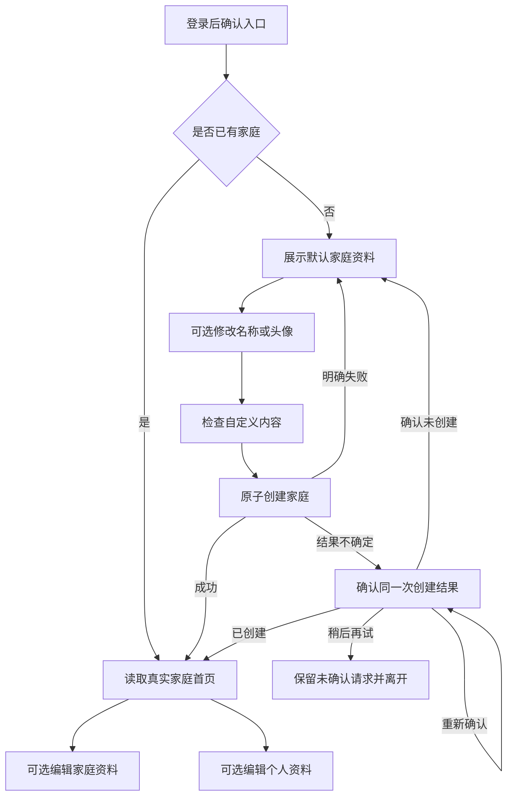

# feat: 创建家庭与初始形象

## 概述

把现有“创建家庭”说明页替换为真正可用的创建流程：无家庭用户可以直接使用默认家庭资料完成创建，随后进入只展示真实资料的单人家庭首页。用户可在创建前修改家庭头像和名称；创建成功后可继续编辑家庭资料，并设置个人头像和昵称。

本计划以 `docs/prd/003-create-home-prd.md` 为唯一产品依据。邀请、第二位成员加入、共同事项和成员管理仍然后置。本次交付不能用演示数据伪装家庭状态，也不能因连续点击、两台设备同时提交或网络超时产生多个家庭。

## 完成标准

以下条件全部满足，才算本模块完成：

- 新用户能在一分钟内完成“登录 → 创建家庭 → 进入单人家庭首页”。
- 同一身份连续、并发、超时重试和重新进入时，只得到同一个家庭。
- 首页只展示真实家庭资料和本人资料，不再展示演示事项或未开放入口。
- 家庭资料和个人资料都能编辑；取消或失败不覆盖旧资料。
- 微信头像、微信昵称不可用时，默认形象和手动昵称仍能完成流程。
- 自定义文字和图片通过云端检查后才能保存；其他账号无法读取或修改。
- 单元测试、类型检查、微信小程序构建、开发者工具预览及真机关键流程全部有实际结果。

## 范围

### 本次包含

- 创建家庭资格确认、默认资料、创建等待、明确失败和结果确认。
- 家庭唯一性、原子创建、重复请求处理和未确认请求恢复。
- 真实的单人家庭首页。
- 家庭头像与名称编辑。
- 个人默认形象、微信头像、微信昵称和手动昵称编辑。
- 4 个中性个人头像和 3 个家庭头像固定素材。
- 文字长度、图片大小、方形裁剪、内容检查、私有访问和旧图清理。

### 本次不包含

- 邀请、分享、第二位成员加入及双方都已建家时的合并处理。
- 事项新增、认领、完成、统计和快速添加。
- 退出、解散、转让和成员管理。
- 用户使用时实时生成头像。
- 性别、手机号、生日、地区等资料。
- 向真实情侣独立发布；邀请闭环完成前只允许在测试环境验证。

## 已确认的项目现状

- 登录恢复和入口分流已经存在，云端通过可信微信身份查询 `households.memberKeys` 判断是否有家庭。
- `src/pages/create-home/index.vue` 仍是说明页；`src/pages/index/index.vue` 仍展示演示事项。
- 项目使用 uni-app、Vue 3、TypeScript、Pinia、Wot UI 和微信云开发。
- 当前只有 `resolve-login` 云函数，还没有家庭资料、图片上传、内容检查或资料编辑能力。
- 客户端不允许直接读写 `users`、`households` 和 `invitations`。
- `docs/solutions/` 不存在，没有可直接复用的历史解决方案。
- 当前工作区已有 PRD 和总产品方案改动，实施时必须保留，不覆盖或回退。

## 关键技术决定

### 1. `households.memberKeys` 继续作为家庭归属依据

本阶段不再新增 `users.householdId` 作为第二套判断来源，避免登录分流、家庭读取和创建资格出现互相冲突的答案。家庭文档同时保存拥有者和成员列表，创建成功即同时完成“家庭存在、当前用户是成员、当前用户是拥有者”。

### 2. 家庭编号独立，创建锁保证同一身份只建一个家庭

家庭使用与创建者无关的随机编号，避免未来邀请、转让或创建者退出时更换家庭标识。云端另设仅供创建幂等使用的锁文档，其固定主键由当前可信身份得到。创建事务同时处理锁和家庭：

- 锁不存在时，先生成随机家庭编号，再在同一事务中写入锁和家庭名称、头像、拥有者、成员及时间。
- 锁已存在时，读取锁指向的原家庭并直接返回，不覆盖第一次成功保存的名称或头像。
- 两个并发事务争用同一个创建锁时，由数据库冲突重试收敛为一个结果。

创建锁只用于本次“创建或返回原家庭”，不替代 `households.memberKeys` 的家庭归属判断。这样无需相信客户端传来的用户编号、家庭编号或“我没有家庭”结论，也不会因两次请求使用不同资料生成两个家庭；未来加入、转让和退出不需要更换家庭编号。邀请阶段仍需补充“无家庭才能加入”及双方都已建家的产品处理，本计划不提前实现邀请关系。

创建动作在进入事务前必须先按 `memberKeys` 查询当前身份是否已经属于任意家庭；已有家庭直接返回，不创建锁或新家庭。这兼容登录模块已经存在的任意家庭编号。查询确认无家庭后，再用固定创建锁解决本阶段的并发创建；未来邀请与创建同时发生的跨流程竞争由邀请模块统一补上，当前版本尚未开放邀请写入。

### 3. 客户端保存稳定创建请求编号，只用于恢复同一次操作

点击创建时生成请求编号并保存到本地，直到云端明确返回“已创建”或“确认未创建”才清除。请求超时后页面进入“正在确认创建结果”，只允许用同一请求编号查询或重放同一操作，不出现第二个创建按钮。重新打开小程序时发现未确认请求，先恢复确认流程。

家庭唯一性最终由身份创建锁和云端事务保证；请求编号用于前端恢复、日志关联和区分本次操作，不作为身份或权限依据。

开始创建时由云端返回一个绑定当前可信身份的不透明操作凭证，本地待确认请求必须同时保存该凭证。恢复时云端先验证凭证属于当前身份；同一设备切换微信账号后，旧凭证不得被新账号确认或重放，也不能把旧草稿用于新账号创建。身份不匹配时隔离旧请求，只重新查询新账号自己的家庭状态。

### 4. 家庭状态独立于事项和登录状态

新增独立家庭服务与 Pinia 状态。登录状态只负责确认入口，家庭状态负责创建、读取和资料保存；原有事项 store 不再决定是否有家庭。首页只有在真实家庭资料加载成功后才展示，不用默认值掩盖读取失败。

### 5. 默认素材使用固定编号，自定义图片使用受控资源

- 内置头像以固定素材编号保存，云端只接受服务端白名单中的编号。
- 自定义图片先裁剪、压缩并上传到临时目录，再由云端确认上传者、文件类型、大小和检查结果。
- 通过检查后才保存为当前头像；家庭读取接口在确认成员身份后换取短期访问地址。
- 数据库只保存文件编号和状态，不保存长期公开地址。
- 替换成功后异步清理旧图；失败、取消和过期临时图由清理任务回收。

### 6. 默认内容白名单由服务端判断

默认名称和内置素材在检查服务暂时不可用时仍可创建。云端按具体白名单值判断，不接受客户端传来的“默认内容”标记。自定义家庭名称、昵称或图片检查不可用时不保存，页面保留草稿并允许重试或切回默认内容。

### 7. 微信资料获取保持自愿并使用当前平台能力

不使用基础库 2.27.1 起已被收回的旧用户资料接口。个人资料编辑页最低支持微信基础库 2.21.2：头像使用 `button open-type="chooseAvatar"`，昵称使用 `input type="nickname"`；两项都由用户主动操作。能力不支持、被取消或真机验证失败时，不影响默认形象、手动昵称和另一个字段的编辑。微信返回的临时头像仍须裁剪、上传和检查，昵称仍须执行本项目的文字校验和内容检查。

### 8. 编辑页进入家庭分包

创建页和首页是启动主流程，保留在主包。家庭资料编辑和个人资料编辑放入家庭分包。7 个内置头像都有可能在首页展示，因此统一放在全局静态资源中；选择页不再复制一份。新增图片必须压缩并检查主包体积。

## 数据边界

### `households`

| 字段 | 用途 | 约束 |
|---|---|---|
| 随机家庭编号 | 文档主键 | 云端生成且不依附创建者，客户端不能指定 |
| `name` | 家庭名称 | 去首尾空格、无换行、最多 20 个完整字符 |
| `avatar` | 内置素材编号或自定义资源编号 | 内置编号须在白名单；自定义资源须已通过检查 |
| `ownerKey` | 拥有者身份 | 创建时等于当前可信身份，不返回前端 |
| `memberKeys` | 家庭成员身份列表 | 创建时只含当前可信身份；登录归属判断继续使用 |
| `createdAt` / `updatedAt` | 时间 | 由云端产生 |

### `users`

在现有最小用户文档上扩展：

| 字段 | 用途 | 约束 |
|---|---|---|
| `nickname` | 当前展示昵称 | 默认“小伙伴”；自定义最多 12 个完整字符 |
| `avatar` | 内置素材编号或自定义资源编号 | 只允许本人修改 |
| `profilePreset` | 展示偏好 | 中性默认、小帅、小美、随机形象或自定义；不保存性别 |
| `updatedAt` | 更新时间 | 由云端产生 |

随机形象在第一次选择时保存一个具体内置头像编号，重新进入后保持不变。

现有用户文档没有这些新增字段，不做一次性迁移。云端读取时把缺失或部分缺失字段归一化为“小伙伴”和中性默认头像，只在用户首次成功保存个人资料时写入完整字段。创建家庭事务不额外承担用户资料补写，避免扩大原子写入范围。

### `household_creation_locks`

以当前可信身份对应的固定主键保存首次创建得到的家庭编号，只供创建幂等与超时恢复使用。锁和家庭必须在同一事务中写入；锁不参与日常家庭归属判断，也不返回前端。未来账号注销或家庭删除时必须同步处理该锁，具体删除流程随对应需求落地。

### `media_assets`

新增受控资源记录，至少包含上传者、用途、云存储文件编号、检查状态、过期时间和创建时间。接口不返回上传者身份或内部检查明细，只返回页面需要的有限状态。家庭头像和个人头像用途不能互换，其他用户上传的资源不能被引用。

## 云端能力边界

新增 `cloudfunctions/household/`，使用有限动作承载同一家庭领域，避免页面分别拼装权限判断：

| 动作 | 结果 | 权限要点 |
|---|---|---|
| 创建家庭 | 返回当前家庭与本人展示资料 | 只信任当前微信身份；重复请求返回原家庭 |
| 查询当前家庭 | 返回家庭与本人展示资料 | 必须确认当前身份属于该家庭 |
| 修改家庭资料 | 返回保存后的家庭资料 | 当前身份必须是成员；自定义内容须已通过检查 |
| 修改本人资料 | 返回保存后的本人资料 | 只能修改当前身份对应的用户 |
| 准备头像上传 | 返回本次临时上传位置或令牌 | 绑定当前身份、用途、大小和有效期 |
| 提交/查询头像检查 | 返回检查中、通过或不通过 | 不暴露原始检查结果；通过后才能引用 |
| 获取头像访问地址 | 返回短期地址 | 每次先确认家庭成员关系 |

云函数入口负责可信身份、数据库、云存储、内容安全调用和白名单日志；可测试的业务规则拆到独立文件。日志只记录动作、有限结果、耗时和内部关联编号，不记录原始名称、昵称、图片、微信身份或完整数据库记录。

## 页面流程

### 页面进入保护

- 创建页显示前重新确认登录和家庭状态：未登录回登录页，已有家庭回首页，确认失败只显示重试，不显示表单。
- 首页显示前重新确认并读取真实资料：无家庭回创建页，失败显示重试，不显示旧资料或演示数据。
- 两个编辑页显示前确认家庭归属并加载已保存资料；权限失效时退出编辑页。
- 应用恢复、页面 `onShow` 和创建成功跳转共用在途请求与页面意图，旧请求不能覆盖较新的成功跳转。

## 实施顺序

按 `单元 1 → 单元 2 → 单元 3 的默认创建 → 单元 4 → 单元 6 → 单元 3 的自定义头像 → 单元 5 → 单元 7` 执行。图片安全通路已接入后，创建页和家庭资料页同时开放自定义头像入口；预设头像只作为无需上传时的备用选择。

在单元 1 前先完成两个真实环境关卡：

- 审计测试环境现有家庭归属。一个身份属于零个家庭可继续创建，属于一个家庭直接复用；发现属于多个家庭时停止该身份的创建和首页加载，记录待处理数据，不能按查询顺序自行选一个。合并、保留或删除哪一个必须另行确认。
- 实际调用内容安全能力并留下可重复结果，只选择一条图片检查路径后再设计图片状态：优先异步检查；异步结果无法可靠接收时验证同步检查。两条都不可用时只推进默认创建里程碑，自定义头像保持隐藏，完整模块不能标记完成。

## 实施单元

- [ ] **单元 1：固定家庭契约、字符规则和创建唯一性**

**目标：** 先把最危险的数据规则写成可测试的纯逻辑，再开始页面开发。

**对应需求：** R1-R3、R6-R8、R10、R13-R14、R24、R33-R36。

**依赖：** 测试云环境可用；确认目标微信基础库版本。

**文件：**
- 新建：`src/types/household.ts`
- 新建：`src/utils/display-text.ts`
- 新建：`cloudfunctions/household/index.js`
- 新建：`cloudfunctions/household/household-domain.js`
- 新建：`cloudfunctions/household/package.json`
- 新建：`tests/unit/display-text.spec.ts`
- 新建：`tests/unit/household-domain.spec.ts`
- 修改：`cloudfunctions/README.md`

**做法：**
- 定义家庭、本人展示资料、内置头像、创建请求和有限错误结果，响应不包含内部身份键。
- 页面和云端使用同一组文字规范：去首尾空格、禁止换行、按用户看到的完整字符计数。优先使用 `Intl.Segmenter`；目标小程序环境不支持时采用经过测试的轻量分段实现，前后端行为必须一致。
- 云端根据可信身份定位固定创建锁，在事务中同时写入锁和随机家庭文档。已有锁直接返回其指向的原家庭，首次成功资料生效。
- 创建锁前先按现有 `memberKeys` 规则查询已有家庭；任意编号的旧家庭都直接返回，不能因没有创建锁而再建一个。
- 明确请求编号、绑定身份的不透明操作凭证、保存周期和结果确认状态；二者都不代替云端权限判断。
- 云端逐项验证默认白名单或自定义内容凭证，拒绝前端伪造的用户、家庭和“已审核”字段。

**测试场景：**
- 同一身份连续创建只得到一个家庭。
- 两个并发创建只得到一个家庭，第二次不覆盖首次资料。
- 任一步失败不留下“有家庭但无成员”或“有成员但无家庭”的状态。
- 已有家庭再次创建返回原家庭。
- 已有家庭使用任意旧编号且没有创建锁时，仍返回原家庭且不新增家庭。
- 空白、换行、20/12 字边界、中文、肤色表情和连接符组合表情计数一致。
- 伪造用户编号、家庭编号、拥有者、成员、默认标记或头像凭证均无效。
- 测试环境真实并发两个首次创建请求，验证事务冲突重试只落一份家庭；模拟其中一次响应超时后仍返回同一家庭。

**完成判断：**
- 纯逻辑测试证明创建分支规则和文字规则一致，云端响应没有内部身份信息；真实测试云环境证明并发事务收敛后，才能进入页面开发。

- [ ] **单元 2：建立家庭前端服务、状态与超时恢复**

**目标：** 让创建、查询、保存和结果确认都有统一状态，不由页面自行拼接远程调用。

**对应需求：** R1-R3、R9、R11-R14。

**依赖：** 单元 1。

**文件：**
- 新建：`src/services/household-cloud.ts`
- 新建：`src/store/modules/household.ts`
- 新建：`src/utils/pending-household.ts`
- 新建：`tests/unit/household-cloud.spec.ts`
- 新建：`tests/unit/household-store.spec.ts`
- 新建：`tests/unit/pending-household.spec.ts`
- 修改：`src/store/index.ts`
- 修改：`src/store/modules/auth.ts`

**做法：**
- 沿用登录服务的可替换调用端、结果白名单、超时和测试隔离方式。
- store 区分“资格确认、可编辑、检查中、创建中、结果确认中、加载成功、明确失败”，每类状态只有允许的操作。
- 创建点击后保存稳定请求编号和本次草稿；超时进入确认状态，不恢复创建按钮。
- 重开时先读取未确认请求并确认家庭；确认已有则清理本地请求并进入首页，确认无家庭才恢复表单。
- 结果仍不确定时提供“重新确认”和“稍后再试”。稍后再试返回登录品牌页并保留未确认请求；再次进入或恢复应用时继续确认，仍不开放新创建按钮。
- 合并应用和页面重复查询，创建成功后的新状态优先于旧的入口查询结果。
- 仅保存恢复同一次创建需要的最小本地数据，不保存微信身份、内部家庭编号或长期图片地址。
- 本地保存绑定身份的不透明操作凭证而非真实身份。恢复发现凭证与当前账号不匹配时隔离旧请求，不能确认、重放或套用旧草稿，只查询当前账号自己的状态。

**测试场景：**
- 连续点击只产生一次创建调用。
- 明确失败保留草稿并恢复重试。
- 超时只允许重新确认，同一请求编号保持不变。
- 稍后再试可以离开等待页，但重新进入仍恢复同一请求，不出现新建入口。
- 关闭再打开能恢复确认；确认成功进入首页，确认无家庭才重新开放创建。
- 账号 A 创建超时后切换账号 B，账号 B 不会恢复或创建账号 A 的家庭；切回账号 A 后仍可按云端结果恢复。
- 旧的恢复查询晚返回时不能覆盖创建成功状态。
- 无效云端响应和平台异常均进入安全失败状态。

**完成判断：**
- 服务和 store 的全部状态转换有测试，任何不确定状态都不能发起第二次独立创建。

- [ ] **单元 3：完成默认素材和创建家庭页面**

**目标：** 用户无需授权或填写额外资料即可完成默认创建，也可在创建前修改家庭资料。

**对应需求：** R4-R9、R11-R14、R25-R30、R32。

**依赖：** 默认创建依赖单元 1-2；开放自定义头像依赖单元 6；另需品牌视觉标准和 AI 图片生成工具。

**文件：**
- 修改：`src/subpackages/household/create-home/index.vue`
- 新建：`src/subpackages/household/components/HouseholdAvatarPicker.vue`
- 新建：`src/pages/avatar-crop/index.vue`
- 新建：`src/static/avatars/households/household-01.png`
- 新建：`src/static/avatars/households/household-02.png`
- 新建：`src/static/avatars/households/household-03.png`
- 新建：`tests/e2e/create-home-page.spec.js`
- 修改：`src/pages.json`
- 修改：`docs/brand/visual-standard.md`

**做法：**
- 生成 3 个符合奶油白、薄荷绿、少量珊瑚色的家庭头像，不使用真人脸、传统爱心、带烟囱房屋或明显性别暗示；人工挑选后压缩。
- 页面默认选中首个家庭头像并预填“我们的小家”，使用 Wot UI 表单、输入、按钮、头像和反馈组件。
- 复用当前 Wot UI 已提供的 `wd-upload` 与 `wd-img-cropper`，不引入新的上传或裁剪组件；裁剪器放在独立页面，固定 1:1 输出并控制导出质量。
- 头像选项同时显示名称与选中标记；名称显示剩余字数；无效字段定位并说明原因。
- 自定义图片选择后进入方形裁剪预览，取消不替换原选择；裁剪完成后使用单元 6 的受控上传和检查流程，未通过检查的图片不能保存为正式头像。
- 创建、检查和确认期间锁住所有编辑及返回误触；明确失败恢复草稿。
- 内容检查统一在用户点击创建或保存后触发，只检查发生变化的自定义字段。多个字段可以并行检查，但必须全部通过才写正式资料；任一字段修改后，该字段旧检查结果立即失效。部分失败时保留全部草稿、逐字段提示并恢复编辑，不保存任何一部分。
- 自定义图片选择后进入方形裁剪和安全检查；只有检查通过的图片才可成为家庭头像，预设头像始终可作为备用选择。
- 直接打开页面时执行资格保护，未确认家庭状态前不展示可提交表单。
- 新增素材后检查图片体积、主包大小和小屏/大字体布局。

**测试场景：**
- 默认资料无需操作即可提交。
- 名称空白、换行、超长不能提交；合法组合表情正确计数。
- 选择、取消裁剪、超 5 MB、非图片和无法识别图片不替换当前头像。
- 创建中连续点击、返回和修改均不产生第二次操作。
- 已有家庭或未登录用户直接打开页面不能创建。
- 小屏幕和大字体下保存、错误提示和头像选中状态可见可用。

**完成判断：**
- 开发者工具可完整操作默认创建页面；默认素材符合品牌规范，页面状态与 store 一致。

- [ ] **单元 4：替换首页演示内容，展示真实单人家庭**

**目标：** 创建成功后进入正式首页，只显示当前家庭和当前用户的真实资料。

**对应需求：** R11、R15-R19、R33-R35。

**依赖：** 单元 1-3。

**文件：**
- 修改：`src/pages/index/index.vue`
- 修改：`src/components/home/HomeSummaryCard.vue`
- 新建：`src/pages/index/components/MemberProfileCard.vue`
- 新建：`tests/e2e/home-single-member.spec.js`
- 修改：`src/store/modules/task.ts`

**做法：**
- 首页加载真实家庭名称、家庭头像、本人昵称和本人头像，默认个人资料显示中性头像与“小伙伴”。
- 展示“这个家暂时只有你一人”；移除演示事项、四项统计、快速添加和邀请提示。
- 点击家庭资料进入家庭编辑分包，点击本人资料进入个人编辑分包。
- 首次加载和手动重试都使用同一套家庭与成员卡片骨架，保留页面结构但不显示伪造文字或头像；读取失败后，以原位置错误说明和重试按钮替换骨架。
- 家庭归属丢失时清空家庭 store 并回创建页；未登录回登录页。
- 事项 store 不再提供 `hasHome` 或首页演示数据；若其他代码仍引用，先完成引用迁移再移除无效字段。

**测试场景：**
- 创建成功后显示刚保存的家庭资料和默认本人资料。
- 重开后仍进入同一家庭。
- 首页没有演示事项、统计、快速添加或邀请入口。
- 查询失败不显示旧资料；重试成功恢复。
- 非成员无法通过伪造参数读取家庭资料。

**完成判断：**
- 首页只有真实单人状态，创建成功和重新进入两条路径都能到达并显示同一家庭。

- [ ] **单元 5：完成家庭资料和个人资料编辑**

**目标：** 在不强制索取微信资料的前提下，完成家庭和本人资料的可取消、可重试编辑。

**对应需求：** R18-R24、R28-R32、R33-R35。

**依赖：** 单元 1-4、单元 6；目标微信基础库 2.21.2 或更高版本的 iOS、Android 真机验证通过。

**文件：**
- 新建：`src/subpackages/household/edit-household/index.vue`
- 新建：`src/subpackages/household/edit-profile/index.vue`
- 新建：`src/subpackages/household/components/ProfileAvatarPicker.vue`
- 新建：`src/static/avatars/people/person-01.png`
- 新建：`src/static/avatars/people/person-02.png`
- 新建：`src/static/avatars/people/person-03.png`
- 新建：`src/static/avatars/people/person-04.png`
- 新建：`tests/e2e/edit-household.spec.js`
- 新建：`tests/e2e/edit-profile.spec.js`
- 修改：`src/pages.json`

**做法：**
- 两个编辑流程使用独立页面和独立草稿；进入时以已保存资料初始化，取消不保存。
- 有未保存修改时返回或取消先确认放弃；关闭小程序不自动保存草稿。
- 家庭页支持内置家庭头像、自定义头像和家庭名称。
- 个人页支持“小帅”“小美”“随机形象”和自定义。生成 4 个可爱、中性、不以发型、服装或颜色固定性别的头像；随机形象选择后保存具体素材编号。
- 微信环境明确使用 `button open-type="chooseAvatar"` 和 `input type="nickname"`；头像与昵称分别修改，一个被取消不影响另一个。平台不可用时提供默认形象与手动输入，不调用已收回的 `getUserProfile`。
- 家庭名、昵称和图片分别显示检查状态及未通过原因；保存中阻止重复提交。
- 保存成功后更新家庭 store 并返回首页；失败时首页旧资料不变，编辑页保留草稿。

**测试场景：**
- 家庭名称或头像分别修改、取消、失败和重试。
- 小帅、小美、随机形象重新进入后稳定显示；不产生性别字段。
- 微信头像或昵称被取消、不可用、返回空值时，当前资料保持不变，另一项仍能编辑。
- 昵称 12 字边界和组合表情计算正确。
- 有草稿返回时出现放弃确认，无草稿直接返回。
- 其他账号不能修改当前用户资料，非成员不能修改家庭资料。

**完成判断：**
- 默认、微信和手动三类路径在开发者工具或真机上有明确结果，保存失败不会覆盖已保存资料。

- [ ] **单元 6：完成自定义头像的安全上传、检查和清理**

**目标：** 自定义头像从选择到展示全程受控，不产生长期公开图片或越权访问。

**对应需求：** R5、R22-R23、R28-R30、R34-R37。

**依赖：** 单元 1-2；微信内容安全能力和云存储权限在测试环境验证通过。

**文件：**
- 新建：`src/services/avatar-media.ts`
- 新建：`src/utils/image-selection.ts`
- 新建：`cloudfunctions/household/avatar-media.js`
- 新建：`cloudfunctions/household/content-safety.js`
- 新建：`cloudfunctions/household/config.json`
- 新建：`cloudfunctions/cleanup-avatar-media/index.js`
- 新建：`cloudfunctions/cleanup-avatar-media/package.json`
- 新建：`cloudfunctions/cleanup-avatar-media/config.json`
- 新建：`tests/unit/avatar-media.spec.ts`
- 新建：`tests/unit/content-safety.spec.ts`
- 修改：`cloudfunctions/household/index.js`
- 修改：`cloudfunctions/household/package.json`
- 修改：`cloudfunctions/README.md`

**做法：**
- 客户端在上传前检查常见图片类型和 5 MB 上限，完成方形裁剪和适度压缩；原图不作为正式头像保存。
- 云端签发绑定当前身份、用途和短有效期的临时资源，客户端不能自由指定正式文件路径。
- 云端再次验证文件类型、实际大小、用途和上传者，再调用文字或图片内容检查。自定义名称和昵称使用 `security.msgSecCheck`；图片优先使用官方推荐的 `security.mediaCheckAsync`，并保存“检查中、通过、拒绝、检查失败”有限状态。若目标云环境不能可靠接收异步结果，能力验证后才可切换到受支持的同步图片检查，不能跳过检查。
- 在 `config.json` 声明实际使用的 `security.msgSecCheck`、`security.mediaCheckAsync`，以及启用同步兜底时的 `security.imgSecCheck`；重新上传云函数后为权限缓存预留验证时间。
- 检查中禁止保存；不通过、不可用或结果不确定时保留旧头像，允许重新检查或使用默认头像。
- 检查通过的资源才能被家庭或本人资料引用。读取时从当前可信身份重新确认家庭归属，再返回短期地址；数据库不保存临时地址。
- 云存储文件使用不可猜测的新路径，不覆盖旧路径，避免缓存继续显示旧头像。
- 检查通过后由云端把已验证内容提升到新的正式只读路径并保存内容摘要；正式路径禁止客户端写入或覆盖。资料保存时再次核对资源状态、摘要、上传者和用途，临时路径随后被覆盖也不能改变正式头像。
- 云端按可信身份、动作和时间窗口限制创建、上传准备、内容检查、状态查询与短期地址获取；同时限制单个身份未完成资源的数量和总容量，重复检查复用已有结果。具体阈值在测试环境按平台配额确定并记录，异常调用和费用增长需要告警。
- 保存新头像成功后清理旧自定义头像；临时、失败和取消资源按过期时间定期清理。清理失败记录有限任务并重试，不影响已保存新头像。
- 独立定时清理入口按 `expiresAt` 分批扫描，只删除未被家庭或用户正式资料引用的资源；先确认引用再删云文件，成功后更新资源记录。重复运行必须安全，单批数量、保留时长和失败重试上限在测试云环境按官方限制验证后写入配置。
- 云函数配置只声明需要的内容安全调用权限；客户端、文档和日志不出现管理凭据或原始内容。

**测试场景：**
- 超 5 MB、伪造扩展名、无法识别、上传中断和裁剪取消均不替换头像。
- 自定义文字或图片检查不通过、暂时不可用、结果不确定时不保存。
- 默认白名单内容在检查服务不可用时仍可创建。
- 用户不能引用其他人的临时资源，也不能把个人头像资源用于家庭头像。
- 审核后覆盖原临时路径不能改变已提升的正式头像；摘要或状态不一致时拒绝保存。
- 超过单账号调用频率、临时资源数量或容量上限时，不继续产生新的上传、检查或短期地址费用。
- 非成员不能换取家庭或成员头像地址；短期地址过期后可重新取得，数据库中不保存过期地址。
- 替换成功后旧图被清理；保存失败时旧图仍可用，新临时图最终清理。
- 清理任务重复运行不会误删正式引用图片；单个文件删除失败不阻断后续批次，并能在下次重试。
- 存储规则生效后，以成员和非成员两个身份分别验证访问结果。

**完成判断：**
- 自定义头像的上传、检查、保存、查看和清理均有自动测试和真实云环境验证，数据库中没有长期公开地址。

- [ ] **单元 7：跨层验收、包体检查和发布限制确认**

**目标：** 用真实微信环境验证整条通路，并明确当前只能测试、不能独立发布给真实情侣。

**对应需求：** 全部需求和成功标准。

**依赖：** 单元 1-6；至少两个可切换测试身份；微信开发者工具与测试云环境。

**文件：**
- 修改：`tests/e2e/create-home-page.spec.js`
- 修改：`tests/e2e/home-single-member.spec.js`
- 修改：`tests/e2e/edit-household.spec.js`
- 修改：`tests/e2e/edit-profile.spec.js`
- 新建：`tests/e2e/weixin-environment.js`
- 新建：`tests/e2e/global-setup.js`
- 新建：`tests/e2e/global-teardown.js`
- 修改：`jest.e2e.config.cjs`
- 修改：`package.json`
- 修改：`package-lock.json`
- 修改：`README.md`
- 修改：`cloudfunctions/README.md`

**做法：**
- 准备新用户、已有家庭用户和非成员用户，记录可重复的数据准备与清理步骤。
- 真机验证微信头像、昵称选择、相机、相册、裁剪、内容检查和访问地址过期行为。
- 两台设备使用同一身份同时创建；提交后断网再恢复；关闭小程序后重新进入确认。
- 第二账号直接尝试读取、修改或引用第一账号的家庭、用户和图片资源，确认云端拒绝。
- 运行全部单元测试、类型检查和微信小程序构建；打开微信开发者工具逐页检查加载、失败、空状态、返回确认和重复点击。
- 补齐微信开发者工具自动化会话的启动、共享和关闭入口，配置项目路径及工具位置。自动页面测试缺少会话时明确失败，不能继续用 `test.skip` 伪装通过；真机人工项使用独立清单，不混入自动测试结果。
- 检查代码依赖分析和主包/分包体积；压缩或移动图片，主包接近 1.5 MB 前处理。
- README 记录云函数部署、内容安全调用权限、云存储权限、测试数据和真机验收方法，不记录密钥。
- README 记录测试资料保留期限与清理责任；正式开放前必须完成账号注销及家庭删除需求，覆盖用户资料、创建锁、正式头像和临时资源，否则不得发布。
- 明确标注当前版本不向真实情侣发布，直到邀请与双方已建家恢复方案完成。

**验收清单：**
- 默认创建、编辑后创建、明确失败、超时确认、重开恢复。
- 同身份连续点击、并发提交和双设备同时创建。
- 家庭首页真实资料、单人状态和无演示入口。
- 家庭资料与个人资料的默认、微信、自定义、取消、失败和重试。
- 字符边界、图片边界、内容检查不可用和默认资料兜底。
- 非成员读取与修改拒绝、短期图片地址和旧图清理。
- 小屏、大字体、弱网和页面返回。

**完成判断：**
- 自动检查全部通过；页面在开发者工具和真机完整走通；未能自动执行的真机场景有逐项结果，不能以测试“跳过”当作通过。

## 系统影响

- **登录分流：** `resolve-login` 仍以家庭成员列表判断入口；创建成功后再次恢复会返回首页。
- **首页：** 从演示事项页变为真实单人家庭页，事项模块暂不展示。
- **状态：** 增加独立家庭状态；登录、家庭和事项各自负责单一领域。
- **云端：** 增加家庭领域云函数、内容检查调用和受控云存储流程。
- **数据：** 家庭文档保存家庭资料及成员/拥有者关系；用户文档保存本人展示资料。
- **包体：** 主包保留启动所需页面和当前显示素材，编辑页及仅编辑使用的资源进入家庭分包。
- **隐私：** 自定义头像不使用长期公开地址；家庭资料只经云函数返回给成员。

## 风险与处理

| 风险 | 处理 |
|---|---|
| 并发创建产生两个家庭 | 可信身份争用固定创建锁，事务同时写锁和随机家庭，首次成功资料生效 |
| 云端成功但客户端超时 | 本地稳定请求编号，进入确认状态，重开继续确认，不开放第二次创建 |
| `App.onShow` 与页面查询互相覆盖 | 合并在途请求并给导航结果排序，创建成功状态优先 |
| 前后端字符计数不一致 | 共用规则与测试向量，真机验证 `Intl.Segmenter`，必要时使用同一轻量实现 |
| 微信头像昵称能力变化 | 先在目标基础库和真机验证；默认形象与手动昵称始终可用 |
| 相册或相机隐私声明缺失 | 开发预览可验证，正式审核前补齐微信隐私保护指引并再次真机测试 |
| 图片检查异步结果难以接收 | 开工先做能力验证，锁定官方支持的回调或同步方案，检查未完成绝不保存 |
| 云函数 SDK 自动升级产生行为变化 | 锁定实际验证版本，本功能不跨大版本升级；升级单独测试 |
| 自定义头像被公开或越权引用 | 临时资源绑定身份和用途，读取前验成员关系，只返回短期地址 |
| 审核通过后替换文件绕过检查 | 通过后由云端提升到不可覆盖的正式路径并校验内容摘要 |
| 恶意重复上传或检查消耗费用 | 服务端限频、限制未完成资源数量与容量、复用检查结果并监控异常费用 |
| 临时图和旧图长期残留 | 保存后清旧图，过期资源定期清理，失败任务可重试 |
| 默认图片使主包变大 | 压缩 7 个全局头像；只把编辑页代码和仅供编辑使用的辅助资源放入分包，并用开发者工具检查包体 |
| 当前单人家庭阻碍未来邀请 | 家庭编号不依附创建者；本阶段不正式发布，邀请 PRD 仍须解决双方都已建家的恢复方案 |

## 开工前条件

- 微信开发者工具中确认测试云环境、目标基础库和至少两个测试身份。
- 确认云数据库、云存储、事务和内容安全调用可用，并只在测试环境操作。
- 为云函数声明必要的内容安全调用权限；客户端数据库和云存储权限保持最小化。
- 真机确认微信头像选择和昵称填写能力；若不可用，记录目标版本并按兜底路径交付。
- 确认相册、相机和头像选择涉及的微信隐私接口已经在隐私保护指引中声明；未完成声明前不得提交正式审核。
- 当前 `resolve-login` 使用的 `wx-server-sdk` 不在本功能中顺手跨大版本升级；家庭云函数锁定并验证同一兼容版本，SDK 升级另行评估。
- 确认默认素材生成和人工挑选标准，不使用真人、明星或性别刻板形象。

## 延后事项

- 邀请、加入、家庭合并或选择，以及双人资料编辑冲突。
- 成员退出、解散、转让和账号注销时的完整删除流程。
- 家庭事项和统计。
- 用户实时生成 AI 头像。
- 正式环境发布与真实情侣开放。

以上删除流程虽然延后开发，但属于正式发布硬门槛；当前测试环境也必须按约定周期清理测试用户、家庭、创建锁和图片资源。

## 资料来源

- 产品依据：`docs/prd/003-create-home-prd.md`
- 品牌依据：`docs/brand/visual-standard.md`
- 项目规范：`AGENTS.md`
- 项目云端边界：`cloudfunctions/README.md`
- [DCloud：input 组件与微信昵称填写](https://uniapp.dcloud.net.cn/component/input)
- [DCloud：button 组件与微信头像选择](https://uniapp.dcloud.net.cn/component/button)
- [DCloud：用户资料接口现状](https://uniapp.dcloud.net.cn/api/plugins/login.html?id=getuserinfo)
- [微信开放文档：头像昵称填写能力](https://developers.weixin.qq.com/miniprogram/dev/framework/open-ability/userProfile.html)
- [Wot UI：Upload 上传](https://wot-ui.cn/component/upload.html)
- [Wot UI：ImgCropper 图片裁剪](https://wot-ui.cn/component/img-cropper.html)
- [CloudBase：微信小程序调用云函数](https://docs.cloudbase.net/recipes/add-cloud-function-wechat-miniprogram)
- [CloudBase：数据库事务](https://docs.cloudbase.net/database/transaction)
- [CloudBase：云存储安全规则](https://docs.cloudbase.net/storage/security-rules)
- [CloudBase：云存储基础权限](https://docs.cloudbase.net/storage/data-permission)
- [CloudBase：云存储文件上传](https://docs.cloudbase.net/recipes/add-file-upload-wechat-miniprogram)
- [CloudBase：图片与文字内容检查调用权限](https://docs.cloudbase.net/faq/knowledge/cloud-call-604101-permission-error)
- [CloudBase：图片内容审核](https://docs.cloudbase.net/storage/ci-cos-moderation)
