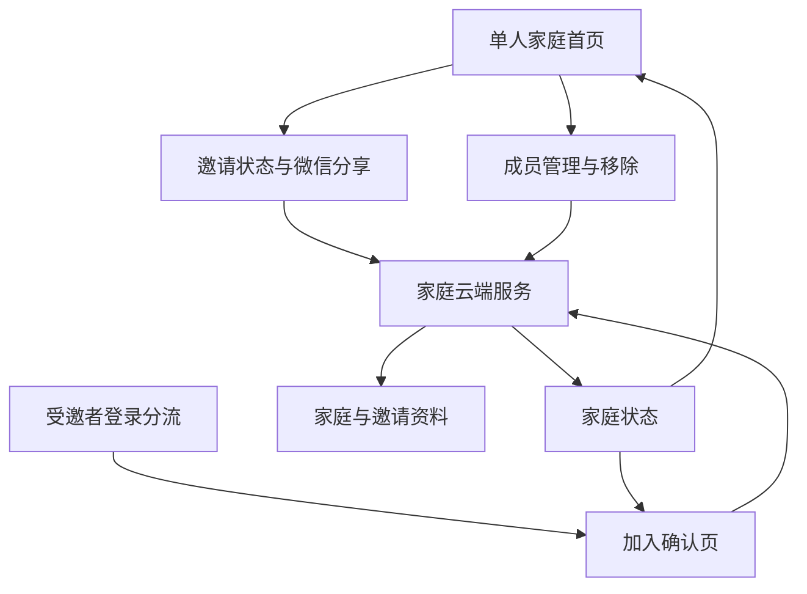

# 邀请与加入家庭实施计划

## 概览

在现有“单人家庭”基础上，增加微信分享邀请、受邀者确认加入、单人家庭转入、创建者移除成员和两人家庭首页。所有家庭归属变化都由云端根据当前登录身份确认，确保一个人只能在一个家庭中、一个家庭最多两人。

## 问题与范围

当前项目已有登录分流、邀请参数暂存和加入页占位，但没有真实邀请、加入或成员变更能力。此计划交付 PRD 004 的完整双人闭环，并保留现有单人创建和资料编辑能力。

不包含共同事项、第三位成员、退出家庭、解散家庭、拥有者转让、家庭合并、邀请备注和提醒。

## 需求追踪

- R1-R6：单人家庭可生成、分享、查看和重新发送唯一有效邀请。
- R7-R12：受邀者完成登录后可查看家庭概要、确认加入并获得可重试结果。
- R13-R18：已有单人家庭的受邀者可明确确认转入；双人家庭不允许合并或加入。
- R19-R23：失效、已使用、满员、本人打开、并发确认和结果不确定均有确定去向。
- R24-R26：首页根据真实成员数展示单人等待或两人成员状态。
- R27-R32：创建者可二次确认移除另一位成员；被移除者保留个人资料并回到无家庭状态。

## 调研结论

### 现有基础

- `src/App.vue` 已接收分享入口的 `inviteToken`，`src/store/modules/auth.ts` 已暂存凭证并在登录后交给云端确认。
- `cloudfunctions/resolve-login/entry-state.js` 已具备邀请预检查和进入 `JOIN_CONFIRM` 的分流，但当前只读、不消费邀请。
- `cloudfunctions/household/household-domain.js` 已以家庭成员列表作为唯一归属依据，并使用事务完成创建；`cloudfunctions/household/index.js` 已集中家庭领域动作。
- `src/subpackages/household/join-home/index.vue` 目前是占位页；`src/pages/index/index.vue` 目前只渲染本人和单人家庭状态。
- `tests/unit/resolve-login.spec.ts`、`tests/unit/household-domain.spec.ts`、`tests/unit/household-store.spec.ts` 已建立云端规则与前端状态的隔离测试模式。

### 外部约束

- 云端事务适合把成员变更、邀请失效和归属锁的更新作为同一结果；事务中只使用确定文档的读取和写入，不在事务里做条件查询或外部调用。[CloudBase 事务说明](https://docs.cloudbase.net/database/transaction)
- 数据库规则只限制小程序端请求，云端服务不受客户端规则限制。因此邀请和家庭集合继续设为“所有用户不可读写”，由云端统一判断访问资格。[CloudBase 安全规则说明](https://cloud.tencent.com/document/product/876/41802)

## 关键技术决定

| 决定 | 处理方式 | 原因 |
| --- | --- | --- |
| 邀请归属 | 由现有 `household` 云端服务处理邀请创建、预览、加入、转入、移除和状态确认 | 家庭成员关系不分散到多个服务，沿用已验证的可信身份边界 |
| 邀请凭证 | 云端只保存不可逆摘要；原凭证仅在创建者设备上保存到过期，用于再次分享 | 既能避免云端保存可直接使用的凭证，也能支持已生成邀请的再次分享 |
| 单人家庭转入 | 用现有 `householdCreationLocks` 作为每个用户当前家庭的固定归属锁；加入、转入、移除时在同一事务内更新或清除 | 事务不适合用条件查询判断归属，固定文档可以防止并发产生双重归属 |
| 两人资料展示 | 家庭云端结果返回两位成员的安全展示资料，不返回内部身份键；首页按“我”和另一位成员渲染 | 满足成员展示需求，同时不把可用于越权的身份信息交给页面 |
| 移除后的提示 | 云端为被移除者记录一次性提示；其下次登录或刷新时展示说明后进入创建页 | 对方无法实时看到移除操作，不能只依赖创建者页面反馈 |

## 高层交互关系

> 下图表达各模块的协作方向，供实现时核对，不规定具体方法或文件内部写法。

## 实施单元

- [x] **单元 1：补齐邀请、成员和结果的数据契约**

**目标：** 为邀请状态、两人成员展示、加入确认、转入和移除提供受限且一致的数据形状。

**需求：** R1-R3、R7-R12、R19-R26、R29-R31。

**依赖：** 无。

**文件：**

- 新建：`src/types/invitation.ts`
- 修改：`src/types/auth.ts`
- 修改：`src/types/household.ts`
- 修改：`src/services/entry-router.ts`
- 修改：`cloudfunctions/household/household-domain.js`
- 测试：`tests/unit/entry-router.spec.ts`
- 测试：`tests/unit/household-domain.spec.ts`

**实施方法：**

- 定义有限的邀请状态、邀请概要、成员展示资料和成员变更结果；页面只识别这些有限结果，不接收云端任意文字。
- 扩展家庭概要，使其包含当前成员可展示的两人资料、当前用户角色和邀请等待摘要；保持内部身份键、创建锁和原始邀请凭证不返回页面。
- 为“已被移除”的一次性提示增加明确分流与页面提示编号，使其能安全地去创建页而不是被当成普通网络错误。
- 在现有家庭领域结果归一化处同时兼容旧单人数据，缺少成员资料时使用既有默认头像和称呼。

**遵循模式：** `src/types/household.ts` 的有限联合结果、`src/services/entry-router.ts` 的状态到页面映射、`cloudfunctions/household/household-domain.js` 的安全结果转换。

**测试场景：**

- 正常：两人家庭结果包含两位可展示成员，当前用户拥有唯一“我”标记。
- 边界：旧单人家庭缺少个人资料时仍得到安全默认展示，成员数不虚构为两人。
- 错误：未知或字段不完整的云端结果不能被客户端当成成功结果。
- 集成：被移除状态只路由到创建页并携带受控提示，不把旧家庭地址留在页面栈中。

**完成验证：** 所有入口状态都有唯一页面去向，且类型检查能阻止页面使用内部身份资料。

- [x] **单元 2：实现云端邀请、加入、转入和移除的完整结果**

**目标：** 在可信身份和同一事务边界内完成邀请生命周期与成员关系变化。

**需求：** R1-R6、R9-R23、R27-R32。

**依赖：** 单元 1。

**文件：**

- 新建：`cloudfunctions/household/invitation-domain.js`
- 修改：`cloudfunctions/household/household-domain.js`
- 修改：`cloudfunctions/household/index.js`
- 修改：`cloudfunctions/resolve-login/entry-state.js`
- 修改：`cloudfunctions/resolve-login/index.js`
- 修改：`cloudfunctions/README.md`
- 测试：`tests/unit/invitation-domain.spec.ts`
- 测试：`tests/unit/household-domain.spec.ts`
- 测试：`tests/unit/resolve-login.spec.ts`

**实施方法：**

- 生成高强度、带 24 小时过期时间的邀请；云端仅保存摘要、所属家庭、创建时间、过期时间及使用或作废状态。一个家庭重新发送时作废旧邀请。
- 创建邀请、读取等待状态和预览邀请都重新确认当前调用者的家庭、成员数和创建者身份。预览只返回家庭头像、名称和成员数。
- 加入、单人家庭转入和移除均先做只读预检查以获得用户提示，再以固定家庭和归属锁文档进行事务内复核。事务中同时更新家庭成员、邀请状态、相关归属锁和移除提示，失败时不改变任何一方归属。
- 转入只接受一人家庭；删除旧家庭前再次确认其确实只有当前用户。旧家庭使用的自定义家庭头像按既有资源清理规则标记，不影响用户自己的头像。
- 移除不接收页面指定的目标成员。云端从当前双人家庭中识别唯一“另一位成员”，避免伪造目标身份；移除后使旧邀请失效并清除被移除者的归属锁。
- 扩展登录分流：有效邀请仍只做预检查，不消费邀请；已在邀请目标家庭的用户回首页；已在其他单人家庭的用户进入转入确认；被移除者仅显示一次说明后进入创建页。

**执行说明：** 先为每种成员关系转变写失败用例，再实现云端规则，防止只覆盖正常加入。

**遵循模式：** `cloudfunctions/household/household-domain.js` 的领域错误和事务适配、`cloudfunctions/resolve-login/entry-state.js` 的只读登录分流、`tests/unit/household-domain.spec.ts` 的内存事务替身。

**测试场景：**

- 正常：单人创建者生成邀请；无家庭受邀者加入后家庭恰为两人、邀请失效、双方读取同一家庭。
- 正常：单人家庭受邀者确认转入后个人资料保留、旧单人家庭消失、目标家庭为两人。
- 正常：创建者移除唯一另一位成员后家庭恢复单人、被移除者无家庭且保留个人资料。
- 边界：重新发送仅保留最新邀请；创建者打开自己邀请、已在目标家庭的用户打开旧链接均不消费邀请。
- 边界：受邀者已在双人家庭、目标家庭已满、邀请过期或已使用时不改动任何家庭。
- 错误：两个账号并发确认时只允许一个成功；任一事务写失败时成员、旧家庭、归属锁和邀请状态全部保持原值。
- 错误：转入条件在确认前变化、移除目标已不在家庭、结果超时后重试时，不产生重复成员或丢失原家庭。
- 集成：登录预检查只读，真正加入只发生在确认动作；被移除提示只展示一次。

**完成验证：** 任意账号在任意时刻最多关联一个家庭；任意家庭最多两人；失败和重试不留下半完成关系。

- [x] **单元 3：建立前端邀请状态与可靠确认流程**

**目标：** 让创建者安全保存待分享邀请，让受邀者在超时或重新打开后能重新确认真实结果。

**需求：** R3-R6、R7-R12、R19-R23、R29-R31。

**依赖：** 单元 1、单元 2。

**文件：**

- 新建：`src/services/invitation-cloud.ts`
- 新建：`src/store/modules/invitation.ts`
- 新建：`src/utils/pending-invitation.ts`
- 修改：`src/services/household-cloud.ts`
- 修改：`src/store/modules/household.ts`
- 修改：`src/store/modules/auth.ts`
- 测试：`tests/unit/invitation-cloud.spec.ts`
- 测试：`tests/unit/invitation-store.spec.ts`
- 测试：`tests/unit/auth-store.spec.ts`
- 测试：`tests/unit/household-store.spec.ts`

**实施方法：**

- 将家庭资料读取和邀请领域动作分开：家庭状态继续由家庭状态模块持有，待分享凭证、加入草稿和确认中的请求由邀请状态模块持有。
- 原始邀请凭证仅保存到创建者本机且随过期时间清除；页面、普通错误提示和日志不展示凭证。凭证丢失时，页面只能明确重新发送，不能猜测或恢复旧凭证。
- 加入和转入使用一次性操作凭证与单飞保护；超时后先请求云端确认当前用户是否已加入，再决定显示成功、保留原家庭或允许重试。
- 家庭资料读取成功后用云端返回的成员资料刷新状态；被移除或转入成功时清理旧页面状态、旧待确认数据和不再有效的邀请。

**遵循模式：** `src/store/modules/household.ts` 的创建确认与单飞处理、`src/store/modules/auth.ts` 的启动恢复和一次性导航、`src/utils/pending-household.ts` 的短期恢复资料。

**测试场景：**

- 正常：创建者生成邀请后可分享，重新进入仍可查看等待状态；受邀者确认加入后状态刷新为两人家庭。
- 边界：同一页面连续点击加入或转入只发起一次确认；已过期的本机凭证自动清除。
- 错误：创建、加入、转入或移除超时后先确认，确认到成功时不显示失败；确认未完成时保留可重试状态。
- 错误：云端返回失效、已使用、满员、其他家庭或无效结果时，不覆盖当前已保存家庭资料。
- 集成：登录后的待处理邀请能到达确认页；移除后刷新会清空旧家庭状态并进入创建页提示。

**完成验证：** 页面不会因重复点击、重开或迟到响应显示错误家庭，也不会把邀请凭证暴露在可见内容中。

- [x] **单元 4：完成邀请、加入、成员管理和双人首页界面**

**目标：** 把真实邀请状态和成员关系变成用户可以理解、可以操作的页面流程。

**需求：** R1-R12、R13-R18、R19-R32。

**依赖：** 单元 1、单元 3。

**文件：**

- 新建：`src/subpackages/household/member-management/index.vue`
- 新建：`src/subpackages/household/member-management/member-management-view.ts`
- 新建：`src/subpackages/household/join-home/join-home-view.ts`
- 修改：`src/subpackages/household/join-home/index.vue`
- 修改：`src/subpackages/household/invite-status/index.vue`
- 修改：`src/pages/index/index.vue`
- 修改：`src/pages/index/home-view.ts`
- 修改：`src/pages/index/components/MemberProfileCard.vue`
- 修改：`src/components/home/HomeSummaryCard.vue`
- 修改：`src/pages.json`
- 测试：`tests/unit/join-home-view.spec.ts`
- 测试：`tests/unit/member-management-view.spec.ts`
- 测试：`tests/unit/home-view.spec.ts`
- 测试：`tests/e2e/invite-join-home.spec.js`

**实施方法：**

- 单人首页新增真实的邀请按钮和等待状态；分享动作只在已成功取得邀请凭证时开放，取消分享不会假装邀请已被对方收到。
- 加入页替换占位说明：显示邀请家庭概要、普通加入确认、单人家庭转入说明与二次确认，以及所有不可加入原因的明确文案。
- 新增成员管理页，创建者可查看等待状态或双人成员列表；仅在确有另一位成员时显示移除按钮，并使用二次确认说明后果。普通成员不显示管理和移除入口。
- 首页以成员数组渲染本人和另一位成员，移除现有“创建者”高低标签，保持“我”标记；两人家庭不再显示单人提示，未满两人不预先显示对方资料。
- 复用 Wot UI 的按钮、弹窗、加载和空状态组件。新页面和其私有视图逻辑放在 `subpackages/household` 内，主包只保留首页入口。

**遵循模式：** `src/pages/index/index.vue` 的加载与失败状态、`src/subpackages/household/create-home/index.vue` 的保存中防重复操作、`src/subpackages/household/edit-household/index.vue` 的取消确认、`tests/e2e/home-single-member.spec.js` 的可选自动化结构。

**测试场景：**

- 正常：单人首页显示邀请按钮，已生成邀请显示等待与重新发送；两人首页显示两位成员且只标记自己。
- 正常：无家庭受邀者看到加入确认；单人家庭受邀者看到保留或转入的明确选择；创建者可在成员管理页二次确认移除。
- 边界：普通成员、单人状态和加载状态不展示移除入口；失效、已使用、满员和已在其他家庭均显示对应说明。
- 错误：分享取消、服务失败、确认超时和资料读取失败保留可理解的原页面状态与重试入口。
- 集成：从分享入口登录后到达真实加入页；加入、转入或移除成功后重新进入首页，成员数和文案立即一致。

**完成验证：** 用户无需理解内部规则即可完成邀请、加入、转入或移除；任意不可执行操作都没有伪入口。

- [x] **单元 5：补齐部署说明与双账号验收**

**目标：** 让测试云环境能够可靠部署、验证和回退本需求，而不是只在一个模拟账号上看页面。

**需求：** 全部需求，特别是成功标准中的双账号访问限制。

**依赖：** 单元 2、单元 3、单元 4。

**文件：**

- 修改：`cloudfunctions/README.md`
- 修改：`docs/prd/004-invite-join-home-prd.md`
- 修改：`tests/e2e/login-flow.spec.js`
- 修改：`tests/e2e/home-single-member.spec.js`
- 修改：`tests/e2e/invite-join-home.spec.js`

**实施方法：**

- 更新云端集合清单和权限说明：`invitations`、`households`、`users`、`householdCreationLocks`、`householdOperations`、头像相关集合均拒绝小程序端直接读写。
- 记录两账号验收路径：首次邀请加入、两边已建单人家庭后的转入、并发确认、创建者移除、被移除者重进、非成员访问和邀请过期。
- 自动化可覆盖的页面结构和文案状态继续写入现有可选自动化测试；必须依赖微信真实分享、两个账号或云端并发的场景，明确列为开发者工具和真机验收，不伪造自动化通过。

**遵循模式：** `cloudfunctions/README.md` 的部署前集合说明、`tests/e2e/login-flow.spec.js` 的“有自动化会话才运行”结构。

**测试场景：**

- 集成：两个真实账号在测试环境完成加入后，双方均能读取同一个家庭，非成员无法读取。
- 集成：两个账号同时确认同一邀请，仅一个账号成功，另一账号得到满员结果。
- 集成：创建者移除成员后，被移除者刷新不再能读取旧家庭，创建者可重新发起邀请。
- 集成：自定义家庭头像、成员头像和资料在加入、转入、移除后仍只对当前家庭成员可见。

**完成验证：** 文档列明全部需要的集合、权限和双账号检查；自动化测试与真机验收边界清晰可重复。

**完成记录（2026-08-14）：** `cloudfunctions/README.md` 重写为发布前检查清单，覆盖云函数部署、集合与权限、头像目录、双账号验收七条路径、自动化与真机边界。`docs/prd/004-invite-join-home-prd.md` 增加“成功标准”后的“双账号验收路径”小节，列出与成功标准逐条对应的真机验收条目。`tests/e2e/login-flow.spec.js` 扩展为 5 个用例（新增“缺少邀请凭证时的明确提示”“邀请状态页默认文案受控”）；`tests/e2e/home-single-member.spec.js` 重写为 3 个用例（单人/双人/加载与失败）；新建 `tests/e2e/invite-join-home.spec.js` 覆盖加入页（普通/转入）、邀请状态页、成员管理页的页面结构。`npm run test:unit`（21 套 / 128 用例）和 `npm run type-check` 均通过；`npm run test:e2e` 在没有真实微信开发者工具会话时按预期全部跳过。

## 系统影响

- **入口影响：** `src/App.vue` 保持只收集邀请凭证；`resolve-login` 扩展为根据真实家庭关系把用户送到加入、转入、首页或创建页。
- **状态影响：** 新邀请状态与既有登录、家庭状态分开管理；成功的加入、转入和移除必须使旧状态失效。
- **数据影响：** 新增邀请记录；现有创建锁扩展为当前家庭归属锁。当前集合需在测试环境预先存在，客户端权限继续全部拒绝。
- **资料影响：** 用户个人资料在转入和被移除后保留；不再被引用的旧单人家庭头像走已有清理流程。
- **不变规则：** 登录仍不收集手机号码或强制微信资料；家庭资料编辑仍由两位家庭成员共同维护；事项模块仍不展示或写入数据。

## 风险与应对

| 风险 | 应对 |
| --- | --- |
| 两人同时确认造成第三位成员或重复归属 | 事务内以固定家庭和归属锁再次确认成员数与归属，不依赖页面初次结果 |
| 转入失败却删除原单人家庭 | 先验证目标邀请，再在同一事务中完成旧家庭删除和新家庭加入；失败自动保持原状 |
| 原始邀请凭证泄露或永久留存 | 云端只保留摘要；创建者设备上的短期凭证到期清除，日志和页面不显示原文 |
| 移除后被移除者仍能看到旧资料 | 每次进入重新确认归属；移除写入一次性提示并清空旧家庭状态 |
| 云端集合或权限未初始化导致创建失败 | 在部署说明中列明集合和“所有用户不可读写”权限，并在双账号验收前逐项检查 |
| 微信分享和真实双账号行为无法由本地自动化完全覆盖 | 保留页面自动化测试，同时把真机、双账号和云端并发列为必做验收 |

## 延后事项

- 共同事项上线后的成员移除、转入、退出和资料保留规则。
- 所有权转让、双方同意退出、解散家庭和账号注销。
- 邀请推送、提醒、聊天和多人家庭。

## 参考

- 原始需求：`docs/prd/004-invite-join-home-prd.md`
- 现有登录分流：`cloudfunctions/resolve-login/entry-state.js`
- 现有家庭领域规则：`cloudfunctions/household/household-domain.js`
- 现有家庭状态：`src/store/modules/household.ts`
- 云端事务：[CloudBase 事务说明](https://docs.cloudbase.net/database/transaction)
- 数据库权限：[CloudBase 安全规则说明](https://cloud.tencent.com/document/product/876/41802)
