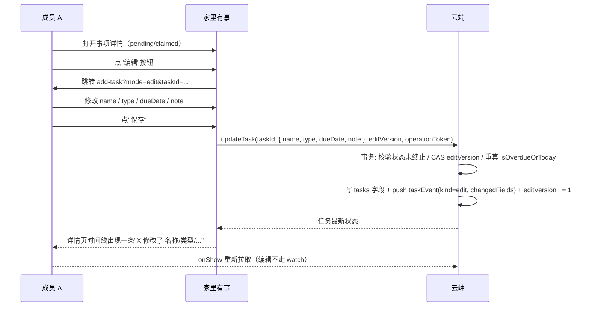
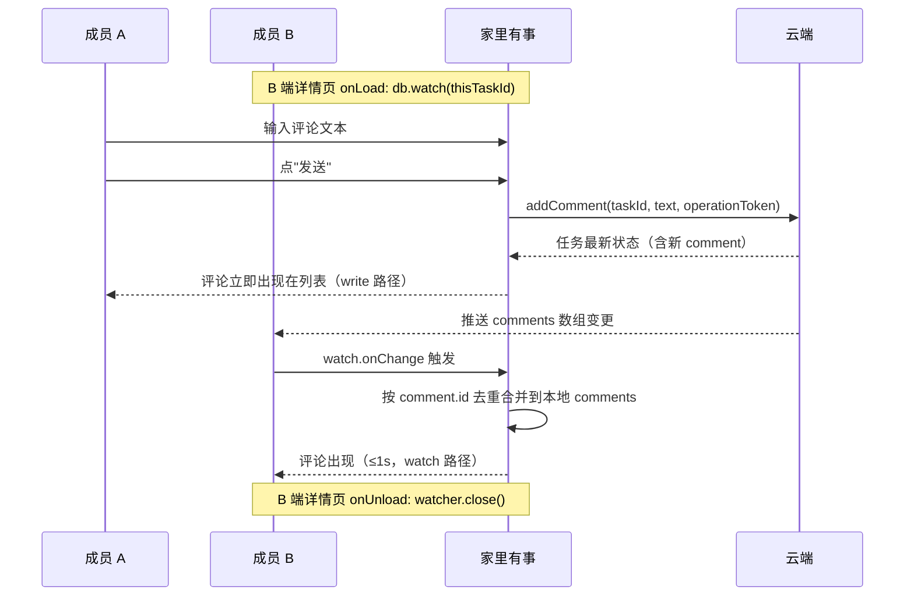

# 事项编辑与多人评论模块实施计划

## 概览

在 PRD 005 已经把"创建 → 邀请 → 认领 → 完成 / 放弃 → 已完成记录"跑通的基础上，补齐两个 PRD 005 已声明"暂不做"的高频痛点能力：

- **字段编辑**：在 `pending` / `claimed` 状态下，任一成员能修改 `name` / `type` / `dueDate` / `note` 四个字段；编辑行为进入事件流产生 `edit` 事件；并发编辑用 `editVersion` 做轻量乐观锁。
- **多人评论**：事项详情页底部加评论输入框与列表，评论按时间倒序展示；评论**不可改不可删**；评论**接 WeChat Cloud `db.watch` 实时推送**（SSE 通道，对方在详情页"打开中"时 ≤1s 内看到）；编辑与状态变更**不**走实时推送。

不在本期：转交 / 重新打开 / 删除；编辑 / 删除已发评论；终态后任何修改；提醒 / 推送 / 附件 / 图片；多家庭（>2 人）；统计 / 积分 / 排行；完整编辑 diff 历史。

## 问题与范围

### 当前现状

- `src/types/task.ts` 已声明 `TaskSummary` / `TaskDetail` / `TaskEvent` / `CompletedTaskItem`，**不含** `TaskComment` / `editVersion` / `edit` 事件。
- `cloudfunctions/task/task-domain.js` 已实现 `create / listCurrent / getDetail / claim / complete / abandon / listCompleted` 7 个动作，**无** `updateTask` / `addComment`；`tasks` 文档不含 `comments` / `editVersion` 字段。
- `src/store/modules/task.ts` 已有对象式 Pinia + 单飞 + 超时恢复；**无** `updateTask` / `addComment` action；**无** watch 订阅。
- `src/subpackages/task/task-detail/index.vue` 已有顶部 + 事件流 + 操作按钮；**无** 编辑入口 / 评论区 / `edit` 事件展示 / watch 生命周期。
- `src/subpackages/task/add-task/index.vue` 仅支持新建；**无** 编辑模式。

### 本计划范围

- PRD 006 全部需求 R1-R41、双账号验收 14 条路径、关键决定 8 条。
- 数据契约扩展（`TaskComment` / `TaskEditEvent` / `editVersion`）、云端 2 个新动作、前端 2 个新 action、详情页评论区 + 编辑入口、`db.watch` 接入与降级、14 条双账号验收路径。

### 不在范围

- PRD 005 暂不做清单（重复事项、模板、提醒、推送、附件等）继续保留，本期不动。
- 评论 / 编辑的"完整历史记录"（PRD 005 70 行 + PRD 006 关键决定）；`edit` 事件只存字段名数组，不存旧值/新值。
- 编辑 / 状态变更的实时推送；只评论走 `db.watch`。

## 需求追踪

- **R1-R8** 编辑：编辑入口、字段范围、负责人排除、edit 事件写入、首页/分组重排、note 校验、终态隐藏"保存"按钮。
- **R9-R16** 评论：输入框可见性、空白禁用、立即出现、空状态、卡片展示、不可改不可删、提交失败重试、>50 条分页预留。
- **R17-R19** 事件与时间线：edit 事件展示、changedFields 中文化。
- **R20-R24** 错误与边界：失败保留、重复点击幂等、超时重试、字段不可信、原子事务。
- **R25-R26** 状态机扩展点：状态机不变；editVersion CAS 校验。
- **R27-R33** 实时推送（仅评论）：watch 生命周期、合并语义、断线降级、发起人不依赖 watch、watch 不绕过鉴权、watch 只读 comments 字段。
- **双账号验收 14 条路径**（PRD 005 10 条 + 本期新增 4 条：编辑后同步、watch 实时同步、watch 断线降级、watch 范围控制、watch 不冲掉本地状态）。

## 调研结论

### 现有基础（可直接复用）

- `cloudfunctions/household/household-domain.js` 的 `HouseholdDomainError` + repository 注入 + 事务模式；本计划新增的 `updateTask` / `addComment` 沿用同一套错误码和事务封装。
- `cloudfunctions/household/invitation-domain.js` 的"安全转义"模式（只回页面需要的字段，不暴露 `_id` / `householdId` / `actorKey`）；`updateTask` / `addComment` 的响应同样按"展示字段"收缩。
- `src/services/task-cloud.ts` 已有的 `isTaskSummary` / `isTaskDetail` / `isCompletedTaskItem` 严格校验模式；本计划新增 `isTaskComment` / `isTaskEditEvent`。
- `src/store/modules/task.ts` 已有的对象式 Pinia + `cloudClient` 抽象 + 单飞 + `authoritativeRevision` 防 race + `pending` 短期凭证；新增 `updateTask` / `addComment` action 走同一套。
- `src/subpackages/task/add-task/index.vue` 的 Wot UI 表单（`wd-input` / `wd-textarea` / `wd-radio-group` / `wd-button`）+ `add-task-view.ts` 纯函数；编辑页**复用同一份** `add-task-view.ts`，新增 `mode: 'create' | 'edit'` 入口参数。
- `src/subpackages/task/task-detail/index.vue` 的 Wot UI 顶部 + 事件流（彩色圆点按 kind 区分）+ 操作按钮（认领/完成/放弃）；本计划在底部加评论区 + 顶部加编辑入口 + 时间线加 `edit` 事件展示。
- `src/utils/pending-task.ts` 的 `requestId` / `operationToken` 双凭证 + 短期落盘；`updateTask` / `addComment` 复用同一套（不引入新凭证机制）。
- `tests/unit/task-cloud.spec.ts` / `task-store.spec.ts` / `task-domain.spec.ts` / `add-task-view.spec.ts` / `task-detail-view.spec.ts` 的"内存替身 + 注入"模式；新增 `comment-view.spec.ts` / `update-task-domain.spec.ts` 直接复用。

### 外部约束

- WeChat Cloud 实时数据推送（`db.watch`）走 SSE 通道，**不**走裸 WebSocket；每个 doc 变更会触发一次推送调用，按调用量计费；前端 SDK 原生支持、自动重连。
- WeChat Cloud 事务只支持已确定文档的读和写；`updateTask` 在事务中只读 `tasks` 自身 + `taskOperations` 写事件，仍可用。
- 微信 `db.watch` 不支持字段级订阅，只能 doc 级订阅；本计划在 watch 回调里**只读** `comments` 字段（PRD 006 R33），其他字段变更忽略。
- 评论存储在事项文档内（不另起集合）；单文档 1 MB 软上限对"200 字 × 200 条"≈ 80KB 仍有数倍冗余；分页接口留口子（PRD 005 已有 `nextCursor` 模式可借鉴）但默认一次拉完。
- 微信小程序后台杀进程时 SSE 连接会断；本计划走"watch 断线静默降级到 onShow 拉取"（PRD 006 R30），不弹任何错误。

## 关键技术决定

| 决定 | 处理方式 | 原因 |
| --- | --- | --- |
| 字段范围 | 仅 `name` / `type` / `dueDate` / `note` 可编辑；assignee **不**进编辑表单 | 沿用 PRD 005 "认领只能由'我来处理'产生"原则；避免"我以为你接了"沟通裂缝 |
| 编辑权限 | 任一成员、仅 `pending` / `claimed` | 与 PRD 005 "任一成员都能完成 / 放弃"对称；终态全封口 |
| 终态全封口 | `completed` / `abandoned` 后编辑按钮和评论输入框都不显示，云端 `updateTask` / `addComment` 都返回 `TASK_TERMINAL` | 简单且对称；不引入"封口后能加评论但不能改字段"半开放状态 |
| 评论不可改不可删 | 前端无任何编辑 / 删除入口；云端不开放 update / delete comment 动作 | 与 Slack / Linear 一致；"打错字发一条新的"是更轻量修复路径 |
| `edit` 进时间线但 `comment` 不进 | 时间线回答"谁、什么时候、改了字段"（关心顺序）；评论区是异步对话（关心内容本身） | 混一起会让时间线被评论淹没 |
| `editVersion` 乐观锁 | 任务文档新字段；初始 0；每次 `updateTask` 成功 +1；前端在更新时携带当前 `editVersion` 供云端 CAS 校验 | 不引长事务；冲突时后到的成员看到"已被 X 更新"提示并刷新 |
| 评论存事项文档 | 新增 `comments: TaskComment[]` 字段；不另起集合 | 单文档 1 MB 软上限对"200 字 × 200 条"仍有数倍冗余；分页接口留口子但默认一次拉完 |
| 仅评论接 watch | task-detail `onLoad` 建 `db.watch(this._id)`；`onUnload` 必 `watcher.close()` | "对话"是高频双向操作，watch 收益大；"编辑"是低频单向操作，对方下次 onShow 就能看到 |
| watch 只合并 comments | 回调里**只读** `comments` 字段的更新；其他字段（name/type/dueDate/note/events/editVersion）忽略 | 避免在 watch 里引入多字段合并冲突（编辑到一半被对方覆盖） |
| watch 断线静默降级 | `onError` 或长时间无 `onChange` → 切回"onShow 拉取"模式；不弹错误 | 微信小程序后台杀进程 / 网络抖动时断线是常态；静默比弹错更不打扰用户 |
| 发起人不依赖 watch | addComment 云函数返回的最新文档就是 source of truth；watch 即使没回来，本地也已经是最新的 | 简化"自己端"路径；watch 仅承担"对方"侧实时回显 |
| edit 事件只存字段名 | 存 `changedFields: ("name" \| "type" \| "dueDate" \| "note")[]`；不存旧值/新值 | PRD 005 + PRD 006 都明确"完整历史记录"在 MVP 之外；存 diff 会扩大存储且需要设计 diff 展示 |
| 编辑触发的"今天/逾期"重算 | 服务端在事务中按当前日期 + 新 `dueDate` 重新计算 `isOverdueOrToday` | 客户端不重复实现这套逻辑；保持"服务端是单一排序源"原则 |
| 复云端 addComment 原子性 | 写 `tasks.comments` 数组 + 写 `taskOperations`（comment 事件）必须在同一事务 | 与 PRD 005 已声明的"完成/放弃/认领必须在同一事务"对称 |
| 复用 add-task 页面承载编辑 | `add-task-view.ts` 抽离出"校验 / 提交 / 类型选项"等纯函数；`.vue` 通过 `mode: 'create' \| 'edit'` + `taskId?` 入口参数决定行为 | 避免重复实现一份几乎相同的表单；维护成本最低 |
| 字段名展示中文化 | PRD 006 锁：`name → 名称`、`type → 类型`、`dueDate → 截止日期`、`note → 备注` | 详情页时间线文案要可读 |
| 评论最大长度 200 | 与 PRD 005 `note` 字段的 100 字区分；对话场景下更自由 | 短文本 + 即时对话场景下"打错字发一条新的"足够覆盖 |
| 评论顺序 | 倒序，新发在最上；输入框在底部 | 跟 PRD 005 时间线一致；发完即出现在顶部 |
| watch 不影响 addComment 双凭证 | 即使 watch 触发，前端也不绕过 `requestId` + `operationToken` 幂等闸门 | 与 PRD 005 "不绕过双凭证"对称；保持幂等性 |

## 高层交互关系

### 编辑字段



### 多人评论（含实时推送）



### watch 生命周期与降级

```mermaid
flowchart TB
    A[详情页 onLoad] --> B{task 状态 pending/claimed?}
    B -- 否 --> X[不订阅, 仅 onShow 拉取]
    B -- 是 --> C[db.collection('tasks').doc(id).watch]
    C --> D{onChange?}
    D -- 有 --> E[按 comment.id 合并到本地 comments]
    D -- 无 --> F[长时间无变化]
    C --> G{onError?}
    G -- 有 --> H[切回 onShow 拉取模式]
    F --> H
    H --> I[下次 onShow 强制拉取, 不弹错]
    A2[详情页 onUnload] --> J[watcher.close]
    J --> K[释放连接]
```

## 实施单元

### U1：扩展数据契约（TaskComment / TaskEditEvent / editVersion）

**目标**：为评论、编辑事件、乐观锁提供受限且一致的数据形状；前端类型与云端响应严格对齐。

**需求**：R1-R2（编辑字段范围）、R9-R13（评论展示）、R17-R19（事件与时间线）、R25-R26（状态机扩展点）、PRD 006 概念与字段章节。

**依赖**：无。

**文件**：

- 修改：`src/types/task.ts`
- 新建：`src/types/task-comment.ts`（`TaskComment` 类型 + `isTaskComment` 严格校验）
- 修改：`src/services/task-cloud.ts`（`updateTaskInCloud` / `addCommentInCloud` 函数签名 + `isTaskComment` 导出）
- 新建：`src/utils/pending-task.ts`（复用，不新增凭证；新增 `PENDING_TASK_KIND` 加 `update` / `addComment` 两种 kind）
- 测试：`tests/unit/task-cloud.spec.ts`（新增 updateTask / addComment 响应校验）

**实施方法**：

- `TaskComment` 类型：`{ id: string, actor: AssigneeDisplay, text: string, at: string }`；`text` 1-200 字。
- `TaskEvent` 联合扩展：在 `create | claim | complete | abandon` 之外加 `edit`；`TaskEditEvent = { kind: 'edit', actor: AssigneeDisplay, at: string, changedFields: ("name" | "type" | "dueDate" | "note")[] }`。
- `TaskDetail` 扩展：加 `comments?: TaskComment[]`（默认空数组）与 `editVersion: number`（默认 0）。
- 严格校验 `isTaskComment`：拒绝任何带 `_id` / `householdId` / `actorKey` / `memberKeys` 的对象；`text` 1-200、首尾去空白、UTF-8 字符计数。
- 响应类型：`UpdateTaskResult = { status: 'UPDATED', task: TaskSummary, editVersion: number, events: TaskEvent[] }`；`AddCommentResult = { status: 'COMMENTED', task: TaskDetail }`。
- 错误码沿用 PRD 005 六个（`TASK_INVALID_REQUEST` / `TASK_NOT_FOUND` / `TASK_FORBIDDEN` / `TASK_TERMINAL` / `TASK_DUPLICATE_OPERATION` / `TASK_TEMPORARY_FAILURE`）；`updateTask` / `addComment` 不引入新错误码。

**遵循模式**：`src/types/task.ts` 现有的有限联合 + `src/services/task-cloud.ts` 现有的 `isTaskSummary` / `isTaskDetail` 严格校验；`src/utils/pending-task.ts` 现有 `kind` 枚举。

**测试场景**：

- 正常：`TaskComment` 完整字段被识别；`text` 1-200 字被接受；`changedFields` 数组元素是 `("name" | "type" | "dueDate" | "note")[]` 联合。
- 边界：`changedFields` 为空数组时仍合法（PRD 006 R5 兜底：不上事件，但类型允许）。
- 错误：携带 `_id` / `householdId` / `actorKey` 的"评论对象"被 `isTaskComment` 拒绝；`text` 0 字、201 字、纯空白被拒。
- 集成：`UpdateTaskResult` 缺 `editVersion` / `events` 字段时返回 false；`AddCommentResult` 缺 `task.comments` 时返回 false。

**完成验证**：typecheck 通过；`tests/unit/task-cloud.spec.ts` 新增 6+ 用例；前端类型不出现 `householdId` / `actorKey` / `_id`。

### U2：云端 task 域扩展 updateTask / addComment

**目标**：在云端按当前家庭身份完成字段编辑和评论写入，所有写入在同一事务内完成；`updateTask` 用 `editVersion` 做轻量 CAS 校验；编辑行为在事件流里产生 `edit` 事件。

**需求**：PRD 006 概念与字段 / 身份与权限 / 产品要求 R1-R26 / 隐私与安全边界。

**依赖**：U1。

**文件**：

- 修改：`cloudfunctions/task/task-domain.js`（新增 `updateTask` / `addComment` 域函数）
- 修改：`cloudfunctions/task/index.js`（新增 action 路由）
- 修改：`cloudfunctions/task/repository-data.js`（新增 `getTaskById` helper，含 PRD 005 已有 3-retry × 200ms 一致性窗口）
- 修改：`cloudfunctions/README.md`（task 云函数章节加 updateTask / addComment 动作 + 幂等 + 鉴权说明）
- 测试：`tests/unit/task-domain.spec.ts`（新增 updateTask / addComment 用例）

**实施方法**：

- `updateTask(input, deps)`：
  - 事务前预检：身份属于该事项所属家庭、状态未终止（`pending` 或 `claimed`）、`editVersion` 匹配（CAS）；不通过返回对应错误（`TASK_FORBIDDEN` / `TASK_TERMINAL` / `TASK_DUPLICATE_OPERATION`）。
  - 字段校验：`name` 1-20 字（沿用 `validateDisplayText`）、`type` ∈ 三个枚举、`dueDate` 可空且为 `YYYY-MM-DD` 格式或 `null`、`note` 0-100 字。
  - 计算 `changedFields`：对比新旧四个字段，只有真正变化的字段名进入数组。
  - 重算 `isOverdueOrToday`：若 `dueDate` 或 `type` 改变，按当前日期重算。
  - 事务中：更新 `tasks` 文档（`name` / `type` / `dueDate` / `note` / `isOverdueOrToday` / `editVersion += 1`）；若 `changedFields` 非空，追加 `taskOperations` 文档（`kind: 'edit', changedFields`）。
  - 返回 `{ status: 'UPDATED', task: TaskSummary, editVersion, events: TaskEvent[] }`（events 是更新后的事件流倒序）。
- `addComment(input, deps)`：
  - 事务前预检：身份属于该家庭、状态未终止、`text` 1-200 字。
  - 事务中：push `tasks.comments` 数组（新 comment 由云端生成 `id` 与 `at`）；追加 `taskOperations` 文档（`kind: 'comment'` —— 仅供审计，本期不在前端展示）。
  - 返回 `{ status: 'COMMENTED', task: TaskDetail }`（task 含最新 `comments` 数组与 `editVersion`）。
- 安全转义：响应里 `TaskSummary` / `TaskDetail` 仍按 PRD 005 模式（无 `_id` / `householdId` / `actorKey`），`TaskComment.actor` 走 `AssigneeDisplay`（昵称 + 内置头像）。
- 幂等：与 PRD 005 同款 `operationToken` 短期凭证（`taskop_<taskId>_<sha256(operationToken)>` 文档 id 复用），同一 `operationToken` 重复提交幂等。
- action 路由：`index.js` 加 `updateTask` / `addComment` 两个 case，复用 PRD 005 的 `withIdentity` + `taskOpIdentityKey` 模式。

**遵循模式**：`cloudfunctions/household/household-domain.js` 的 `HouseholdDomainError` + 事务 + repository 注入；`cloudfunctions/household/invitation-domain.js` 的"安全转义"模式。

**测试场景**：

- 正常：任一成员在 `pending` / `claimed` 下 `updateTask` 改 `name` / `type` / `dueDate` / `note`；返回的 `task` 与新字段一致，`editVersion` 比旧值 +1，`events` 顶部多一条 `edit`。
- 正常：任一成员 `addComment` 1-200 字；返回的 `task.comments` 含新 comment 且 `at` 是服务端时间。
- 边界：纯空白 / 0 字 / 201 字评论被拒；`dueDate` 为 `''` / `'今天'` / `'2026-13-99'` 被拒。
- 边界：`changedFields` 只列真实变化的字段；只改 `name` 时数组为 `['name']`。
- 错误：终态（`completed` / `abandoned`）下 `updateTask` / `addComment` 都返回 `TASK_TERMINAL`。
- 错误：非家庭成员调用 `updateTask` / `addComment` 返回 `TASK_FORBIDDEN`。
- 错误：`updateTask` 携带的 `editVersion` 与云端不匹配时返回 `TASK_DUPLICATE_OPERATION`（含 `currentEditVersion` 提示给前端）。
- 错误：同一 `operationToken` 重复 `updateTask` / `addComment` 幂等。
- 集成：编辑 `type` 从 `to_handle` 改 `low_stock` 时，`isOverdueOrToday` 按新 `dueDate` 重算；事务内 `tasks` 与 `taskOperations` 同时成功或同时回滚。
- 集成：`getTaskById` 仍走 3-retry × 200ms 一致性窗口（PRD 005 已有，不重复实现）。

**完成验证**：27 套件 + ~30 新增用例；typecheck 通过；云函数 `cloudfunctions/task/` 7 个 action + 2 个新 action = 9 个；幂等性、终态封口、editVersion CAS 全覆盖。

### U3：前端 task 状态扩展 updateTask / addComment action

**目标**：让前端 store 支持编辑和评论两种新 action，复用 PRD 005 的单飞 + 双凭证 + 超时恢复 + `authoritativeRevision` 防 race 模式。

**需求**：R5-R6（编辑事件与重排）、R11-R16（评论展示与重试）、R20-R24（错误与边界）、R28-R30（实时推送的"发起人不依赖 watch"路径）。

**依赖**：U1、U2。

**文件**：

- 修改：`src/store/modules/task.ts`（新增 `updateTask` / `addComment` action；新增 `editInFlight` / `addCommentInFlight` 单飞保护；复用 `requestId` / `operationToken` 双凭证）
- 修改：`src/services/task-cloud.ts`（新增 `updateTaskInCloud` / `addCommentInCloud` 客户端调用；与 `claimTaskInCloud` 同款"严格校验响应"模式）
- 测试：`tests/unit/task-store.spec.ts`（新增 updateTask / addComment 用例）

**实施方法**：

- `updateTask(draft)` action：
  - 单飞保护：`editInFlight` 复用 `claimInFlight` 模式。
  - 凭证：生成 `requestId` + `operationToken`，写入 `pending-task.ts`（`kind: 'update'`）。
  - 调 `updateTaskInCloud`，成功后：`applyEdited(task, editVersion, events)` 合并到本地 `detail`（覆盖 `name` / `type` / `dueDate` / `note` / `isOverdueOrToday`，`editVersion` 替换，`events` 追加）；同时同步到 `current`（按新 `type` 重新归位 + 按新 `dueDate` 重排 priority）。
  - 错误处理：沿用 PRD 005 的 `humaniseError` + `recoverAfterTimeout`（轻量查详情确认）。
  - 超时恢复：复用 `recoverAfterTimeout` 模式；查详情时若 `editVersion` 已变则按成功处理。
- `addComment(text)` action：
  - 单飞保护：`addCommentInFlight` 复用。
  - 凭证：`requestId` + `operationToken`（`kind: 'addComment'`）。
  - 调 `addCommentInCloud`，成功后：`applyCommented(task)` 合并到本地 `detail.comments`（云端返回的就是最新，前端不需要自己 push）。
  - 错误处理：网络失败时停在输入框文本 + `errorMessage`；超时同 updateTask 走 `recoverAfterTimeout`。
- `applyEdited` 合并：使用 `editVersion` 做幂等键（同一 `editVersion` 重复调用是 no-op）；`applyCommented` 同理。
- `authoritativeRevision` 防 race：切家庭 / 移除成员时 `resetForHouseholdChange` 已清空 `detail` / `comments` / `editVersion`。

**遵循模式**：`task.ts` 现有的 `claim` / `complete` / `abandon` action；`household.ts` 的 `authoritativeRevision` 模式。

**测试场景**：

- 正常：updateTask 成功后 `detail.name` / `type` / `dueDate` / `note` 与新值一致；`editVersion` +1；`detail.events` 顶部多一条 `edit`；`current` 按新 `type` / `dueDate` 重新归位。
- 正常：addComment 成功后 `detail.comments` 含新 comment（`id` / `actor` / `text` / `at` 来自云端返回）。
- 边界：连续点击 3 次"保存"按钮，只发一次 `updateTask` 云端调用（单飞）。
- 边界：连续点击 3 次"发送"按钮，只发一次 `addComment` 云端调用。
- 错误：`updateTaskInCloud` 返回 `TASK_DUPLICATE_OPERATION`（editVersion 不匹配）时，`errorMessage` 显示"已被 X 更新，请刷新"；`detail` 不变。
- 错误：`addCommentInCloud` 返回 `TASK_TERMINAL` 时，`errorMessage` 显示"事项已经结束，不能再操作"；`detail.comments` 不变。
- 错误：网络中断后页面停在 `updating` / `commenting`；恢复后用户点重试，先调用 `getTaskDetail` 确认；已生效则按成功处理。
- 集成：被移除者刷新后 `loadCurrent` 返回 `TASK_FORBIDDEN`，`updateTask` / `addComment` 在 store 拒绝（前置 `detail` 已被清空）。

**完成验证**：typecheck 通过；`tests/unit/task-store.spec.ts` 新增 8+ 用例；重复点击、网络超时、不匹配的 editVersion 都不会让前端显示错误家庭或重复事件。

### U4：编辑页（复用 add-task）+ 详情页评论区 + 时间线 edit 事件

**目标**：把编辑和评论变成用户可以理解和操作的页面，包括 add-task 页的编辑模式、详情页"编辑"按钮、评论区列表与输入框、时间线 `edit` 事件展示、终态隐藏入口。

**需求**：R1-R8（编辑）、R9-R16（评论）、R17-R19（事件与时间线）、R20-R24（错误与边界）。

**依赖**：U1、U3。

**文件**：

- 修改：`src/subpackages/task/add-task/index.vue`（新增 `mode: 'create' | 'edit'` 入口参数；`onLoad` 读取 `taskId`；编辑模式预填详情 + 改标题"编辑事项" + 改按钮"保存"；编辑模式禁用 type radio 切换？否——type 也能改，保留全部控件）
- 修改：`src/subpackages/task/add-task/add-task-view.ts`（抽离"校验 / 提交 / 类型选项"为可复用纯函数；新增 `buildDraftFromDetail(detail)` helper；`submitEdit` vs `submitCreate` 两条路径）
- 修改：`src/subpackages/task/task-detail/index.vue`（顶部加"编辑"按钮（仅 pending/claimed 显示）；底部加评论区组件；时间线增加 `edit` 事件展示；事件文案支持中文化 changedFields）
- 新建：`src/components/task/TaskComments.vue`（评论列表 + 输入框 + 空状态；纯 UI 组件）
- 新建：`src/components/task/TaskCommentItem.vue`（单条评论展示：头像 / 昵称 / 文本 / 相对时间）
- 新建：`src/subpackages/task/task-detail/task-detail-view.ts`（抽出"事件展示文案 / changedFields 中文化 / 评论相对时间"纯函数）
- 修改：`src/subpackages/task/task-detail/task-detail-view.ts`（若已存在则扩展；不存在则新建；保持现有 `describeEventLine` / `formatTerminalTime` 模式）
- 修改：`src/pages.json`（add-task 页面注册 `mode` / `taskId` query 解析；如有新增分包页面则注册）
- 测试：`tests/unit/add-task-view.spec.ts`（新增 `mode: 'edit'` + `buildDraftFromDetail` 用例）
- 测试：`tests/unit/task-detail-view.spec.ts`（新增 `describeEditEvent` / `describeChangedFields` / `formatRelativeTime` 用例）
- 测试：`tests/e2e/shared-task.spec.js`（新增 add-task 编辑模式 e2e：进入编辑、修改字段、保存、回到详情看到新字段）

**实施方法**：

- add-task 改造：
  - `onLoad(options)` 读取 `mode` 与 `taskId`；`mode === 'edit'` 时调 `taskStore.loadDetail(taskId)`，把 `detail` 的 `name` / `type` / `dueDate` / `note` 预填到本地 draft。
  - 标题动态：编辑模式 "编辑事项" + 副标"补充或修正家里这件事"；创建模式保持 "记一件事" + "先记下来，我们一起处理"。
  - 提交按钮：编辑模式 "保存"；创建模式 "记下来"。
  - 提交逻辑：`mode === 'edit'` 调 `taskStore.updateTask(draft)`；成功 `uni.navigateBack()`；失败停在页面显示错误。
  - 编辑模式不显示"创建提示"组件；保留 note 字段（PRD 005 已有）。
- task-detail 改造：
  - 顶部右侧（标题旁）"编辑"按钮：仅 `phase === 'loaded' && detail && (status === 'pending' || status === 'claimed')` 时显示；点击 `uni.navigateTo({ url: '/subpackages/task/add-task/index?mode=edit&taskId=...' })`。
  - 时间线增加 `edit` 事件展示：`describeEditEvent(event)` 返回 `${actor} 在 ${at} 修改了 ${describeChangedFields(changedFields).join('、')}`；`describeChangedFields` 走中文化映射。
  - 底部评论区（`<TaskComments :comments="detail.comments" :can-comment="canComment" :is-submitting="isAddingComment" @send="onAddComment" />`）：
    - 列表：空状态"还没有留言"；非空按 `at` 倒序展示。
    - 每条 `<TaskCommentItem>`：头像 / 昵称 / 文本 / 相对时间（"刚刚 / X 分钟前 / yyyy-MM-dd HH:mm"）。
    - 输入框：仅 `canComment` 为 true 时显示；空白时"发送"按钮禁用；提交中 loading。
- 视图函数：
  - `describeEditEvent(event)` 复用 `describeEventLine` 模式。
  - `describeChangedFields(fields)` 走 `Record<TaskEditField, string>` 映射表。
  - `formatRelativeTime(iso, now?)` 与 `formatTerminalTime` 同款可注入 `now` 便于单测。

**遵循模式**：`add-task/index.vue` 现有的 Wot UI 表单 + `add-task-view.ts` 纯函数；`task-detail/index.vue` 现有的 Wot UI 顶部 + 事件流；`household/create-home/index.vue` 现有的"私有视图函数 + 单文件 Vue"。

**测试场景**：

- 正常：add-task 编辑模式预填当前 detail；改 `name` 后保存；详情页时间线顶部出现一条 `edit`。
- 正常：task-detail 评论区空状态"还没有留言"；A 发评论后立即出现（write 路径）；相对时间"刚刚"。
- 正常：task-detail 终态（completed / abandoned）下"编辑"按钮和评论输入框都不显示。
- 边界：编辑模式不修改任何字段直接保存，`changedFields` 为空数组，不产生 `edit` 事件（R5 兜底）。
- 边界：评论文本去首尾空白后为空，"发送"按钮禁用。
- 错误：编辑保存失败时停留在 add-task 页，错误信息展示在按钮上方，draft 保留。
- 错误：评论发送失败时停留在 task-detail 页，输入框文本保留，提供重试。
- 集成：add-task 编辑模式保存成功后 navigateBack；task-detail 时间线新增的 `edit` 事件中 `changedFields` 中文显示（"修改了 名称、截止日期"）。

**完成验证**：typecheck 通过；`tests/unit/add-task-view.spec.ts` + `tests/unit/task-detail-view.spec.ts` 新增 8+ 用例；e2e `tests/e2e/shared-task.spec.js` 新增 1-2 个用例；真机双账号验收"编辑后双方同步"路径通过。

### U5：评论实时推送（db.watch 订阅 + 合并 + 降级）

**目标**：让"对方在详情页打开中"时能看到 ≤1s 内的评论更新；watch 断线时静默降级到 onShow 拉取；watch 不冲掉本地状态（编辑框、评论草稿、乐观更新）。

**需求**：R27-R33（实时推送整段）。

**依赖**：U3（store 的 `applyCommented` 已经能合并来自云函数返回的 comments；watch 路径也用同一份合并逻辑）。

**文件**：

- 修改：`src/services/task-cloud.ts`（新增 `subscribeTaskComments(taskId, callbacks)` 与 `unsubscribeTaskComments()` 函数；调用 `wx.cloud.database().collection('tasks').doc(taskId).watch({ onChange, onError })`）
- 修改：`src/store/modules/task.ts`（新增 `subscribeComments(taskId, onComment)` 与 `unsubscribeComments()` action；`subscribe` 内部用 service 订阅，回调里走 `applyCommentedFromWatch` 合并逻辑）
- 修改：`src/subpackages/task/task-detail/index.vue`（`onLoad` 调 `taskStore.subscribeComments(taskId, ...)`；`onUnload` 调 `taskStore.unsubscribeComments()`；`onShow` 兜底拉取；`onHide` 可选：暂停订阅）
- 测试：`tests/unit/task-store.spec.ts`（新增 subscribe / unsubscribe action 用例；mock `subscribeTaskComments` 触发 `onChange` 验证合并）

**实施方法**：

- service 层 `subscribeTaskComments(taskId, callbacks)`：
  - 调用 `db.collection('tasks').doc(taskId).watch({ onChange: (snapshot) => {...}, onError: (err) => {...} })`。
  - `onChange` 里**只**读 `docs[0].comments` 字段；`snapshot.docChanges` 暂不使用（避免按字段变化精确处理；本期按"整 comments 数组"重新合并即可）。
  - 把 `docs[0].comments` 通过 `callbacks.onComments(newComments)` 传回 store。
  - 返回一个 `watcher` 对象，调用方负责 `watcher.close()`。
  - `unsubscribeTaskComments(watcher)` 调 `watcher.close()`。
- store 层 `subscribeComments(taskId, onComment?)`：
  - 调 `subscribeTaskComments(taskId, { onComments: (newComments) => { this.applyCommentedFromWatch(taskId, newComments) } })`。
  - `applyCommentedFromWatch` 走与 `applyCommented` 相同的合并逻辑：以 `comment.id` 为去重键，新数组里的 id 若本地已有则忽略，若无则按 `at` 倒序插入。
  - **关键**：本函数**只**修改 `detail.comments`，**不**触碰 `detail.name` / `type` / `dueDate` / `note` / `events` / `editVersion`；编辑框、评论草稿、其他本地状态完全保留（R28 兜底）。
  - `unsubscribeComments()` 调 `service.unsubscribeTaskComments(this._commentWatcher)` 并清空引用。
- task-detail 生命周期：
  - `onLoad(options)`：`this._taskId = options.taskId`；调 `taskStore.loadDetail(taskId)`；成功后 `taskStore.subscribeComments(taskId)`。
  - `onUnload()`：`taskStore.unsubscribeComments()`；释放 watcher。
  - `onShow()`：复用 `loadDetail`（不变）；watch 断线时 onShow 拉取是兜底（R30）。
  - **不**在 `onHide` 主动 unsubscribe（用户切后台时希望保留连接，回到详情时不丢推送）。

**遵循模式**：`task.ts` 现有的 `authoritativeRevision` 模式（reset 时清空 detail）；`household.ts` 现有的"按需订阅 / 主动释放"模式（如有）。

**测试场景**：

- 正常：mock `subscribeTaskComments` 触发 `onComments` 传回新数组；store 的 `detail.comments` 按 `id` 去重合并；已有 id 忽略、新 id 倒序插入。
- 边界：watch 回调里 `docs[0].comments` 为空数组时，本地清空（这是 R33 "只读 comments" 的兜底；但保留本地草稿 / 乐观更新——见下条）。
- 边界：watch 回调触发时，本地编辑框、评论输入框、乐观更新的 comment 都**不**被冲掉（R28）。
- 错误：`onError` 触发时静默降级——store 标记 `_watcherInError = true`；详情页 onShow 检测到该标记时强制 `loadDetail` 拉取一次；不弹错误。
- 集成：详情页 onUnload → `unsubscribeComments` → `watcher.close()` 被调；同一个 `taskId` 在首页不再有 watch 订阅（首页没有 task-detail 的 watch）。
- 集成：发起 addComment 的成员**不依赖** watch 回显（R31）——store 调 `addCommentInCloud` 成功后云端返回的最新 `task` 直接 `applyCommented`，本地已经最新；watch 即使没回来也不影响。

**完成验证**：typecheck 通过；`tests/unit/task-store.spec.ts` 新增 4+ 用例；真机双账号验收"评论实时同步" / "watch 断线降级" / "watch 范围控制" / "watch 不冲掉本地状态" 4 条新路径通过。

### U6：部署清单与双账号验收（14 条路径）

**目标**：把新增的 `updateTask` / `addComment` 两个云端动作、`db.watch` 实时推送接、编辑/评论区页面纳入部署清单；扩展双账号验收 14 条路径；PRD 005 的 10 条路径全部回归通过。

**需求**：PRD 006 成功标准 + 双账号验收路径（14 条）。

**依赖**：U1、U2、U3、U4、U5。

**文件**：

- 修改：`cloudfunctions/README.md`（task 云函数章节加 2 个新动作；幂等性 / 鉴权 / editVersion CAS / addComment 事务 / watch 计费说明）
- 修改：`tests/e2e/shared-task.spec.js`（新增 add-task 编辑模式 + 评论区 + watch 收发的 e2e 路径；保留 PRD 005 10 条路径不动）
- 部署清单（不入仓）：`cloudfunctions/README.md` 的"task 云函数部署步骤"小节，列出：
  - 上传 `cloudfunctions/task` 到测试环境
  - 在云数据库确认 `tasks` 集合自动添加 `comments` / `editVersion` 字段（首次 addComment / updateTask 后）
  - 微信开发者工具"云开发" → "实时数据推送" → 启用（首次 watch 时会要求）
  - 不需要新建集合；不需要改数据权限

**实施方法**：

- `cloudfunctions/README.md` 补充：
  - `updateTask(input)`：`taskId` / `name` / `type` / `dueDate` / `note` / `editVersion` / `requestId` / `operationToken`；返回 `TaskSummary` / `editVersion` / `events`；`TASK_TERMINAL` 终态封口；`TASK_DUPLICATE_OPERATION` editVersion 不匹配。
  - `addComment(input)`：`taskId` / `text` / `requestId` / `operationToken`；返回 `TaskDetail`（含最新 `comments`）；`TASK_TERMINAL` 终态封口；`TASK_INVALID_REQUEST` 文本超长。
  - 实时推送：`db.watch` 计费按调用量；本期评估"每事项详情页打开"对应"watch 调用次数"约 1:1；可接受。
- e2e 用例新增（仅当微信开发者工具 automator 可用时执行；不通则跳过）：
  - add-task 编辑模式：从详情页点"编辑"进入 add-task；改 `name`；保存；回到详情看到新 `name`。
  - 评论区：详情页底部发评论；列表立即出现。
  - watch 实时同步：A、B 同时打开详情；A 发评论；B 端 ≤1s 内出现。
- 双账号验收 14 条路径（在真机上用两个微信账号走）：
  1. **PRD 005 路径 1-10 全部回归**（创建/认领/完成/放弃/优先规则/重复点击/超时重试/非成员/移除成员/历史保留）。
  2. **编辑后双方同步**：A 创建并填 note；B 看到；A 改 name / type / dueDate 三个字段；B 刷新看到全变；首页按新字段重新归位。
  3. **编辑时间线**：A 改 name → 详情页时间线顶部出现"A 修改了 名称"；再改 dueDate → 多一条；空提交不增加事件。
  4. **编辑封口**：completed 后"编辑"按钮不显示；前端模拟显示并点保存，云端返回 `TASK_TERMINAL`。
  5. **评论按时间倒序**：A 发 3 条、B 发 2 条；详情页显示 5 条按时间倒序。
  6. **评论不可改不可删**：评论区不出现任何编辑/删除/长按菜单；直接调非 addComment 的 comment 写入动作返回 `TASK_INVALID_REQUEST`。
  7. **评论封口**：abandoned 后评论输入框不显示；B 调 addComment 云函数返回 `TASK_TERMINAL`。
  8. **并发编辑**：A、B 同时打开编辑页，携带同一 `editVersion`；先保存 OK，后保存收到"已被更新"提示。
  9. **评论/编辑与状态机解耦**：编辑不改变 status；评论不改变 status；详情页 status chip 在编辑/评论前后保持一致。
  10. **非成员读不到评论**：第三方账号 C 调 getTaskDetail / listCompleted，看到 `comments: []`（云端不返回非家庭成员的事项）。
  11. **编辑触发的分组重排**：A 创建 dueDate=明天；B 看到"快到期"；A 编辑成今天；A、B 双方都看到移到"优先处理"。
  12. **评论实时同步**：A、B 同时打开详情；A 发评论；B 端 ≤1s 出现（watch 路径）；A 端立即显示（write 路径）。
  13. **watch 断线降级**：DevTools 切离线再恢复；A 发评论；B 端 watch 短暂断线看不到 → 切回前台后重新进入详情页 → onShow 强制拉取 → 看到评论；不弹错误。
  14. **watch 范围控制 + watch 不冲掉本地状态**：退出详情 onUnload → `watcher.close()` 被调；云开发控制台"实时推送"调用计数 ≈ 详情页访问次数；A 在编辑框输入一半 → B 发评论 → A 端 watch 触发 → 仅合并 comments；编辑框内容保留。

**遵循模式**：`cloudfunctions/README.md` 现有 household / task 章节；`tests/e2e/shared-task.spec.js` 现有 PRD 005 e2e 路径。

**完成验证**：

- `cloudfunctions/README.md` 部署清单完整，新加动作的鉴权 / 幂等 / 终态封口都有说明。
- `tests/e2e/shared-task.spec.js` 在 automator 不可用时优雅跳过；可用时新增用例通过。
- 真机双账号 14 条路径在测试云环境全部走通。
- 微信开发者工具"云开发" → "数据库" → `tasks` 集合字段包含 `comments` (Array) 与 `editVersion` (Number)。
- 微信开发者工具"云开发" → "数据库" → `taskOperations` 集合新加 `edit` 与 `comment` 两种 `kind`。
- 微信开发者工具"云开发" → "实时数据推送" → 调用记录与详情页访问次数大致一致。

## 风险与回退

| 风险 | 触发条件 | 影响 | 回退方案 |
| --- | --- | --- | --- |
| `db.watch` 在微信开发者工具模拟器中不可用 | 模拟器没启"实时数据推送" | watch 路径在模拟器中走不通 | 模拟器走 onShow 拉取兜底；真机验收走 watch 路径 |
| `db.watch` 在小程序后台被杀时断线 | 用户切后台 | 推送丢失 | R30 静默降级到 onShow 拉取；不弹错 |
| `editVersion` CAS 冲突 | 两人同时编辑 | 后到者看到"已被更新"提示 | U3 错误处理已覆盖；用户刷新即可 |
| 评论文档大小超 1 MB | 同一事项 >5000 条 200 字评论 | 写失败 | PRD 006 范围边界说明：本期不迁出；如发生就降级到 abandon 后重新建 |
| 实时推送计费超预算 | watch 调用次数远超预期 | 资金 | U5 已限定"watch 只在详情页打开时挂"；非打开页不挂；可在 R 阶段监控调用量 |
| add-task 编辑模式与创建模式混淆 | UI 标题 / 按钮文案不清晰 | 用户误操作 | PRD 006 R2 + U4 实施方法已规定：标题"编辑事项" / 按钮"保存"；保留全部控件（type 也能改） |
| edit 事件 `changedFields` 字段名漂移 | 后端英文、前端中文 | 文案不一致 | U1 + U4 都走 `Record<TaskEditField, string>` 映射表，类型层保证 |
| watch 回调里其他字段的变更被忽略导致"评论顺序错乱" | A 端 addComment 时 B 端 watch 触发，但 B 端 watch 忽略其他字段 | 顺序仍按 `at` 倒序，**无影响** | U5 已规定只读 comments；本地 `at` 倒序与云端保持一致 |

## 单元总览

| 单元 | 主题 | 主要文件 | 工作量估计 |
| --- | --- | --- | --- |
| U1 | 数据契约 | `src/types/task.ts`、`src/types/task-comment.ts`、`src/services/task-cloud.ts` | 0.5 天 |
| U2 | 云端 task 域 | `cloudfunctions/task/task-domain.js` / `index.js` / `repository-data.js` | 1.5 天 |
| U3 | 前端 task 状态 | `src/store/modules/task.ts` | 0.5 天 |
| U4 | 页面（编辑 / 评论区 / 时间线 edit） | `src/subpackages/task/add-task/*`、`src/subpackages/task/task-detail/*`、`src/components/task/TaskComments.vue` | 1.5 天 |
| U5 | 实时推送（db.watch） | `src/services/task-cloud.ts`、`src/store/modules/task.ts`、`src/subpackages/task/task-detail/index.vue` | 1 天 |
| U6 | 部署清单 + 双账号验收 | `cloudfunctions/README.md`、`tests/e2e/shared-task.spec.js`、真机验收 | 1 天 |

合计约 6 个工作日。U2 / U4 / U5 是重点；U1 / U3 是支撑；U6 是收口。

## 下一步

按 U1 → U2 → U3 → U4 → U5 → U6 顺序逐个单元交付；每单元完成跑 typecheck + 单元测试 + 真机手测；U6 留到最后做 14 条双账号验收。
