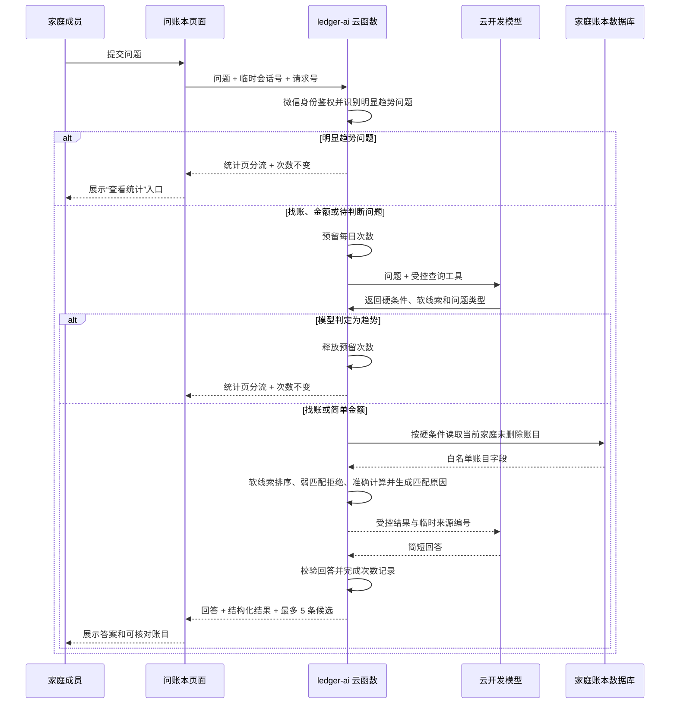
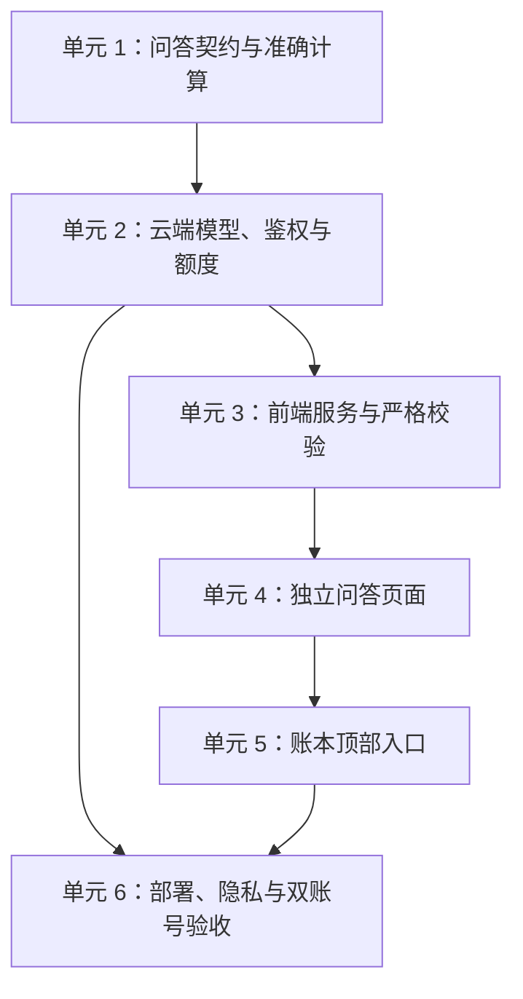

# feat: 增加“问账本”RAG 问答

## 概览

在家庭账本顶部增加“问账本”入口，进入独立分包页面。第一版优先解决“只记得部分线索”的模糊找账，并辅助完成有明确条件的简单金额汇总或两组总额比较。页面采用聊天形式，展示最多 5 条带匹配原因的候选账目，并支持用“第一笔”等表达继续确认。多月份趋势继续交给现有统计页。

本计划以正式产品范围 `docs/prd/010-ledger-rag-qa-prd.md` 和需求来源 `docs/brainstorms/2026-08-30-ledger-rag-qa-requirements.md` 为准。第一版使用模型体验额度，不引入向量数据库、其他模型厂商、凭证图片识别或长期聊天历史。

## 问题背景

现有账本已经能按月份、日期、付款人、收支类型和类目筛选，也有独立统计页。真正缺少的是：用户只记得大概金额、用途、时间或备注时，无法快速找回目标账目。新功能因此把模糊找账放在第一优先级；简单金额计算作为辅助，趋势分析不在问答中重复建设（见来源文档“问题背景”和“范围边界”）。

## 需求追踪

- R1-R4、R21：账本顶部入口、独立页面、当前页面内连续追问、退出后清空、首次说明与示例。
- R5-R8、R22、R34：以模糊找账为主，只保留一个明确总额或两个明确分组的简单比较；每轮重新核对未删除账目。
- R9-R12、R28-R33：硬条件不放宽，软线索适度模糊；展示最多 5 条编号候选、真实账目和匹配原因；弱匹配拒绝，支持引用候选继续追问，趋势转到统计页。
- R13-R17、R23：家庭每天 10 次、并发与重复提交保护、剩余次数、完整加载和失败状态、额度耗尽不影响原账本。
- R18-R20、R24-R27、R35：家庭隔离、最少数据、首次告知、临时会话自动失效、日志收敛、提示注入防护和云端凭据保护。
- 成功标准：目标账目进入前 5 条候选、匹配原因可理解、简单金额计算准确、候选追问读取最新数据、趋势正确分流、跨家庭访问失败、体验额度耗尽时安全降级。

## 范围边界

- 不读取或识别凭证图片，不把凭证地址发送给模型。
- 不提供预算、消费评价、理财、投资或家庭关系判断。
- 不在问答中生成多月份趋势、原因分析、预测或建议；趋势问题提供现有统计页入口。
- 不保存可供用户再次打开的聊天历史，不支持跨天继续会话。
- 不支持语音提问，不替代现有筛选和统计。
- 不接入向量数据库、外部模型厂商或自动付费能力。
- 不在本次工作中整理用户现有的账本统计页面改动；只在账本顶部入口区域做兼容性集成。

## 背景与研究

### 现有代码与模式

- `cloudfunctions/ledger/index.js` 统一从微信身份得到用户标识，再校验其是否属于目标家庭；新问答函数必须保持同等或更严格的边界。
- `cloudfunctions/ledger/ledger-domain.js` 将金额保存为整数分，并在云端完成筛选和统计；问答中的金额不能交给模型自行计算。
- `cloudfunctions/ledger/repository-data.js` 通过字段白名单收敛数据库记录；问答应建立更窄的模型输入和前端候选摘要。
- `src/services/ledger-cloud.ts` 对云函数响应做严格结构校验、超时收敛和测试注入；新的问答服务沿用此模式，但使用更长且可配置的模型调用超时。
- `src/store/modules/ledger.ts` 适合持久页面筛选状态；问答会话只在单页存在，因此不新增全局状态模块。
- `src/pages/ledger/index.vue` 和 `src/pages/ledger/ledger-home-view.ts` 正在增加“统计”入口。后续必须在该现状上布置“问账本”，不能覆盖或回退用户尚未提交的改动。
- `tests/unit/ledger-domain.spec.ts`、`tests/unit/ledger-cloud.spec.ts`、`tests/unit/ledger-store.spec.ts` 已形成纯规则、严格响应和单次请求保护的测试模式。
- 仓库没有 `docs/solutions/`，本次没有可复用的项目内解决方案文档。

### 外部资料

- CloudBase Node 端 AI 能力要求 `@cloudbase/node-sdk` 3.16.0 以上，并支持云端模型调用：<https://docs.cloudbase.net/ai/sdk-reference/init>。
- CloudBase 的工具调用支持让模型调用受控函数查询数据库，适合本项目“模型理解问题、云端读取账本”的边界：<https://docs.cloudbase.net/ai/model/tool-calling>。
- 普通事件云函数可以从服务端调用云开发资源；模型访问只放在云端，不从小程序直接调用：<https://docs.cloudbase.net/cloud-function/resource-integration/cloudbase>。
- 当前模型版本变化频繁，已有多个模型下线公告；具体模型名不能写死在前端，实施和发布前必须以控制台为准：<https://cloud.tencent.com/document/product/876/133828>。
- 体验额度和模型消耗会变化，额度用完后的行为必须在测试环境实测并关闭自动付费：<https://buy.cloud.tencent.com/price/tcb/overview>。

### 研究结论

- 没有发现 CloudBase AI 平台整体即将停用的公告，但具体模型会调价或下线，因此以云端配置切换模型。
- 第一版采用“受控查询工具 + 现有云数据库 + 模型生成”，不需要单独购买向量数据库。模型把自然语言拆成日期、收支类型等硬条件，以及金额、类目、备注关键词和近义词等软线索；云端用固定规则筛选、排序和计算匹配原因，先验证模糊找账是否真的有价值。
- 平台日志是否包含完整问题和模型上下文，官方公开资料不足以确认，必须作为发布阻断项在控制台和测试环境核实。

## 关键技术决定

| 决定 | 做法 | 原因 |
| --- | --- | --- |
| 模型调用边界 | 新建独立 `ledger-ai` 云函数，小程序只调用该函数 | 隔离模型超时与账本增删改查，所有鉴权、额度和数据收敛都留在云端 |
| RAG 方式 | 模型通过受控工具表达查询意图，云端检索账目并准确计算，再返回受控事实供模型组织回答 | 保留自然语言能力，同时不让模型直接接触全部数据或自行计算金额 |
| 检索存储 | 使用现有云数据库和本地关键词排序，不增加向量数据库 | 第一版数据量和备注长度有限，先验证需求，避免新增付费能力 |
| 硬条件与软线索 | 日期范围、收入或支出类型必须严格满足；金额、类目和备注按受控容差、关键词及近义词排序 | 找到账目的同时避免把时间或收支方向越找越偏 |
| 候选排序 | 候选分数和匹配原因由云端固定规则产生；至少命中一个有区分度的软线索才可展示，不向用户显示百分比 | 模型不能凭感觉挑出唯一账目，弱证据也不能伪装成高可信结果 |
| 回答契约 | 区分候选找账、金额结果、统计页分流、无依据和失败；数字、候选顺序、匹配原因和来源账目使用结构化字段 | 页面和测试以可信事实为准，不以模型自由文本为准 |
| 模型输入 | 用临时来源编号替代真实账目编号，只发送最少候选字段，不发送凭证、家庭编号或成员内部编号 | 降低数据暴露，并阻断备注诱导模型扩大读取范围 |
| 会话与重试 | 页面生成临时会话号；原始问题只在本次调用期间使用，云端短时记录保存结构化查询条件、来源编号和受控响应，闲置 30 分钟失效且最长保留 2 小时 | 支持“第一笔”等追问和相同请求重试；短时记录不含原始问题、完整账目或模型上下文，也不能作为聊天历史重新打开 |
| 每日额度 | 模型调用前原子预留家庭当天次数，服务端确认失败时释放；服务端已完成但客户端断网时保留成功结果，同一请求号重试直接返回缓存且仍只扣一次 | 防止两名成员并发突破 10 次，也避免断网造成重复模型调用或重复扣费 |
| 前端状态 | 问答状态保留在独立页面，不新增 Pinia 模块 | 退出页面即结束会话，避免意外恢复旧聊天 |
| 查看全部 | 首次答案仅返回 5 条候选或参与计算的账目；“查看全部”使用当前结果的短时令牌分页，不再次调用模型 | 减少页面和响应体积，且不额外消耗模型额度 |
| 候选引用 | 每轮候选生成只在该轮稳定的序号和临时来源编号；“第一笔”等追问先解析到临时编号，再重新校验原账目 | 支持自然追问，同时保证账目删除或修改后不会继续使用旧内容 |
| 趋势分流 | 常见趋势表达优先在调用模型前识别；其余由受控问题分类识别，统一返回统计页入口且不消耗家庭每日次数 | 避免重复实现统计页，也尽量减少无价值的模型消耗 |
| 功能开关 | 云端配置提供默认关闭的问答开关；只有发布清单全部通过后才开启，额度或隐私条件变化时可立即关闭 | 无需重新发版即可安全停用问答，且不影响普通账本 |

## 高层设计

> 本图只用于说明预期数据流，是评审方向，不是实现代码。实施时应按真实 SDK 和数据库能力调整具体名称。

## 前置条件

- 按 `docs/guides/ledger-ai-cloudbase-setup.md` 确认小程序账号、腾讯云账号和现有微信云开发环境绑定一致，不能为了领取资源误建第二个环境。
- 确认该小程序是否已参加“小程序成长计划”，并记录 AI 资源包、云开发套餐或代金券的有效期；一个小程序只能参加一次且资源环境不可随意切换。
- 在测试云环境确认可用模型、体验额度、有效期和额度耗尽错误；关闭按量付费和自动购买能力。
- 在“套餐用量”确认基础资源剩余量。关闭超限按量符合“不自动付费”要求，但基础资源耗尽可能导致整个环境停服；发布说明必须保留这个限制，不能承诺原账本绝对不受影响。
- 验证普通微信云函数同时使用 `wx-server-sdk` 获取微信身份、使用 `@cloudbase/node-sdk` 调用内置模型的兼容性。
- 核实模型调用日志、云函数日志和数据看板是否会记录完整问题或账目；若无法满足 PRD 010 的隐私边界，停止发布并回到需求评审。
- 确认 `ledgerEntries` 的当前数据量和必要查询索引；无日期问题仍覆盖全部历史，但云端必须分批读取并聚合，只把紧凑统计和有限来源发送给模型。

## 腾讯云资源清单

| 资源 | 计划动作 | 费用控制 |
| --- | --- | --- |
| 现有微信云开发环境 | 复用，不新建环境 | 先核对套餐、资源点和有效期 |
| 云开发 AI+ | 启用控制台当前可用的成长计划体验模型 | 无体验资格则暂停，不购买资源包 |
| `ledger-ai` 普通云函数 | 新建并部署问答入口 | 家庭每天 10 次，云端功能开关默认关闭 |
| `ledgerAiDailyUsage` 集合 | 新建，用于家庭每日次数 | 禁止小程序直接读写，仅保存家庭、日期和次数 |
| `ledgerAiSessions` 集合 | 新建，用于当前会话、重试和候选引用 | 禁止小程序直接读写，闲置 30 分钟失效，最长 2 小时 |
| 临时记录清理 | 优先配置自动过期；不支持时部署清理函数 | 只清理问答临时记录 |
| 日志与用量监控 | 复用平台能力 | 不记录问题、回答和账目正文；设置额度提醒 |

不创建向量数据库、云服务器或新的云存储。本功能会额外消耗模型 Token、云函数运行和数据库读写；“体验额度内不额外付费”不能表述为“永久免费”。

## 待确认事项

### 计划阶段已解决

- 第一版核心场景：以模糊找账为主，简单金额汇总或两组总额比较为辅；多月份趋势继续使用现有统计页。
- 相似结果如何表达：最多展示 5 条编号候选和结构化匹配原因，不替用户选出唯一账目，不展示匹配百分比。
- 模糊条件边界：日期和收支类型为硬条件；金额、类目和备注为软线索；只命中弱条件时返回无依据。
- 是否使用向量数据库：第一版不使用；结构化查询加关键词候选已经能形成检索后生成的 RAG 闭环。
- 是否从小程序直接调用模型：不直接调用；所有模型访问放在独立云函数内。
- 是否新增全局状态：不新增；会话只在问答页存在。
- 失败和并发如何计数：先预留、成功确认、服务失败释放，同一请求号只处理一次。

### 实施阶段确认

- 具体内置模型：从控制台当时可用模型中选择中文短问答效果合格、体验额度可用的一款；模型版本不得进入前端契约。
- `@cloudbase/node-sdk` 与现有微信云函数运行时的最终兼容版本：通过最小测试函数确认后锁定依赖版本。
- 平台体验额度耗尽的实际错误码和日志内容：在测试环境主动模拟后加入错误映射和发布清单。
- 短时问答记录的清理能力：闲置 30 分钟失效、创建后最长 2 小时；优先使用数据库自动过期或定时清理，若当前环境不支持，则以独立清理函数实现。
- 金额模糊容差、关键词与近义词权重、弱匹配拒绝线和候选上限：用代表性家庭数据确定，固定在云端规则中；模型不能自行决定最终分数。
- 历史账目单批大小和执行时限：用代表性家庭数据测量后确定；超过单次安全执行能力时返回“范围过大”，不能截断后伪装成完整结果。

## 实施单元

- [ ] **单元 1：建立问答契约、检索规则与准确计算**

**目标：** 在不接入真实模型的情况下，先固定问题类型、硬条件、软线索、候选排序、匹配原因、简单金额结果和错误状态，保证模型只能使用受控能力。

**需求：** R5-R12、R18-R19、R22、R25-R35。

**依赖：** 测试云环境的可用性核验可以并行；代码实现无前置单元。

**文件：**

- 新建 `src/types/ledger-ai.ts`
- 新建 `cloudfunctions/ledger-ai/ledger-ai-domain.js`
- 新建 `cloudfunctions/ledger-ai/repository-data.js`
- 新建 `tests/unit/ledger-ai-domain.spec.ts`

**做法：**

- 定义候选找账、简单金额、统计页分流、无依据和服务状态；响应不复用完整 `LedgerEntrySummary`，避免把凭证字段和无关内部字段带入新页面。
- 将模型产生的查询计划限制在日期范围、收支类型、付款人角色、类目、金额范围、备注关键词、近义词和有限聚合方式内；未知字段、无界范围、多阶段趋势和越界操作全部拒绝。
- 日期和收支类型先作为硬条件过滤；金额使用受控容差，类目、备注关键词和近义词作为软线索排序。匹配原因从真实命中项生成，不接受模型自报的理由或可信度。
- 候选必须达到固定证据门槛；只命中日期等弱条件时返回无依据。存在多笔合理候选时最多按顺序展示 5 条，不能强选唯一结果，也不输出匹配百分比。
- 云端把数据库记录转换为最小模型字段，并使用临时来源编号；准确金额、分组和两组比较由纯规则计算，多月份趋势返回统计页分流。
- 没有日期限制时允许覆盖家庭全部历史，但采用数据库分页和流式聚合；模型只接收最终统计、匹配总数及有限关键来源，绝不接收整本流水。
- 建立回答校验：结构化金额和来源为权威；模型文字出现不存在的金额、成员或来源时，降级为固定安全回答。
- 备注与问题只作为数据，不能改变工具范围、鉴权、次数或系统规则。

**遵循模式：** `cloudfunctions/ledger/ledger-domain.js` 的依赖注入与整数分计算；`cloudfunctions/ledger/repository-data.js` 的字段白名单；`src/types/ledger.ts` 的展示契约分层。

**测试场景：**

1. “去年买电饭煲是哪一笔”严格限制去年，并依据类目、备注关键词和近义词展示最多 5 条候选及可解释的匹配原因。
2. “两百元左右的火锅支出”保持支出类型不变，按受控金额容差和备注线索排序；候选显示真实金额而不是改写成 200 元。
3. 两笔同样合理的结果均作为候选展示，不生成“就是这一笔”；当前回答内序号稳定。
4. 只命中“去年”而金额、类目、备注均无关联时返回无依据，并建议补充线索。
5. “上个月餐饮花了多少”只统计指定月份、支出和餐饮类目，合计等于来源账目整数分之和。
6. “今年我和对方谁记的支出更多”只比较两个成员的明确总额；“最近三个月有什么变化”返回统计页分流，不生成趋势结论。
7. 金额范围、具体日期、收入与自定义类目能组合查询，日期和收支类型不可被软线索放宽。
8. 所有匹配记录均已删除或无匹配时返回无依据，不生成猜测文本。
9. 备注包含要求忽略规则、读取其他家庭或输出内部编号的文字时，只按普通关键词数据处理。
10. 模型返回未知来源编号、错误金额、伪造匹配原因或越界字段时被拒绝，并产生安全降级回答。
11. 模型输入和前端候选摘要不包含凭证编号、凭证地址、家庭编号或成员内部编号。
12. 数据为空、单成员家庭、成员已离开和自定义类目被删除等边界得到稳定结果。

**完成验证：** 纯规则测试覆盖正常、空数据、越界、错误模型输出和提示注入；同一固定数据集的金额结果完全可重复。

- [ ] **单元 2：接入独立云函数、模型工具、家庭鉴权和每日额度**

**目标：** 建立安全的云端问答入口，在调用体验额度前后都能正确处理身份、并发、失败、短时会话和来源分页。

**需求：** R2-R4、R8、R13-R20、R22-R35。

**依赖：** 单元 1；前置条件中的 SDK、额度和日志核验。

**文件：**

- 新建 `cloudfunctions/ledger-ai/index.js`
- 新建 `cloudfunctions/ledger-ai/model-adapter.js`
- 新建 `cloudfunctions/ledger-ai/package.json`
- 新建 `cloudfunctions/ledger-ai/config.json`
- 新建 `tests/unit/ledger-ai-cloud.spec.ts`

**做法：**

- 新函数只开放状态查询、提交问题和来源分页三个受控动作；每个动作都从微信上下文得到身份，并重新验证当前家庭成员关系。
- 使用 `wx-server-sdk` 访问现有数据库，使用符合官方要求的 `@cloudbase/node-sdk` 调用内置模型；模型和参数只从云端配置读取。
- 模型通过工具调用取得经校验的查询计划和事实包；工具本身只能查询当前家庭未删除账目，不能执行写操作。
- 提交动作先识别常见趋势表达；若受控问题分类最终判定为趋势，则返回统计页分流并释放预留次数。找账和金额问题才进入候选检索或计算。
- 新建家庭日额度记录和短时请求记录。日额度按北京时间日期生成不可猜测的文档键，事务预留最多 10 次；短时记录只保存重试、连续追问、候选引用和来源分页必需的结构化上下文、临时来源编号和受控响应，不保存原始问题、完整账目或模型上下文，闲置 30 分钟失效且最长保留 2 小时。
- “第一笔”等追问只能引用当前用户当前会话上一轮候选；读取前重新检查账目仍属于当前家庭且未删除，并以最新字段重新生成回答。账目变化或消失时返回专用状态，不回显旧缓存内容。
- 为请求记录明确“处理中、已完成、已失败”状态。同一请求号重复提交返回已缓存结果且不再次扣次；只有服务端确认模型未完成或调用失败时才释放预留；若服务端已经完成但客户端断网，重试返回缓存并保留一次计数；无依据属于完成结果并确认扣次。
- 来源分页和重试每次都重新校验调用者仍属于当前家庭；成员被移除后，即使持有未过期令牌也不能读取缓存来源。
- 云端配置提供默认关闭的功能开关；关闭状态在鉴权后、扣次和模型调用前返回，不影响原账本云函数。
- 日志只记录动作、受控错误码、耗时、是否有来源和剩余额度，不记录问题、回答、账目、模型上下文或访问凭据。
- 将平台额度耗尽、模型不可用、模型超时、无依据、家庭权限变化和普通临时错误映射为稳定状态。

**遵循模式：** `cloudfunctions/ledger/index.js` 的微信身份、家庭成员校验和错误收敛；`cloudfunctions/ledger/ledger-domain.js` 的事务和幂等锁；`cloudfunctions/cleanup-deleted-ledger-entries/` 的独立清理与部署说明。

**测试场景：**

1. 家庭成员模糊找账得到候选回答、结构化匹配原因、最多 5 条候选和剩余 9 次。
2. 非成员、被移除成员、伪造家庭编号和伪造上一轮会话均无法读取账目或消耗目标家庭次数。
3. 两名成员同时提交第 10、11 次时只有一个成功预留，家庭总数不超过 10。
4. 同一请求号连续提交三次只调用一次模型、只扣一次，并返回同一结果。
5. 服务端确认的模型超时、调用失败或 SDK 错误释放预留；服务端完成后客户端断网则保留结果和一次计数，相同请求号重试不再次调用模型。
6. 无依据结果扣一次；本地可识别的空白、超长和明显越界问题在调用模型前拒绝且不扣次。
7. 平台体验额度耗尽返回专用不可用状态，不重试轰炸模型，也不影响普通 `ledger` 云函数。
8. 来源分页只能读取当前请求已匹配的账目；短时记录过期后返回“结果已过期”，不能重新调用模型。
9. 日志捕获器验证没有问题正文、回答正文、账目备注、家庭编号明文或模型凭据。
10. 功能关闭时状态查询和提问返回专用停用状态，不预留次数、不调用模型，原账本功能正常。
11. 会话闲置 30 分钟或创建满 2 小时后，追问、重试和来源分页均不能再读取短时记录；页面仍可开始新会话。
12. A 的“第一笔”不能引用 B 的候选；同一用户开启新会话后也不能引用旧会话候选。
13. 候选被编辑后追问读取最新内容，候选被删除或成员离开家庭后不返回旧内容。
14. 趋势问题返回统计页分流且家庭剩余次数不变；明显趋势表达不会触发模型，其他表达即使经问题分类后分流也不计入家庭每日次数。

**完成验证：** 模拟模型与数据库的单元测试通过；在测试云环境完成一次真实工具调用、额度失败映射和两账号并发验证后才能进入页面联调。

- [ ] **单元 3：建立前端问答服务与严格响应校验**

**目标：** 为页面提供单一、可测试的云函数客户端，拒绝任何带有非法字段或不可信模型结构的响应。

**需求：** R9-R17、R19、R23、R28-R35。

**依赖：** 单元 1 的类型契约；单元 2 的稳定云端动作。

**文件：**

- 新建 `src/services/ledger-ai-cloud.ts`
- 新建 `tests/unit/ledger-ai-cloud-client.spec.ts`
- 修改 `src/types/ledger-ai.ts`

**做法：**

- 沿用账本服务的初始化、测试运行时注入、家庭上下文、超时和受控错误映射，但问答超时独立配置。
- 提交问题时携带页面生成的临时会话号和请求号；客户端不能传可信成员身份、每日次数或模型名。
- 严格校验回答类型、候选序号、固定匹配原因类型、真实账目摘要、整数分金额、剩余次数、来源数组、分页标记和短时结果令牌；出现匹配百分比、额外内部字段、凭证字段或错误类型时整包拒绝。
- 区分候选找账、金额结果、统计页分流、输入错误、无依据、候选已变化、当天次数用完、平台体验额度耗尽、结果过期、家庭权限变化、超时和普通临时错误，页面不解析平台原始错误。

**遵循模式：** `src/services/ledger-cloud.ts` 和 `tests/unit/ledger-cloud.spec.ts` 的响应白名单、超时与测试注入。

**测试场景：**

1. 状态查询、候选找账、金额结果、统计页分流、无依据和来源分页返回正确类型。
2. 响应带重复候选序号、未知匹配原因、匹配百分比、家庭编号、成员内部编号、凭证字段或非整数金额时拒绝为格式错误。
3. 超时、平台不支持、环境未配置和云端临时失败映射为不同受控提示。
4. 客户端提交数据不包含模型名、模型凭据、成员内部身份或账目数组。
5. 相同请求重试保持同一请求号，新问题生成新请求号。

**完成验证：** 所有服务状态和非法响应均有自动化覆盖，页面只依赖本服务公开的受控契约。

- [ ] **单元 4：实现独立“问账本”页面与当前页连续追问**

**目标：** 完成聊天式问答页、首次说明、示例填充、候选卡片、匹配原因、候选引用、简单金额回答、统计页分流、查看全部和所有失败状态，退出后不保留聊天。

**需求：** R1-R12、R15、R17、R21-R24、R28-R35。

**依赖：** 单元 3。

**文件：**

- 新建 `src/subpackages/ledger/ledger-ai/index.vue`
- 新建 `src/subpackages/ledger/ledger-ai/ledger-ai-view.ts`
- 新建 `src/subpackages/ledger/ledger-ai/index.json`
- 修改 `src/pages.json`
- 新建 `tests/unit/ledger-ai-view.spec.ts`
- 新建 `tests/e2e/ledger-ai.spec.js`

**做法：**

- 页面采用连续聊天布局，私有状态管理当前会话、用户消息、受控回答、候选卡片、剩余次数、来源展开和提交中状态；离开页面即销毁，不写入 Pinia 或聊天历史。
- 首次使用显示账目数据用途说明；同意版本只保存在本机，拒绝不会发送数据。说明版本变化后需重新确认。
- 示例问题只填入输入框；问题按项目已有字符计数规则限制为 1-200 个显示字符，越界在调用前提示。
- 采用 Wot UI 的输入、按钮、加载和提示组件，保持所有 `.vue` 文件模板、脚本、样式顺序以及 SCSS 嵌套和 BEM 命名。
- 找账回答按“第 1 笔”到“第 5 笔”展示候选卡片，卡片显示真实账目信息和简短匹配原因，不显示百分比；点击进入现有账目详情，“查看全部”在当前页分页展开。
- 金额回答显示结论、时间范围、统计口径和参与计算的账目；趋势分流消息显示“查看统计”按钮，由用户主动进入现有统计页。
- 分别展示初始、正在回答、候选结果、金额结果、统计页分流、无依据、候选已变化、网络失败、模型失败、当天次数用完、平台额度耗尽、家庭权限失效和结果过期状态。
- 连续追问沿用当前临时会话号，并允许输入“第一笔”等指代；页面展示的旧答案只用于阅读，云端每轮重新查询真实账目。

**遵循模式：** `src/subpackages/ledger/ledger-stats/index.vue` 的分包页面和状态布局；`src/subpackages/task/task-detail/index.vue` 的加载、失败、重试和详情导航；全站统一 `wd-loading` 规范。

**测试场景：**

1. 初次进入显示模糊找账说明、示例和剩余 10 次；点击示例只填入输入框，不提交。
2. 拒绝用途说明后不发送请求；同意后可提问，说明版本不变时不重复打扰。
3. 两笔相似候选以聊天回答中的编号卡片展示，各自显示真实字段和匹配原因；第 6 条以后通过“查看全部”加载。
4. 连续提问“第一笔是哪天记的”沿用当前会话并引用正确候选；页面退出再进入后不显示旧内容。
5. 空白、201 个显示字符、快速连点、提交时退出和弱网重试均保持正确状态且不重复提交。
6. 无依据、候选已变化、当天次数用完、平台额度耗尽、结果过期和被移出家庭各自显示明确文案。
7. 页面任何状态不展示内部编号、模型名、平台原始错误或凭证图片。
8. 趋势问题在聊天中显示统计页说明和按钮，点击后进入现有统计页；返回后当前问答页面状态仍在。

**完成验证：** 单元测试覆盖视图规则；微信开发者工具中实际打开页面，逐项检查输入、键盘、滚动、来源展开、返回和全部状态。

- [ ] **单元 5：把“问账本”接入现有账本顶部**

**目标：** 在不破坏现有“统计”入口和月度概览的前提下，增加清晰、可点击的问答入口。

**需求：** R1，以及“返回后原账本筛选条件不变”的成功标准。

**依赖：** 单元 4 的页面路由。

**文件：**

- 修改 `src/pages/ledger/index.vue`
- 修改 `src/pages/ledger/ledger-home-view.ts`
- 修改 `tests/unit/ledger-home-view.spec.ts`

**做法：**

- 以当前工作区已经存在的“统计”入口改动为基线，将“问账本”和“统计”组织为同一顶部操作区；不得删除、覆盖或重复实现现有统计入口。
- 入口目标和测试标识放在纯视图描述函数中，页面只负责导航；进入问答页不重置账本 store 的月份和筛选条件。
- 使用 Wot UI 图标和项目品牌变量，保证两个入口的触区、主次关系和窄屏排布不会挤压月度标题。

**遵循模式：** 当前 `describeStatsEntry()`、`STATS_ENTRY_URL` 和 `onPressStats()`；`MonthlyExpenseCard` 的点击反馈与现有账目详情导航。

**测试场景：**

1. “问账本”和“统计”同时存在，各自跳到正确分包页面。
2. 月份、具体日期、付款人、收支和类目筛选生效时进入问答并返回，原筛选保持不变。
3. 无家庭、加载失败和问答服务不可用时，账本原有状态不被入口破坏。
4. 窄屏和长月份文案下两个入口不覆盖标题，触区和无障碍说明完整。

**完成验证：** 相关单元测试通过；微信开发者工具实际检查顶部排版、点击和返回后的筛选状态。

- [ ] **单元 6：完成部署、隐私、额度与双账号发布验证**

**目标：** 把云端资源、权限、体验额度和人工验收写清楚并实际验证，确保功能不会泄露家庭账目或自动产生费用。

**需求：** R13-R20、R24-R27，以及全部安全降级成功标准。

**依赖：** 单元 2 和单元 5。

**文件：**

- 修改 `cloudfunctions/README.md`
- 修改 `README.md`
- 修改 `docs/guides/ledger-ai-cloudbase-setup.md`
- 修改 `docs/prd/010-ledger-rag-qa-prd.md`（仅同步实施中确认的官方额度和隐私结果，不改变已确认产品范围）
- 视环境能力新建 `cloudfunctions/cleanup-ledger-ai-requests/` 及对应纯逻辑测试，或在部署文档中配置数据库自动过期

**做法：**

- 记录 `ledger-ai` 云函数依赖、模型配置、集合、索引、权限、短时记录过期方式和安全日志字段；相关集合全部拒绝小程序客户端直接读写。
- 在控制台关闭按量付费，设置额度告警，分别确认 AI Token 和基础资源用尽后的真实行为；功能开关默认关闭，发布验收完成后再开启。
- 更新隐私说明，明确问题和完成本次匹配所需的最少账目字段会发送给云端模型，不包含凭证图片；确认平台日志后再决定能否发布。
- 自动化覆盖候选排序、匹配原因、弱匹配拒绝、简单金额、趋势分流和页面状态；真实模型、体验额度错误、两成员并发、移除成员、跨家庭访问和日志内容必须在测试云环境与双账号真机验证。
- 完成类型检查、全量单元测试、微信小程序构建、样式检查和包体积检查；新增 AI SDK 只存在于云函数，不进入小程序主包或分包。

**遵循模式：** `cloudfunctions/README.md` 的集合权限与双账号验收清单；`package.json` 的 `verify:mp-weixin` 完整检查；现有清理函数的部署方式。

**测试场景：**

1. A、B 共享每天 10 次，跨设备并发第 10/11 次不会突破上限。
2. A 提问后 B 看不到 A 的问答内容；两人都只能看到家庭共享账目本身。
3. B 被移出家庭后，已打开页面的下一次追问和来源分页立即失败，不能继续读取缓存结果。
4. 第三方账号尝试调用状态、提问和来源分页均被拒绝，数据库集合客户端规则也拒绝直接读取。
5. 主动耗尽体验额度后只停用问答；记账、统计、筛选、详情和恢复功能继续正常。
6. 检查模型、云函数和业务日志，没有问题正文、答案正文、备注、金额明细或内部编号。
7. 小程序构建后主包和各分包仍在体积预算内，问答页真机输入、滚动、来源跳转和失败提示正常。
8. 固定样本中的模糊找账目标进入前 5 条候选，硬条件零误放宽，弱线索样本全部拒绝，并且每条匹配原因能由真实字段核对。
9. 趋势问题进入统计页且不减少每日次数；简单金额问题仍能返回准确总额和参与计算的账目。

**完成验证：** 自动化检查全部通过；测试环境部署记录、控制台额度配置、隐私核验结果和双账号真机结果补入部署清单后，才允许发布。

## 系统影响

- **小程序主包：** 仅账本首页增加入口，不引入模型 SDK；主要新增页面位于账本分包。
- **账本分包：** 新增聊天式问答页、候选卡片、匹配原因、统计页分流和当前页会话；退出后不保留问答状态。
- **云端：** 新增独立模型问答函数、家庭日额度记录和短时请求记录；原 `ledger` 云函数保持增删改查职责不变。
- **数据安全：** 家庭账目会在最小范围内发送给云开发内置模型，需要首次说明、平台日志核验和隐私政策更新。
- **运维：** 新增模型额度、模型版本变更、短时记录清理和问答失败率监控，但不记录具体问题内容。
- **现有用户工作：** 账本统计入口与图表相关改动保持原样，实施时必须在脏工作区上精确合并。
- **错误传递：** 模型不可用、候选证据不足、候选已变化、结果过期和家庭权限失效必须保持独立状态；任何失败都不能退化为模型自由发挥的答案。
- **状态生命周期：** 页面退出后本地聊天立即清空；云端短时记录只服务于当前会话重试、候选引用和分页，到期或权限变化后均不可继续读取。
- **跨页面关系：** 趋势分流只跳到现有 `ledger-stats`，不复制统计逻辑；从统计页返回时当前问答页仍在，从问答页返回账本首页时原筛选不变。
- **跨层验收：** 自动化测试证明规则和契约，测试云环境证明真实模型与额度错误，双账号真机证明家庭隔离、共享次数、候选引用和页面跳转。
- **不变约束：** 原有记账、筛选、统计、详情、删除和恢复行为不改变；问答关闭或额度耗尽时这些能力必须继续可用。

## 风险与应对

| 风险 | 可能性 | 影响 | 应对 |
| --- | --- | --- | --- |
| 模型生成错误金额或虚构来源 | 中 | 高 | 数字和来源由云端结构化结果决定；冲突时使用固定安全文案 |
| 模糊范围过宽导致无关账目进入候选 | 中 | 高 | 硬条件先过滤、软线索固定权重、最低证据门槛、固定样本验证前 5 条结果 |
| 模糊范围过窄导致用户仍然找不到 | 中 | 中 | 用真实表达建立近义词和金额容差样本；无依据时提示补充具体线索，不暗中放宽硬条件 |
| 模型编造匹配原因或擅自挑选唯一结果 | 中 | 高 | 匹配原因和候选顺序由云端规则生成，响应禁止可信度百分比和模型自报理由 |
| 两名成员并发突破每日次数 | 中 | 中 | 调用前事务预留、请求号幂等、失败释放 |
| 服务端完成后客户端断网，重试造成重复扣次 | 中 | 中 | 请求生命周期状态、成功响应短时缓存、相同请求号只返回原结果 |
| 体验额度用完后产生费用 | 低到中 | 高 | 关闭按量付费、额度告警、主动耗尽测试、专用降级状态 |
| 基础云资源耗尽导致普通账本也停服 | 低 | 高 | 发布前核对资源余量、家庭每天 10 次、用量提醒和云端功能开关；明确无自动付费与绝对不停服无法同时保证 |
| 成长计划绑定错账号或环境，无法领取资源 | 中 | 高 | 报名前核对小程序、腾讯云账号和环境；记录环境编号，一个小程序只操作一次 |
| 平台日志记录家庭账目 | 未知 | 高 | 发布前实测并更新隐私说明；无法满足边界则不发布 |
| 全部历史账目增长后查询变慢或结果被静默截断 | 中 | 中 | 索引、分批聚合、执行时限和代表性数据压测；无法完整计算时明确拒绝，不返回不完整结论 |
| 模型版本下线或价格调整 | 高 | 中 | 模型名仅在云端配置；发布和维护时关注官方公告并保留切换清单 |
| 备注中的恶意文字改变模型行为 | 中 | 高 | 备注只作为引用数据；工具参数白名单、最小权限和输出校验 |
| 入口与现有统计改动冲突 | 高 | 中 | 以当前工作区为基线，单独测试两个入口，禁止回退用户改动 |

## 分阶段交付

### 第一阶段：安全闭环

- 完成单元 1-3，在无页面情况下用固定数据验证家庭隔离、准确计算、工具调用、每日次数和体验额度错误。
- 固定样本必须先验证模糊候选前 5 命中、硬条件不放宽、弱匹配拒绝和趋势分流，再进入真实模型联调。
- 只有真实模型与日志边界验证通过后，才进入用户界面。

### 第二阶段：页面与入口

- 完成单元 4-5，接入独立问答页和账本顶部入口。
- 先在测试环境和少量账号开放，不把它作为账本必经流程。

### 第三阶段：发布验证

- 完成单元 6 的权限、隐私、额度、双账号、构建和体积检查。
- 根据成功、无依据和失败的聚合次数决定是否继续试用；不记录问题正文。

## 文档计划

- `docs/prd/010-ledger-rag-qa-prd.md` 保持产品范围和验收规则。
- `cloudfunctions/README.md` 增加云函数、集合权限、模型配置、额度关闭、短时记录清理和双账号验收清单。
- `README.md` 更新云函数数量、项目结构、已完成功能和隐私准备步骤。
- `docs/guides/ledger-ai-cloudbase-setup.md` 保留控制台资源确认、成长计划报名、费用开关、部署与上线检查步骤。

## 运行与发布说明

- 正式环境默认保持问答关闭，只有控制台模型、体验额度、日志、隐私说明和双账号验证全部完成后才开启。
- 不建立自动付费兜底；平台额度不可用时返回稳定降级状态。
- 只记录聚合运行指标：提问次数、成功次数、无依据次数、失败次数、延迟区间和剩余额度，不记录问题、答案或账目内容。
- 模型公告和额度规则属于会变化的外部条件，每次发布前重新核对，不能把本计划记录的状态当成永久事实。
