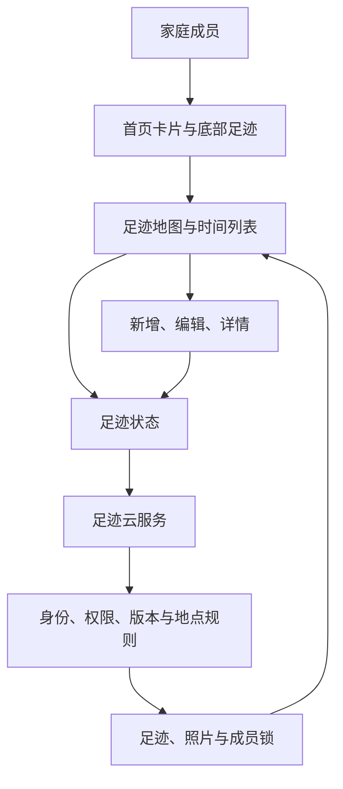
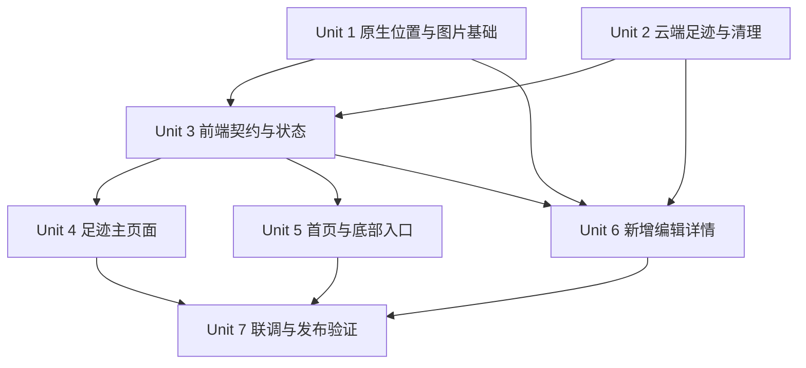
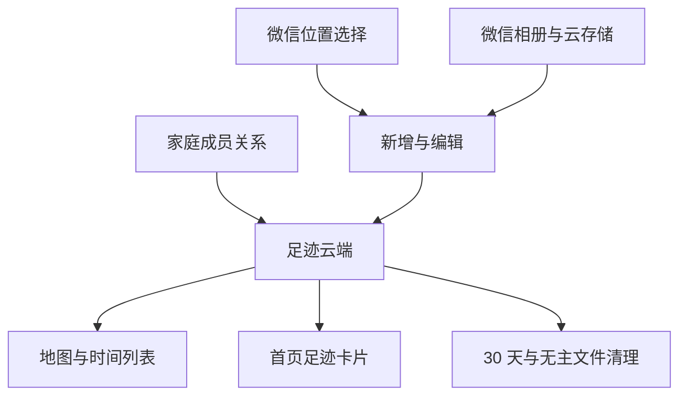

# 我们的足迹（微信地图）

## Overview

### 2026-09-03 执行记录

- 始终留在用户指定的当前分支，本轮未新开分支、未提交、未推送。
- 双入口、地图/列表、地点历史、新增/编辑/详情及照片链路已落地；补充了幂等重试、事务内成员复核、稳定分页、异步家庭隔离和实际 2D 画布导出。
- 本地检查已通过，详细结果与尚未完成的验收见 `docs/plans/2026-09-03-footprint-verification.md`。下列单元复选框按“包含微信实际验证”的完整标准保留，不能用代码已写完代替全部验收。
- 发布仍受微信预览交互、双账号/真机流程，以及云端权限与超时配置确认的限制；状态保持进行中。

为“睦录”增加一套家庭共同足迹册：底部新增“足迹”主入口，首页新增“我们的足迹”卡片；足迹主页默认用微信地图展示去过的地点，也能切换到按游玩日期排列的时间列表。当前家庭成员可以共同新增、修改、删除记录，每条记录包含地点、游玩日期、最多 3 张照片和 300 字回忆。

本计划只使用微信小程序原生地图和位置选择能力，不接入高德或其他收费地图服务。位置只在用户主动选择地点或定位时使用；打开首页、足迹页和历史详情不会主动获取当前位置。

## Problem Frame

- 当前事项和账本能记录“要做什么”和“花了什么”，但照片、地点和共同回忆仍散落在手机相册中。
- 足迹既需要空间视角，也需要时间视角：地图回答“去过哪里”，列表回答“什么时候去过”。
- 同一地点可能去多次，不能覆盖旧回忆；地图又不能为同一点叠出多个无法点击的标记。
- 这是家庭共享数据。前端传来的家庭编号、用户编号、照片地址和记录版本都不能直接信任。
- 地图、位置授权、照片上传分别可能失败，任何一个失败都不应让已有回忆无法查看，也不能留下半条记录或无主照片。

## Requirements Trace

| PRD 要求 | 落地单元 |
| --- | --- |
| R1–R4 双入口、首页摘要、地图/列表切换 | Unit 4、Unit 5 |
| R5–R9 地图聚合、时间列表、详情与降级 | Unit 2、Unit 4、Unit 6 |
| R10–R16 选择地点、新增、照片、保存闭环 | Unit 1、Unit 3、Unit 6 |
| R17–R22 共同维护、历史提示、成员变化、并发冲突 | Unit 2、Unit 3、Unit 6 |
| R23–R28 隐私、清理、失败状态、草稿保护 | Unit 1、Unit 2、Unit 3、Unit 6、Unit 7 |

## Scope Boundaries

本期不做轨迹记录、导航、路线规划、想去清单、地点标签、评分、公开分享、视频、AI 游记、账本联动和部分成员可见。地图只保存用户主动选中的地点，不后台定位，不持续记录移动路线。

### Deferred to Separate Tasks

- 地点模糊合并：本期不根据“距离很近”自动合并，避免把商场内不同店铺或同名不同地点错误合并。
- 城市统计、地图热力图和足迹导出：等真实记录量和使用反馈证明有价值后再做。
- 超大数据量的视口查询：第一版先做分页加载和标记聚合；当单个家庭达到 500 个以上不同地点且真机性能不满足时，再独立优化。

## Context & Research

### Relevant Code and Patterns

- `src/components/AppTabBar.vue` 已使用 Wot UI 自定义底部导航和 `uni.reLaunch`；新增足迹后沿用同一模式，`location` 图标已确认在当前 Wot UI 字体文件中存在字形。
- `src/pages/index/index.vue` 已并行加载家庭、事项和账本摘要；足迹摘要作为独立请求加入，失败时不能拖垮其它首页卡片。
- `src/services/ledger-cloud.ts`、`src/store/modules/ledger.ts` 展示了严格校验云端结果、请求单飞和家庭切换时丢弃旧结果的项目模式。
- `cloudfunctions/ledger/ledger-domain.js` 和 `cloudfunctions/task/task-domain.js` 展示了云端确认成员身份、软删除、幂等操作和版本冲突处理方式。足迹的权限不同：任何当前成员都可编辑和删除任意足迹。
- `src/services/avatar-media.ts`、`cloudfunctions/household/avatar-media.js`、`cloudfunctions/cleanup-avatar-media/` 已有“预约上传—内容检查—正式文件—过期清理”链路；足迹照片在此基础上扩展为每条最多 3 张和整批提交。
- `cloudfunctions/household/invitation-domain.js` 的成员锁记录可保存加入时间。它当前没有 `joinedAt`，本期在加入事务中补齐，用于判断是否需要展示加入前历史提示。
- `scripts/check-mp-package-size.cjs` 已把 1.5 MB 设为主包和分包预警线。足迹主入口留在主包，新增/编辑/详情和私有资源放入 `subpackages/footprint`。
- 仓库没有 `docs/solutions/`，本计划没有可复用的历史解决方案文档。

### External References

- [uni-app 地图组件](https://uniapp.dcloud.net.cn/component/map)：微信小程序端使用平台原生地图，支持标记、自动包含坐标点、点击标记和标记聚合；标记编号需为数字。
- [uni-app 位置接口](https://uniapp.dcloud.net.cn/api/location/location.html)：`uni.chooseLocation` 在微信小程序中打开原生位置选择页，返回地点名称、地址、纬度和经度；不保证稳定地点编号。
- [uni-app 地图上下文](https://uniapp.dcloud.net.cn/api/location/map.html)：可通过地图上下文调整可视范围和初始化标记聚合。
- [CloudBase 聚合搜索](https://docs.cloudbase.net/database/aggregate)：云端可以先按家庭和未删除状态过滤，再按地点指纹分组、计数和取得最近记录；开头的匹配与排序阶段可使用索引。

### Compatibility and Deprecation Check

- 当前 uni-app 版本支持微信小程序 `map`、`uni.chooseLocation` 和 `createMapContext`，官方文档未标记这些微信端能力废弃。
- 官方文档中旧腾讯地图接口停止服务的说明针对 App/H5 相关能力，不是本计划使用的微信小程序原生位置选择。
- 地图宽高使用明确尺寸，不使用百分比高度；坐标统一保存为微信地图使用的 GCJ-02。

## Spec Flow Analysis

### 主流程

1. 用户从底部“足迹”或首页卡片进入足迹页。
2. 页面先读取家庭足迹摘要、地点标记和首屏时间列表；地图失败时仍保留列表入口。
3. 用户主动点“新增足迹”，再点“选择地点”打开微信位置选择页。
4. 选择地点后填写日期、照片和回忆；保存时先完成全部照片处理，再一次性创建记录。
5. 保存成功后刷新地图地点次数、时间列表和首页摘要。
6. 点击标记查看该地点历次记录，点击记录进入详情；任一当前成员都可编辑或删除。

### 必须覆盖的分支

- 没有家庭、单人家庭、两人家庭、新加入成员、已离开成员分别得到正确页面或拒绝结果。
- 位置选择取消、首次拒绝、系统设置中关闭、隐私声明缺失、微信位置页暂不可用分别给出不同反馈；取消不算错误，拒绝后不自动再次弹窗。
- “搜索无结果”发生在微信原生位置选择页，由微信提供空结果界面；小程序只负责验证真机表现和返回后的取消/失败状态，不再叠加一套无法同步的自定义搜索页。
- 0 张、1 张和 3 张照片都能保存；第 2 张上传失败时不创建记录，已预约文件进入清理队列。
- 新增和编辑中返回时，只有真正改动过草稿才确认放弃；选择继续编辑后草稿不丢。
- 两人同时编辑同一记录时，旧版本保存返回冲突并重新拉取最新内容，不做静默覆盖。
- 删除后所有读取接口立即过滤该记录，照片不再签发访问地址，30 天后再物理清理。
- 同游玩日期按 `createdAt` 再按记录编号稳定倒序，避免翻页时重复或漏项。

### 规划期已补齐的规则

- “最近一次”始终按游玩日期判断；同日时以最后创建的记录优先。
- “加入前历史”按记录创建时间与成员 `joinedAt` 比较，不按游玩日期比较，避免加入后补录旧日期时误触发提示。
- 历史提示确认状态保存在云端成员锁中，因此同一账号换设备不会重复提示；创建家庭的第一位成员不显示该提示。
- 位置拒绝后只能查看已有数据和主动重新授权，不能继续使用微信位置搜索。

## Key Technical Decisions

### 1. 地点合并采用确定性指纹，不做距离猜测

云端根据“标准化地点名 + 标准化地址 + 纬经度保留 6 位小数”生成 `placeKey`。名称和地址做 Unicode 规范化、去首尾空白、合并连续空白；坐标必须在合法范围内并固定为 GCJ-02。相同微信位置选择结果会合并，同名不同地址不会合并。若微信以后返回略有不同的坐标，本期宁可显示为两个地点，也不冒险错误合并。

### 2. 浏览数据分成摘要、地点和时间记录三条查询

- 首页只请求轻量摘要：不同地点数、游玩日期最近的一条记录。
- 地图由云端对未删除记录按 `placeKey` 聚合，再按 100 个地点一页读取地点摘要并累计，不传完整回忆和全部照片，也不要求前端先拉完所有记录再统计。
- 时间列表按 20 条记录一页游标读取；游标包含游玩日期、创建时间和记录编号，保证排序稳定。

地图地点不超过 50 个时直接渲染；超过 50 个时使用微信原生标记聚合并分批加入。地图使用独立的数字标记编号表映射 `placeKey`，发生数字碰撞时在页面内顺延，不能把数据库编号直接当地图编号。

首页摘要与地图地点都在读取时使用 CloudBase 聚合流水线计算，避免维护一份容易与记录失步的地点统计表。聚合先按家庭和未删除状态匹配，再排序、按 `placeKey` 分组并计数；相关复合索引在发布前创建。若测试家庭达到 500 个不同地点时聚合或真机渲染超过 2 秒，则停止发布并改为视口查询或独立地点统计任务，不把不完整结果上线。

### 3. 写操作以云端身份和版本为准

所有查询和写入先由云端根据微信身份查出唯一当前家庭，忽略前端传入的用户和家庭归属。新增使用 `requestId` 保证重复点击不会生成两条；编辑携带 `editVersion`，版本不一致返回“内容已更新”；删除为幂等软删除。任何当前成员都可编辑和删除，离开成员立即失去读取照片和记录的权限。

### 4. 照片整批准备，记录一次性提交

照片先在本地重新编码为最长边 1600 像素、质量 82 的 JPEG，以移除原图定位和设备元数据；不能完成重新编码时禁止回退上传原图。随后逐张预约私有上传位置、上传、校验真实文件类型/大小并完成微信图片安全检查。只有全部照片都通过后，创建或编辑事务才把整批照片关联到记录；任一张失败都不写入业务记录，未关联文件由清理任务回收。

单张重新编码后的文件上限为 3 MB，最多 3 张。正式文件使用不可猜测私有路径；临时访问地址只在云端再次确认当前家庭成员且照片仍被未删除足迹引用时签发。

回忆文字在保存前执行微信文字安全检查；图片安全或文字安全服务不可用时保存失败并允许重试，不能绕过检查。每名成员每天最多预约 30 张足迹照片、同时最多保留 6 张未关联照片；列表页数、单次照片地址数量和请求正文长度都设置硬上限，防止异常调用拖垮存储和云函数。

### 5. 加入时间和历史提示沿用成员锁

创建家庭时已有的成员锁 `createdAt` 作为创建者加入时间；接受邀请时补写 `joinedAt`。足迹概览若发现有记录在 `joinedAt` 之前创建且尚未确认提示，则返回 `showPreJoinHistoryNotice: true`。用户确认后由独立动作写 `footprintHistoryNoticeAcknowledgedAt`，不与页面本地缓存绑定。

### 6. 地图和列表各自失败、各自恢复

地点标记和时间列表保持独立加载状态。地图组件或地点查询失败时自动切到列表并保留“重试地图”；列表失败时地图仍可浏览。任何失败都不清空上一次成功数据，家庭发生变化时才整体重置，避免弱网闪成空白。

## High-Level Technical Design



### Planned File Layout

```text
src/
├─ pages/footprint/                 # 主包：底部足迹入口
│  ├─ index.vue
│  ├─ footprint-view.ts
│  └─ components/
├─ subpackages/footprint/           # 分包：新增、编辑、详情
│  ├─ footprint-form/
│  ├─ footprint-detail/
│  ├─ components/
│  └─ utils/
├─ services/footprint-cloud.ts
├─ store/modules/footprint.ts
└─ types/footprint.ts
cloudfunctions/
├─ footprint/
└─ cleanup-footprint-data/
```

## Implementation Units



- [ ] **Unit 1：微信位置、图片预处理与隐私基础**

**Goal:** 先证明微信位置选择、地图尺寸、照片重新编码和隐私配置在当前项目版本可用，并形成可测试的通用适配层。

**Requirements:** R10、R11、R13、R23、R24、R26、R27

**Dependencies:** 无

**Files:**
- Create: `src/utils/footprint-location.ts`
- Create: `src/subpackages/footprint/utils/footprint-image.ts`
- Modify: `src/manifest.json`
- Test: `tests/unit/footprint-location.spec.ts`
- Test: `tests/unit/footprint-image.spec.ts`

**Approach:**
- 封装 `uni.chooseLocation`，只在用户主动点击时调用；区分成功、用户取消、权限拒绝、隐私声明缺失和平台临时故障。
- 返回值只保留标准化地点名、地址、GCJ-02 纬经度；前端不生成最终 `placeKey`，由云端重新计算。
- 为权限拒绝提供“重新尝试”和 `uni.openSetting` 路径，但页面加载和再次进入时不自动请求。
- 图片工具使用微信离屏画布重新绘制并导出 JPEG，限制最长边、质量、张数和输出大小；不支持安全重编码时返回明确错误，不上传原图。
- 在 `manifest.json` 增加用户位置用途说明和微信需要的隐私能力声明；不加入后台定位权限。
- 当前 `project.config.json` 使用基础库 3.17.1，满足离屏画布和地图聚合要求；实现时保留能力检查，低版本只阻止新增照片，不影响查看已有足迹。

**Test scenarios:**
- 选择地点成功、主动取消、拒绝、隐私未声明和临时失败均映射为准确状态。
- 非法坐标、空地点名和非 GCJ-02 预期输入被拒绝。
- 横图、竖图、超大图重新编码后最长边不超过 1600，输出为 JPEG 且不带源文件 EXIF 段。
- 第 4 张照片、空文件、超过 3 MB 输出和画布导出失败均被阻止。

**Verification:**
- 单元测试通过。
- 微信开发者工具和真机分别完成一次“选择地点—取消—拒绝—打开设置后重试”。
- 抽查处理前后照片元数据，处理后不包含 GPS、设备型号和拍摄时间。

---

- [ ] **Unit 2：足迹云端、共同权限、照片安全与定时清理**

**Goal:** 建立足迹的唯一可信读写入口，保证共同维护、地点合并、版本冲突、照片私密访问和删除清理正确。

**Requirements:** R2、R3、R5–R9、R13–R22、R24–R26

**Dependencies:** 无；可与 Unit 1 顺序推进，但完成后才能接页面。

**Files:**
- Create: `cloudfunctions/footprint/index.js`
- Create: `cloudfunctions/footprint/footprint-domain.js`
- Create: `cloudfunctions/footprint/repository-data.js`
- Create: `cloudfunctions/footprint/footprint-media.js`
- Create: `cloudfunctions/footprint/package.json`
- Create: `cloudfunctions/footprint/config.json`
- Create: `cloudfunctions/cleanup-footprint-data/index.js`
- Create: `cloudfunctions/cleanup-footprint-data/cleanup.js`
- Create: `cloudfunctions/cleanup-footprint-data/package.json`
- Create: `cloudfunctions/cleanup-footprint-data/config.json`
- Modify: `cloudfunctions/household/invitation-domain.js`
- Test: `tests/unit/footprint-domain.spec.ts`
- Test: `tests/unit/footprint-media.spec.ts`
- Test: `tests/unit/cleanup-footprint-data.spec.ts`
- Test: `tests/unit/invitation-domain.spec.ts`

**Approach:**
- 提供摘要、地点分页、记录分页、记录详情、新增、修改、删除、照片预约、照片检查、照片临时地址和历史提示确认动作。
- 每个动作先用云端微信身份查唯一家庭，再检查记录所属家庭；任何前端家庭编号和创建者编号都不参与授权。
- 云端重新校验日期、300 个完整字符、坐标、地点字段、照片数量和照片引用，并生成 `placeKey`。
- 地点名称、地址和回忆文字走微信文字安全检查，照片走同步图片安全检查；检查不可用时返回可重试失败，不降级为未经检查直接保存。
- 新增以请求凭证幂等；编辑使用递增版本做比较后更新；删除写 `deletedAt/deletedBy` 并立即从所有读取与照片访问中排除。
- 照片按 `prepared → approved → linked → detached/deleted` 管理；图片安全检查、真实格式和 3 MB 上限在云端再次验证。
- 摘要和地点查询使用 CloudBase 聚合流水线；为记录的家庭/删除状态/游玩日期/创建时间/地点指纹，以及照片状态/过期时间和操作凭证建立复合索引。
- 限制照片预约频率、未关联照片数、分页大小和正文长度；上传地址必须与本次预约的随机私有路径完全匹配，不能接受任意云文件地址。
- 记录不存在、已删除、跨家庭和无权访问对客户端统一返回“足迹不存在或已不可访问”，不通过错误差异泄露其它家庭是否存在该记录。
- 清理任务每日处理：过期未关联照片、编辑后已脱离照片、软删满 30 天的记录及其照片。单条失败记重试次数，不阻断其它条目。
- 接受邀请事务写稳定 `joinedAt`；确认历史提示时更新当前成员锁，不暴露内部成员编号。

**Test scenarios:**
- 单人和双人家庭均可新增；B 可修改/删除 A 的记录；非成员和离开成员全部拒绝。
- 同一地点两条记录得到同一 `placeKey`，同名不同地址或坐标得到不同键。
- 重复新增请求只生成一条；两个版本并发编辑时后者返回冲突；重复删除返回同一结果。
- 时间列表游标在同日多条记录时不重不漏，补录旧日期归入正确位置。
- 新成员仅在存在加入前创建记录时看到一次历史提示；确认后换设备不再出现。
- 3 张照片全部通过才关联；一张失败、伪造文件地址、跨家庭照片、已软删照片均不能访问。
- 超出照片日限额、未关联照片上限、超大正文和越界分页均被拒绝，不写入任何记录。
- 29 天删除记录不清理，满 30 天清理；无主照片到期清理；单条删除失败可重试。

**Verification:**
- 云端领域、照片和清理测试全部通过。
- 数据库权限保持客户端不可直接读写足迹和照片元数据。
- 云端日志不输出回忆全文、内部用户编号、照片临时地址或上传密钥。

---

- [ ] **Unit 3：前端类型、服务与足迹状态**

**Goal:** 为三个页面和首页提供同一份可靠状态，处理分页、家庭切换、弱网保留和写后同步。

**Requirements:** R2–R9、R16–R22、R27

**Dependencies:** Unit 1、Unit 2

**Files:**
- Create: `src/types/footprint.ts`
- Create: `src/services/footprint-cloud.ts`
- Create: `src/store/modules/footprint.ts`
- Test: `tests/unit/footprint-cloud.spec.ts`
- Test: `tests/unit/footprint-store.spec.ts`

**Approach:**
- 定义记录、地点摘要、首页摘要、分页游标、照片资源、草稿、冲突和各加载阶段类型。
- 服务层对白名单字段逐项校验，拒绝结构不完整或包含非法日期/坐标的结果；统一把云端错误转换为用户能理解的反馈。
- 状态分别维护摘要、地点、时间记录、当前详情和三组加载/失败状态；切换家庭或退出登录时完整清空。
- 地点每页 100 个、时间记录每页 20 条；并发翻页单飞，刷新时保留上一次成功数据，迟到的旧家庭响应不得覆盖当前家庭。
- 新增、编辑、删除成功后统一失效并刷新摘要、地点、列表和当前详情；冲突时保留用户草稿并加载最新版本供重新确认。
- 历史提示确认失败时保留提示，下次可重试，不能只在本地假装确认成功。
- 首页和列表只保存照片资源编号；实际展示前按当前成员身份换取短期地址，家庭变化后立即清空地址缓存。

**Test scenarios:**
- 初次加载、追加分页、刷新保留、分页失败重试和到达末页正确。
- 家庭切换、退出登录和旧请求迟到时无串户数据。
- 新增后地点数与最近记录变化；同地点新增只增加次数，不增加地点数。
- 编辑换地点、删除最后一条地点记录后，摘要、地点和列表都正确失效刷新。
- 写请求重复点击只发一次；冲突保留草稿；非重试错误不无限重发。

**Verification:**
- 类型检查和对应单元测试通过。
- 服务测试覆盖每个云端动作和每类失败返回。

---

- [ ] **Unit 4：足迹主页面、地图聚合与时间列表**

**Goal:** 完成底部入口对应的主页面，让地图与时间列表都能独立浏览和降级。

**Requirements:** R4–R9、R19、R20、R23、R27

**Dependencies:** Unit 3

**Files:**
- Create: `src/pages/footprint/index.vue`
- Create: `src/pages/footprint/footprint-view.ts`
- Create: `src/pages/footprint/components/FootprintMap.vue`
- Create: `src/pages/footprint/components/FootprintTimeline.vue`
- Create: `src/pages/footprint/components/FootprintPlaceSheet.vue`
- Modify: `src/pages.json`
- Test: `tests/unit/footprint-view.spec.ts`
- Test: `tests/unit/footprint-map.spec.ts`

**Approach:**
- 页面根节点采用足迹语义 BEM 类名，使用 Wot UI 加载、分段切换、按钮、弹层和失败反馈；加载文案统一为“正在加载足迹”。
- 地图固定明确高度，不在页面打开时显示当前位置或请求定位；用全部地点坐标调整视野。
- 50 个以内直接显示标记，更多时初始化原生聚合并按页加入；标记展示次数，点击后打开地点摘要和历次记录入口。
- 列表按游玩日期展示地点、首图和摘要，滚动到底加载下一页；没有照片或回忆时不渲染空区域。
- 地图失败自动保留列表，列表失败保留地图；空家庭和空足迹分别展示不同引导。
- 新成员历史提示用 Wot UI 对话框展示，确认成功后关闭；失败则保留并允许重试。
- 地图之外始终提供内容等价的时间列表；地图标记、切换、重试和新增操作区至少保持 88rpx 可点击尺寸，不能把颜色作为唯一状态提示。

**Test scenarios:**
- 空状态、地图加载、地图失败、列表失败、两者成功和分页中状态完整。
- 1 个、50 个和 51 个地点走正确标记模式；同地点 3 次只产生一个标记且次数为 3。
- 标记数字映射碰撞后仍能点到正确地点。
- 点击列表和地点弹层都进入正确详情；重新进入小程序仍默认地图。
- 页面初始化不调用定位接口。

**Verification:**
- 微信开发者工具实际打开地图和列表，检查地图尺寸、标记点击、弹层、分页、空态、加载和失败重试。
- 真机检查地图拖动、缩放、50+ 标记聚合和列表滚动流畅度。

---

- [ ] **Unit 5：首页“我们的足迹”卡片与四入口底部导航**

**Goal:** 让首页卡片和底部足迹入口指向同一份家庭足迹，并保持其它首页模块独立可用。

**Requirements:** R1–R3、R16

**Dependencies:** Unit 3；可与 Unit 4 分开推进。

**Files:**
- Modify: `src/components/AppTabBar.vue`
- Modify: `src/pages/index/index.vue`
- Modify: `src/pages/index/home-view.ts`
- Create: `src/pages/index/components/HomeFootprintCard.vue`
- Test: `tests/unit/home-view.spec.ts`
- Test: `tests/unit/app-tabbar.spec.ts`

**Approach:**
- 底部导航增加“足迹”，使用已确认有字形的 Wot UI `location` 线稿图标；四个入口继续统一用 `uni.reLaunch`。
- 首页并行加载足迹摘要；失败只影响足迹卡片，事项、账本和家庭卡片继续显示。
- 有记录时显示去过地点数、按游玩日期最近的地点/日期和首图；无首图时使用品牌色地点占位，不新增大图资源。
- 无记录显示引导文案；失败状态保留可点击入口和独立重试。
- 卡片和底部入口都进入 `/pages/footprint/index`，不复制两套数据逻辑。

**Test scenarios:**
- 四个入口标题、图标、激活态和路径正确，点当前入口不重复跳转。
- 同地点三次摘要仍显示一个地点；补录旧记录不替换更新日期更近的卡片。
- 足迹摘要失败时其它首页请求和卡片不受影响。
- 卡片有图、无图、空数据、加载和失败五种状态可用。

**Verification:**
- 首页和足迹页之间从两个入口往返，确认当前家庭和数据一致。
- 375px 常用机型下四入口不挤压、不截字，图标均正常显示。

---

- [ ] **Unit 6：新增、编辑、详情与三张照片闭环**

**Goal:** 完成“选地点—填日期—加照片—保存—回看—共同编辑/删除”的完整用户流程。

**Requirements:** R8、R10–R18、R21、R22、R25、R27、R28

**Dependencies:** Unit 1、Unit 2、Unit 3

**Files:**
- Create: `src/subpackages/footprint/footprint-form/index.vue`
- Create: `src/subpackages/footprint/footprint-form/footprint-form-view.ts`
- Create: `src/subpackages/footprint/footprint-detail/index.vue`
- Create: `src/subpackages/footprint/components/FootprintPhotoPicker.vue`
- Create: `src/subpackages/footprint/components/FootprintPhotoGallery.vue`
- Modify: `src/pages.json`
- Test: `tests/unit/footprint-form-view.spec.ts`
- Test: `tests/unit/footprint-photo-picker.spec.ts`
- Test: `tests/unit/footprint-detail-view.spec.ts`

**Approach:**
- 新增和编辑共用表单页，以是否带记录编号区分；地点选择在前，日期、照片、回忆在后。
- 日期默认今天、不可未来；回忆按完整字符计数 300；照片最多 3 张，可预览、移除、替换并显示逐张处理/上传状态。
- 保存按“本地重编码—预约—上传—云端检查—一次性提交”执行，任一步失败都保留草稿并指出失败照片；全部成功前另一成员看不到半成品。
- 表单发生真实变更后返回才确认放弃；确认放弃时通知云端释放本批预约照片，失败也由清理任务兜底。
- 编辑页加载时保留记录版本；冲突后展示最新内容与用户草稿差异，用户确认基于最新版重新提交，不自动覆盖。
- 详情展示完整地点、日期、照片、回忆、创建者和最后修改时间；照片可预览，同地点其它记录可继续进入。
- 删除对所有当前成员开放，确认文案包含地点和日期；删除成功后返回足迹页并刷新所有摘要。

**Test scenarios:**
- 只选地点和日期可保存；未来日期、301 字、第 4 张照片和无地点不能保存。
- 选择位置取消不改草稿，拒绝后不循环弹窗，重新授权后可继续。
- 第 2 张上传失败后重试只处理失败项；放弃后预约文件进入清理，不生成记录。
- 编辑更换到已有地点后归入该地点历史；换到新地点后原地点次数正确减少。
- A 保存后 B 用旧版本保存得到冲突，B 草稿不丢并能重新确认。
- B 删除 A 创建记录成功；删除中的重复点击只执行一次；旧详情地址随后不可访问。
- 无照片、无回忆详情不显示空白区域，三张照片可逐张预览。
- 页面逻辑测试沿用仓库现有纯视图函数模式，不为本功能额外引入组件测试框架；真实组件交互由开发者工具和真机验收覆盖。

**Verification:**
- 微信开发者工具逐项跑新增、编辑、冲突、删除、放弃草稿和照片失败流程。
- 两个微信测试账号或两台真机跑共同编辑与删除同步。
- 单元测试、类型检查和微信构建通过。

---

- [ ] **Unit 7：整体验收、包体积、隐私与发布检查**

**Goal:** 用真实微信环境完成 PRD 13 条验收，不把配置、部署和清理任务留到上线后补救。

**Requirements:** R1–R28

**Dependencies:** Unit 4、Unit 5、Unit 6

**Files:**
- Modify: `docs/prd/011-shared-footprint-map-prd.md`（验收后只更新状态和实际差异）
- Modify: `docs/prd/README.md`（同步状态）
- Modify: `cloudfunctions/README.md`（补齐足迹集合、索引、存储目录、权限、清理和双账号验收清单）
- Create or Modify: `tests/e2e/footprint-flow.spec.js`
- Modify: `project.config.json`（仅当微信开发者工具验证确认需要足迹相关配置时）

**Approach:**
- 在微信公众平台补齐位置和图片用途的隐私说明；确认不申请后台定位、不加入高德密钥和第三方地图域名。
- 部署 `footprint` 与 `cleanup-footprint-data` 云函数，配置每日清理触发器并验证数据库/云存储权限。
- 用两个测试账号完成 PRD 验收 1–13；位置授权、拒绝、重新开启必须真机验证。
- 执行样式检查、类型检查、全部单元测试、微信构建、包体积检查和可运行的自动化流程。
- 检查主包与 `footprint` 分包均低于 1.5 MB 项目预警线；构建产物不提交版本库。
- 检查云存储用量和清理日志，记录开发免费额度不等于长期零成本；不承诺照片永久免费存储。
- 发布采用“云端先兼容、前端后启用”：新云函数先部署但旧前端没有入口；前端回滚时保留云端和数据不删除。若新云端异常，先隐藏足迹入口并停止写入，不回滚或硬删已经保存的足迹。

**Test scenarios:**
- PRD 13 条验收逐条留结果，重点覆盖双入口一致、重复地点、共同编辑、旧成员越权、冲突和半成品清理。
- 小程序冷启动、弱网、地图临时故障和云函数超时下，已有内容仍可通过可用入口访问。
- 主包/分包体积、样式规则和所有已有模块回归通过。

**Verification:**
- `pnpm run verify:mp-weixin`
- `pnpm run test:e2e`
- 微信开发者工具预览并真机扫码，完成两账号完整流程。
- 云端手动制造一条过期无主照片和一条满 30 天软删记录，执行清理任务后确认业务记录与文件均按规则清理。
- 用 500 个不同地点的测试数据验证聚合和真机渲染；任一首屏超过 2 秒或出现标记丢失，发布检查不通过。

## System-Wide Impact



- **交互影响：** 首页新增独立足迹摘要请求；底部导航从 3 项变 4 项；足迹主页面进入主包，表单和详情进入新分包。
- **数据影响：** 新增足迹记录、照片资源和操作记录；成员锁增加加入时间和历史提示确认时间，但不改变现有家庭人数与邀请规则。
- **权限影响：** 足迹与其它模块不同，当前家庭两名成员都能修改和删除；所有动作仍由云端重查家庭关系。
- **失败传播：** 地图、列表、照片、写操作和首页摘要各自失败、各自重试；任何失败都不能清空其它模块或上一次成功数据。
- **生命周期：** 软删后立即不可见，30 天后记录和照片物理清理；未提交、被替换和审核失败照片由更短的过期清理处理。
- **不变约束：** 登录、事项、账本和家庭头像流程不改变；客户端仍不能直接读写数据库；不增加后台定位。

## Risks & Mitigations

| 风险 | 应对 |
| --- | --- |
| 微信位置选择返回值没有稳定地点编号 | 云端用名称、地址和 6 位坐标生成确定性指纹；不做危险的近距离模糊合并 |
| 微信位置授权被拒绝或平台能力暂不可用 | 已有足迹照常查看；只在用户再次主动点击时请求，并提供打开设置与重试 |
| 地图地点过多造成卡顿 | 地点摘要分页、50 个以上启用原生聚合、100 个一批加入；真机验证 50+ 场景 |
| 三张照片上传一半失败产生残缺记录 | 全部审核通过后才一次性关联业务记录；无主文件定时清理 |
| 照片携带定位和设备信息 | 本地画布重新编码，失败不上传原图；抽查元数据作为交付门槛 |
| 恶意文字、图片或大量上传消耗资源 | 文字/图片安全检查失败即拒绝，照片预约和未关联文件设硬上限，分页和正文长度受限 |
| 两人同时修改互相覆盖 | 版本比较、冲突提示、保留草稿并基于最新内容重新确认 |
| 新成员误把加入前记录当作共同经历 | 使用云端加入时间判断并只展示一次明确提示 |
| 主包体积上涨 | 主包只放足迹入口页与必要公共状态，表单/详情/私有组件进入新分包；1.5 MB 守门 |
| 云存储并非永久免费 | 压缩、3 张上限、无主文件和 30 天清理、发布前查看实际用量，不作零成本承诺 |

## Documentation / Operational Notes

- 开发顺序按 Unit 1 → Unit 2 → Unit 3 → Unit 4/5 → Unit 6 → Unit 7，每个单元完成后先跑对应测试再进入下一单元。
- 所有新增/修改代码写中文意图注释；Vue 文件严格保持 template、script、style 顺序，样式使用 scoped SCSS、BEM 和嵌套。
- 新页面加载统一用 `wd-loading`，文案为“正在加载足迹”“正在加载足迹详情”或“正在加载足迹编辑页”。
- 位置和照片用途需要在微信公众平台隐私说明中同步配置；不得把 AppSecret、云环境管理凭据或地图密钥写入代码和文档。
- 发布顺序：先部署云函数与清理任务，再发布小程序前端；云端先上线时不影响旧前端。
- 回滚只关闭或移除前端入口，不删除新集合和已保存内容；恢复服务后原足迹仍可继续使用。

## Sources & References

- **Origin:** [docs/prd/011-shared-footprint-map-prd.md](../prd/011-shared-footprint-map-prd.md)
- **Repository patterns:** `src/components/AppTabBar.vue`、`src/pages/index/index.vue`、`src/services/ledger-cloud.ts`、`src/store/modules/ledger.ts`、`cloudfunctions/ledger/ledger-domain.js`、`cloudfunctions/task/task-domain.js`、`cloudfunctions/household/avatar-media.js`、`cloudfunctions/household/invitation-domain.js`
- **Official docs:** [uni-app 地图组件](https://uniapp.dcloud.net.cn/component/map)、[uni-app 位置接口](https://uniapp.dcloud.net.cn/api/location/location.html)、[uni-app 地图上下文](https://uniapp.dcloud.net.cn/api/location/map.html)、[CloudBase 聚合搜索](https://docs.cloudbase.net/database/aggregate)
