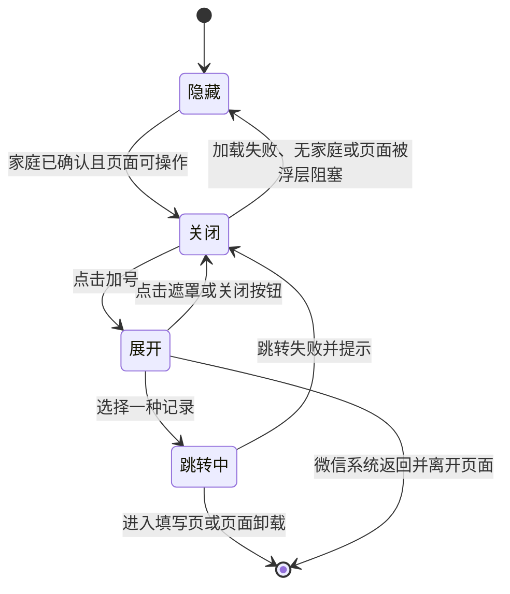
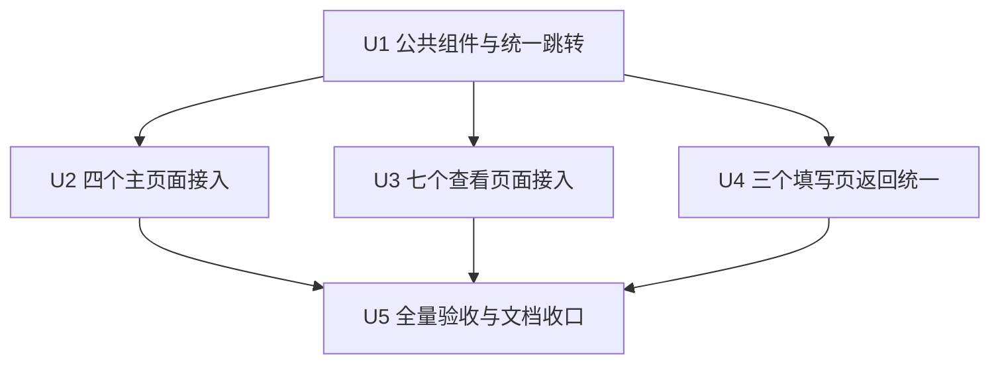

# 全局快速新增事项、账目与足迹实施计划

## 概述

把首页和账本页现有的单用途加号替换为一个跨页面复用的快速新增组件，并接入 PRD 指定的 11 个查看页面。用户点加号后，在遮罩上方向上展开“记账”“记事项”“记足迹”，顺序固定，选择后继续使用现有填写页面。三种内容保存成功后统一返回发起页面并显示成功提示，不改任何云端数据规则。

## 问题与目标

当前加号的用途取决于用户所在页面，记账前往往要先切到账本。已确认的产品目标是让用户在浏览家庭内容时，最多点击两次就能开始任一种记录，同时保留原来的浏览位置和筛选状态。完整产品规则以 `docs/prd/014-global-quick-add-prd.md` 为准。

本计划属于跨页面前端改造：涉及公共组件、11 个接入页面和 3 个现有填写页，但不新增页面、不改数据库、不改云函数，也不改变事项、账目、足迹本身的字段和权限。

## 需求对应

- R1–R5：由公共快速新增组件负责显示、固定顺序、展开关闭和 300 毫秒内的过渡。
- R6–R12：由公共组件的遮罩、层级、点击锁和页面传入的阻塞状态共同保证。
- R13–R15：由 11 个允许页面显式接入，其他页面不接入；每个页面只在家庭已确认且页面可操作时显示。
- R16、R19：由统一的动作配置和页面跳转失败处理负责。
- R17–R18：由 3 个现有填写页统一返回方式和成功反馈负责。
- 成功标准：由单元测试、微信开发者工具自动化、窄屏视觉检查和真机检查共同验证。

## 范围边界

- 不增加第四种新增类型，不提供自定义排序、最近使用或默认直达。
- 不改变底部“首页、账本、足迹、我的”四个栏目。
- 不修改事项、账目、足迹的保存接口、数据权限和云端处理。
- 不在登录、创建或加入家庭、各类填写编辑页、成员管理、账本类目管理和头像裁剪页显示快速新增。
- 不为了拦截微信左上角返回而改造全站顶部栏；该平台例外已经补充进 PRD。
- 本期只交付和验收微信小程序；其他平台是否支持“先收起菜单再返回”不纳入本次验收。
- 不引入新的第三方组件、图片资源或全局状态模块。

## 现状与可复用模式

### 相关代码

- `src/components/AppTabBar.vue` 已统一四个主入口，但只负责栏目切换，继续保持职责不变。
- `src/pages/index/index.vue` 和 `src/pages/ledger/index.vue` 已使用 `wd-fab`，位置都在右下角并避开底部栏目，可直接作为尺寸和间距基准。
- `src/pages/ledger/index.vue` 已在日期选择器和筛选弹层打开时隐藏加号，可复用“页面传入阻塞状态”的处理方式。
- `src/pages/footprint/index.vue` 与 `src/subpackages/footprint/footprint-detail/index.vue` 已有弹层状态，适合直接控制快速新增入口的显隐。
- `src/subpackages/task/add-task/index.vue` 新建成功后目前会清空页面栈并回首页；`src/subpackages/ledger/ledger-add/index.vue` 和 `src/subpackages/footprint/footprint-form/index.vue` 已采用返回上一页，三者需要统一。
- 首页、账本、足迹和账本统计已有页面重新显示时刷新数据的逻辑；通过保留页面栈返回，可以继续沿用并保留当前筛选、地图模式和滚动位置。
- 当前单元测试以纯函数和源码接入检查为主，微信页面交互由 `tests/e2e/` 中可选连接微信开发者工具的测试补足。

### 项目约束

- 新公共组件放在 `src/components/`，因为它会被多个主页面和分包共同使用。
- 所有改动继续使用 Vue 3、`<script setup lang="ts">`、Wot UI v2 和项目品牌变量；`.vue` 文件顺序遵守本项目的“模板、脚本、样式”。
- 新增和修改代码要写中文注释，样式采用 SCSS、BEM 和嵌套写法。
- 共享组件放在主包后，需要重新检查微信小程序主包体积。

### 历史经验

- 仓库当前没有 `docs/solutions/` 目录，本计划不引用不存在的历史方案。
- 项目已有经验表明：页面浮层不能只靠视觉层级碰运气，应显式避免两个浮层同时出现；微信开发者工具测试被跳过也不能当作页面验收通过。

### 外部依据

- Wot UI `Fab` 支持向上展开、自定义动作内容和双向控制展开状态：https://wot-ui.cn/component/fab
- Wot UI `Overlay` 用于阻止背景操作，`Root Portal` 用于解决复杂页面中的固定定位和层级问题：https://wot-ui.cn/component/overlay 、https://wot-ui.cn/component/root-portal
- uni-app 页面路由中，`navigateTo` 保留当前页面，`navigateBack` 返回原页面：https://uniapp.dcloud.net.cn/api/router.html
- uni-app 官方兼容表说明经典 uni-app 的 `onBackPress` 不支持微信小程序，因此微信左上角返回保留系统行为：https://uniapp.dcloud.net.cn/tutorial/page.html

## 关键技术决定

- **单独创建公共组件，不把功能塞进底部栏目组件。** `AppTabBar` 继续只负责栏目切换；新的快速新增组件既能出现在有底部栏的主页面，也能出现在没有底部栏的详情页。
- **页面决定是否显示，组件只负责交互。** 公共组件接收“是否可见”“是否被当前浮层阻塞”“是否需要避开底部栏目”等明确输入，不自行请求家庭资料，避免和页面已有加载流程重复请求或产生竞态。
- **动作顺序和跳转集中维护。** 统一工具保存三种动作的名称、已确认有字形的图标和目标页面；三个填写页分别使用 PRD 已确认的成功提示，避免引入没有真实复用价值的配置。
- **使用 Wot UI 的悬浮按钮、遮罩和根节点承载。** 悬浮按钮负责展开动画，遮罩负责锁住背景，根节点承载解决底部栏目、长列表和足迹地图附近的层级问题。加号始终在遮罩上方。
- **只保留最少状态。** 组件只维护“是否展开”和“是否正在跳转”；页面通过输入控制显示，不新增 Pinia 状态。组件隐藏或页面卸载时立即清除展开状态。
- **所有目标页都用保留页面栈的跳转。** 选择动作后先关闭菜单再进入现有填写页；保存后返回发起页。导航失败时释放点击锁并在原页提示，不打开第二个页面。
- **主页面和详情页使用不同的语义化位置配置。** 主页面避开底部栏目，详情页贴近页面安全区；除垂直位置外，组件的动作顺序和行为完全一致。
- **微信返回行为按已确认例外处理。** 微信左上角返回直接离开当前页；组件销毁时清掉菜单。支持返回拦截的平台可以先收起菜单，但不能让此兼容逻辑影响微信构建。

## 高层状态设计

> 这张图只用于说明状态关系，是评审方向，不是要求照抄的实现代码。

状态来源保持单一：页面只决定“是否允许显示”，组件内部只决定“关闭、展开、跳转中”。任何进入隐藏或卸载的路径都必须清除遮罩和点击锁。

## 用户流程与异常分支

1. 正常新增：查看页面显示加号 → 点加号出现遮罩和三个动作 → 点一个动作 → 关闭菜单并进入现有填写页 → 保存 → 返回原页面并提示成功。
2. 主动取消：进入填写页后返回且未保存 → 回原页面 → 不产生记录，原页面状态保持。
3. 关闭菜单：点遮罩空白或再次点加号 → 菜单和遮罩一起收起，页面恢复操作。
4. 快速连点：第一次选择动作后进入跳转锁定 → 后续点击无效 → 成功进入或失败提示后再解除。
5. 家庭不可用：家庭仍在确认、读取失败或没有家庭 → 不显示加号，不提供无法完成的入口。
6. 页面已有浮层：筛选、日期选择、删除确认或历史提示打开 → 快速新增隐藏或保持在不可操作层级，不与当前浮层竞争。
7. 进入失败：页面栈达到限制或系统拒绝跳转 → 留在原页面，菜单关闭，提示稍后重试。
8. 微信系统返回：菜单展开时点微信左上角返回 → 按系统规则离开页面 → 组件销毁且不留下遮罩或展开状态。

## 实施单元

- [x] **U1：建立公共快速新增组件与统一跳转规则**

**目标：** 先形成单一、可复用、可测试的菜单和跳转入口，后续页面只负责提供可见状态。

**对应需求：** R1–R9、R12、R16、R19。

**依赖：** 无。

**文件：**

- 新建：`src/components/GlobalQuickAdd.vue`
- 新建：`src/utils/quick-add.ts`
- 新建并测试：`tests/unit/global-quick-add.spec.ts`

**做法：**

- 在统一工具中按“离加号由近到远”的顺序定义记账、记事项、记足迹，并使用项目中已确认可显示的 `book`、`tags`、`location` 图标。
- 工具负责把动作映射到现有三个填写页，并把页面跳转包装成明确的成功或失败结果，供组件释放重复点击锁和展示失败提示。
- 公共组件用 Wot UI 悬浮按钮承载三个带图标和文字的动作，用受控展开状态驱动遮罩；遮罩、按钮和加号建立明确的前后层级。
- 加号在关闭和展开时分别提供“打开快速新增”和“关闭快速新增”的可识别名称，三个动作也同时提供完整文字，避免只靠图标传达用途。
- 暴露语义化输入控制整体可见、当前是否被页面浮层阻塞、是否需要避开底部栏目；组件不读取业务 store，也不修改父页面状态。
- 隐藏、阻塞、选择动作或组件卸载时清除展开状态；跳转未结束时忽略其他动作。
- 使用根节点承载遮罩和悬浮按钮，优先保证足迹地图、固定底部栏和长页面上的覆盖一致。

**执行提示：** 先写动作顺序、跳转结果和重复点击保护的失败测试，再实现公共组件。

**沿用模式：**

- `src/pages/index/index.vue` 与 `src/pages/ledger/index.vue` 现有 `wd-fab` 的位置和品牌主色。
- `src/pages/ledger/index.vue` 的“弹层打开时隐藏悬浮按钮”模式。
- `src/components/AppTabBar.vue` 的固定路径表和明确类型边界。

**测试场景：**

- 正常：动作列表顺序固定为记账、记事项、记足迹，三项分别指向正确的现有填写页。
- 正常：点加号后同时出现遮罩和三项动作；点遮罩或关闭按钮后全部消失。
- 正常：主页面位置避开底部栏目，详情页位置靠近底部安全区，动作相对顺序不变。
- 边界：组件不可见或被阻塞时，不渲染可点击加号；从可见切到阻塞时自动收起。
- 边界：窄屏下三项文字完整，点击范围不小于现有悬浮按钮的可点击范围。
- 边界：加号在关闭、展开两种状态下名称准确，三个动作不依赖图标也能识别。
- 异常：第一次跳转尚未结束时重复点动作，只发起一次跳转。
- 异常：跳转失败时菜单关闭、点击锁释放、显示可重试提示。
- 集成：源码接入检查确认使用 Wot UI 悬浮按钮、遮罩和根节点承载，没有自造另一套弹层组件。

**完成验证：** 公共组件可单独通过类型检查和单元测试；在普通页面与含地图页面中都能正确覆盖背景，且不需要业务页面复制动作配置。

---

- [x] **U2：替换四个主页面的加号**

**目标：** 首页、账本、足迹和“我的”使用完全一致的快速新增入口，移除首页和账本原有单用途加号。

**对应需求：** R1–R9、R11–R17。

**依赖：** U1。

**文件：**

- 修改：`src/pages/index/index.vue`
- 修改：`src/pages/ledger/index.vue`
- 修改：`src/pages/footprint/index.vue`
- 修改：`src/pages/profile/index.vue`
- 修改并测试：`tests/e2e/home-single-member.spec.js`
- 新建并测试：`tests/e2e/global-quick-add.spec.js`
- 补充接入检查：`tests/unit/global-quick-add.spec.ts`

**做法：**

- 首页和账本移除原来直接进入单一填写页的悬浮按钮，换成公共组件；足迹原有顶部“新增足迹”保留，同时增加公共入口；“我的”新增公共入口。
- 四个主页面都使用“避开底部栏目”的位置配置，并只在家庭已确认、页面主体可操作时显示。
- 账本页把日期选择器和筛选弹层状态传给公共组件；足迹页把历史提示弹层状态传入，避免浮层叠加。
- 不改变 `AppTabBar`、首页卡片、足迹顶部按钮和账本筛选的原有行为。
- 更新旧首页自动化断言，使其验证新的全局入口，而不是旧的单用途加号。

**沿用模式：**

- 四个页面现有的家庭加载、失败和 `onShow` 刷新逻辑。
- `AppTabBar` 现有的固定底部位置与安全区。

**测试场景：**

- 正常：四个主页面在已有家庭时都能看到同一个加号，展开后的三项名称、顺序和路径一致。
- 正常：首页点“记账”、账本页点“记事项”、“我的”点“记足迹”都进入正确填写页，返回后仍停在发起页面。
- 正常：足迹顶部“新增足迹”保持原行为，不被公共入口替代。
- 边界：账本日期选择器或筛选弹层打开时加号隐藏，关闭后恢复。
- 边界：足迹历史提示打开时加号隐藏，确认提示后恢复。
- 边界：加载中、失败或没有家庭时不显示入口。
- 集成：菜单展开时底部四个栏目不能被点击；足迹地图不能盖住遮罩或动作按钮。

**完成验证：** 四个主页面不再出现含义不同的加号；微信开发者工具可在不写入数据的情况下完成三种入口跳转与返回检查。

---

- [x] **U3：接入七个查看页面并补齐家庭可用状态**

**目标：** 让 PRD 指定的事项详情、历史事项、账目详情、账本统计、问账本、足迹详情和邀请状态也能使用快速新增。

**对应需求：** R1–R3、R6–R19。

**依赖：** U1。

**文件：**

- 修改：`src/subpackages/task/task-detail/index.vue`
- 修改：`src/subpackages/task/completed-tasks/index.vue`
- 修改：`src/subpackages/ledger/ledger-detail/index.vue`
- 修改：`src/subpackages/ledger/ledger-stats/index.vue`
- 修改：`src/subpackages/ledger/ledger-ai/index.vue`
- 修改：`src/subpackages/footprint/footprint-detail/index.vue`
- 修改：`src/subpackages/household/invite-status/index.vue`
- 补充接入检查：`tests/unit/global-quick-add.spec.ts`
- 补充页面自动化：`tests/e2e/global-quick-add.spec.js`

**做法：**

- 七个页面使用“无底部栏目”的位置配置；只在当前家庭已经确认且页面没有阻塞性浮层时显示。
- 账目详情和事项详情在删除、放弃确认或正在提交重要操作时暂时隐藏入口；足迹详情在删除确认弹层打开或删除进行中时隐藏。
- 账本统计沿用已有家庭状态和重新显示刷新；问账本保留问题草稿和消息，不因进入填写页而重建页面。
- 事项详情、历史事项和邀请状态当前没有稳定的家庭展示状态，需要接入现有家庭状态读取：已有资料时直接复用，没有资料时由页面现有生命周期补一次读取；不把请求放进公共组件。
- 邀请状态页即使允许展示入口，也仍以邀请错误提示为主；只有已登录且确认仍有家庭时才出现加号。
- 页面内使用系统确认框时增加明确的“确认框正在显示”状态，确保公共入口不会与确认框同时可操作。

**沿用模式：**

- `src/subpackages/ledger/ledger-detail/index.vue`、`src/subpackages/ledger/ledger-stats/index.vue` 和 `src/subpackages/footprint/footprint-detail/index.vue` 已有的家庭读取方式。
- 各页面现有的加载、失败、删除锁和 `onShow` 行为。

**测试场景：**

- 正常：七个页面在家庭已确认后都显示同样的三项菜单，任一动作进入正确填写页并可返回原页面。
- 正常：问账本中已输入但未发送的问题，在进入记账页再返回后仍保留。
- 边界：详情未加载完成、记录不存在、家庭读取失败或无家庭时不显示入口。
- 边界：事项删除或放弃确认、账目删除确认、足迹删除确认出现时，快速新增入口不可见；取消确认后恢复。
- 边界：历史事项为空时，只要家庭确认成功仍可显示入口。
- 边界：邀请无效页面在没有家庭时不显示；已有家庭时才显示。
- 集成：源码矩阵明确断言 11 个允许页面已接入，同时抽查登录、三个填写页、成员管理和类目管理没有接入。

**完成验证：** PRD 列出的允许页面和禁止页面与代码接入矩阵完全一致，直接进入分包查看页时也不会因为家庭状态缺失而错误显示入口。

---

- [x] **U4：统一三个填写页的成功返回与提示**

**目标：** 无论从哪个允许页面发起，保存事项、账目或足迹后都回到原页面，并看到一致的成功提示。

**对应需求：** R16–R18。

**依赖：** U1 的统一动作与成功提示配置。

**文件：**

- 修改：`src/subpackages/task/add-task/index.vue`
- 修改：`src/subpackages/ledger/ledger-add/index.vue`
- 修改：`src/subpackages/footprint/footprint-form/index.vue`
- 修改并测试：`tests/unit/global-quick-add.spec.ts`

**做法：**

- 三个页面只在“新建成功”分支使用统一返回规则；编辑已有内容的返回、冲突处理和草稿保护保持不变。
- 事项新建成功不再清空页面栈并强制回首页，改为返回发起页。
- 账目和足迹沿用返回上一页，但把成功提示统一放到返回成功后的可见页面，分别使用“已记账”“事项已添加”“足迹已保存”。
- 三个页面都以返回成功回调作为提示时机；返回失败时不得再次保存或显示虚假的“已返回”状态，应保留已保存结果并给出可手动返回的提示。
- 返回前仍等待真实保存成功；保存失败、上传失败、冲突或用户取消时不返回，也不显示成功提示。
- 发起页已有 `onShow` 刷新时继续刷新；没有展示该类内容的页面只恢复原状态，不发起无关数据请求。

**沿用模式：**

- `src/subpackages/footprint/footprint-form/index.vue` 的草稿返回保护和成功后返回流程。
- 各 store 现有的重复提交保护和“只有真实成功才离开”规则。

**测试场景：**

- 正常：三种新建保存成功均只返回一级，成功提示与记录类型一致。
- 正常：从首页、详情页和统计页发起后，返回的是对应发起页而不是固定栏目。
- 边界：用户返回但未保存，不产生记录、不显示成功提示。
- 边界：事项编辑、账目编辑和足迹编辑继续按现有方式回到详情或列表，不套用新建提示。
- 异常：保存失败、凭证或照片上传失败、版本冲突时留在填写页，并保留现有错误反馈。
- 异常：模拟返回失败时只保存一次，留在当前页并提示用户手动返回，不重复写入数据。
- 集成：首页、账本和足迹在返回后通过原有重新显示逻辑看到新增内容；筛选和浏览模式不被重置。

**完成验证：** 三个新建流程都不再把用户带离发起位置，失败路径和草稿保护没有回退。

---

- [ ] **U5：完成跨页面自动检查、视觉验收与文档收口**

**目标：** 确认公共入口在微信小程序的真实层级、窄屏、返回和包体积条件下可用，再标记交付完成。

**对应需求：** 全部需求与成功标准。

**依赖：** U2、U3、U4。

**文件：**

- 修改并测试：`tests/e2e/global-quick-add.spec.js`
- 修改：`docs/prd/README.md`
- 如实际实现决策有变化，同步更新：`docs/prd/014-global-quick-add-prd.md`

**做法：**

- 完成样式规范检查、类型检查、全部单元测试、微信小程序构建和包体积检查。
- 连接微信开发者工具后，至少实测四个主页面、一个事项查看页、一个账本查看页、足迹地图页和足迹详情页；自动化被跳过不能作为通过。
- 在常见窄屏下检查文字、动作按钮、加号、遮罩和底部栏目；检查地图、弹层和系统提示不会盖住快速新增动作。
- 分别验证点遮罩关闭、点加号关闭、三种动作跳转、取消返回、导航失败提示和快速连点。
- 在微信真机确认左上角返回直接离开页面且没有残留遮罩；不把该平台行为误报为“先收起菜单”。
- 使用测试家庭完成一次真实事项、账目和足迹保存，确认返回页、成功提示和页面刷新；避免污染正式家庭数据。
- 全部通过后把 PRD 目录中的 014 状态更新为已实现；如果真机尚未完成，则明确标记为“已实现，待真机验证”。

**测试场景：**

- 集成：四个主页面展开菜单时，背景和底部栏目不能操作，三个动作都能进入对应填写页。
- 集成：足迹地图页展开菜单时，地图手势、标记点和顶部新增按钮均被遮罩阻止。
- 集成：代表性详情页保存后返回原页，原滚动位置和局部状态没有无故重置。
- 集成：微信左上角返回遵守已确认的平台例外，页面离开后再次进入时菜单默认关闭。
- 回归：原有首页事项入口、足迹顶部新增、账目编辑、事项编辑、足迹编辑及底部栏目切换不受影响。
- 体积：共享组件进入主包后，主包和总包仍在项目预警线以内。

**完成验证：** 所有自动检查通过，微信开发者工具和真机验证有明确结果，文档状态与真实验证程度一致。

## 全局影响

- **页面关系：** 11 个查看页面共同依赖一个公共入口；3 个填写页负责保存后返回；四个主页面的 `onShow` 继续负责刷新本页数据。
- **错误传递：** 进入失败在发起页提示；保存失败留在填写页；家庭读取失败直接隐藏入口，不把失败伪装成“无家庭”。
- **状态生命周期：** 展开和跳转锁只存在于组件实例，选择动作、隐藏或卸载都会清理，不进入全局 store。
- **跨分包关系：** 公共组件和统一工具位于主包，分包只向主包引用；不会出现主包反向引用分包私有组件。
- **接口不变：** 所有云函数、数据库记录和权限校验保持不变，新增入口仍走现有三套保存流程。
- **验证缺口：** 单元测试不能证明微信原生地图、底部栏目和根节点遮罩的真实层级，必须用微信开发者工具和真机补足。

## 风险与处理

| 风险 | 处理方式 |
| --- | --- |
| 遮罩被地图或底部栏目盖住 | 使用根节点承载并明确层级；优先在足迹地图页做实际预览，若仍被原生地图覆盖，实施时采用微信支持的覆盖方式并补回归检查。 |
| 11 个页面各自判断显隐，后续可能遗漏 | 公共组件统一交互；测试维护允许页面与禁止页面的源码接入矩阵。 |
| 公共组件自行加载家庭导致重复请求 | 家庭状态由页面提供，组件不访问 store；缺少状态的三个页面在自身生命周期补齐。 |
| 事项新建从清空页面栈改为返回，旧测试或刷新行为变化 | 单独修改成功分支并更新测试；失败、编辑和草稿路径保持不变。 |
| 快速点击打开多个填写页 | 组件设置跳转锁，只有成功或失败回调后才能再次发起。 |
| 自动化测试因未连接开发者工具而跳过 | 跳过只记录为未验证，交付前必须实际连接并完成代表性页面检查。 |
| 公共组件进入主包增加体积 | 不引入依赖或图片，完成构建后执行现有包体积检查。 |

## 已解决问题

- 是否复用现有填写页：复用，不创建新的快速新增页面。
- 是否把入口放进 `AppTabBar`：不放，避免详情页另做一套入口。
- 是否让公共组件主动加载家庭：不主动加载，由页面显式传入可用状态。
- 如何保证“记账”最近：动作定义按离加号由近到远固定，组件向上展开。
- 如何处理页面已有弹层：页面传入阻塞状态，公共组件立即隐藏并收起。
- 如何处理微信左上角返回：按已确认例外直接离开，不改造顶部栏。
- 是否需要外部调研：只核对 Wot UI 展开、遮罩、根节点承载和 uni-app 返回兼容；其余均已有本地模式。

## 实施时再确认的事项

- `Root Portal` 与 `Overlay` 在当前微信基础库和足迹 `map` 上的最终层级只能通过实际预览确认；如果根节点承载仍不足，采用最小的微信兼容覆盖方案，不扩展成全站导航改造。
- 微信开发者工具自动化会话和测试账号是否可用属于执行环境条件；不可用时必须保留人工逐页验收结果，不能把跳过当通过。
- 各页面现有弹层的阻塞状态名称可在实现时就地选择，但不能为了统一命名改动无关业务逻辑。

## 文档与交付说明

- 需求来源：`docs/prd/014-global-quick-add-prd.md`。
- PRD 已记录微信系统返回例外；实现若出现新的用户行为变化，必须先同步 PRD，再调整代码。
- 完成状态只根据真实验证更新，不提交微信构建产物。
