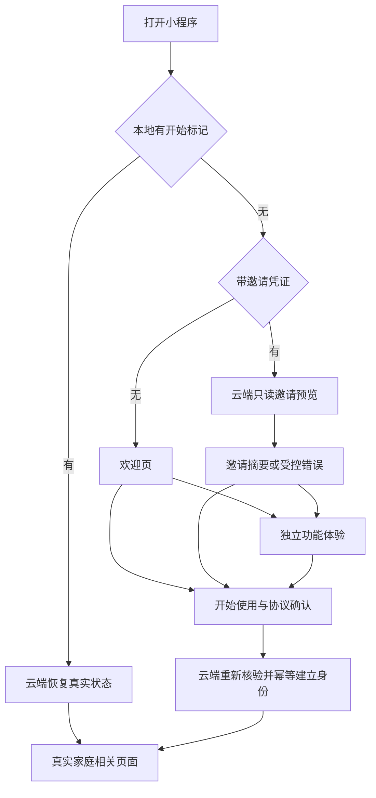
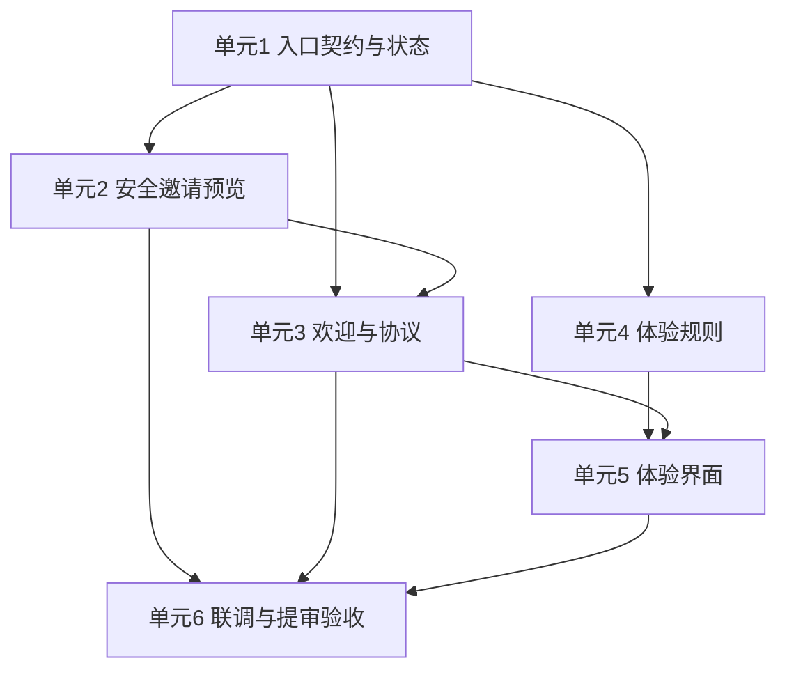
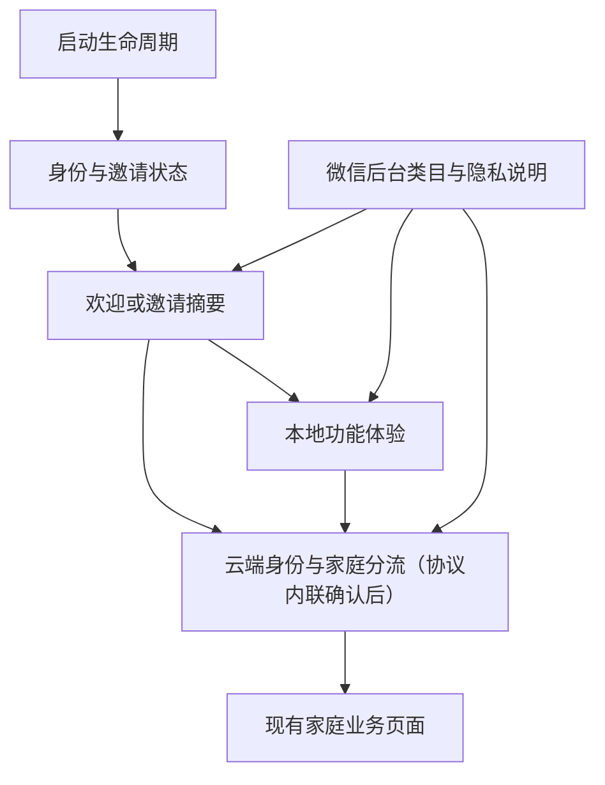

# feat: 重构首次了解、功能体验与开始使用流程

## 概述

把当前“打开即勾选协议并登录”的首屏，改为先理解产品、再主动开始使用。尚未开始使用的普通用户先看到欢迎页，可直接创建家庭，也可进入一张不保存数据的独立体验页；从邀请进入的用户先看到最小邀请摘要，可直接加入或先体验。只有用户主动选择创建或加入并确认协议后，才建立最小身份并进入现有家庭分流。

本计划以 `docs/prd/001-login-prd.md` 为唯一产品依据，并同步遵守 `docs/prd/003-create-home-prd.md` 与 `docs/prd/004-invite-join-home-prd.md`。现有登录、邀请和家庭能力已经落地，本次是在保留安全边界的前提下调整首次入口，不重做家庭业务。

## 问题框定

当前启动页 `src/pages/login/index.vue` 在用户看到实际功能前就要求同意协议并点击“微信快捷登录”，与本次微信审核反馈冲突。若直接把账本页面开放给未开始使用的用户，又会把产品误解为单一记账工具；若伪造一个体验家庭，则会让用户随后创建真实家庭时产生“为什么创建两次”的困惑。

现有代码已经具备可复用基础：`src/App.vue` 会保存邀请并只为已有本地标记的用户恢复状态；`src/store/modules/auth.ts` 对恢复和主动开始动作做单次请求保护；`cloudfunctions/resolve-login/entry-state.js` 从可信微信身份判断家庭和邀请状态；`cloudfunctions/household/invitation-domain.js` 能用邀请凭证返回受限摘要且不消费邀请。计划应保留这些边界，只改变用户在确认协议前看到和能操作的内容。

### 三类启动模式

| 启动模式 | 第一屏 | 可体验 | 何时建立身份 | 正式去向 |
| --- | --- | --- | --- | --- |
| 尚未开始使用、无邀请 | 欢迎页 | 可选 | 点击“创建我的家”并确认协议后 | 云端确认已有家庭或进入创建家庭 |
| 尚未开始使用、有邀请 | 正在确认邀请，随后显示最小邀请摘要 | 可选，邀请始终保留 | 点击“加入这个家”并确认协议后 | 云端复核后进入加入、转入或受控异常页 |
| 已开始使用 | 正在确认当前状态 | 不显示 | 不重复建立 | 直接进入真实家庭、创建页或邀请处理页 |

## 需求追踪

- R1-R5：新用户先进入欢迎页，显示“创建我的家”和“先看看怎么用”，不在选择前要求登录或资料授权。
- R6-R15：提供与正式家庭分离的一页式体验，覆盖事项认领、临时记账和足迹展开；离开后清空且不向正式数据迁移。
- R16-R20：仅在主动创建或加入时确认协议并建立最小身份；处理期间防重复，失败保留入口语境并可重试。
- R21-R26：邀请用户先看到最小摘要；体验前后邀请不丢失；异常和网络失败分开处理且不泄露家庭内部资料。
- R27-R28：已有用户跳过体验；本地标记丢失时，在用户主动开始后恢复云端既有身份和家庭，不创建第二个家庭。
- R29-R31：提审类目、版本说明和实际功能一致；首屏可供审核体验；欢迎、邀请和体验页面满足小屏幕、大文字及清楚状态反馈。

## 范围边界

### 本次包含

- 改造现有启动页为欢迎、邀请摘要、恢复中和失败重试的统一入口。
- 新增独立体验页及事项、账本、足迹三个固定示例场景。
- 新增统一的协议确认入口和可实际查看的用户协议、隐私政策页面。
- 调整邀请预览结果，使开始使用前只返回和展示必要摘要。
- 保留并调整现有身份恢复、家庭分流、邀请保存、失败重试与防重复处理。
- 补充自动检查、微信开发者工具、真机账号和微信后台提审检查。

### 本次不包含

- 长期游客模式、跨设备同步或将体验数据迁移到真实家庭。
- 在正式首页、账本、事项或足迹页面中混入示例数据。
- 体验中的图片上传、真实位置选择、邀请发送、问账本或任何真实家庭数据访问。
- 手机号、微信昵称、微信头像、性别、生日、地区等额外资料收集。
- 重做创建家庭、正式记账、事项、足迹、邀请加入和成员管理业务。
- 通过隐藏正式功能或使用与实际功能不符的说明规避审核。

## 上下文与调研

### 相关代码和既有模式

- `src/App.vue`：启动和回前台时保存邀请；已有用户才自动恢复，重复生命周期调用由状态层合并。
- `src/store/modules/auth.ts`：身份标记、邀请上下文、单次请求、重试和一次性导航的唯一来源。
- `src/services/entry-router.ts`：有限云端状态到固定页面的集中映射，未知状态保持当前页面。
- `cloudfunctions/resolve-login/entry-state.js`：主动开始可幂等建立最小用户，恢复动作只查询；家庭归属由云端成员数据判断。
- `cloudfunctions/household/invitation-domain.js`：邀请凭证经摘要查询，预览不消费邀请，正式加入时重新校验。
- `src/utils/ledger-validators.ts`：正式账本金额格式、正数和上限规则，体验记账应直接复用。
- `src/subpackages/ledger/ledger-add/ledger-add-view.ts`：收支类型、固定类目展示和纯视图逻辑的现有模式。
- `src/pages/login/components/AgreementCheckbox.vue`：协议勾选组件可迁移到新的开始使用页，但必须增加可打开正文的入口。
- `tests/unit/auth-store.spec.ts`、`tests/unit/invitation-domain.spec.ts`、`tests/e2e/login-flow.spec.js`：分别提供状态隔离、邀请安全和微信页面验收模式。

### 项目经验

- `docs/solutions/workflow-issues/prd-brainstorm-plan-delivery-loop-2026-09-09.md` 要求先固定产品边界，再按“结果约定、云端规则、前端状态、页面、实际环境验收”的顺序推进。
- 自动检查通过不能代替微信开发者工具、真机、双账号和后台配置确认；最终状态必须区分“已实现”和“已实际确认”。
- 涉及身份、家庭和邀请的判断继续由云端完成，页面只提出操作并展示受控结果。

### 外部约束

- 当前项目为 Vue 3、TypeScript、uni-app 微信小程序，界面继续使用 Wot UI 2.3.x；新页面遵守项目规定的模板、脚本、样式顺序和中文注释要求。
- 微信隐私相关能力只有在指引声明与用户确认符合要求后才能调用；本次体验不调用隐私接口，正式协议内容与后台隐私保护指引仍须一致。[腾讯云小程序隐私保护适配说明](https://cloud.tencent.com/document/product/1301/97930)
- 不引入已调整或已收回的微信头像昵称获取方式；现有云端可信身份足以建立最小应用身份，头像昵称继续由用户在产品内主动设置。
- 页面路由、生命周期和滚动布局遵循 [uni-app 官方文档](https://uniapp.dcloud.net.cn/)，按钮、输入、单选、加载和吸顶提示使用 [Wot UI 官方组件](https://wot-ui.cn/)。

## 关键技术决定

| 决定 | 处理方式 | 原因 |
| --- | --- | --- |
| 启动页路径 | 保留 `pages/login/index` 作为技术启动页，但界面和用户文案全部改为欢迎与开始使用，不再展示"登录" | 避免更换首路由造成额外迁移，同时满足用户实际看到的是独立欢迎页 |
| 主动开始契约 | 保留云端现有 `login` 意图作为内部兼容契约，前端对外统一提供"开始使用"动作和文案 | 减少云端部署风险；内部名称不暴露给用户，也不改变产品语义 |
| 协议确认 | **2026-09-11 调整**：在欢迎页内联协议勾选，删除独立开始使用页，协议未勾选时主按钮不可点 | 真机验证发现老用户清除本地标记后需多跳转一次，体验不佳；欢迎页本身不展示"登录"二字，等价满足审核；少一个页面跳转 = 老用户少一步 |
| 体验状态 | 全部保存在体验页本地状态和纯函数中，不进入 Pinia、本地存储或云端 | 从结构上保证离开清空，避免与真实家庭数据串联 |
| 邀请预览 | 继续通过现有不可猜测邀请凭证调用云端，只返回邀请人昵称头像、家庭名称和成员数 | 未建立身份也能理解邀请，同时不暴露事项、账目、足迹、内部编号或邀请原文 |
| 正式分流 | 协议确认后仍调用现有云端入口重新核验家庭和邀请，不信任开始前的预览结果 | 体验期间邀请可能过期、被使用或家庭满员，最终结果必须以云端最新状态为准 |
| 页面组件边界 | 路由页面只组合状态与导航；欢迎展示、邀请摘要、协议区域及三个体验场景拆成页面私有组件，输入向下、事件向上 | 页面包含多个独立区域，拆分后便于测试并符合现有 Vue 3 组织方式 |

## 高层流程设计

> 下图只表达各部分配合方式，供实施时核对方向，不规定具体代码写法。

### 邀请终态处理

| 发生时机 | 身份状态 | 邀请处理 | 用户下一步 |
| --- | --- | --- | --- |
| 预览阶段确认无效、过期、已使用或满员 | 尚未开始使用 | 不创建用户；用户明确结束时再清除凭证 | 联系对方重发，或主动结束邀请并返回欢迎页 |
| 预览阶段暂时失败 | 尚未开始使用 | 保留凭证和当前入口 | 原页重试，不显示为失效 |
| 协议确认后重新核验为过期、已使用或满员 | 已建立最小身份且无家庭 | 清除终态邀请 | 联系对方重发，或主动进入创建家庭 |
| 已有家庭用户打开其他邀请 | 已开始使用且已有家庭 | 不消费邀请，提示后清除当前入口凭证 | 返回自己的真实家庭 |

邀请格式异常或不存在时，云端可以在创建最小身份前拒绝；此时仍按“尚未开始使用”处理。页面不得只根据错误页是否出现推测身份状态，而应以 auth 状态中的完成标记决定下一步按钮。

## 已解决与延后问题

### 计划阶段已解决

- 是否新增另一套登录云函数：不新增，沿用 `resolve-login` 的可信身份和幂等创建能力。
- 是否复用正式业务页体验：不复用；体验页面不导入业务 store 或云端服务。
- 是否更换首路由路径：不更换；保留兼容路径，改变页面职责和展示。
- 邀请预览是否需要先创建用户：不需要；现有邀请领域预览只依赖有效凭证并保持只读。
- 体验金额规则是否另写：不另写；复用正式账本金额校验，体验统计只在内存中计算。

### 延后到实施时确认

- 固定示例地点图片的最终构图和压缩质量：实施时按品牌规范制作并以包体积检查结果决定最终尺寸，不使用真实用户素材。
- 协议和隐私政策中的运营者名称、联系渠道、保存期限等法定信息：页面结构可以先实现，但正式正文必须由项目实际运营者提供并确认；未确认前不得标记为可提审完成。
- 当前微信后台对“共同事项”和“足迹”可选类目的具体名称：后台选项会变化，提审前按当前账号实际可选项核对；至少补充审核明确要求的“工具－记账”。

## 实施单元

- [ ] **单元 1：调整首次入口契约与状态生命周期**

**目标：** 在不破坏已有家庭恢复能力的前提下，把“未开始使用”改为欢迎状态，并为普通创建和邀请加入提供统一的开始使用动作。

**对应需求：** R1、R4-R5、R15-R20、R27-R28。

**依赖：** 无。

**文件：**

- 修改：`src/types/auth.ts`
- 修改：`src/store/modules/auth.ts`
- 修改：`src/services/entry-router.ts`
- 修改：`src/App.vue`
- 测试：`tests/unit/auth-store.spec.ts`
- 测试：`tests/unit/entry-router.spec.ts`
- 测试：`tests/unit/resolve-login.spec.ts`

**实施方法：**

- 将页面可见概念从“是否登录”改为“是否已经开始使用”，但兼容读取现有本地标记，避免已上线用户升级后被当成新人。
- 为页面提供统一的开始使用动作；其内部继续使用现有云端主动意图，错误文案、处理中提示和页面内容不再出现“微信快捷登录”。
- `NEED_LOGIN` 对应当前启动欢迎页；已有标记仍先显示“正在确认登录状态”，恢复成功后直接去真实页面，失败时保留重试。
- 保留邀请原值的短期本地存储、单次请求和一次性导航；只有成功进入非邀请流程、受控邀请终态或用户明确结束邀请时才清理。
- 为迟到恢复结果、重复 `onLaunch/onShow`、本地标记失效及云端已有家庭的组合补齐防回退规则。

**执行说明：** 先扩充现有状态回归测试，再调整状态命名和页面动作，避免升级后把正式用户送回欢迎页。

**遵循模式：** `src/store/modules/auth.ts` 的单次请求与一次性导航、`src/services/entry-router.ts` 的有限状态映射、`tests/unit/auth-store.spec.ts` 的依赖注入测试。

**测试场景：**

- 正常：全新用户无本地标记时不调用云端、不创建身份，停留在欢迎入口。
- 正常：已有标记用户打开时只查询一次，并直接进入真实家庭或创建家庭页，不出现欢迎与体验。
- 边界：清空本地标记但云端已有家庭时，用户主动开始后恢复原家庭，不创建第二个家庭。
- 边界：启动和回前台连续触发恢复时共享一个请求，只消费一次导航结果。
- 错误：恢复或开始使用超时后留在当前入口并允许重试，邀请和已有家庭状态不被错误清空。
- 集成：创建家庭刚成功时，较早发出的恢复结果不能把用户送回创建页或欢迎页。

**完成验证：** 所有旧入口状态仍有唯一去向；现有用户升级后无需重新确认协议或再次创建家庭；新用户在主动开始前没有云端用户写入。

- [ ] **单元 2：收紧并接通开始使用前的邀请预览**

**目标：** 让持有有效邀请的未开始用户先看见必要摘要，同时保证预览不创建身份、不消费邀请、不泄露内部数据。

**对应需求：** R21-R26、R28。

**依赖：** 单元 1。

**文件：**

- 修改：`src/types/invitation.ts`
- 修改：`src/services/invitation-cloud.ts`
- 修改：`src/store/modules/invitation.ts`
- 修改：`cloudfunctions/household/invitation-domain.js`
- 修改：`cloudfunctions/household/index.js`
- 测试：`tests/unit/invitation-cloud.spec.ts`
- 新建测试：`tests/unit/invitation-store.spec.ts`
- 测试：`tests/unit/invitation-domain.spec.ts`
- 测试：`tests/unit/auth-store.spec.ts`

**实施方法：**

- 将公开预览契约固定为邀请人昵称与头像、家庭名称和成员数，不返回家庭头像、成员列表、内部用户编号、家庭编号、事项、账目或足迹。
- 邀请预览以当前 `pendingInviteToken` 为输入，并记录请求对应的凭证版本；切换邀请、返回非预览结果或请求失败时清除旧摘要，迟到结果只有在凭证版本仍匹配时才允许写入，防止把上一份邀请显示给当前链接。
- 内置邀请人头像可直接返回受控编号；自定义头像只能由云端在有效邀请凭证授权后转换为短时可展示地址，响应不得包含存储路径、资源编号或可长期复用的地址。若临时地址生成失败，摘要使用中性默认头像且邀请仍可继续。
- 区分“正在确认”“暂时无法确认，可重试”和“无效、过期、已使用、满员”等终态；网络失败保留邀请，终态不自动转去创建家庭。
- 终态页面提供明确结束邀请动作；清除凭证必须由用户动作或已经完成的受控分流触发，不能因为一次暂时失败而清除。
- 继续使用服务端摘要查询和固定格式校验；预览只读，不调用用户创建逻辑，也不记录或展示邀请原文。
- 协议确认后的正式开始动作必须再次走 `resolve-login`，不能根据预览结果直接加入。

**执行说明：** 先为公开返回字段和“不创建、不消费”增加安全测试，再改云端与前端契约。

**遵循模式：** `cloudfunctions/household/invitation-domain.js` 的受控结果、`src/services/invitation-cloud.ts` 的运行时结果校验、`tests/unit/invitation-domain.spec.ts` 的内存仓库。

**测试场景：**

- 正常：有效邀请返回四项必要展示信息，页面可渲染摘要，邀请记录保持未使用。
- 边界：同一设备先后打开两份邀请时只显示后一份摘要；旧请求迟到不能覆盖新邀请。
- 边界：邀请人使用自定义头像时只返回短时可展示结果；生成失败时显示默认头像，不把有效邀请误判为无效。
- 边界：邀请人在用户体验期间重发邀请，旧链接在正式开始时得到已使用或失效结果，不加入错误家庭。
- 错误：格式异常、不存在和无权访问统一返回无效，不泄露邀请是否真实存在。
- 错误：网络或数据库暂时失败保留邀请并可重试，不误报为失效，也不显示上一次预览。
- 安全：预览响应、日志、错误文案和页面文本均不包含邀请原文、家庭编号、内部身份或家庭业务数据。
- 集成：未开始用户完成预览后仍没有 `users` 写入；只有协议确认后的开始动作允许幂等建立最小身份。

**完成验证：** 持有有效凭证的未开始用户可理解邀请来源，任何预览路径都不会改变身份、家庭或邀请状态。

- [ ] **单元 3：完成欢迎、协议确认和正式文本入口**

**目标：** 把现有登录页改成清楚的欢迎或邀请入口，并集中完成协议确认、开始处理和失败重试。

**对应需求：** R1-R5、R14、R16-R24、R27、R31。

**依赖：** 单元 1、单元 2。

**文件：**

- 修改：`src/pages/login/index.vue`
- 重命名并修改：`src/pages/login/components/LoginBrandHero.vue`
- 新建：`src/pages/login/components/WelcomeActions.vue`
- 新建：`src/pages/login/components/InvitationSummary.vue`
- 新建：`src/pages/login/welcome-view.ts`
- 新建：`src/pages/login/components/AgreementCheckbox.vue`（协议内联到欢迎页）
- ~~新建：`src/pages/start/index.vue`~~（**2026-09-11 删除**：协议改内联到欢迎页）
- ~~移动并修改：`src/pages/start/components/AgreementCheckbox.vue`~~（改为新建在 `pages/login/components/`）
- ~~新建：`src/pages/start/start-use-view.ts`~~（**2026-09-11 删除**：逻辑并入 `welcome-view.ts`）
- 新建：`src/pages/legal/index.vue`
- 新建：`src/pages/legal/legal-content.ts`
- 修改：`src/subpackages/household/invite-status/index.vue`
- 新建：`src/subpackages/household/invite-status/invite-status-view.ts`
- 修改：`src/pages.json`（去掉 `pages/start/index` 注册）
- 新建测试：`tests/unit/welcome-view.spec.ts`
- ~~新建测试：`tests/unit/start-use-view.spec.ts`~~（**2026-09-11 删除**）
- 新建测试：`tests/unit/legal-content.spec.ts`
- 新建测试：`tests/unit/invite-status-view.spec.ts`
- 测试：`tests/e2e/first-use-experience.spec.js`（路径从 `/pages/start/index` 改为 `/pages/login/index`）

**实施方法：**

- 启动页根据现有用户恢复、普通欢迎、邀请确认、邀请摘要和失败重试五种视图组合页面；路由页面只负责调度，展示组件只接收数据并上报按钮事件。
- 普通欢迎页使用品牌 Logo 和产品定位，主按钮为"开始使用"，次按钮为"先看看怎么用"；不展示登录、手机号或微信资料授权。
- 协议勾选内联在欢迎页（welcome / invite-summary 模式），未勾选时主按钮不可点；点勾选后主按钮变为可用；勾上后用户点"开始使用"直接调云端分流到 home / create-home / join-home。
- 邀请摘要显示邀请人头像昵称、家庭名称和当前成员数，主按钮为"加入这个家"，次按钮为"先看看怎么用"；加载与终态均使用受控文案。
- 用户协议和隐私政策使用本地静态正文页面，可从协议区域分别打开并返回；不得使用空链接、占位文案或无法滚动查看的弹窗。
- 邀请终态页根据是否已开始使用显示唯一下一步：未开始用户可结束邀请返回欢迎页，已开始且无家庭用户可主动创建家庭；暂时失败仍留在摘要入口重试。
- 页面加载统一使用 `wd-loading`；按钮、勾选和反馈优先使用 Wot UI；样式按品牌变量、BEM 和 SCSS 嵌套组织。

**执行说明：** 先为视图模式与按钮文案建立纯逻辑测试，再替换现有页面，避免视觉改造掩盖状态分流错误。**2026-09-11 调整**：真机验证发现老用户清除本地标记后需多跳转一次；协议确认改为内联到欢迎页，去掉独立 start 页，老用户少一步。

**遵循模式：** `src/pages/login/index.vue` 的恢复状态、`src/subpackages/household/join-home/index.vue` 的邀请展示、`docs/brand/visual-standard.md`、项目全站加载和样式规范。

**组件职责：**

- `src/pages/login/index.vue`：恢复、预览、协议确认和开始导航的页面组合层（**2026-09-11 调整**：协议勾选从独立 start 页迁入）。
- `WelcomeActions.vue`：展示产品用途与两个欢迎入口，不读取 store。
- `InvitationSummary.vue`：展示最小邀请摘要与两个邀请入口，不持有邀请凭证。
- `AgreementCheckbox.vue`（**2026-09-11 调整**：移至 `pages/login/components/`）：只处理勾选与两个正文入口，通过事件通知父页面。
- `src/pages/legal/index.vue`：按受控类型展示已确认的静态正文，不接受任意富文本。

**测试场景：**

- 正常：新用户首屏只看到产品用途、"开始使用"和"先看看怎么用"，可直接进入任一路径。
- 正常：邀请用户先看到确认状态，成功后显示四项必要摘要以及"加入这个家""先看看怎么用"。
- 正常：从欢迎进入同意协议后按钮语境正确；勾选并成功开始后进入云端给出的正式页面。
- 边界：打开协议正文再返回时来源模式和邀请保留；取消协议回到欢迎页入口。
- 边界：小屏幕、系统较大文字和页面滚动时，主按钮、协议正文与次要入口均可见可点。
- 错误：邀请预览失败显示重试；开始使用失败不跳页、不重复写入，连续点击只发起一次请求。
- 终态：未开始用户可结束无效邀请并回欢迎页；已开始且无家庭用户可主动去创建家庭；两种情况都不得自动创建。
- 安全：页面文字和调试输出不展示邀请原文、微信身份或家庭内部数据；法律正文不使用不受信任的 HTML。
- 集成：已有用户启动期间只看到恢复状态后跳转，不短暂闪现欢迎或邀请体验入口。

**完成验证：** 审核人员无需开始使用即可理解产品并进入功能体验；选择正式使用时可以查看完整协议，且创建与邀请语境不会串线；老用户清除本地标记后只需勾选 + 1 次点击进家（**2026-09-11 调整**：合并独立 start 页）。

- [ ] **单元 4：建立独立体验的纯状态与固定示例**

**目标：** 先固定三种体验交互和临时统计规则，确保体验不依赖真实家庭、Pinia、本地存储或云端。

**对应需求：** R6-R13。

**依赖：** 单元 1。

**文件：**

- 新建：`src/pages/experience/experience-view.ts`
- 新建：`src/types/experience.ts`
- 修改：`src/utils/ledger-validators.ts`（仅在现有公共金额规则无法直接复用时调整对外使用方式，不改变正式账本边界）
- 新建测试：`tests/unit/experience-view.spec.ts`
- 测试：`tests/unit/ledger-validators.spec.ts`

**实施方法：**

- 定义一组固定、无真实个人信息的事项、账本类目、初始收支统计和足迹内容；不设置家庭名称、成员头像或虚构用户身份。
- 事项状态只支持认领、恢复示例；结果显示“由我处理”，不产生任何业务请求。
- 体验记账接收金额文本、支出或收入和固定分类；金额转换直接使用正式账本校验，合法提交后以整数分更新总额和分类统计。
- 空白、零、负数、格式错误和超上限金额返回明确错误且统计不变；修改类型或分类不会隐式提交。
- 足迹只支持展开和收起固定详情，日期、图片和文字均来自本地常量。
- 提供统一初始状态和重置动作，页面每次新进入或从其他页面返回时恢复初始状态。

**执行说明：** 体验规则采用测试先行，先证明所有操作只改变内存状态，再制作界面。

**遵循模式：** `src/subpackages/ledger/ledger-add/ledger-add-view.ts` 的纯视图描述器、`src/utils/ledger-validators.ts` 的整数分校验、`tests/unit/ledger-add-view.spec.ts` 的边界测试。

**测试场景：**

- 正常：认领事项后状态变为“由我处理”，恢复后回到未认领。
- 正常：选择支出、输入 `12.50` 并选择餐饮后，支出总额和餐饮统计增加 1250 分；收入同理进入收入统计。
- 边界：`0`、负数、空白、三位以上小数、非数字和超过上限均提示错误，提交前后统计完全相同。
- 边界：连续提交两笔不同类型和分类后，总额与分类明细分别准确累加，无浮点误差。
- 正常：展开足迹后显示固定日期、图片说明和回忆，再次点击收起。
- 隔离：任何体验动作都不调用云端服务、不写 Pinia、不使用本地存储；重置后与全新进入状态完全一致。

**完成验证：** 三个场景可由纯逻辑完整验证，体验前后真实事项、账本、足迹、家庭和邀请数据均无变化。

- [ ] **单元 5：制作一页式功能体验并衔接开始入口**

**目标：** 让用户在一个独立页面完成事项认领、临时记账和足迹展开，并清楚知道示例不会保存。

**对应需求：** R6-R15、R23-R24、R31。

**依赖：** 单元 3、单元 4。

**文件：**

- 新建：`src/pages/experience/index.vue`
- 新建：`src/pages/experience/components/ExperienceTaskCard.vue`
- 新建：`src/pages/experience/components/ExperienceLedgerCard.vue`
- 新建：`src/pages/experience/components/ExperienceFootprintCard.vue`
- 新建：`src/pages/experience/assets/footprint-sample.png`
- 修改：`src/pages.json`
- 测试：`tests/unit/experience-view.spec.ts`
- 新建测试：`tests/e2e/first-use-experience.spec.js`

**实施方法：**

- 页面顶部使用吸顶提示“功能体验 · 示例数据不会保存”，其余内容按共同事项、家庭账本、共同足迹顺序排列，不复用正式首页结构。
- 三个场景组件使用明确的属性和事件：父页面持有唯一临时状态，子组件只展示并上报认领、记账、展开或重置动作。
- 账本体验使用 Wot UI 输入、单选与按钮，错误紧邻输入展示；统计变化立即可见，并提供恢复示例。
- 足迹示例图按主包体积预算压缩，提供文字说明；不请求相册、位置或网络图片。
- 页面底部根据来源显示一组配套操作：普通进入为“返回欢迎页”“创建我的家”，邀请进入为“返回邀请”“加入这个家”；点击后进入统一协议页，邀请仍由身份状态保存。
- 页面显示、隐藏和卸载都按规则重置体验状态；返回邀请入口时重新使用当前邀请摘要，不把体验结果传出页面。

**遵循模式：** 项目页面私有组件目录、Vue 单向数据流、Wot UI `wd-sticky`/`wd-input`/`wd-radio-group`/`wd-button`、`src/uni.scss` 品牌变量和页面 BEM 样式规范。

**测试场景：**

- 正常：从欢迎页进入后可依次完成认领、记账和足迹展开，顶部“不保存”提示始终可见。
- 正常：合法记账后金额及分类统计立即变化，点击恢复或重新进入页面后恢复固定初始值。
- 邀请：从邀请摘要进入时底部按钮为“加入这个家”，返回后仍显示同一邀请摘要；不得出现“创建我的家”。
- 边界：小屏幕、较大文字和键盘弹起时输入、错误、统计及底部按钮不互相遮挡，页面可以完整滚动。
- 错误：非法金额不改变统计；快速重复点击提交、认领和展开不会产生重复变化。
- 隔离：页面运行期间网络断开仍可完整体验；测试确认没有调用事项、账本、足迹、家庭或邀请写入接口。
- 集成：从体验进入协议页后取消并返回，体验数据已重置而邀请语境仍保持。

**完成验证：** 审核人员和新用户无需建立身份即可在一页内看懂并操作三个核心功能，页面没有虚构家庭或真实数据错觉。

- [ ] **单元 6：完成跨层回归、发布准备与实际审核验收**

**目标：** 确认新入口不会破坏现有用户和邀请，并使后台类目、隐私说明、版本说明与实际首屏一致。

**对应需求：** R20-R31及全部成功标准。

**依赖：** 单元 2、单元 3、单元 5。

**文件：**

- 修改：`tests/e2e/login-flow.spec.js`
- 修改：`tests/e2e/invite-join-home.spec.js`
- 新建：`tests/e2e/first-use-experience.spec.js`
- 修改：`cloudfunctions/README.md`
- 修改：`README.md`
- 新建：`docs/plans/2026-09-11-first-use-audit-verification.md`

**实施方法：**

- 自动检查覆盖样式、类型、全部单元测试、微信构建和主包/分包体积；体验图片加入后重点核对主包余量。
- 微信开发者工具分别验证普通新用户、邀请新用户、已有用户、清空本地标记但云端已有家庭、无效邀请和网络失败六类入口。
- 真机使用至少两个微信账号验证：邀请预览后体验、体验期间邀请失效、确认加入、已有家庭用户打开其他邀请，以及重复点击不会产生第二个家庭。
- 云端先部署向后兼容的邀请预览收窄，再发布小程序；旧客户端不依赖被移除的家庭头像字段，回退时仍能使用旧入口。
- 微信公众平台至少补充审核明确要求的“工具－记账”，并按当前后台选项核对事项与足迹类目；版本说明写明首屏可免登录体验固定示例，正式数据仅家庭成员可见。
- 对照实际调用的隐私能力更新后台隐私保护指引；协议正文、后台声明和代码行为三者一致后才提交审核。
- 每个实施单元完成后同步更新计划复选框、PRD目录和README；自动检查与真机/后台确认分开记录。

**遵循模式：** `docs/plans/2026-09-03-footprint-verification.md` 的分层验收记录、`cloudfunctions/README.md` 的发布检查、现有 e2e 在有微信自动化会话时执行的结构。

**测试场景：**

- 回归：已有用户升级后直接进入原家庭，首页、事项、账本、足迹及全局新增不受影响。
- 回归：无家庭已有用户直接进入创建页；被移除用户仍只看到一次受控说明。
- 邀请：全新用户预览和体验不创建身份，确认后加入成功；邀请过期、被使用或满员时不创建错误家庭。
- 恢复：清空本地数据后主动开始，云端已有家庭被恢复，不生成第二个用户或家庭。
- 安全：非成员和没有有效凭证的用户不能获得邀请摘要或任何家庭业务数据；客户端仍不能直接读写家庭集合。
- 发布：审核人员无需授权资料即可完成三项体验；类目、版本说明、隐私指引和页面实际能力逐项一致。

**完成验证：** 自动检查全部通过，微信开发者工具和真机结果有截图或记录，后台类目和隐私配置已确认；若只完成代码而未完成后台或真机步骤，状态必须写为“已实现，待实际环境确认”。

## 系统影响

- **交互关系：** 启动生命周期先保存邀请并判断是否恢复；未开始用户由欢迎页进入体验或直接协议确认后开始使用（**2026-09-11 调整**：协议确认在欢迎页内联，删除独立 start 页）。
- **错误传递：** 邀请预览失败留在欢迎页；开始使用失败留在欢迎页；云端受控邀请终态进入明确错误页，未知结果和临时失败不跳转。
- **状态生命周期：** 身份标记与邀请继续由 auth 状态保存；邀请摘要由 invitation 状态保存且绑定当前凭证；体验状态只存在于体验页并在离开时清空；协议勾选仅保存在欢迎页本地。
- **接口兼容：** 不新增第三方接口，不改变客户端传入用户或家庭身份的规则；公开邀请预览只收窄返回字段，正式加入接口不变。
- **集成覆盖：** 单元测试证明纯规则和安全边界，微信自动化验证页面结构，真机双账号与后台检查证明真实分享、身份恢复和审核配置。
- **不变规则：** 家庭最多两人、任一用户最多一个家庭、邀请一次性且可过期、客户端不能直读家庭数据、体验不保存、导航不写入足迹。

## 风险与依赖

| 风险 | 影响 | 应对 |
| --- | --- | --- |
| 改首屏后已有用户短暂看到欢迎页 | 让正式用户误以为数据丢失 | 有本地标记时先显示恢复状态；恢复结论前不渲染欢迎或体验入口 |
| 邀请摘要与当前凭证错配 | 显示错误家庭或邀请人 | 摘要绑定凭证；新请求开始、凭证变化和失败时清旧摘要；迟到响应不得覆盖 |
| 自定义邀请人头像扩大未登录访问范围 | 暴露云存储资源或形成长期公开链接 | 仅凭有效邀请换取短时展示地址，不返回资源编号和存储路径；失败时回退默认头像 |
| 体验期间邀请状态变化 | 用户按旧摘要继续加入 | 协议确认后由 `resolve-login` 重新核验，预览结果从不作为加入依据 |
| 体验误触真实业务 | 未同意前创建数据或申请隐私权限 | 体验模块不导入业务 store/服务，不保存数据，并用测试替身确认无网络写入 |
| 体验页内容过多或按钮被键盘遮挡 | 审核人员无法完成流程 | 一页三段、顶部提示吸顶、底部操作随页面流布局，小屏和大文字专项验收 |
| 法律正文或后台隐私指引不一致 | 提审失败或用户无法了解数据处理 | 使用实际运营者信息；代码、正文和微信后台逐项核对，缺资料时不标记完成 |
| 示例图片增大主包 | 接近微信主包限制 | 使用单张压缩本地图并执行包体积检查，必要时进一步压缩而不改体验结构 |
| 云端与小程序版本发布次序不一致 | 新页面无法解析邀请摘要 | 预览契约做向后兼容收窄，先部署云端再发布小程序，保留旧客户端可用字段校验 |

## 分阶段交付

### 阶段一：入口与安全边界

- 完成单元 1、2，先证明新用户不被自动创建、邀请预览只读且已有用户不受影响。

### 阶段二：页面与体验

- 完成单元 3、4、5，交付可独立检查的欢迎、协议和一页式体验。

### 阶段三：实际环境与提审

- 完成单元 6，在微信开发者工具、真机双账号和微信公众平台中收口验证证据。

## 文档与发布说明

- 实施完成后把 `docs/prd/001-login-prd.md` 和 `docs/prd/004-invite-join-home-prd.md` 的交付状态更新为真实结果。
- `README.md` 记录新的首次入口、体验边界和检查方式；`cloudfunctions/README.md` 记录云端发布顺序及邀请预览约束。
- 提审版本说明使用面向审核人员的事实描述：首次进入可直接体验固定示例；示例不会保存；开始创建或加入家庭时才确认协议；正式数据仅家庭成员可见。
- 后台手工配置和真机结果写入 `docs/plans/2026-09-11-first-use-audit-verification.md`，未完成项不得用自动检查代替。

## 参考

- 原始需求：`docs/prd/001-login-prd.md`
- 相关创建规则：`docs/prd/003-create-home-prd.md`
- 相关邀请规则：`docs/prd/004-invite-join-home-prd.md`
- 旧登录计划：`docs/plans/2026-08-13-002-feat-login-entry-flow-plan.md`
- 旧邀请计划：`docs/plans/2026-08-14-002-feat-invite-join-home-plan.md`
- 历史经验：`docs/solutions/workflow-issues/prd-brainstorm-plan-delivery-loop-2026-09-09.md`
- 启动入口：`src/App.vue`、`src/pages/login/index.vue`
- 身份分流：`src/store/modules/auth.ts`、`cloudfunctions/resolve-login/entry-state.js`
- 邀请预览：`src/store/modules/invitation.ts`、`cloudfunctions/household/invitation-domain.js`
- 金额规则：`src/utils/ledger-validators.ts`
- 官方参考：[uni-app](https://uniapp.dcloud.net.cn/)、[Wot UI](https://wot-ui.cn/)、[腾讯云小程序隐私保护适配说明](https://cloud.tencent.com/document/product/1301/97930)
