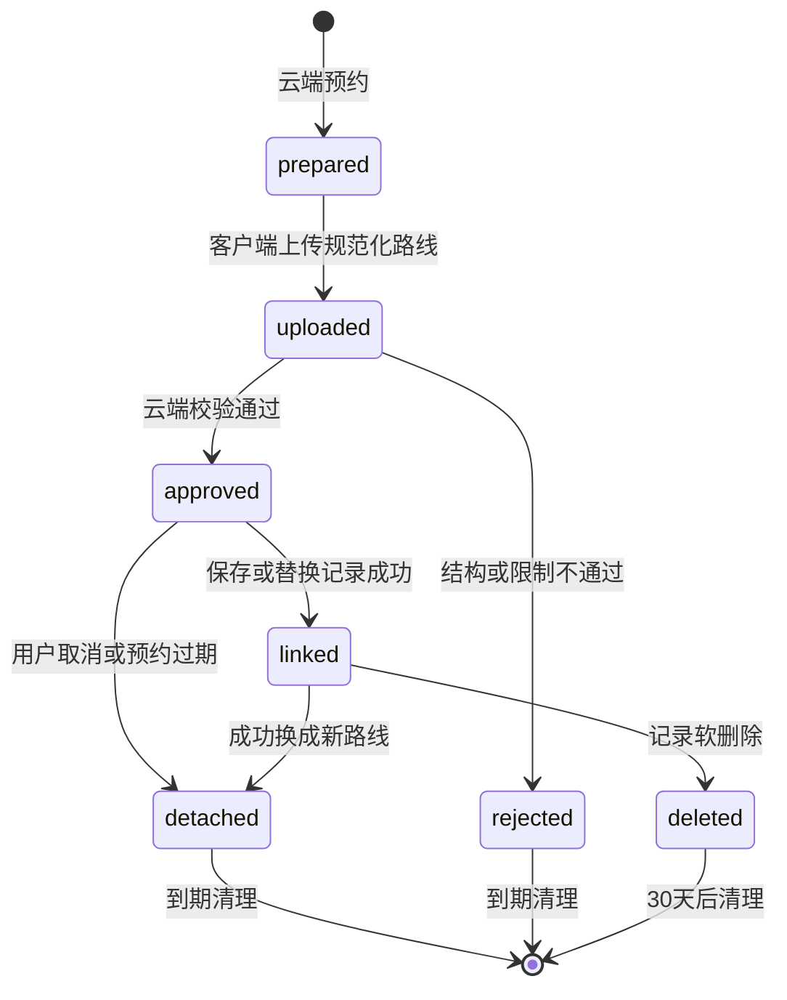
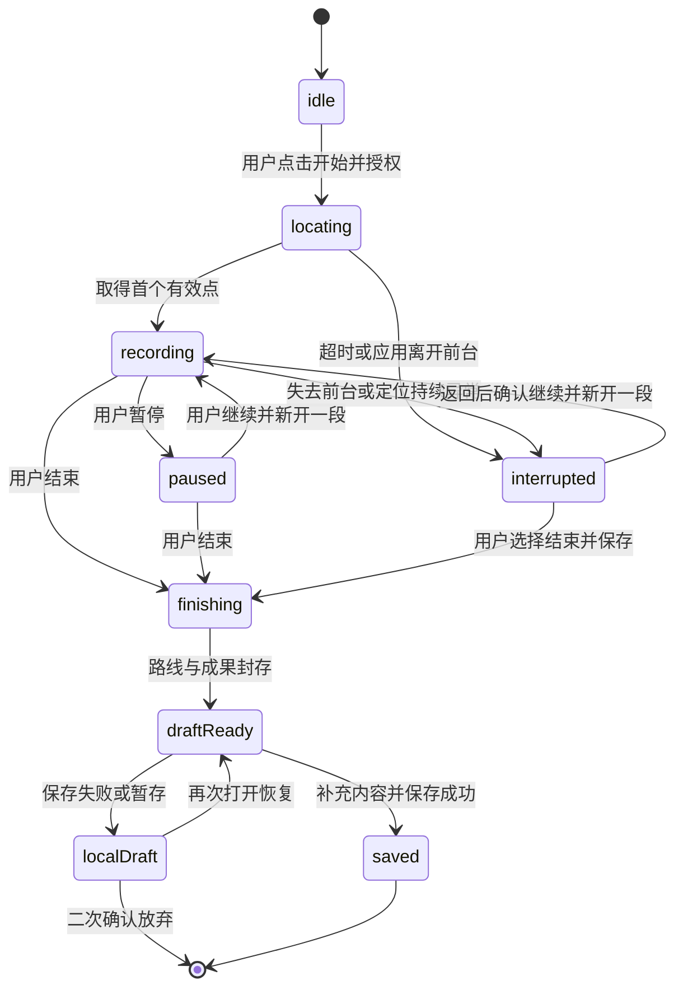
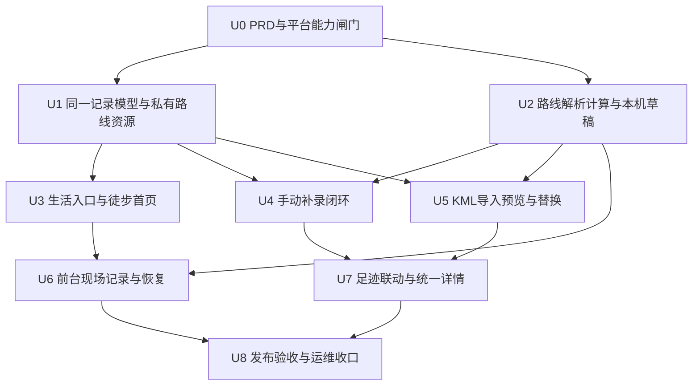

# “生活”入口与共同徒步记录实施计划

## 概述

为睦录增加第五个底部入口“生活”，第一版固定展示徒步、减肥、骑行、追星四张应用卡片，只开放徒步。徒步支持三种记录方式：保持小程序打开时现场记录、无路线事后补录、从微信聊天导入 KML。一次徒步只保存一条家庭共同记录，并自动进入现有足迹；徒步页和足迹页读取、修改、替换路线、删除的都是同一条记录。

本计划把第一版拆成九个实施单元。先固定中文 PRD 和核验微信账号能力，再扩展足迹数据模型及私有路线文件，随后完成路线算法、生活入口、补录、KML、现场记录和足迹联动，最后用自动检查、开发者工具、真机和云端权限检查收口。后台持续定位不是第一版的交付前提，只有账号类目、接口开通、隐私声明和真机验证全部通过后，才作为增强能力另行开放。

## 2026-09-18 实施进度

- 徒步三种记录方式的代码与自动检查已经完成：现场记录、无路线补录、KML、照片、统一详情、修改、路线替换、删除和足迹联动均已落地。
- 全量单元测试、构建、代码规范、样式规范和包体积检查通过；详细结果见 `docs/verification/hiking-life-app-verification.md`。
- 按用户要求，本轮不打开微信开发者工具；开发者工具、双账号、云端部署和两端真机项目保持待验收。
- 现场记录入口已按用户要求开放，支持暂停、继续、结束、分段和本机恢复；连续定位资格与两端真机表现仍待用户验证，因此 U6 保持未勾选，整项计划继续为进行中。

## 完成标准

以下条件全部满足才算完成，不能用“代码已写完”替代：

- `docs/prd/016-hiking-life-app-prd.md` 已根据确认需求落地，支持的 KML 范围、文件限制、位置权限说明与实际账号能力一致。
- 用户能从“生活”进入徒步，并分别完成已开放的现场记录、无路线补录和 KML 导入保存流程；保存后的同一条记录在徒步和足迹中都可见。若账号不具备连续定位资格，现场记录必须保持未开放，整项需求不能标记为全部完成。
- 暂停、中断、异常退出、无权限、KML 损坏、重复提交、两人同时编辑、路线替换失败和删除失败都不会丢失仍可恢复的内容，也不会生成两份记录。
- 路线原文、完整坐标、照片和感受不会出现在普通日志；非家庭成员无法通过云端接口取得记录或新的路线临时地址，已签发地址按最短可用期限失效。
- 自动检查全部通过，微信开发者工具能走通页面流程，至少一台 iOS 和一台 Android 真机完成定位、文件选择、中断恢复和地图显示检查。
- 云函数、数据库索引、云存储权限和清理任务完成真实环境核验；未完成的平台审核或真机项目要明确标记为“待真实环境验证”，不能写成已交付。

## 需求对应

- R1–R3：U3 完成“生活”入口、四张固定卡片和禁用态。
- R4–R7：U1、U3、U4 建立同一条家庭共同记录、徒步列表和三种记录入口。
- R8–R12、R28：U6 完成前台现场记录、暂停继续、分段、中断恢复、弱信号提示和本机草稿。
- R13–R17：U4、U5 完成无路线补录、KML 本地解析预览和原子替换。
- R18–R19：U2 统一计算距离、有效时长、平均速度与可信海拔成果。
- R20–R22：U1、U7 让同一条徒步记录进入足迹地图、列表和详情，并保持修改删除一致。
- R23–R27：U1、U5、U8 完成云端成员校验、私有路线资源、冲突保护、重复点击保护、30 天清理和脱敏日志。

## 范围边界

- 第一版不实现减肥、骑行和追星，只显示“即将开放”，且不允许点击进入空页面。
- 不做公开路线、陌生人动态、好友关系、排行、点赞、评论、位置监控或向另一位成员实时共享路线。
- 不做自动休息判断、热量、分公里配速、训练建议、健康建议和手动画路线。
- 不依赖付费地图、付费运动或外部文件处理服务；地图只使用小程序现有地图组件，KML 在本机解析。
- 第一版 KML 只接受 KML 2.2/2.3 中含两个以上有效坐标的 `LineString`；多个 `LineString` 按多段路线处理。`gx:Track`、压缩 KMZ、Polygon、NetworkLink 和远程资源不在首版范围。
- 第一版的建议公开限制为：单个 KML 不超过 5 MB、最多 20,000 个有效路线点、最多 100 段；地图展示最多使用 2,000 个抽稀点，但距离和海拔成果仍按完整的已接受路线计算。中档真机要在 3 秒内完成上限文件的解析并显示预览，且不能出现页面失去响应或系统强退；达不到时应在 PRD 发布前降低限制并同步文案，不能静默截断用户文件。
- 后台持续定位单列为可选增强项。未完成微信后台接口开通与真机验收前，不在清单、页面文案或隐私声明中承诺该能力，也不加入后台定位声明。

## 现状与可复用模式

### 相关代码

- `src/components/AppTabBar.vue` 统一维护四个主入口及 `reLaunch` 切换；增加“生活”时应继续集中维护路径和类型，所有主页面显式传入自己的激活项。
- `src/pages.json` 当前把首页、账本、足迹和我的放在主包，业务编辑页放在分包；“生活”作为底部入口进入主包，徒步列表、表单和现场记录放到新的徒步分包。
- `src/types/footprint.ts`、`src/services/footprint-cloud.ts`、`src/store/modules/footprint.ts` 已形成足迹类型、严格返回校验和家庭切换隔离模式，可扩展为地点足迹与路线足迹的联合类型。
- `cloudfunctions/footprint/` 已有云端身份确认、家庭成员校验、幂等创建、版本冲突、照片预约和私有临时地址；徒步继续使用同一个足迹云函数和 `footprintEntries`，避免产生两个需要同步的数据源。
- `cloudfunctions/cleanup-footprint-data/` 已按 30 天规则清理软删除记录和过期照片；路线资源接入同一清理任务和可重试机制。
- `src/subpackages/footprint/footprint-form/index.vue` 和 `footprint-detail/index.vue` 已有最多三张照片、编辑冲突、删除确认和家庭共同查看流程；徒步复用照片流程，详情页扩展为按记录种类显示地点或完整路线。
- `src/pages/footprint/footprint-view.ts` 当前把地图标记编号映射回地点；需要改成同时支持地点标记和徒步标记，地图总览仍不铺开路线。
- `src/manifest.json` 目前只声明主动选择地点；连续定位的声明和用途文案尚不存在，必须以微信后台实际开通结果为准。

### 项目约束

- 开发前从最新 `dev` 创建 `feature/hiking-life-app`，不得直接在 `master` 或 `dev` 开发或推送。
- 先完成并确认中文 PRD，再开始实现。所有新页面和组件继续使用 Vue 3、`<script setup lang="ts">`、Wot UI v2、模板—脚本—样式顺序、中文注释、SCSS、BEM 和品牌变量。
- 主包只增加“生活”入口页；徒步完整业务放入分包，KML 解析器也应随徒步分包打包，并在加入依赖后重新检查主包与分包体积。
- 页面必须具备加载、失败、空状态和重复点击保护；统一使用 `wd-loading`，不新增另一套基础组件。
- 身份、家庭、路线资源与删除权限均由云端按当前登录身份重新确认，客户端提交的家庭编号只能用于发现上下文变化，不能当作授权依据。

### 历史经验

- `docs/solutions/workflow-issues/prd-brainstorm-plan-delivery-loop-2026-09-09.md` 要求把 PRD、实现、提交、部署与真实环境验收分开记录；地图、定位和云端权限不能只靠单元测试宣布完成。
- 现有足迹采用版本号避免两位成员用旧页面互相覆盖，照片采用“预约—审核—关联—过期清理”的生命周期。路线替换应沿用同样的原子关联思路，失败时继续保留旧路线。
- 已有足迹首页的“去过几个地方”语义不能被路线数量污染：徒步可出现在最近足迹和时间列表，但地点数量与地点聚合只统计地点足迹。

### 外部依据与时效检查

- 微信 `startLocationUpdate` 只在小程序前台接收位置，但当前官方文档同样要求指定类目通过审核并在后台开通接口；代码审核会检查是否已开通：https://developers.weixin.qq.com/miniprogram/dev/api/location/wx.startLocationUpdate.html
- `startLocationUpdateBackground` 需要 `scope.userLocationBackground`，并要求 `requiredBackgroundModes: ['location']`；“工具/健康管理”属于可申请类目之一，但实际账号仍要在管理后台确认：https://developers.weixin.qq.com/miniprogram/dev/api/location/wx.startLocationUpdateBackground.html
- `onLocationChange` 要与上述启动接口配合，不能仅注册监听就声称持续记录：https://developers.weixin.qq.com/miniprogram/dev/api/location/wx.onLocationChange.html
- `chooseMessageFile` 可从客户端会话选择文件，扩展名筛选只在 `type: 'file'` 时生效；首版用它限定 `.kml`：https://developers.weixin.qq.com/miniprogram/dev/api/media/image/wx.chooseMessageFile.html
- `FileSystemManager.readFile` 支持 UTF-8，本身允许读取远大于本产品限制的文件；产品仍需在读取前按 5 MB 主动拒绝，避免卡死页面：https://developers.weixin.qq.com/miniprogram/dev/api/file/FileSystemManager.readFile.html
- 小程序地图支持 `marker`、`polyline` 和 `include-points`，可用于总览标记和详情路线视野：https://developers.weixin.qq.com/miniprogram/dev/component/map.html
- OGC KML 标准规定坐标顺序为经度、纬度、可选海拔，`LineString` 至少包含两个坐标；KML 使用 WGS 84，国内微信地图展示前需转换为地图坐标：https://docs.ogc.org/is/12-007r2/12-007r2.html
- KML XML 解析使用维护中的 `fast-xml-parser`，锁定实施时已审计版本；配置 `processEntities: false`，并在解析前拒绝 DOCTYPE、ENTITY 和超深嵌套。相关安全公告明确建议关闭实体处理：https://github.com/NaturalIntelligence/fast-xml-parser/security/advisories/GHSA-jmr7-xgp7-cmfj
- 上述微信开放文档在 2026-09-17 检查时未显示接口废弃提示；实现和提审前仍需再次核对，因为类目和隐私规则可能变化。

## 关键设计决定

### 1. 一条记录、两个入口

继续使用 `footprintEntries` 作为唯一记录集合，新增 `entryKind: 'place' | 'hike'`。历史记录没有该字段时按 `place` 解释，不做高风险的一次性全量迁移。徒步记录不写 `placeKey`；地点数量和地点聚合通过“存在合法 `placeKey`”的正向条件查询，既能保留历史地点，又不会把徒步混入地点。徒步首页只查询 `hike`，足迹时间列表查询两类，路线标记单独查询 `hike` 的代表点。

徒步记录的名称、日期、地点、感受、照片、成果和路线引用都在同一条记录上。地点可以为空，但每条徒步都要有地图代表点：有路线时由云端根据首个有效路线点重新计算，无路线补录时要求用户选择地点。这样 KML 缺少地点也能保存，同时足迹总览仍能放置一个标记。

徒步日期允许为空，但现有时间列表与游标不能依赖空日期。新记录增加必填 `sortDate`：有徒步日期时取该日期，没有时只用创建日作稳定排序；展示仍读取可空的 `hikedAt`，不能把排序回退值冒充真实徒步日期。历史地点的 `visitedAt` 归一为 `sortDate`，游标升级后同时兼容旧字段。

### 2. 路线文件与记录分离

完整路线不直接塞进数据库记录。新增 `footprintRouteMedia` 保存路线资源状态、所属家庭、上传者、摘要、点数、段数和清理时间；规范化路线 JSON 保存在私有云存储。`footprintEntries` 只保存 `routeRef`、成果摘要和代表点，避免大记录拖慢列表与地图。

KML 原文永不上传。客户端本地解析后，只上传结构受控的规范化路线 JSON；云端重新校验坐标范围、点数、段数、文件摘要和当前家庭，再批准关联。查看详情时，云端确认当前成员后签发短期地址；客户端下载后再次校验结构，不把临时地址长期缓存。

路线预约沿用现有媒体上传锁，但按资源种类单独计数：默认每位成员 24 小时最多预约 10 条路线、同时最多保留 3 条未关联路线。配额应在 PRD 中公开为防误操作限制；达到上限只阻止新上传，不影响查看、编辑文字或删除已有记录。

### 3. 路线替换必须原子生效

新路线先独立完成本地预览、上传和云端校验，用户确认保存时才在同一事务中更新记录、关联新路线、解除旧路线。任何解析、上传、校验、版本冲突或保存失败都保留旧路线与现有文字照片。解除的路线进入待清理状态；记录软删除后，路线与照片一起等待 30 天再物理删除。

### 4. 路线坐标、显示与成果分开处理

规范化路线保存 KML 原始 WGS 84 经纬度、可选海拔和可选时间，按分段数组保存。距离与海拔成果基于完整已接受路线计算；微信地图显示时转换为 GCJ-02，并只对显示副本做保形抽稀。任何跨段中断都不计算距离、爬升或连线。

手动暂停和应用中断都结束当前分段，恢复时新开一段。平均速度只使用有效记录时长。首版 LineString KML 不包含逐点时间，因此只从路线计算距离和可信海拔，不从文件猜测时长或速度；用户补填有效时长后才可计算平均速度。KML 仅在 `altitudeMode=absolute` 且点内确有海拔时计算海拔成果，贴地、相对地面、海拔不足、异常跳变或过滤后没有可信样本时均显示“暂无数据”，不得用 0 代替。

### 5. 本机草稿先于云端共同记录

现场路线在记录者本机的用户数据目录中按分段持续落盘，轻量元数据保存在本地存储。每次暂停、进入后台、页面卸载和固定点数间隔都做原子检查点；恢复时校验草稿版本和文件完整性。草稿只有保存成功后才上传并变成共同记录，另一位成员不能读取未完成路线。

### 6. 现场记录按能力闸门开放

开发开始先在小程序后台确认 `startLocationUpdate` 是否已开通，并用最小真机样例验证。如果未开通，页面不展示“开始徒步”，本期先交付补录和 KML，且整项需求不能标记为全部完成；不得用定时轮询普通定位接口冒充连续定位。

后台定位默认不实现、不声明、不展示。只有前台闭环稳定后，再单独验证账号类目、后台接口、隐私说明、锁屏和系统回收行为；全部通过才允许加入能力开关，否则保持隐藏。

### 7. 足迹原有口径保持稳定

“去过几个地方”和地点聚合继续只统计地点足迹。最新足迹和时间列表允许徒步成为最新记录，首页文案按记录类型显示“最近去了某地”或“最近完成某次徒步”。足迹地图对每条有路线的徒步只显示一个专属标记，点开进入同一个详情页；完整路线只在详情中下载和绘制。

### 8. 云端先兼容旧客户端，再给新客户端返回徒步

已发布旧版本只认识地点足迹，如果云端直接把徒步混入原响应，会把整个足迹响应判为格式错误。所有现有读取动作默认保持旧响应，只返回地点；新版本显式发送 `responseVersion: 'hiking-v1'` 后才返回联合类型和徒步标记。部署顺序固定为“兼容云端 → 验证旧客户端 → 发布新客户端 → 开放徒步创建”，回滚时先关闭创建入口，云端继续保留两种响应，不能删除已保存徒步。

## 数据与状态设计

### 记录摘要

`FootprintEntrySummary` 改为地点与徒步的判别联合类型：

- 地点足迹：保留 `placeKey`、`place`、日期、感受、封面和版本号。
- 徒步足迹：包含名称、可空地点、代表点、可空 `hikedAt`、必填 `sortDate`、路线引用可空、距离/时长/速度/爬升/最高/最低等可空成果、感受、封面和版本号。
- `FootprintEntryDetail` 在徒步分支增加完整照片和可读取路线资源信息；地点分支继续保留同地点次数。

所有“暂无数据”由 `null` 表达，0 只用于确实测得为 0 的值。云端和客户端都按判别字段严格校验，不能用可选字段堆出模糊对象。

### 路线资源状态



### 现场记录状态



## 实施单元



- [ ] **U0：落地中文 PRD，并完成平台能力闸门**

**目标：** 在写业务代码前，把需求、限制、隐私文案和微信账号真实能力固定下来，避免做出无法提审的现场记录入口。

**对应需求：** 全部需求，重点 R8、R10、R11、R14–R16、R24。

**依赖：** 无。

**文件：**

- 新建：`docs/prd/016-hiking-life-app-prd.md`
- 修改：`docs/prd/README.md`
- 新建：`docs/verification/hiking-platform-capability-check.md`
- 条件修改：`src/manifest.json`

**做法：**

- 将已确认需求转成正式 PRD，保留编号、成功标准、范围边界和“前台连续定位也受接口审核约束”的最新核验结果。
- 在微信公众平台检查当前账号类目、`startLocationUpdate`、`onLocationChange`、后台定位接口和隐私声明状态，记录检查日期、账号界面证据和结论。
- 用最小真机样例验证前台启动、位置回调、停止、拒绝授权、进入后台和返回前台；样例不保存业务数据。
- 只有前台接口已开通时，才在 manifest 增加与实际使用一致的位置用途声明；后台定位未通过时不得加入 `requiredBackgroundModes` 或后台权限说明。
- 把 5 MB、20,000 点、100 段和 2,000 展示点写入 PRD；若压力测试后调整，PRD、页面提示和测试常量必须同时修改。

**测试场景：**

- 已开通：真机能开始、收到多次位置回调并停止，页面离开前台后按预期中断。
- 未开通：记录明确的接口错误和后台配置状态，产品仅开放补录/KML，不出现误导性的开始按钮。
- 权限拒绝：拒绝后不持续请求，说明受影响能力并保留补录/KML 入口。
- 隐私一致：代码调用、manifest 声明、公众平台隐私说明和页面用途文案四处一致。

**完成验证：** PRD 已确认；能力检查有真实证据；现场记录是否进入本期有明确结论。仅靠文档推测不算通过。

---

- [ ] **U1：扩展足迹数据模型，建立私有路线资源生命周期**

**目标：** 让地点足迹和徒步足迹共享一个可信数据源，同时把大体积路线保存在可授权、可替换、可清理的私有资源中。

**对应需求：** R4、R5、R17、R20–R23、R25、R27。

**依赖：** U0 的 PRD 与能力结论。

**文件：**

- 修改：`src/types/footprint.ts`
- 新建：`src/types/hiking.ts`
- 修改：`src/services/footprint-cloud.ts`
- 新建：`src/services/hiking-cloud.ts`
- 修改：`src/store/modules/footprint.ts`
- 新建：`src/store/modules/hiking.ts`
- 修改：`cloudfunctions/footprint/index.js`
- 修改：`cloudfunctions/footprint/footprint-domain.js`
- 修改：`cloudfunctions/footprint/repository-data.js`
- 新建：`cloudfunctions/footprint/hiking-domain.js`
- 新建：`cloudfunctions/footprint/footprint-route-media.js`
- 修改：`cloudfunctions/cleanup-footprint-data/index.js`
- 修改：`cloudfunctions/cleanup-footprint-data/cleanup.js`
- 修改：`cloudfunctions/README.md`
- 修改并测试：`tests/unit/footprint-domain.spec.ts`
- 修改并测试：`tests/unit/footprint-repository.spec.ts`
- 修改并测试：`tests/unit/footprint-cloud.spec.ts`
- 修改并测试：`tests/unit/footprint-store.spec.ts`
- 新建并测试：`tests/unit/hiking-domain.spec.ts`
- 新建并测试：`tests/unit/hiking-cloud.spec.ts`
- 新建并测试：`tests/unit/hiking-store.spec.ts`
- 修改并测试：`tests/unit/cleanup-footprint-data.spec.ts`

**做法：**

- 为新记录写入 `entryKind`，读取历史无字段记录时统一归一为地点足迹；客户端类型使用明确联合类型。
- 扩展云端列表：徒步首页只列 `hike`；新版足迹时间列表列两类；地点数和地点分组以合法 `placeKey` 正向筛选；最近足迹允许两类。空徒步日期使用 `sortDate` 排序但不参与展示。
- 为旧客户端保留默认地点响应；只有显式传入 `responseVersion: 'hiking-v1'` 才返回联合类型。用旧请求与新请求分别锁定响应结构，避免云端先发布导致线上旧版本足迹整体失败。
- 新增路线预约、上传确认、授权读取、放弃和替换动作。云端校验成员身份、资源所有人、家庭、摘要、坐标范围、段点上限和状态流转。
- 创建/更新/删除继续使用请求凭证和 `editVersion`。路线和照片在记录事务成功时一起关联；冲突或失败不改变旧记录。
- 日志只写动作、错误类型、字节数、点数和段数，不写坐标、路线内容、照片、感受或短期地址。
- 路线上传目录只能由预约上传者写入自己的随机路径，客户端不能读取、列举或覆盖其他路线；预约动作执行每人每日 10 条、同时 3 条未关联的限额。
- 扩展每日清理：清理超时未关联、替换后解除、校验拒绝和软删满 30 天的路线文件；文件删除失败保留记录供下次重试。
- 在云端说明中列出 `footprintRouteMedia` 集合、必要索引、私有存储目录、权限规则、云函数超时和发布顺序。

**测试场景：**

- 历史地点记录没有 `entryKind` 时仍能加载、编辑、删除，地点数量不变。
- 云端升级后，旧客户端请求仍只收到原地点结构并可正常使用；新客户端请求才收到徒步联合结构。
- 徒步能成为最近足迹但不增加“去过几个地方”，地点分组不出现路线代表点。
- 同一请求凭证重试只创建一条徒步；两个成员并发编辑时旧版本收到冲突且草稿可保留。
- 新路线已批准但记录保存失败时旧路线仍关联；成功替换后旧路线进入待清理，新路线只关联一次。
- 非成员、已离开家庭成员、资源上传者冒用其他家庭、过期资源和摘要不一致均被拒绝。
- 软删除后两端立即不可见；30 天内资源仍受保护，满期后记录、照片、路线与操作数据按规则清理。

**完成验证：** 云端领域测试、仓储测试、客户端严格校验和清理测试全部通过；用本地夹具证明旧地点数据无需迁移即可继续工作。

---

- [ ] **U2：建立受限 KML 解析、路线计算、坐标转换和本机草稿核心**

**目标：** 用一套纯函数和本地文件能力同时支撑 KML、现场记录、地图显示和中断恢复，避免页面各算一套成果。

**对应需求：** R9、R10、R12、R14–R16、R18、R19、R27、R28。

**依赖：** U0 确认的文件限制与隐私边界。

**文件：**

- 修改：`package.json`
- 修改：锁文件
- 新建：`src/utils/hiking-kml.ts`
- 新建：`src/utils/hiking-route.ts`
- 新建：`src/utils/hiking-coordinate.ts`
- 新建：`src/utils/hiking-draft.ts`
- 新建：`src/utils/hiking-tracker.ts`
- 新建：`tests/fixtures/kml/valid-linestring.kml`
- 新建：`tests/fixtures/kml/valid-multi-segment.kml`
- 新建：`tests/fixtures/kml/missing-altitude.kml`
- 新建：`tests/fixtures/kml/invalid-coordinate.kml`
- 新建：`tests/fixtures/kml/doctype-entity.kml`
- 新建并测试：`tests/unit/hiking-kml.spec.ts`
- 新建并测试：`tests/unit/hiking-route.spec.ts`
- 新建并测试：`tests/unit/hiking-coordinate.spec.ts`
- 新建并测试：`tests/unit/hiking-draft.spec.ts`
- 新建并测试：`tests/unit/hiking-tracker.spec.ts`

**做法：**

- 锁定审计过的 XML 解析器版本并关闭实体处理；读取前按扩展名和 5 MB 限制拒绝，解析前拒绝 DOCTYPE、ENTITY、外部链接和异常嵌套。
- 只提取命名空间无关的 `LineString/coordinates`，把多个线段保存为独立 segments；校验经纬度范围、有限数字、最少两个点、总点数与总段数。
- 距离使用 WGS 84 大圆距离，分段分别累计；显示时转为 GCJ-02，国外坐标保持原值；抽稀只作用于显示副本并保留每段首尾点。
- 首版 LineString KML 不解析逐点时间，因此文件本身不产生时长和速度；用户补填时长后才计算平均速度。现场记录使用状态机产生的有效时长。
- KML 海拔仅在 `altitudeMode=absolute` 且有效样本足够时计算；现场海拔按定位来源和精度单独判断。使用固定阈值与平滑规则抑制小幅噪声，跨段不累计，并用人工可复核夹具锁定结果。
- 本机草稿采用带版本号的元数据和路线文件，写入临时文件后原子替换；保存点、暂停、进入后台和卸载都能检查点。损坏草稿不覆盖可读旧版本，并给用户“保留文件/放弃草稿”的明确选择。
- 定位点过滤掉超出合理精度、时间倒退、坐标非法和明显瞬移的样本；过滤只说明“信号不稳定”，不把未知路程算入成果。

**测试场景：**

- 标准单段、多段、命名空间前缀、换行坐标、带/不带海拔的 KML 均得到预期结果。
- DOCTYPE、ENTITY、NetworkLink、KMZ、超限文件、超过点数/段数、NaN、越界坐标和只有一个点均被拒绝且返回具体原因。
- WGS 84 到地图坐标转换使用固定基准点验证；中国境外坐标不误转。
- 多段路线不连接，暂停前后不补线；抽稀后保留段数与端点，完整路线计算结果不变。
- 没有时间/海拔时返回 `null`；真实 0 值不被转成“暂无数据”；时间倒退与海拔跳变不产生伪成果。
- `clampToGround`、`relativeToGround` 和未声明绝对海拔的 KML 均不产生累计爬升、最高或最低海拔。
- 应用退出、写盘中断、草稿版本过旧、文件损坏和重复恢复均不会丢掉最近一次完整检查点。

**完成验证：** 所有路线核心逻辑在不启动页面和云端的情况下用固定夹具通过；新增依赖经过安全与包体积检查，没有进入主包。

---

- [ ] **U3：增加“生活”底部入口和徒步首页**

**目标：** 先交付清晰、私密、可扩展但不空跳的生活入口，并让双方能查看共同徒步列表。

**对应需求：** R1–R3、R6、R26。

**依赖：** U1 的徒步列表接口。

**文件：**

- 修改：`src/pages.json`
- 修改：`src/components/AppTabBar.vue`
- 修改：`src/pages/index/index.vue`
- 修改：`src/pages/ledger/index.vue`
- 修改：`src/pages/footprint/index.vue`
- 修改：`src/pages/profile/index.vue`
- 新建：`src/pages/life/index.vue`
- 新建：`src/pages/life/life-view.ts`
- 新建：`src/subpackages/hiking/hiking-home/index.vue`
- 新建：`src/subpackages/hiking/components/HikingRecordCard.vue`
- 新建：`tests/unit/life-view.spec.ts`
- 新建：`tests/unit/hiking-view.spec.ts`
- 修改：`tests/e2e/global-quick-add.spec.js`
- 新建：`tests/e2e/hiking-entry-flow.spec.js`

**做法：**

- 在底部栏加入“生活”，使用已确认存在字形且与现有线稿一致的 Wot UI 图标；五个主页面统一更新激活类型和路径。
- “生活”页固定展示四张卡片：徒步可点击，减肥、骑行、追星显示“即将开放”且无跳转；页面文案强调“两个人的生活应用”，不出现广场、社区或他人动态暗示。
- 徒步首页读取当前家庭的徒步记录，提供“开始徒步”和“补录徒步”；若 U0 判定连续定位未开通，则隐藏开始入口并说明当前可用方式。
- 加载、无家庭、空列表、失败、分页和重复点击均使用项目现有模式；家庭切换时清空旧家庭数据和路线临时地址。
- 列表只展示摘要和封面，不下载完整路线；缺失日期、地点或成果统一显示“暂无数据”。
- 卡片、禁用态和记录操作不能只靠颜色区分；所有可点击操作提供明确文字和不小于 88rpx 的触控区域，地图同时提供文字成果作为不可视时的替代信息。

**测试场景：**

- 五个底部入口都能互相切换并正确高亮，连续快速点击不会重复跳转。
- 徒步卡片进入徒步首页，另外三张卡片可识别为禁用且不触发导航。
- 有家庭时看到双方记录；无记录显示空状态；无家庭引导创建或加入；加载失败可重试。
- 当前台定位未开通时只显示补录和 KML 相关入口，不出现仍可后台记录之类承诺。
- 徒步列表有很多记录时分页稳定，不下载路线文件，不泄露其他家庭记录。

**完成验证：** 开发者工具实际打开五个主入口并点完四张生活卡片；主包和总包体积检查通过。

---

- [ ] **U4：完成无路线补录与共同记录保存**

**目标：** 先形成不依赖定位审核和 KML 的最小可用闭环，让旧徒步也能成为共同记录与足迹。

**对应需求：** R4、R6、R7、R13、R18、R20–R25。

**依赖：** U1、U2、U3。

**文件：**

- 新建：`src/subpackages/hiking/hiking-form/index.vue`
- 新建：`src/subpackages/hiking/hiking-form/hiking-form-view.ts`
- 新建：`src/subpackages/hiking/components/HikingMetrics.vue`
- 复用并按需修改：`src/subpackages/footprint/components/FootprintPhotoGallery.vue`
- 修改：`src/pages.json`
- 新建并测试：`tests/unit/hiking-form-view.spec.ts`
- 修改并测试：`tests/unit/hiking-domain.spec.ts`
- 新建：`tests/e2e/hiking-manual-flow.spec.js`

**做法：**

- 补录表单支持名称、日期、地点、距离、有效时长、照片和感受；无路线补录必须选择地点，以便生成普通徒步标记。海拔、平均速度等没有可信来源的字段显示“暂无数据”。
- 距离和时长允许用户补填，平均速度由两者计算；输入统一使用明确单位并在提交前归一，拒绝负数、无限值和超出产品上限的内容。
- 照片沿用现有最多三张的选择、审核、预约、放弃和恢复流程，不复制另一套媒体逻辑。
- 保存按钮锁定重复点击，使用稳定请求凭证重试；成功后返回徒步首页并刷新，同一记录立即可从足迹看到。
- 网络失败保留全部表单和已批准照片；版本冲突保留草稿，提示刷新最新记录后再合并提交。

**测试场景：**

- 只填写最少必填项和地点即可保存；没有路线与海拔时对应位置显示“暂无数据”。
- 手填距离与时长能得到正确平均速度；缺任一项时速度为空，不把 0 或空串混淆。
- 三张照片可保存，第四张被阻止；取消、审核失败和网络超时不丢文字草稿。
- 重复点保存、超时后同凭证重试都只生成一条共同记录。
- 保存成功后徒步列表和足迹列表出现同一个编号；任一成员都能查看，非成员不能查看。

**完成验证：** 开发者工具和真实云环境各完成一次无照片、三张照片、保存超时重试和另一位成员查看。

---

- [ ] **U5：完成 KML 选择、本地预览、保存与路线替换**

**目标：** 用户能从微信聊天选择受支持 KML，在上传前本机看懂路线与成果，确认后保存；双方后续可安全替换路线。

**对应需求：** R7、R13–R18、R20、R21、R24、R25、R27。

**依赖：** U1、U2、U4。

**文件：**

- 新建：`src/subpackages/hiking/hiking-import/index.vue`
- 新建：`src/subpackages/hiking/hiking-import/hiking-import-view.ts`
- 新建：`src/subpackages/hiking/components/HikingRouteMap.vue`
- 修改：`src/subpackages/hiking/hiking-form/index.vue`
- 修改：`src/pages.json`
- 新建并测试：`tests/unit/hiking-import-view.spec.ts`
- 修改并测试：`tests/unit/hiking-cloud.spec.ts`
- 新建：`tests/e2e/hiking-kml-flow.spec.js`

**做法：**

- 用 `chooseMessageFile({ count: 1, type: 'file', extension: ['kml'] })` 选择文件，先检查文件名与大小，再以 UTF-8 读取并交给 U2 解析。
- 本地预览显示路线分段、视野自适应、距离和可识别成果；缺失日期、地点、时长、速度或海拔显示“暂无数据”，不猜测。
- 预览地图未成功渲染时不开放最终保存，页面保留文件与表单并提供单独重试；详情页地图失败则不阻塞文字、照片和删除编辑。
- 用户确认保存前不预约云端资源、不上传路线、不创建共同记录。确认后上传规范化 JSON，云端批准后随记录一次关联。
- 编辑已有徒步时，新 KML 在独立草稿中预览；确认替换前显示将变化的成果。取消、解析失败、上传失败、冲突和保存失败都保持旧路线。
- 页面离开时清理未关联的路线预约；网络清理失败由过期任务兜底。KML 原文与本机临时文件按页面生命周期清理，不写普通日志。

**测试场景：**

- 从微信聊天选择有效单段/多段 KML，预览后保存；另一位成员从详情能看到同一路线。
- 用户在预览前取消、预览后取消或重新选择文件，均不生成记录、不上传旧文件且保留已填文字。
- 缺日期/地点/海拔/时间仍可保存；成果只显示实际可识别项。
- 文件超限、损坏、无 LineString、恶意实体、坐标越界和点数超限返回准确提示，可重新选择。
- 达到路线预约限额时不再上传，但仍可保留本地预览、编辑文字、查看和删除已有记录。
- 替换成功后两入口都显示新路线；替换失败或并发冲突后仍显示旧路线并保留新草稿。
- 临时地址过期可重新获取；非成员拿到旧地址也不能长期访问，退出家庭后无法重新签发。

**完成验证：** 至少用三个真实来源的 KML 在 iOS/Android 微信中完成选择、预览和保存；同时验证一个恶意夹具与一个超限文件不会卡死页面。

---

- [ ] **U6：完成前台现场记录、暂停继续、中断恢复和结束保存**

**当前进度（2026-09-18）：** 代码与自动检查已完成，入口已经开放；微信后台接口资格、开发者工具和 iOS/Android 真机流程待用户验证，通过前不勾选本单元。

**目标：** 在 U0 已确认可用的账号上，实现保持小程序打开时可靠记录，任何离开前台或异常都明确分段并保住草稿。

**对应需求：** R5、R8–R12、R18、R19、R24、R25、R28。

**依赖：** U0 前台接口通过，U2、U3、U4。

**文件：**

- 新建：`src/subpackages/hiking/hiking-record/index.vue`
- 新建：`src/subpackages/hiking/hiking-record/hiking-record-view.ts`
- 修改：`src/subpackages/hiking/hiking-form/index.vue`
- 修改：`src/App.vue`
- 修改：`src/manifest.json`
- 修改：`src/pages.json`
- 新建并测试：`tests/unit/hiking-record-view.spec.ts`
- 修改并测试：`tests/unit/hiking-tracker.spec.ts`
- 修改并测试：`tests/unit/hiking-draft.spec.ts`
- 新建：`tests/e2e/hiking-record-flow.spec.js`

**做法：**

- 用户点击开始后才解释用途、请求权限并启动前台位置更新；页面打开、历史查看和草稿恢复都不能自动开始定位。
- 页面持续展示地图、距离、有效时长、信号状态和开始/暂停/继续/结束操作。暂停停止累计时长并结束当前段，继续时新建一段。
- 应用进入后台、位置更新停止、长时间无有效点或系统回收时写检查点并标记中断；返回后先提示继续或结束，不在两个未知点之间补线。
- 主动离开记录页时提供继续记录、暂存退出、放弃三个明确选择；放弃再次确认并只清理本机草稿。
- 结束后封存路线和成果，进入同一个徒步表单补充名称、地点、照片和感受；保存失败继续保留本机草稿和已上传但未关联资源。
- 定位监听器必须在暂停、结束、页面卸载、应用隐藏和错误分支正确停止，避免重复注册与耗电。

**测试场景：**

- 正常完成开始—记录—暂停—继续—结束—补充—保存，暂停时间不计入速度，路线显示两段。
- 权限拒绝、系统定位关闭、首点超时和持续弱信号均有持续提示，仍可结束或暂存，并保留补录/KML 入口。
- 进入后台再返回时自动标记中断，继续后新开一段；未知空档不计距离和爬升。
- 强制关闭小程序或手机重启后再次进入，能恢复最近完整检查点并选择继续或结束保存。
- 两次快速点击开始/暂停/结束只触发一次状态迁移，监听器不重复。
- 保存成功前另一位成员看不到路线；保存成功后才出现在双方列表。

**完成验证：** iOS 与 Android 真机各完成正常、暂停、短暂后台、强制关闭恢复、权限拒绝和弱信号场景；开发者工具模拟不能替代这项验收。

---

- [ ] **U7：把徒步接入足迹地图、时间列表和统一详情**

**目标：** 让同一条徒步在两个入口一致展示、修改和删除，同时保持足迹原有地点统计与地图清晰度。

**对应需求：** R4、R17、R20–R22、R25。

**依赖：** U4、U5；U6 通过时同时接入现场记录。

**文件：**

- 修改：`src/pages/footprint/index.vue`
- 修改：`src/pages/footprint/footprint-view.ts`
- 修改：`src/pages/index/components/HomeFootprintCard.vue`
- 修改：`src/subpackages/footprint/footprint-detail/index.vue`
- 修改：`src/subpackages/footprint/footprint-form/index.vue`
- 修改：`src/subpackages/hiking/hiking-home/index.vue`
- 修改并测试：`tests/unit/footprint-view.spec.ts`
- 修改并测试：`tests/unit/footprint-empty-map.spec.ts`
- 修改并测试：`tests/unit/footprint-form-view.spec.ts`
- 修改并测试：`tests/unit/home-view.spec.ts`
- 修改：`tests/e2e/footprint-flow.spec.js`
- 新建：`tests/e2e/hiking-footprint-sync.spec.js`

**做法：**

- 足迹地图同时构建地点聚合标记和徒步代表标记，使用不同样式与统一数字 ID 映射；总览不请求或绘制完整路线。
- 时间列表使用判别类型显示地点卡片或徒步卡片。地点数量、地点筛选、同地点次数和导航按钮只对地点足迹生效。
- 统一详情页按记录类型分支：地点沿用现有内容；徒步显示完整路线、成果、照片、感受和“暂无数据”。路线加载失败不阻塞文字照片，并提供单独重试。
- 徒步首页与足迹列表都进入同一个详情编号。编辑文字照片、替换 KML和删除都更新同一记录，并在返回时刷新两端 store。
- 首页最近足迹文案按类型显示，避免对徒步使用“最近去了某地”的错误句式；地点数继续只统计地点。

**测试场景：**

- 同时存在地点足迹、有路线徒步和无路线徒步时，地图标记类型与数量正确，路线不会在总览铺开。
- 点击徒步标记、徒步卡片和徒步首页记录都进入同一详情；详情路线能自适应完整视野。
- KML 缺地点时标记使用路线首点，详情地点显示“暂无数据”；无路线补录使用所选地点标记。
- 从任一入口修改名称、照片、感受或路线，另一入口刷新后一致；并发冲突不静默覆盖。
- 从任一入口删除后两边立即消失；重复删除幂等，30 天清理后无孤立资源。
- 原有地点新增、编辑、导航、地点筛选、地图聚合和首页卡片回归通过。

**完成验证：** 用同一家庭双账号在开发者工具或两台真机完成“甲保存—乙查看并修改—甲刷新—乙删除—甲刷新”，两入口始终只有同一条记录。

---

- [ ] **U8：完成自动检查、真实环境验收、发布说明与运维收口**

**目标：** 把代码通过、页面可用、云端部署、平台权限和真机行为分别验证并留下可复查证据。

**对应需求：** 全部需求和成功标准。

**依赖：** U1–U5、U7；U6 仅在 U0 确认前台接口可用时纳入本轮验收。

**文件：**

- 新建：`docs/verification/hiking-life-app-verification.md`
- 修改：`cloudfunctions/README.md`
- 修改：相关单元测试与 `tests/e2e/` 流程

**做法：**

- 运行 `npm run test:unit`、`npm run build:mp-weixin`、`npm run check:styles`、`npm run check:package-size` 和完整 `npm run verify:mp-weixin`；任何失败修复后重新全跑。
- 在微信开发者工具逐页检查五栏布局、生活卡片、徒步空/错/加载态、补录、KML 预览、记录页、详情、编辑和删除；窄屏与长文案不能溢出。
- 在真实云环境创建集合与索引、配置私有存储、部署 `footprint` 与清理函数，验证超时、定时触发、非成员拒绝、退出家庭拒绝和临时地址过期。
- 按“兼容云端 → 旧客户端回归 → 新客户端发布 → 开放徒步创建”的顺序发布；准备关闭徒步创建入口的回滚方式，回滚不得删除或降级已有路线记录。
- iOS/Android 真机分别检查聊天选文件、地图路线、前后台切换、定位授权、弱信号、强制关闭恢复和照片；记录微信版本、基础库、机型和结果。
- 检查日志和故障上报，只能看到错误类型、文件大小、点数、段数、耗时和请求追踪号；人工搜索确认没有坐标串、KML 原文、临时地址、照片内容或感受。
- 如果后台定位资格后来通过，单独补充增强能力验证章节和 PRD 变更；未通过则保持隐藏，不影响本计划基本闭环验收。

**测试矩阵：**

| 维度 | 最少覆盖 |
|---|---|
| 账号 | 家庭成员甲、家庭成员乙、非成员、离开家庭成员 |
| 记录来源 | 无路线补录、标准 KML、多段 KML、现场记录 |
| 权限 | 允许位置、拒绝位置、系统定位关闭、接口未开通 |
| 中断 | 暂停、进入后台、断网、强制关闭、手机重启、云函数超时 |
| 并发 | 重复保存、同凭证重试、两人同时编辑、编辑与删除冲突 |
| 文件 | 正常、缺海拔、缺时间、损坏、恶意实体、超大小、超点数 |
| 地图 | 单条、多条、跨段、无路线、境外坐标、路线下载失败 |
| 清理 | 取消导入、替换旧路线、软删除 30 天、清理失败后重试 |

**完成验证：** 验证文档逐项给出“已通过 / 待真实环境验证 / 不适用”和证据位置；自动测试跳过、接口未开通、云端未部署或真机未测都不能标成通过。

## 分阶段交付顺序

### 阶段 A：不依赖连续定位审核的可用闭环

完成 U0、U1、U2、U3、U4、U5、U7 的补录/KML部分。用户可以进入生活、补录旧徒步、导入 KML，并在徒步和足迹中共同查看、编辑和删除。这一阶段可独立验收；若要先行发布，PRD 和发布说明必须明确“现场记录暂不可用”，且不能把整项徒步需求标记为完成。

### 阶段 B：前台现场记录

仅在 U0 前台接口真实通过后完成 U6，并补齐 U7、U8 对现场记录的验收。未通过不得用其他接口轮询替代，也不得把阶段 A 对外描述成完整现场记录版本。

### 阶段 C：后台定位增强

不属于本计划第一版完成条件。只有账号类目、接口、隐私声明、iOS/Android 锁屏与系统回收测试全部通过后，另写 PRD 变更和独立实施计划。

## 风险与缓解

- **账号没有连续定位权限。** U0 先核验；阶段 A 保持完整可用，阶段 B 不误开放，产品完成状态如实拆分。
- **KML 来源差异大。** 首版明确只支持 LineString，多段保留；使用真实夹具和恶意夹具，错误给出具体原因，不“尽量猜”。
- **路线点过多导致卡顿或包体积增加。** 读取前限大小，解析后限点数，显示副本抽稀；解析器随分包打包，真机压力测试决定最终公开上限。
- **国内地图坐标偏移。** 计算保留 WGS 84，展示统一转 GCJ-02，并用固定基准点和真机地图核对。
- **海拔噪声造成虚假爬升。** 只有可信海拔才计算，使用固定过滤规则和夹具；结果不足时显示“暂无数据”。
- **路线资源与记录不同步。** 新路线先批准、事务内关联，失败保留旧路线；过期和软删资源由每日任务兜底。
- **本机草稿损坏。** 版本化元数据、临时文件原子替换和最近完整检查点；损坏时不自动覆盖旧草稿。
- **足迹旧功能回归。** 历史无字段记录按地点处理，地点统计显式排除徒步，并保留全部现有足迹回归测试。
- **隐私泄露。** 路线私有存储、短期授权地址、云端成员校验、退出家庭后拒绝、日志字段白名单和非成员测试共同防护。

## 验证命令

实施阶段按单元先跑相关测试，收口时运行：

```bash
npm run test:unit
npm run build:mp-weixin
npm run check:styles
npm run check:package-size
npm run verify:mp-weixin
```

微信开发者工具自动化只有在已连接、已登录且测试未跳过时才算证据；KML 文件选择、定位中断、强制关闭恢复、锁屏和云端权限必须在真实环境单独验收。

## 不在本计划中解决的问题

- 减肥、骑行、追星三个应用的功能设计和数据模型。
- 公开分享路线、朋友圈路线海报、好友排行或社交互动。
- 运动健康平台同步、手表同步、GPX/FIT/TCX/KMZ 导入。
- 自动识别休息、偏航提醒、离线地图、导航、救援和安全监控。
- 自动付费地图服务或第三方轨迹分析。

## 计划完成后的交接

实施时严格按 U0 → U1/U2 → U3/U4/U5 → U6 → U7 → U8 推进。每个单元完成后更新本计划复选框和验证文档，不提前勾选后续阶段。若 U0 发现前台连续定位无法开通，立即冻结 U6，只完成阶段 A，并把“现场记录未开放”的事实保留在 PRD、页面和交付说明中。
