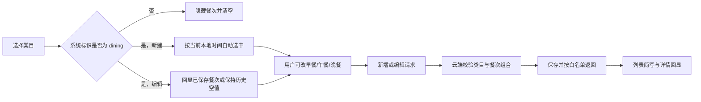

# feat: 为餐饮账目增加早午晚餐选项

## 概述

在记账页选择系统预设的“餐饮”类目后，显示“早餐 / 午餐 / 晚餐”三个选项。新建账目时按设备当前本地时间自动选中一个选项，用户可以在保存前修改或取消，餐次不是必选项。所选餐次随账目保存，并在账目列表与详情中可见；既有账目保持兼容，不做批量补写，也不因编辑而被自动改成错误餐次。

本计划只完成规划，不提前编写功能代码。进入实施前，须先补充并确认中文 PRD，再按本计划逐项交付。

## 问题说明

当前餐饮账目只能记录金额、类目、付款人、日期、备注和凭证。同一天存在多笔餐饮消费时，用户只能靠备注区分是哪一餐，信息不够直观。新增餐次后，用户可以更快识别餐饮账目的生活场景，同时保持记账流程轻量。

本次改动横跨记账页、前后端数据约定、云端保存、列表和详情回显。它不是只加三个按钮：如果只改页面而没有贯通保存与旧数据兼容，用户重新打开账目后会丢失选择，或者旧账目会被错误标记。

## 完成标准

- 只有系统预设类目 `dining` 被选中时，才显示早餐、午餐、晚餐选项；自定义同名类目不触发。
- 新建餐饮账目时，按设备当前本地时间自动选中：00:00–10:59 为早餐，11:00–15:59 为午餐，16:00–23:59 为晚餐。
- 自动选中后，用户可以手动改为另外一个餐次，也可再次点击已选项取消；餐次为空时仍可保存。
- 从餐饮切到其他类目时清空餐次；再次切回餐饮时按当时的本地时间重新自动选中。
- 新增和编辑餐饮账目都能保存并回显餐次；列表显示“餐饮 · 早餐”等简短信息，详情单独显示“餐次”。
- 历史账目没有餐次时仍能正常加载、显示、编辑和保存；编辑旧账目时不得仅因打开页面就自动写入当前餐次。
- 云端只接受 `breakfast`、`lunch`、`dinner` 或空值；非餐饮账目不能保留餐次；旧版本客户端未传餐次时仍可正常记账。
- 统计、筛选、类目管理、凭证、软删除恢复和“问账本”现有行为不受影响。
- 自动检查全部通过，并在微信开发者工具中实际走通新增、切换类目、编辑旧账目和详情回显。

## 需求追踪

- **R1 餐饮限定：** 餐次入口只由系统类目的稳定标识 `dining` 控制，不依赖中文名称或类目编号。
- **R2 自动默认：** 新建餐饮账目按当前本地小时自动选中早餐、午餐或晚餐，用户可修改或取消。
- **R3 状态切换：** 用户主动离开餐饮类目时清空餐次；之后再次主动选择餐饮时重新推断；其他字段变化和编辑页初始化不得覆盖用户手选值或历史空值。
- **R4 保存与校验：** 餐次贯通新增、编辑、云端保存和响应校验，只允许三种固定值或空值。
- **R5 回显：** 餐次在记账编辑页、账目列表和账目详情中一致显示。
- **R6 旧数据兼容：** 没有餐次的历史账目保持为空，不迁移、不猜测、不因编辑自动改写。
- **R7 发布兼容：** 云端先保持对旧客户端兼容，再发布新前端；旧客户端不传餐次时不能报错。
- **R8 流程约束：** 实施前先新增中文 PRD 并由用户确认，之后才进入代码开发。

## 范围边界

- 不增加夜宵、加餐、下午茶等更多选项；三餐之外仍可用备注表达。
- 不按账目日期推断餐次。现有账目只保存日期，时间会归一到中午，无法可靠推断历史餐次。
- 不回填或迁移历史账目；旧数据的餐次保持空值。
- 不新增按餐次筛选、统计图表或首页汇总。
- 不让“问账本”按餐次理解或查询，本轮不扩大模型输入字段。
- 不把餐次加入自定义类目，也不因类目中文名称为“餐饮”而启用。
- 不改变账目权限、家庭共同可见范围、金额规则、付款人规则和软删除规则。

## 背景与调研

### 现有代码与模式

- `cloudfunctions/ledger/preset-categories.js` 和 `cloudfunctions/household/household-domain.js` 已把系统餐饮类目固定为 `key: dining`，可作为唯一判断依据。
- `src/subpackages/ledger/ledger-add/index.vue` 同时承担新增与编辑，草稿和纯函数集中在 `src/subpackages/ledger/ledger-add/ledger-add-view.ts`；餐次推断和选项描述应继续放在纯函数层，页面只负责组合状态。
- `src/subpackages/ledger/ledger-add/components/` 已用于记账页私有组件。餐次选择只服务该页面，应放在这里，不提升到全局组件目录。
- 当前 Wot UI v2.3.2 已提供按钮形态的 `wd-radio-group` / `wd-radio`，可以支持三选一及历史空值，不需要自造基础选择控件。页面仍遵循项目规定的 `<template>`、`<script setup lang="ts">`、`<style lang="scss" scoped>` 顺序。
- `cloudfunctions/ledger/ledger-domain.js` 负责输入校验和记录落库，`cloudfunctions/ledger/repository-data.js` 负责响应白名单；新增字段必须同时经过这两层，不能只在数据库里出现。
- `src/services/ledger-cloud.ts` 对云端响应做严格校验；新增字段必须允许“缺失 / null / 合法三值”，把缺失统一整理为空值后再交给页面，并拒绝未知字符串，才能兼容历史记录与旧部署且保持前端类型真实。
- `src/components/ledger/LedgerEntryItem.vue` 是列表共用展示，`src/subpackages/ledger/ledger-detail/index.vue` 与 `ledger-detail-view.ts` 负责详情；展示文案应由共享纯函数生成，避免列表和详情叫法漂移。
- `tests/unit/ledger-add-view.spec.ts`、`ledger-domain.spec.ts`、`ledger-cloud.spec.ts`、`ledger-home-view.spec.ts`、`ledger-detail-view.spec.ts` 已覆盖对应层，新增行为应沿用这些测试位置。

### 历史经验

- `docs/solutions/` 没有直接命中餐次或账目字段扩展的已验证方案。本次沿用现有账本分层、严格响应校验和真实小程序验证方式。
- 既有账本修复记录表明，自动检查不能替代微信开发者工具与真机路径；计划把自动验证和实际环境验证分开记录。
- 当前工作区已有 4 个与本需求无关的未跟踪文档，实施与提交时必须继续保留并排除在本需求范围外。

### 外部资料判断

本仓库已有直接、成熟的记账表单、云函数、数据白名单、列表与详情模式，Wot UI 依赖中也已确认存在合适组件。本次不涉及新平台能力或外部接口，因此无需额外外部调研。

## 关键决定

- **使用可空的固定三值字段 `mealPeriod`：** 三值便于校验和展示；允许为空是为了兼容旧账目和发布期间仍在使用的旧客户端。
- **按系统类目 `key` 判断，不按名称或编号判断：** 类目编号每个家庭不同，名称也可能被自定义类目复用；`dining` 是现有稳定业务标识。
- **自动选择只发生在新建状态进入餐饮类目时：** 这满足“按当前时间自动选中”，同时避免打开历史账目时把当前时间错误写成历史餐次。
- **推断边界固定为 11 点和 16 点：** 规则简单、可测试、无需依赖账目日期。00:00–10:59 归早餐，11:00–15:59 归午餐，16:00–23:59 归晚餐。
- **离开餐饮即清空：** 避免先选餐饮再改交通后，云端留下无意义餐次；重新进入餐饮时重新按当前时间选中。
- **前端保证新数据完整，云端保持滚动发布兼容：** 新页面对餐饮自动提供有效值；云端仍允许空值，以免旧客户端和历史账目在部署切换期失败。云端对非法值及非餐饮携带餐次的请求明确拒绝。
- **编辑请求区分“没传”和“明确清空”：** 新增请求没传餐次时落为空值；编辑请求没传时保留原值，显式传空值时才清空。这样旧版本客户端编辑新版餐饮账目时不会悄悄丢掉餐次。
- **不做数据库迁移：** 云数据库文档允许新增可选字段，读取层把缺失字段统一视为空值即可。错误回填的风险高于空值的影响。
- **使用 Wot UI 按钮式单选组件：** 满足项目组件规范，也能表达旧账目的未选择状态；不使用会强制选中第一项的分段器，避免历史数据被无意改写。
- **列表轻量展示、详情明确展示：** 列表以“餐饮 · 早餐”方式帮助快速识别，详情增加“餐次”行；没有餐次时不显示占位文案，保持旧账目原样。

## 已解决问题

- **餐次是否自动选择？** 是。用户已确认根据当前时间自动选中，并允许修改。
- **自动选择使用哪个时间？** 使用打开或重新选择餐饮类目时的设备本地当前时间，不使用账目发生日期。
- **旧餐饮账目怎么办？** 保持空值，不迁移、不猜测；进入编辑页时也不自动补写。
- **自定义“餐饮”是否触发？** 不触发，只认系统类目的 `dining` 标识。
- **餐次是否影响统计和问账本？** 本轮不影响，保持现有金额和类目统计口径。

## 延后到实施阶段的问题

- 微信开发者工具对按钮式单选在目标机型宽度下的最终间距，需要在真实预览中微调；不改变三选一行为和字段约定。
- 云函数与小程序具体部署时间由交付阶段决定，但顺序必须是先部署兼容云端，再发布前端。

## 高层数据流

> 以下只说明方案关系，用于评审方向，不是要求照抄的实现代码。

## 实施单元

- [x] **单元 1：补充并确认餐次 PRD**

**目标：** 在写代码前把产品规则、时间边界、旧数据策略和不做范围写入中文 PRD，满足项目的需求先行规则。

**对应需求：** R1-R8。

**依赖：** 无。

**文件：**

- 新建：`docs/prd/017-ledger-meal-period-prd.md`
- 修改：`docs/prd/README.md`

**实施方法：**

- 把本计划中的完成标准、用户流程、三段时间规则、历史兼容和范围边界整理为 PRD 017。
- PRD 初始状态保持“待确认”；用户确认后再改为“已确认”，随后才能进入单元 2。
- PRD 不扩展夜宵、筛选、统计或“问账本”，避免把一次轻量记账优化扩大成餐饮分析功能。

**遵循模式：** 参考 `docs/prd/008-shared-ledger-prd.md` 的字段表、用户流程、边缘场景与真机验证清单；README 沿用现有编号和状态表格式。

**测试场景：**

- 文档完整覆盖 R1-R8，且时间边界没有空档或重叠。
- PRD 明确区分新建账目、已有餐次的编辑账目和没有餐次的历史账目。
- PRD 明确自定义同名类目不触发，统计和“问账本”不在本轮范围。

**完成验证：** PRD 017 与目录索引一致，并取得用户明确确认；未确认前不开始功能代码。

- [ ] **单元 2：贯通餐次数据约定与云端保存**

**目标：** 让餐次从前端请求安全地进入云端记录，并通过响应白名单返回，同时兼容缺少该字段的历史记录和旧客户端。

**对应需求：** R1、R4、R6、R7。

**依赖：** 单元 1 已确认。

**文件：**

- 修改：`src/types/ledger.ts`
- 修改：`src/services/ledger-cloud.ts`
- 修改：`src/store/modules/ledger.ts`
- 修改：`cloudfunctions/ledger/ledger-domain.js`
- 修改：`cloudfunctions/ledger/repository-data.js`
- 修改测试：`tests/unit/ledger-domain.spec.ts`
- 修改测试：`tests/unit/ledger-cloud.spec.ts`
- 修改测试：`tests/unit/ledger-store.spec.ts`

**实施方法：**

- 在账目摘要、详情、新增请求和编辑请求中加入可空餐次字段，三值固定为早餐、午餐、晚餐对应的英文标识。
- 云端先读取目标类目的真实记录，通过 `key: dining` 校验餐次与类目的组合；合法餐次保存，非餐饮携带餐次或未知值时返回现有通用非法请求错误。
- 新增请求未携带餐次时按空值处理，使旧客户端仍可新增餐饮账目；编辑请求未携带餐次时保留原值，只有显式传空值才清空。历史记录字段缺失时，云端响应统一返回空值。
- 编辑餐饮账目时，显式传入新餐次就更新；旧客户端编辑已有餐次但未传字段时保留原值；切换为非餐饮时新版前端必须显式保存为空，云端也要阻止非餐饮残留餐次。
- 响应校验允许缺失、空值或合法三值，拒绝其他内容；服务层把缺失字段整理成空值后再返回严格类型，状态层只透传并替换完整账目，不复制业务判断。

**执行提示：** 先用失败测试锁定数据约定和兼容行为，再修改云端与前端类型。

**遵循模式：** 沿用 `cloudfunctions/ledger/ledger-domain.js` 的输入校验与类目归属检查、`repository-data.js` 的白名单输出、`src/services/ledger-cloud.ts` 的严格响应验证。

**测试场景：**

- 新增系统餐饮账目并传入三种合法餐次时，各自原样保存并返回。
- 旧客户端不传餐次时，餐饮账目仍可新增，响应餐次为空。
- 非餐饮账目传餐次、餐饮账目传未知值时均被拒绝，数据库不写入脏值。
- 编辑已有餐次的餐饮账目可以改成另一个餐次。
- 旧客户端编辑已有餐次但不传该字段时，原餐次保持不变；编辑历史空值账目且不传时继续保持空值。
- 新版客户端把餐饮切换成非餐饮并显式传空值时，旧餐次被清空。
- 云端返回缺失字段、空值、合法值时客户端校验并整理为严格的可空字段，返回未知字符串时校验失败。
- 状态层新增和编辑成功后，内存中的账目包含云端返回的餐次；失败时保持原数据。

**完成验证：** 所有新增、编辑、旧数据和非法组合测试通过，且既有账目接口行为无回归。

- [ ] **单元 3：实现记账页餐次自动选择与编辑回显**

**目标：** 在餐饮类目下提供三餐选择，新建时按当前本地时间自动选中，编辑时准确回显且不误改历史账目。

**对应需求：** R1-R5、R6。

**依赖：** 单元 2。

**文件：**

- 新建：`src/subpackages/ledger/ledger-add/components/MealPeriodPicker.vue`
- 修改：`src/subpackages/ledger/ledger-add/ledger-add-view.ts`
- 修改：`src/subpackages/ledger/ledger-add/index.vue`
- 修改测试：`tests/unit/ledger-add-view.spec.ts`

**实施方法：**

- 页面私有组件使用 Wot UI 按钮式单选组展示“早餐 / 午餐 / 晚餐”，只接收当前值、禁用状态并向上通知变化，不持有保存逻辑。
- 餐次区域紧跟在类目选择下方、付款人之前，只在系统餐饮类目下出现；三个按钮同排并保留明确文字和足够触控区域，不用只有颜色或图标的表达。
- 纯函数层负责餐次选项、显示文案和按小时推断默认值，时间作为参数传入，便于稳定测试 10:59、11:00、15:59、16:00 等边界。
- 页面根据当前类目编号找到类目记录，再通过稳定 `key` 决定是否显示餐次，而不是比较中文名称。
- 新建模式第一次选择餐饮时，如果餐次为空，按当前本地时间填入；用户手选后，改金额、日期、付款人、备注或凭证都不得重新覆盖。
- 离开餐饮时清空；再次进入时重新推断。编辑模式优先回显已有餐次；历史餐饮账目为空时保持未选择，不在页面加载时自动赋值。
- 新建与编辑初始化使用明确的模式和加载完成标记，不能仅靠类目监听猜测。即使编辑详情和类目列表以不同顺序返回，也不得把历史空值误判为用户刚选餐饮；只有用户主动切换类目后再进入餐饮，才重新按当前时间选择。
- 保存新增和编辑请求时都传递餐次；保存期间禁用选项并继续使用现有重复点击保护和错误反馈。

**执行提示：** 先补纯函数和状态转换测试，再接页面与组件，避免把时间判断写进模板或监听器分支。

**遵循模式：** 组件放在记账页自己的 `components/` 下；页面继续使用 Vue 3 Composition API、单一草稿源和派生状态；样式使用品牌变量、SCSS 嵌套和 BEM；SFC 顺序以项目规则为准。

**测试场景：**

- 10:59 推断早餐，11:00 推断午餐，15:59 仍为午餐，16:00 推断晚餐，23:59 仍为晚餐。
- 新建页选择系统餐饮后自动选中当前餐次；选择其他类目时不显示也不保留餐次。
- 用户把自动值从午餐改成晚餐后，修改金额、日期和备注仍保持晚餐；再次点击晚餐后可清空并以无餐次状态保存。
- 餐饮切交通再切回餐饮时，按重新进入时的当前时间产生新默认值。
- 自定义名称为“餐饮”的类目不显示餐次。
- 编辑带有早餐值的账目时回显早餐；编辑历史空值账目时保持未选择，保存其他修改不会偷偷写入当前餐次。
- 分别模拟“详情先返回、类目后返回”和“类目先返回、详情后返回”，历史空值都保持为空；用户主动切走再切回餐饮后才产生默认值。
- 保存中控件不可重复操作；新增和编辑请求携带页面最终值。

**完成验证：** 纯函数测试通过，并在微信开发者工具中确认三选项排版、选中态、手动修改、类目切换和保存禁用状态正常。

- [ ] **单元 4：补齐列表、详情展示与整体验证**

**目标：** 让已保存餐次在用户重新查看账目时可识别，并完成跨层回归验证与真实小程序验收。

**对应需求：** R4-R7。

**依赖：** 单元 2、单元 3。

**文件：**

- 修改：`src/pages/ledger/ledger-home-view.ts`
- 修改：`src/components/ledger/LedgerEntryItem.vue`
- 修改：`src/subpackages/ledger/ledger-detail/ledger-detail-view.ts`
- 修改：`src/subpackages/ledger/ledger-detail/index.vue`
- 修改测试：`tests/unit/ledger-home-view.spec.ts`
- 修改测试：`tests/unit/ledger-detail-view.spec.ts`
- 视现有夹具需要同步修改：`tests/unit/ledger-store.spec.ts`

**实施方法：**

- 让列表使用的类目展示对象保留系统 `key`，再用共享描述函数把三值转为“早餐 / 午餐 / 晚餐”；空值或未知值不输出展示文案。
- 列表仅在系统餐饮账目且餐次存在时，把类目标题显示为“餐饮 · 早餐”等形式；其他类目与历史空值账目保持原样。
- 详情仅在餐次存在时增加“餐次”一行，不为空值显示“未分类”，避免给旧数据制造新含义。
- 不把餐次加入统计请求、类目筛选、已删除区、凭证处理或“问账本”输入；确认这些路径继续按原字段工作。
- 先部署向后兼容的云函数，再验证新版小程序；自动检查、开发者工具验证、双账号共享可见性和云端实际保存结果分别记录。

**遵循模式：** 列表和详情复用描述器，避免重复映射；继续使用现有加载、失败、空状态和导航行为，不为餐次新增独立页面或全局状态。

**测试场景：**

- 三种餐次在列表分别显示正确中文，空值与非餐饮账目不追加餐次。
- 详情对合法值显示“餐次”行，历史空值不显示该行。
- 新增晚餐账目后返回列表可见“餐饮 · 晚餐”，进入详情仍为晚餐，再进入编辑页也回显晚餐。
- A 新增带餐次的账目后，B 能看到相同餐次但不能编辑 A 的账目，原有权限不变。
- 旧餐饮账目、已删除账目恢复、分页列表和统计加载均不因缺失餐次报错。
- 云端先更新、前端仍为旧版本时可以继续记账；前端更新后可以读取旧记录与新记录。

**完成验证：** 账本相关定向测试和项目全量验证均通过；微信开发者工具实际走通新增、手改、切类目、编辑旧账、列表与详情；有条件时用双账号确认共同可见。无法完成真机或云端部署时必须明确标记为“已实现，待实际环境确认”，不能称为完整交付。

## 系统影响

### 数据与兼容

- `ledgerEntries` 文档新增可选字段，不需要迁移或重建集合。
- 历史缺失字段统一视为空，不改变账目金额、排序、统计和权限。
- 发布必须保持前后兼容：新版云端接受旧客户端请求，新版前端接受旧记录响应。
- 删除、恢复、分页和详情都通过同一白名单返回餐次，不能只让新增接口返回。

### 界面与交互

- 新控件只进入账本分包，不增加主包页面或全局组件。
- 页面现有 loading、保存中禁用、错误提示和重复点击保护保持不变。
- 三个选项需要在常见微信小程序宽度内同排可读；真实预览发现拥挤时只调整间距，不改变交互规则。

### 安全与隐私

- 餐次属于家庭共享账目字段，沿用现有“共同可见、仅创建者可编辑删除”权限。
- 云端仍根据当前用户和家庭上下文确认权限与类目归属；前端传来的类目编号和餐次不能直接信任。
- 不把餐次扩展到模型输入或外部服务，本轮不增加新的隐私出口。

## 风险与处理

- **旧账目被误标：** 历史空值不推断、不迁移，编辑页加载时也不自动补写。
- **同名类目误触发：** 只使用系统类目的稳定 `dining` 标识。
- **切换类目留下脏数据：** 离开餐饮时前端清空，云端再次校验类目与餐次组合。
- **部署顺序导致旧客户端失败：** 云端字段可空并先部署，保证旧客户端仍可工作。
- **列表与详情文案不一致：** 三值到中文的映射放在共享描述器，并分别测试两个展示入口。
- **时间边界出现不同解释：** PRD 固定 11:00 和 16:00 两个边界，测试覆盖边界前后一分钟。
- **需求膨胀：** 夜宵、餐次筛选统计和“问账本”均明确排除，后续如需要另开需求。

## 验证安排

### 自动验证

- `tests/unit/ledger-add-view.spec.ts`：时间推断、类目状态转换、自动值不覆盖手选值、历史空值。
- `tests/unit/ledger-domain.spec.ts`：三值保存、非法组合拒绝、旧请求兼容、编辑与清空。
- `tests/unit/ledger-cloud.spec.ts`：响应缺失、空值、合法值与非法值校验。
- `tests/unit/ledger-store.spec.ts`：新增和编辑时餐次透传及成功后的本地替换。
- `tests/unit/ledger-home-view.spec.ts`、`tests/unit/ledger-detail-view.spec.ts`：列表和详情中文展示及空值兼容。
- 项目全量验证入口通过，包含代码检查、格式、样式、类型、单元测试、微信小程序构建和包体积检查。

### 微信开发者工具验证

- 早、午、晚三个时间段分别验证自动默认值；无法等待真实时段时，使用可控测试入口验证纯函数，开发者工具至少实测当前时段。
- 新建餐饮账目后手动切换餐次并保存，列表、详情、编辑页三处一致。
- 餐饮切换为交通后保存，列表和详情不出现餐次；再次切回餐饮能重新自动选择。
- 打开一条历史餐饮账目，确认不凭空出现餐次；只改备注并保存后仍不出现餐次。
- 网络失败或云函数未更新时，页面显示现有错误反馈，保存按钮可恢复，不能出现重复账目。

### 云端与双账号验证

- 检查实际云记录：新餐饮账目保存合法值，非餐饮账目为空，历史账目无需变化。
- A 记录餐次后 B 能看到相同结果；B 仍不能编辑或删除 A 的账目。
- 云端部署和小程序预览均取得真实证据后，才把需求状态标记为完整完成。

## 实施顺序

1. 先完成并确认 PRD 017。
2. 先锁定可空字段和云端兼容规则，再改界面。
3. 完成记账页自动选择、手动修改和编辑回显。
4. 补齐列表与详情展示。
5. 先完成自动验证，再进行微信开发者工具、云端和双账号验证。
6. 只提交本需求文件，通过 PR 合并回 `dev`；不包含工作区中已有的无关未跟踪文档。

## 完成定义

- PRD 已确认，R1-R8 都有对应实现与验证证据。
- 新建餐饮账目能自动选中、手动修改或取消、保存和回显餐次。
- 历史账目、旧客户端和非餐饮账目保持兼容，没有脏数据或错误补写。
- 列表、详情和编辑页显示一致，双账号可见性与原权限保持不变。
- 自动检查全部通过；微信开发者工具与云端验证结果单独记录。
- 功能分支只包含本需求文件，未修改或提交无关工作。
