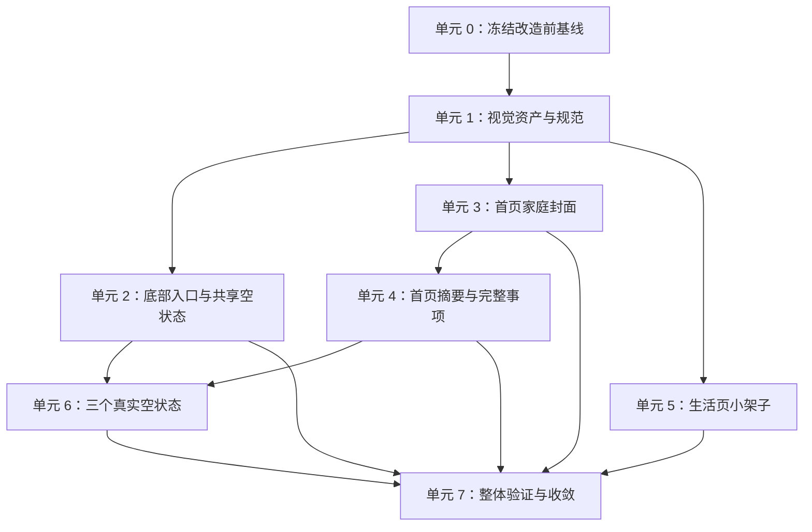

# feat: 建立睦录温馨生活视觉体系首轮样板

> 2026-09-23 实施说明：项目协作规范明确要求底部五个入口继续使用 Wot UI 线稿图标，优先级高于本计划中的自定义图片方案。因此底部入口只整理配置与验证五个名称、图标和跳转，不替换为图片；页面插画、家庭封面、生活小架子和三类空状态按计划落地。当前仍缺微信开发者工具与真机证据，计划保持进行中。

## 概述

在不更换现有主题色、不增加业务功能的前提下，为睦录建立一套可持续扩展的“共同生活物件”视觉语言。首轮改造首页、生活页、底部五个入口，以及事项、账本和足迹已有的空状态。

首页继续完整保留家庭资料、本月收支、最近足迹、全部事项和已完成入口，只把欢迎区与家庭资料合并成更紧凑的家庭封面；生活页从重复卡片网格改为“共同生活小架子”；底部入口使用统一的圆润线稿；三个空状态使用同一画风的小场景。正常账本列表、正常足迹列表、我的页面、填写页和详情页不在首轮整体改造范围内。

本计划只明确实施与验收方式，不提前修改页面。实际开发必须从最新 `dev` 建立独立功能分支，并保留当前工作区中与本需求无关的文件。

## 问题说明

现有页面清楚、功能完整，但白色卡片、通用图标和文字占比很高，缺少能让用户立即联想到“两个人共同生活”的品牌特征。如果只往页面上增加大插画，会挤压首页信息、拖慢首屏并降低列表效率；如果只换一批图标，首页、生活页与空状态又容易成为几套不相干的画风。

本次需要同时解决三个问题：建立一致的视觉规则；保留首页原有信息与操作；让新增素材在真实小尺寸、窄屏、较大字体、图片失败和高密度列表下仍然可用。

## 完成标准

- 首页顺序固定为家庭封面、本月账本摘要、最近足迹摘要、完整事项列表、已完成事项入口，现有信息和点击目标不减少。
- 双成员家庭显示两位真实头像；单成员家庭显示本人真实头像、淡化占位和“等另一位加入”，仅符合现有邀请权限时提供邀请入口，不虚构第二位成员。
- 本月账本继续显示支出和收入；最近足迹继续显示地点数、最近地点、日期和可用照片；事项继续完整展示四个现有分组及其中全部项目。
- 生活页清楚分为页面说明、当前可用工具和即将开放工具；徒步最醒目且整项可点，未开放工具弱化、标明状态并且不可点击。
- 底部五个入口的文字、路径、当前页处理和安全区行为不变，新图标在选中、未选中及真实显示尺寸下都能辨认。
- 事项、账本和足迹空状态采用同一套小场景；筛选后无结果不得伪装成“从未记录”，足迹地图零记录时仍保留地图。
- 加载、失败、空数据、正常数据、图片失败和重复点击保护继续有效，各首页区块失败时互不拖累。
- 页面首次出现与按钮按下反馈克制、一次完成、不改变布局；所有结果都有静态文字或状态表达，不依赖动画才能理解，返回页面不反复播放入场效果。
- 新增运行素材 200 KB 和主包 1.2 MB 是需要优先达成并记录偏差原因的软目标；1.5 MB 是不得突破的硬性检查线。
- 自动检查、微信小程序构建和包体积检查通过；微信开发者工具与真实设备分别完成页面、点击、窄屏和高密度内容检查，并留存结果。

## 需求追踪

- **统一画风（R1-R6）：** 所有新图标、小场景和装饰只使用现有奶油白、薄荷绿、深薄荷绿、蜜桃珊瑚及中性色；共同场景使用“两个略有差异的物件＋共同小勾或两点光芒”，普通操作仍用单个清晰图标。
- **首轮边界（R7-R10）：** 只整体改造首页、生活页和底部入口；账本与足迹只改空状态，并用高密度账目、事项和含照片足迹验证延展性。
- **家庭封面（R11-R13）：** 家庭资料与真实头像是主体，生活物件只作陪衬；单成员不造假；长名称和头像失败有稳定退路。
- **首页信息（R14-R19）：** 保留账本、足迹、全部事项、已完成入口的顺序、数据和点击行为。
- **生活页（R20-R25）：** 使用“共同生活小架子”，徒步是唯一主要入口，减肥记录、骑行记录和追星记录明确不可用，继续保持现有名称、顺序与家庭私密工具属性。
- **空状态与反馈（R26-R30）：** 三个已有空状态使用小场景并服务下一步操作；只加入轻微出现与按压反馈，不扩展到事项详情完成动效。
- **完整状态（R31-R36）：** 保留所有加载、失败、空、正常和防重复状态；兼顾窄屏、较大字体、触控、辅助说明和包体积。

## 范围边界

- 不更换主题色、Logo、产品名称或现有字体体系。
- 不新增或修改账本、事项、足迹、徒步的业务能力、数据约定和权限。
- 不整体重做账本页、足迹页、我的页面、填写页、详情页或历史事项页。
- 不减少首页账本、足迹或事项信息，不截断事项数量，不把摘要退化成单纯入口。
- 不加入公开社区、陌生人内容、排名、打卡或伴侣监督表达。
- 不使用完整房间、大幅户外场景、复杂渐变、强阴影、持续循环动画或大量照片。
- 不为生活页制造不存在的空状态，不在本轮实现事项完成盖章。

## 背景与调研

### 现有页面与组件

- `src/pages/index/index.vue` 已按欢迎区、家庭资料、账本摘要、足迹摘要、事项列表、已完成入口组织内容。新家庭封面应合并前两个区域，避免增加一层大卡片，同时保持后续顺序不变。
- `src/components/home/HomeSummaryCard.vue` 同时被首页和“我的”使用。首页专属封面应放在 `src/pages/index/components/HomeFamilyCover.vue`，不能直接改共享组件而连带改变“我的”。
- 家庭数据已有 1 至 2 位成员、昵称、头像和本人标记，不需要增加云端字段。自定义头像的临时访问地址可以沿用“我的”页面现有处理方式。
- `MonthlyExpenseCard.vue` 已覆盖加载、失败和正常状态；`HomeFootprintCard.vue` 已覆盖加载、失败、空和正常状态；本次只调整外观与文字容纳方式，不改变各自的数据来源。
- `TaskList.vue` 已完整渲染“优先处理、快到期、快没了、待处理”四组及全部事项，没有截断逻辑。事项改造必须继续复用这套完整分组。
- `src/pages/life/life-view.ts` 已固定徒步、减肥记录、骑行记录和追星记录四项，只有徒步可用；入口名称、顺序、说明、目标与不可用判断应继续留在现有逻辑中。
- `src/components/AppTabBar.vue` 使用 Wot UI 底部导航并负责五个固定路径。Wot UI 已提供自定义图标位置，计划只替换图形，不重新实现导航、文字和安全区。

### 素材与体积

- 当前运行素材以 PNG 为主。首轮运行图片统一放入 `src/static/warm-life/`，按底部入口、生活物件、小场景和生活页分类；高分辨率原稿放入 `references/warm-life-originals/`，不进入小程序运行包。
- 首页、生活页和底部入口都在主包内，新素材会直接增加主包体积。素材按实际显示尺寸约两倍导出、裁掉透明空白并压缩，首轮新增运行素材总量目标不超过 200 KB。
- 底部入口必须先制作真实显示尺寸的选中与未选中对照图，再决定是否替换现有图标；验收前保留现有图标作为回退方案。

### 历史经验

- `docs/solutions/workflow-issues/prd-brainstorm-plan-delivery-loop-2026-09-09.md` 要求每个实施单元都明确范围、异常与验收，并把自动检查和开发者工具、真机证据分开记录。
- `docs/solutions/ui-bugs/hiking-live-recording-feedback-2026-09-19.md` 表明组件能力、构建结果和真实小程序表现是三类证据，视觉改造不能只以构建通过作为完成。
- `docs/solutions/best-practices/welcome-page-inline-agreement-2026-09-12.md` 强调装饰不能增加步骤、不可用状态不能只靠颜色表达、共享视觉组件应与业务状态分离，并需要控制包体积。

### 外部资料判断

本次不涉及新平台能力、新依赖或外部接口。现有 Wot UI、uni-app 组件和项目模式足以实施，因此不增加外部依赖，也无需以外部方案替代本项目已有约定。

## 关键决定

- **首页新增私有家庭封面：** 合并现有欢迎区和家庭资料区，避免首屏继续叠加卡片；保留家庭资料的测试标识与编辑入口，不影响“我的”页面共享卡片。
- **家庭封面分开两个点击区域：** 家庭主体进入家庭资料编辑，单成员邀请占位进入成员管理；二者不能互相嵌套，避免误触和小程序事件冲突。
- **邀请入口服从现有权限：** 只有当前用户本来就有邀请资格时，占位区域才可点击；异常的单成员非管理者状态只显示提示，不伪装成可用入口。
- **首页头像本地组合：** 不新增全局状态或云端字段。页面并行获取成员自定义头像临时地址，每个头像独立显示加载或默认图，并用家庭标识与请求序号防止切换家庭后旧结果覆盖新结果。
- **底部导航只换图形：** 继续使用 Wot UI 的布局、文字、安全区和当前页处理，通过图标位置切换自定义图片；不重写导航。
- **共享空状态只负责呈现：** 新建 `WarmEmptyState` 承载小场景、标题、说明和可选操作位置，页面仍负责判断是真空数据、筛选无结果、地图零记录还是失败状态。
- **账本空状态区分两种含义：** 读取付款人、收支类型、指定日期和类目四类现有筛选状态；只有四类筛选都未启用且结果为空时，才使用“小票夹与硬币”场景和记账引导。任一筛选生效后的空结果只替换现有提示外观，继续使用页面原有筛选控件，不新增“一键清除全部筛选”。
- **足迹空状态不删除地图：** 地图模式零记录时保留地图，只在下方增加小场景和引导；列表模式才显示完整空状态卡片。加载中、筛选中或失败时不得闪现全局空状态。
- **事项负责人不造假：** 已认领事项只展示现有事项接口已经提供的昵称和内置头像；自定义头像被现有接口收敛为中性默认头像时按现状展示，本轮不扩大事项数据约定。待认领事项使用明确文字或中性占位，不生成虚构成员头像。
- **动效保持页面局部：** 首页使用一次性样式；生活页因返回时会重新插入正常内容，允许使用页面实例内的单一“已播放”标记，确保同一实例的再次显示、数据刷新或图片晚到不重新触发。底部入口重新打开页面产生的新实例视为一次新进入，可以播放一次，不增加全局动效状态。
- **图标回退分为运行和交付两层：** 本地图标先由构建和开发者工具验证完整；单个图片失败时只让该图回退到现有 Wot 图标，不设计无意义的运行时重试状态机。若主包超过目标或首屏受影响，则删除未采用、重复和过大的素材后重新构建，不能只停止引用却把文件留在运行目录。
- **品牌色保持收敛：** 生活页只使用现有奶油、薄荷、珊瑚和中性色。原有天蓝、淡紫不作为新体系主色继续扩张。

## 已解决问题

- **账本和足迹信息是否保留？** 保留。首页继续显示本月支出、收入、地点数量、最近地点和日期，而不是只留入口。
- **事项是否缩成几条？** 不缩。四个分组和每组全部事项继续显示，只把行样式变得更轻、更温暖。
- **单成员是否放品牌双人图？** 不放。只显示真实本人和“等另一位加入”的淡化位置。
- **生活页哪些工具可点？** 首轮只有徒步可点；减肥记录、骑行记录和追星记录保留现有名称与顺序，显示“即将开放”并不可点击。
- **普通功能图标是否都变成成对物件？** 不会。成对物件只用于共同生活场景，编辑、删除、筛选等操作保持单一清晰图标。
- **账本和足迹是否整体重做？** 不会。首轮只改两者已有空状态，正常内容仅作为压力场景验证。

## 实施阶段仍需用真实页面确认的参数

- 家庭封面的最终最大高度、头像尺寸以及长家庭名的换行位置，以基线记录中的窄屏设备和字体放大级别为准；实施记录必须写下具体窗口尺寸、字体档位、长文本样例和最终行数规则，不能只写“已检查”。
- 五个底部图标的线条粗细、填色面积和透明边距，以真实显示尺寸辨认度为准；不清楚的图形直接替换，不靠放大补救。
- 图片压缩尺寸以最终素材实际清晰度和主包检查结果为准，但不得突破本计划的体积目标。
- 轻微出现和按压反馈的最终时长可在真实设备上小幅调整，但不能改变“一次出现、无循环、不影响布局”的规则。

## 实施依赖

## 实施单元

- [ ] **单元 0：冻结改造前基线**

**目标：** 在任何页面改动前保存可复现的旧界面证据，使“信息没有减少、查找没有变慢、首屏没有变重”可以真实对照，而不是改完后凭印象判断。

**对应需求：** R7-R10、R14-R19、R31-R36 与成功标准中的前后对照要求。

**依赖：** PRD 018 已确认；无代码依赖。

**文件：**

- 新建并在后续持续补充：`docs/verification/warm-life-visual-system-verification.md`

**实施方法：**

- 固定一组可复用数据：单成员家庭、双成员家庭、高密度四组事项、大额与长备注账目、含照片和无照片足迹、三个真实空状态；记录数据条件，不把真实隐私内容写进文档。
- 选择一个常用设备和一个窄屏设备，记录逻辑尺寸、像素密度与字体档位；较大字体使用目标环境可稳定复现的放大档，并保存长家庭名、长昵称、长地点和长事项名称样例。
- 在旧界面保存首页、生活页、五个底部入口和三个空状态截图，记录首屏完整可见字段与页面关键位置。
- 同一位验证者对“查看本月支出、找到最紧急事项、确认负责人和时间、找到并进入已完成事项”各做三次，记录正确结果和用时中位数。
- 在同一真实设备进行五次冷启动，记录首页核心摘要首次可见与家庭区域稳定显示的时间中位数，分别覆盖内置头像和自定义头像条件；无法自动计时则用同一种人工记录方式前后对照并注明误差。

**测试场景：**

- 基线数据能稳定复现，不因临时网络数据变化导致前后不是同一场景。
- 截图注明设备、字体、登录家庭类型、数据量和页面状态。
- 四项查找任务三次结果一致，没有把熟悉度差异混进前后对照。

**完成验证：** 验证文档已有改造前截图、数据条件、设备参数、首屏字段、任务用时和冷启动记录；未完成基线时不得开始页面改造。

- [ ] **单元 1：建立视觉资产基线与品牌规则**

**目标：** 先把整套画风、素材清单、真实显示尺寸和体积预算固定下来，避免页面各自临时找图或边开发边漂移。

**对应需求：** R1-R10、R36。

**依赖：** 单元 0。

**文件：**

- 修改：`docs/brand/visual-standard.md`
- 新建运行素材：`src/static/warm-life/tabbar/`
- 新建运行素材：`src/static/warm-life/objects/`
- 新建运行素材：`src/static/warm-life/scenes/`
- 新建运行素材：`src/static/warm-life/life/`
- 新建原稿：`references/warm-life-originals/`

**实施方法：**

- 在品牌规范中补充线条粗细、圆角倾向、少量色块比例、成对物件印记、手写短句边界、禁止元素和最小显示尺寸。
- 列出首轮唯一允许进入运行包的素材：五个底部入口的选中与未选中图、家庭封面陪衬、账本摘要物件、足迹无图占位、事项类别小图、生活页徒步主场景、三个空状态场景。
- 尽量复用同一个物件，不为相同含义复制多张近似图片。装饰元素与有含义的图标分开命名，页面不能把装饰当作唯一提示。
- 运行图片使用透明 PNG，以实际显示尺寸约两倍导出并裁切透明边缘；高分辨率源文件只留在原稿目录。
- 制作五个底部入口的真实尺寸对照板，检查选中和未选中状态；对“双人含义”不清楚或缩小后粘成一团的图形重新设计。
- 从首页封面、底部入口和至少一个空状态各取一个真实尺寸样例，单独确认用户感受到的是“共同生活”且能认出共同小勾或两点光芒这一固定印记；“好看”与“有睦录辨识度”分开记录。

**遵循模式：** 使用 `src/uni.scss` 的现有品牌变量与 `docs/brand/visual-standard.md` 的现有结构；运行素材沿用当前 PNG 方式，不引入新的图片格式或图标依赖。

**测试场景：**

- 五个入口在未读文字前也不互相混淆，结合文字后能快速确认含义。
- 成对物件在小尺寸下仍能看出“两个略有不同的物件”和共同印记，不会像一个复杂图标。
- 小场景去掉颜色后仍能靠轮廓区分，不能只靠绿色或珊瑚色表达含义。
- 素材在奶油背景和白色卡片上都有足够边界，没有大面积透明空白。
- 新增运行素材优先控制在 200 KB 内；若仍超出，先复用、裁切和压缩，并在验证文档记录原因与影响。1.5 MB 主包硬线不可突破。

**完成验证：** 品牌规则、素材清单、尺寸对照板和体积清单完成；底部入口与三个空状态的小尺寸图得到用户视觉确认后，再进入后续页面替换。

- [ ] **单元 2：替换底部入口并建立共享空状态基础**

**目标：** 在不改变导航行为的前提下使用统一的五个新图标，并提供一个可在三个页面复用、但不承载业务判断的空状态组件。

**对应需求：** R4-R7、R26-R28、R31-R36。

**依赖：** 单元 1。

**文件：**

- 修改：`src/components/AppTabBar.vue`
- 新建：`src/components/WarmEmptyState.vue`
- 新建测试：`tests/unit/app-tabbar.spec.ts`
- 新建测试：`tests/unit/warm-empty-state.spec.ts`

**实施方法：**

- 保留 Wot UI 底部导航、五个文字标签、现有页面路径、安全区和当前页不可重复跳转逻辑，只通过图标位置根据选中状态切换对应图片。
- 构建前检查十张固定本地图标都存在且可打包；运行时单张图片加载异常时，只让该位置回退到现有 Wot 图标，不能影响其他入口。不为固定本地资源增加选中态重试状态机。样式区域保留必要内容，避免小程序样式引用异常。
- `WarmEmptyState` 只接收场景图片、标题、说明、图片说明和可选操作区域，不读取页面状态、不决定跳转，也不把装饰图片暴露成无意义的朗读内容。
- 组件内部优先组合 Wot UI 空状态能力，标题、说明和按钮仍是可读文本；图片只是辅助，不替代操作文案。
- 新增样式按 BEM 和 SCSS 嵌套组织，复用品牌间距、圆角和颜色变量；按压反馈不扩大实际跳转范围。
- 底部入口和空状态操作继续使用有明确名称的可操作控件；新增点击区域至少保持 88rpx × 88rpx 的可触范围，装饰图片不单独接收点击。

**测试场景：**

- 首页、账本、足迹、生活、我的五项路径、文字和排列不变。
- 每个入口分别在选中与未选中时加载正确图片；点击当前页不重复跳转，点击其他项仍走原路径。
- 任意一张本地图缺失会在素材检查或构建验收中被发现；模拟单图失败时只有该位置显示旧 Wot 图标，其他入口、文字和导航不受影响。
- 空状态组件可以只显示文字、显示场景图、带主要操作或不带操作；缺少图片时布局不塌陷。
- 较大字体下底部文字和空状态说明可读，主要操作不被图片遮挡。

**完成验证：** 组件测试通过；先在微信开发者工具逐页打开五个主页面，确认选中态、未选中态、当前页不跳转、其他页跳转、安全区和图片失败回退。任一关键项不通过就临时恢复现有图标保证可用，单元 2 保持未完成；修正新图标并重新通过阻断验收后，才能进入最终交付状态。

- [ ] **单元 3：实现首页家庭封面与成员头像状态**

**目标：** 用紧凑的家庭封面替代分离的欢迎区和家庭卡片，让真实家庭资料成为首页视觉锚点，同时正确处理一人、两人、权限和头像失败。

**对应需求：** R3-R6、R11-R14、R19、R31-R36。

**依赖：** 单元 1。

**文件：**

- 新建：`src/pages/index/components/HomeFamilyCover.vue`
- 修改：`src/pages/index/index.vue`
- 修改：`src/pages/index/home-view.ts`
- 修改测试：`tests/unit/home-view.spec.ts`
- 新建测试：`tests/unit/home-family-cover.spec.ts`
- 修改端到端检查：`tests/e2e/home-single-member.spec.js`

**实施方法：**

- 家庭封面显示家庭名、简短共同生活标签、最多两位真实成员头像和少量双杯或共同钥匙陪衬，控制高度，不在顶部再保留独立欢迎大区。
- 保留现有家庭资料测试标识与进入家庭资料编辑的行为。家庭主体和邀请占位使用并列的独立点击区域，不能把一个可点击区域嵌套在另一个区域内。
- 家庭资料是首页其余家庭数据的前置条件：首次加载继续使用统一首页加载；家庭资料加载失败时保持现有整页错误和重试，不渲染可能属于错误家庭的账本、足迹或事项。家庭成功后，账本、足迹和事项的局部失败再各自隔离。
- 双成员按真实成员数据展示；单成员显示当前成员与淡化位置。“等另一位加入”只在有邀请资格时成为入口，否则作为不可点击说明。
- 沿用现有默认头像规则；自定义头像按成员并行取得临时地址，每个头像独立加载，单个失败只回退该头像，不阻塞家庭封面、账本、足迹和事项。
- 家庭或成员集合变化时，先清空旧头像地址并为各头像建立独立加载状态，再发起新请求；每次请求记录当前家庭标识与请求序号，家庭切换、页面销毁或新请求开始后，旧请求的迟到结果不得覆盖当前成员。
- 家庭名、昵称较长时允许换行或缩略辅助文案，头像和邀请入口不能被挤出；装饰图不承担“是否已加入”的唯一含义。
- 家庭主体与邀请入口都提供清楚的控件名称和状态说明，至少保持 88rpx × 88rpx 的可触范围；不可邀请时不保留伪按钮语义。

**执行提示：** 先补一人、两人、权限与迟到请求的测试，再接组件模板，避免仅用理想数据检查封面。

**遵循模式：** 参考 `src/pages/profile/index.vue` 和 `src/services/avatar-media.ts` 的自定义头像处理；首页私有组件放在页面目录，不提升为全局组件；继续使用现有家庭编辑和成员管理路径。

**测试场景：**

- 单成员管理者显示本人真实头像、淡化占位、“等另一位加入”和可用邀请入口，不出现虚构昵称或头像。
- 单成员非管理者异常状态显示占位说明但不可点击，不误导其具备邀请权限。
- 双成员显示两位真实成员，且不再显示邀请占位。
- 内置头像、自定义头像、自定义头像加载中与失败回退都正常；一个头像失败不影响另一个。
- 已显示旧家庭头像后切换家庭时，旧图立即清除；新请求期间显示当前成员的加载或默认状态，旧请求晚返回也不能串头像。
- 家庭名和昵称较长、窄屏及较大字体下，主要信息、头像和入口没有重叠。
- 点击家庭主体进入家庭资料编辑；点击可用邀请占位进入成员管理；点击装饰区域不会触发错误入口。
- 家庭资料首次加载显示“正在加载首页”；加载失败只显示整页错误与重试，重试成功后再按当前家庭加载三个业务区块，不短暂显示旧家庭数据。

**完成验证：** 单元测试与单成员端到端检查通过；微信开发者工具分别预览一人、两人、头像失败和长名称四种状态。

- [ ] **单元 4：重做首页摘要与完整事项列表外观**

**目标：** 让账本、足迹和事项与新家庭封面属于同一套视觉，同时保持原有摘要数据、完整列表密度和各区块独立状态。

**对应需求：** R3-R7、R14-R19、R28-R36。

**依赖：** 单元 3。单元 3 与本单元都会修改首页装配与测试，必须顺序实施，避免合并时丢失家庭封面、摘要顺序或事项状态分支。

**文件：**

- 修改：`src/components/home/MonthlyExpenseCard.vue`
- 修改：`src/components/home/HomeFootprintCard.vue`
- 修改：`src/components/task/TaskSummaryCard.vue`
- 新建：首页事项视觉映射 `src/components/task/task-summary-visual.ts`
- 修改：`src/pages/index/index.vue`
- 修改测试：`tests/unit/home-view.spec.ts`
- 新建测试：`tests/unit/home-layout.spec.ts`
- 新建测试：`tests/unit/task-summary-card.spec.ts`

**实施方法：**

- 账本摘要用轻量生活物件强化“共同账本”，但支出和收入金额仍是最醒目的两项数据；保留加载、失败、重试和进入账本的现有行为。
- 足迹摘要继续显示地点数、最近地点和日期。有照片时保持照片主体；没有照片或加载失败时使用统一的品牌占位，不能隐藏入口或把图片区错误显示成加载中。
- 放宽地点文本的一行截断，允许在限定区域内换行；长地点、日期和图片区不能互相覆盖。
- 事项继续由 `TaskList` 输出全部四组与全部项目。事项行减少厚重卡片感，左侧使用轻量生活物件图，名称为主信息，时间、状态和负责人为辅助信息。
- 已认领事项显示现有接口提供的负责人昵称与内置头像；自定义头像按现有中性默认头像处理，不把默认图误称为真实自定义头像。待认领使用明确文字或中性标记，不用虚构人物。
- 类别物件映射放在首页事项展示组件旁的独立视觉映射中，不修改填写页、详情页和事件展示共同使用的业务配置，避免首轮视觉改造越界影响范围外页面。
- 首页各区块继续独立加载和失败。事项失败时家庭、账本与足迹仍可用；足迹照片失败只替换照片，不把整个足迹摘要变成失败。
- 在首页内容容器挂载时应用一次轻微出现；各可点击卡片与事项行使用统一按压反馈，不改变点击目标、等待时间和重复点击保护。

**测试场景：**

- 首页渲染顺序严格为家庭封面、账本、足迹、四组事项、已完成入口。
- 大额支出与收入、小数金额、零金额都完整可读，装饰不遮挡正负信息。
- 足迹有照片、无照片、照片失败、长地点和无最近地点时均有明确结果与可用入口。
- 事项数据为未定义、加载失败、完全为空、高密度、多行长名称、已认领和待认领时布局与含义正确。
- 四个事项分组中的全部项目都被渲染，没有视觉改造带来的隐藏、截取或“查看更多”。
- 高密度事项下仍能识别并进入列表末尾的已完成事项入口；入口不会被最后一组事项视觉吞没。
- 同一首页实例从详情返回、数据刷新或图片晚到时不重复播放整页入场动画；通过底部入口重新创建的新首页实例可以播放一次。按压反馈不会在失败或不可用状态上制造成功感。

**完成验证：** 相关测试通过；使用同一组高密度事项数据对比改造前后，查找最紧急事项、负责人和时间没有明显变慢，首页首屏仍能看到核心摘要。

- [ ] **单元 5：把生活页改为“共同生活小架子”**

**目标：** 建立有层级、有生活气息的私密工具入口，让徒步成为唯一明确的当前工具，未开放项目不被误认为可用。

**对应需求：** R1-R7、R20-R25、R28、R31-R36。

**依赖：** 单元 1。

**文件：**

- 修改：`src/pages/life/index.vue`
- 修改：`src/pages/life/life-view.ts`
- 修改测试：`tests/unit/life-view.spec.ts`

**实施方法：**

- 页面分为简短说明、当前可用工具和即将开放工具三个区段，用架板与小标签建立整体关系，不再使用四张等权重复卡片。
- 徒步入口使用成对徒步鞋、路线或照片等主场景，整项可点，并保留当前真实跳转目标与家庭状态检查。
- 减肥记录、骑行记录和追星记录按现有顺序放在下方较轻的架板上，保留现有名称与说明并明确显示“即将开放”；不绑定跳转，不提供按压反馈，不能只靠低饱和颜色表达不可用。
- 保留页面原有登录、家庭加载、失败与重试流程。没有有效家庭时继续走现有处理，不用装饰场景掩盖业务错误。
- 页面只使用奶油、薄荷、珊瑚和中性色；手写感只用于短标签，标题、状态和操作文字保持正常字体。
- 页面实例内保留一个“已播放入场”的局部标记：首次正常内容出现时播放并立即记住；后续 `onShow` 即使加载分支让内容重新插入，也不再添加动画。徒步入口保留统一按压反馈，未开放工具保持静态。
- 徒步整项提供清楚的控件名称并保持至少 88rpx 的可触高度；三项未开放工具保留状态文字，但不提供可操作控件语义。

**测试场景：**

- 页面三个层级按顺序出现，徒步视觉最醒目，其他三项明显属于“即将开放”。
- 徒步整项点击进入现有路径；三项未开放工具点击后不跳转、不出现按压成功感。
- 加载、家庭失败、重试和正常状态仍按原逻辑工作。
- 窄屏、较大字体和长说明下，主场景与三项名称不重叠。
- 同一生活页实例从徒步返回时不反复播放入场动画，滚动位置和入口状态没有异常；底部入口重新创建的新实例允许播放一次。
- 模拟同一页面实例第二次执行显示与加载流程，入场标记仍为已播放，正常内容重新出现但不再次动画。

**完成验证：** 生活页逻辑测试通过；微信开发者工具完成可用、不可用、加载、失败和返回五种操作检查，并确认未出现公开动态或监督式表达。

- [ ] **单元 6：接入事项、账本和足迹三个真实空状态**

**目标：** 将三套小场景接入真实业务分支，引导下一步操作，同时避免把筛选无结果、加载中或地图模式误判为全局空白。

**对应需求：** R7-R10、R26-R28、R31-R36。

**依赖：** 单元 2、单元 4。首页空状态接入必须在家庭封面、摘要和完整事项装配稳定后进行，避免同时修改首页模板与测试。

**文件：**

- 修改：`src/pages/index/index.vue`
- 修改：`src/pages/ledger/index.vue`
- 修改：`src/pages/footprint/index.vue`
- 修改测试：`tests/unit/footprint-empty-map.spec.ts`
- 新建测试：`tests/unit/ledger-empty-state.spec.ts`
- 新建测试：`tests/unit/home-empty-state.spec.ts`

**实施方法：**

- 首页事项真正为空时，使用“便签板与笔”小场景，保留当前添加事项引导；事项加载失败继续显示失败与重试，不用空状态覆盖错误。
- 为账本形成统一的显示判断，读取付款人、收支类型、指定日期和类目四类现有筛选状态。只有四类都未启用且查询结果为空时，才显示“小票夹与硬币”场景和记账入口；任一筛选单独或组合启用后的空结果只显示“没有符合条件的账目”，继续通过页面原有筛选控件调整条件，不新增清除按钮或筛选流程。
- 足迹列表模式在真实零记录时显示“相片与双脚印”完整空状态；地图模式必须保留地图，只在下方增加紧凑场景和记录引导。
- 足迹加载中、失败、按地点筛选后无结果以及地图数据暂未完成时，不得短暂闪现全局空状态。
- 三个页面向共享组件提供各自文案和操作，组件不直接导航。调用方复用各页面现有新增入口，并统一使用现有导航锁或同等的短时防重复规则；共享组件本身不持有全局导航状态。
- 场景图片设为辅助装饰，标题、说明和按钮承担完整含义；图片缺失时用户仍能理解并完成下一步。

**测试场景：**

- 首页事项为空显示对应场景，加载失败显示重试，已有任一事项时不显示空状态。
- 账本从未记录时显示记账引导；付款人、收支类型、指定日期、类目任一筛选单独启用或组合启用后无结果，都显示筛选无结果而不是“还没有账目”；用户通过原有筛选控件调整条件后恢复真实结果或真空状态。
- 足迹地图零记录时地图仍存在，且下方有紧凑引导；列表零记录时显示完整空状态。
- 足迹有数据但地点筛选无结果时不显示全局零记录场景；加载和失败过程中不闪烁空状态。
- 三个页面的主按钮仍进入原添加流程；连续触发两次时，只观察到一次导航或一次新增动作。

**完成验证：** 三套状态测试通过；微信开发者工具分别截图事项空、账本真空、账本筛选空、足迹地图空和足迹列表空，并逐项点击主要操作。

- [ ] **单元 7：完成整体验证、压力检查与交付记录**

**目标：** 用真实数据和真实小程序环境确认温馨感没有换来信息损失、误触、包体积上涨或状态回归，并把自动结果与人工结果分别记录。

**对应需求：** R1-R36 与全部成功标准。

**依赖：** 单元 2-6 全部完成。

**文件：**

- 修改过时检查：`tests/e2e/footprint-flow.spec.js`
- 新建：`docs/verification/warm-life-visual-system-verification.md`

**实施方法：**

- 更新已有端到端检查中与当前五个底部入口不一致的旧断言；单成员检查改为验证真实本人、邀请占位和无虚构成员，而不是禁止出现“另一位”文案。
- 单成员端到端检查只绑定一个明确标记为单成员的测试账号或家庭；双成员使用第二个可重复账号或单独人工证据，不让同一脚本在未切换数据时同时断言两种互斥家庭状态。验证记录只记测试条件，不写真实账号和隐私数据。
- 运行项目完整验证入口，覆盖格式、样式、类型、单元测试、微信小程序构建和包体积；任何跳过、超时或未执行都不能记为通过。端到端检查不包含在该入口中，必须作为独立证据执行和记录。
- 在微信开发者工具使用同一窗口宽度和同一组数据，记录首页、生活页、三个空状态、五个底部入口选中态的截图；记录设备或模拟器尺寸，便于前后对照。
- 使用高密度事项、高密度账目和含照片足迹进行压力检查。账目与足迹正常页面只检查新视觉是否造成冲突，不借机扩大整体改造。
- 分别检查单成员与双成员、内置与自定义头像、头像失败；账本加载/失败/空/大额；足迹加载/失败/零记录/无图/有图/图片失败；事项空/失败/密集/已认领/待认领；生活可用/不可用；五个入口的两种状态。
- 用窄屏与较大系统字体完成一轮复查，确认金额、地点、事项、成员和按钮没有遮挡；再在真实设备检查按压反馈、滚动、返回和动画是否自然。
- 复用单元 0 的同一数据、设备、字体档和验证者：四项查找任务各做三次，结果必须全部正确，改造后用时中位数相对基线不得增加超过 15%；超过时先调整信息层级，不能用“更好看”抵消效率退化。
- 首屏必须完整显示家庭身份、本月支出和本月收入；最近足迹摘要的关键数据不得比基线需要更多一次常规滑动才能看到。家庭封面占屏明显增加或任一关键字段后移时，必须记录并调整。
- 在同一真实设备再做五次冷启动，对比首页核心摘要首次可见与家庭区域稳定时间中位数；任一指标相对基线退化超过 15% 时，优先减少、延后或压缩装饰图片和头像加载影响。
- 记录改造前后新增运行素材大小、主包大小以及是否达到 1.2 MB 目标；如超过目标或出现明显首屏负担，删除运行目录中未采用、重复和过大的素材后重新构建，不能只停止页面引用。
- 验证文档分别标记“自动检查”“开发者工具”“真实设备”和“用户视觉确认”。缺少任何真实环境证据时，只能标记为待确认，不能宣称完整交付。

**测试场景：**

- 用户能在首页快速完成查看本月支出、找到最紧急事项、确认负责人和时间三个任务，速度和正确性不明显低于改造前。
- 高密度事项下能找到并进入已完成事项；四项任务全部正确，三次用时中位数相对基线增幅不超过 15%。
- 家庭、账本、足迹、事项任一区块失败时，其余已成功区块仍然可读可点。
- 反复进入首页、生活页、详情页并返回，入场效果不重复干扰，按压效果不导致布局跳动。
- 五个底部入口逐一选中、逐一跳转，文字、图标、路径和当前页处理都正确。
- 在真实设备上连续滚动高密度事项，图片和动效没有明显卡顿；首页首屏可见信息没有被装饰大幅挤压。
- 五次冷启动的首页核心摘要首次可见与家庭区域稳定时间中位数，相对基线增幅均不超过 15%。
- 删除或模拟任一新图片失败，仍有文字、默认图或现有图标可理解和操作。

**完成验证：** `npm run verify:mp-weixin` 全部通过；端到端检查另行执行并记录，因开发者工具会话缺失而跳过时标记为待验证，不计入通过；开发者工具和真实设备清单完成；验证文档包含前后截图、任务用时、冷启动对照、包体积、已知限制和用户最终视觉确认。只有各类证据都齐全，才把首轮样板标记为完成。

## 系统影响

### 页面与导航

- 首页视觉结构变化较大，但数据加载、入口路径和区块顺序不变。
- 生活页改变内容布局，不改变工具列表和徒步目标。
- 底部导航继续由现有全局组件统一管理，不新增原生底部配置或第二套导航。

### 数据与状态

- 不新增云端字段、数据库集合、权限或全局状态。
- 首页新增的成员头像临时地址只在页面生命周期内存在，不写回家庭数据。
- 家庭或成员变化时先清空旧头像映射，新请求、失败和卸载都只影响页面本地状态，不把上一个家庭的图片短暂带到当前页面。
- 空状态判断继续由各业务页面负责，避免共享组件误读筛选、加载或错误状态。

### 包体积与性能

- 所有首轮页面位于主包，新运行图片直接影响首屏与主包大小，必须以清单和预算控制。
- 头像并行请求不能阻塞其他首页区块；图片失败应局部回退，不触发整页重载。
- 动效只使用轻量样式变化，不加入循环、粒子、视频或额外运行依赖。

### 可访问性与可理解性

- 状态与可点击性不得只用颜色或动画表达；所有主要含义都有正常文字。
- 装饰图片隐藏无意义朗读，业务图片提供简短说明或由旁边文字完整表达。
- 较大字体下允许辅助信息换行，主要金额、状态和按钮优先保留。
- 家庭主体、邀请占位、徒步入口和空状态主要操作至少保留 88rpx × 88rpx 的可触范围，并提供可理解的控件名称；不可用项目不保留伪按钮语义。

## 风险与处理

- **温馨装饰挤压首页信息：** 家庭封面合并欢迎区，限制封面高度；列表只用小图标，不加大图片；用同一数据做改造前后首屏对照。
- **两人意象被误认为真实成员：** 家庭封面只用真实头像；成对物件作为陪衬，不使用虚构人物或头像。
- **单成员邀请权限误导：** 邀请占位是否可点由现有权限决定，不可用时保留静态说明。
- **头像异步串位：** 以家庭标识和请求序号丢弃过期结果，每个头像独立回退。
- **头像短暂显示旧家庭：** 家庭或成员集合变化时先清空旧地址并进入逐头像加载状态，不能等新请求完成后才替换。
- **空状态含义错误：** 页面明确区分真空、筛选空、加载、失败和地图零记录，共享组件不做业务判断。
- **底部新图标难辨认：** 先做真实尺寸对照，保留文字和现有图标回退；验收前不删除旧方案。
- **素材导致主包变大或首屏变慢：** 运行素材限制数量与 200 KB 目标，裁切透明区、压缩并复用；超出目标时从运行目录删除未采用和重复文件后重新构建，运行时回退不能替代包体回退。
- **新动效造成重复或卡顿：** 只在挂载时出现一次，按压只用短时样式；真实设备发现干扰时优先减弱或移除。
- **前后对照无法复现：** 页面改动前先冻结数据、设备、字体、截图、任务用时和冷启动基线，最终只用同一条件验收。
- **共享组件连带改变范围外页面：** 首页家庭封面使用页面私有组件；共享空状态只在三个明确页面主动接入，不全站自动替换。
- **工作区与分支污染：** 实施从最新 `dev` 的独立功能分支开始，只纳入本需求文件，保留当前已有无关文档，不直接在 `master` 或 `dev` 开发与推送。

## 验证矩阵

| 区域 | 必查状态 | 核心判断 |
| --- | --- | --- |
| 家庭封面 | 加载、整页失败与重试、一人、两人、内置头像、自定义头像、头像失败、长名称 | 不造假、不串头像、入口正确、失败不显示旧家庭、首屏不过高 |
| 账本摘要 | 加载、失败、正常、零金额、大额 | 支出收入完整，失败只影响本区块 |
| 足迹摘要 | 加载、失败、零记录、无照片、有照片、图片失败、长地点 | 数量地点日期保留，图片局部回退 |
| 事项 | 未定义、失败、空、密集、长名称、已认领、待认领 | 四组与全部项目保留，负责人不造假 |
| 生活页 | 加载、失败、徒步可用、三项不可用、返回 | 层级清楚，不可用项目不误导 |
| 底部入口 | 五项各自选中与未选中、图片失败、当前页点击 | 可辨认、路径不变、有回退 |
| 空状态 | 事项真空、账本真空、账本筛选空、足迹地图空、足迹列表空 | 不误判，地图不消失，下一步明确 |
| 通用体验 | 基线设备、窄屏、较大字体、重复点击、图片失败、页面返回、冷启动 | 不遮挡、不重复操作、不依赖动画，任务与启动退化不超过约定范围 |

## 验证安排

### 自动验证

- 先运行本计划新增和修改的定向测试，确保一人/两人、入口路径、真空/筛选空、地图保留和完整事项列表等关键规则有明确保护。
- 再运行 `npm run verify:mp-weixin`，由项目入口统一完成代码、格式、样式、类型、单元测试、微信小程序构建和包体积检查。
- 端到端检查单独执行并记录；它不属于 `verify:mp-weixin`。缺少开发者工具连接导致跳过时，必须写为“待实际环境验证”，不能并入自动通过。
- 对新增运行素材单独记录文件数和总大小，并与改造前主包体积对比。

### 测试可观察边界

- 家庭成员组合、头像请求版本判断、账本筛选激活和底部入口素材选择放在可直接测试的视图逻辑中，使用明确输入与期望输出验证状态分支。
- 组件的条件显示、独立点击区域和事件绑定沿用项目现有的小程序模板编译检查，不用只搜索源码文字来替代行为验证。
- 线条、尺寸、颜色、动效感受和真实图片加载失败属于开发者工具与真机验收，自动测试不伪装成视觉通过。

### 微信开发者工具验证

- 打开首页、生活页、账本空状态、足迹地图空状态和足迹列表空状态，逐个检查加载、失败、空和正常状态。
- 点击家庭主体、邀请占位、账本摘要、足迹摘要、每个事项、已完成入口、徒步和五个底部入口，确认仍到达原目标。
- 在固定窗口尺寸下保存首页、生活页、三个空状态和五个底部入口选中态截图，记录模拟器尺寸与数据条件。
- 使用单元 0 记录的窄屏逻辑宽度、字体档位和长文本样例复测；家庭名、地点和事项名按页面规则换行，辅助信息可下移，底栏文字不得截掉主要含义。
- 使用开发者工具可用的辅助访问检查确认家庭主体、邀请占位、徒步入口和空状态按钮拥有清楚名称；装饰图不会成为多余朗读项。

### 真实设备与用户确认

- 在至少一种常见窄屏设备和较大系统字体下检查换行、触控和滚动。
- 检查入场和按压反馈是否自然、是否反复播放、是否造成页面跳动或明显掉帧。
- 用高密度事项、账目和含照片足迹完成可读性压力检查。
- 用户分别确认“整体好看”和“能让人想到睦录的共同生活”两项结果，并确认首页信息完整性、列表查找效率和真实设备表现。未通过时先调整样板；最终决定放弃时回退页面与底栏改动，保留已确认的品牌规则、原稿和验证记录供后续使用，不让两套页面视觉长期并存。

## 实施顺序

1. 先冻结旧界面的数据、截图、任务用时、设备参数和冷启动基线。
2. 完成视觉规则、首轮素材清单、真实尺寸对照和体积预算。
3. 建立底部入口与共享空状态基础，并先完成五个主页面的底栏阻断验收。
4. 先完成首页家庭封面，再在同一首页装配上调整摘要与完整事项；生活页可独立实施。
5. 首页装配稳定后接入三个真实空状态，并处理四类筛选空与地图零记录等分支，但不新增筛选操作。
6. 完成定向检查、项目全量验证、开发者工具、真实设备和用户视觉确认。
7. 首轮通过后单独确认下一阶段覆盖顺序与范围；未通过则继续调整或回退页面改动，在出口决定完成前不把两套视觉长期并存视为正式完成。

## 完成定义

- PRD 018 的 R1-R36 都有对应实现与验证证据，没有以视觉优化为理由删减首页信息或改变业务流程。
- 首页、生活页、底部入口与三个空状态使用同一套可辨认、可复用的睦录生活物件语言。
- 单成员不虚构第二位成员，双成员使用真实头像，头像失败和异步切换均有稳定退路。
- 账本、足迹和全部事项在首页继续完整可见，生活页只有徒步可用，三个空状态含义准确。
- 自动检查和微信小程序构建全部通过；主包不超过 1.5 MB 硬线，200 KB 新素材与 1.2 MB 主包软目标的结果和任何偏差原因均已记录。
- 开发者工具和真实设备完成状态、点击、窄屏、较大字体、高密度数据与动效检查。
- 用户明确确认首轮页面气质正确、具有睦录共同生活辨识度、信息没有减少，四项查找与冷启动均在约定退化范围内，才结束本阶段。
