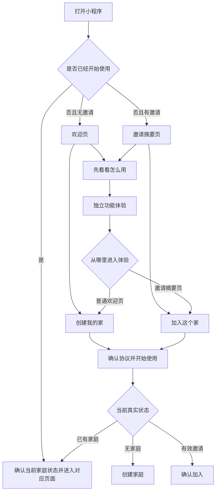

# PRD 001：首次了解、功能体验与开始使用

## 问题与目标

当前版本把登录页作为新用户打开小程序后的第一屏。用户还没有看见事项、账本或足迹的实际价值，就必须先勾选协议并点击“微信快捷登录”，容易被理解为强制登录，也已因此未通过微信版本审核。

本次修订要把首次使用改成“先了解，再创建”：新用户先在欢迎页理解产品，可以自愿进入独立的功能体验；只有决定创建自己的家庭或加入邀请家庭时，才确认协议并开始使用。功能体验不能伪装成用户已经拥有一个家庭，也不能让用户产生“为什么还要再创建一次家庭”的疑问。

本 PRD 替换原 PRD 001 中“首次打开只显示登录页”“微信快捷登录”和“不包含体验模式”的规则。原有的身份安全、邀请保留、失败重试和已使用用户自动恢复规则继续有效。

## 用户流程

## 产品要求

### 欢迎页与开始入口

- R1. 第一次打开、尚未开始使用且没有邀请的用户进入独立欢迎页，不直接进入登录页、家庭首页或账本页。
- R2. 欢迎页说明产品用于两个人共同记录事项、账目和足迹；页面不展示虚构的家庭名称、成员头像或已属于用户的数据。
- R3. 欢迎页提供两个明确入口：主按钮"开始使用"和次按钮"先看看怎么用"。两个入口都可以直接选择，体验不是开始使用的必经步骤。主按钮文案不暗示"创建"或"加入"，由云端按真实状态决定路由。
- R4. 欢迎页不使用"登录""微信快捷登录""授权后体验"等表达，也不在用户选择前申请手机号、头像或昵称。
- R5. 用户勾选协议后点击"开始使用"，云端按真实状态返回：已有家庭 → 家庭首页，无家庭 → 创建家庭，有有效邀请 → 加入确认。协议未勾选时主按钮不可点；用户取消（关闭协议页 / 离开）时留在欢迎页，不创建身份或家庭。（2026-09-11 调整：协议确认内联到欢迎页，删除独立开始使用页）

### 独立功能体验

- R6. “先看看怎么用”进入一张独立的一页式体验页，不进入任何正式家庭页面，也不复用会让用户误以为已经拥有家庭的正式首页结构。
- R7. 体验页顶部始终显示“功能体验 · 示例数据不会保存”，在页面滚动、完成操作和出现结果后仍保持清楚可见。
- R8. 体验页按“共同事项、家庭账本、共同足迹”的顺序展示三个简短场景，让用户理解产品的完整用途，但不设置虚构家庭名称或成员身份。
- R9. 共同事项场景允许用户点击一次“认领”，示例事项随即显示“由我处理”；用户可恢复示例状态并重新体验。
- R10. 家庭账本场景允许用户输入金额、选择支出或收入、选择一个预设分类并提交；金额规则与正式记账保持一致，空白、零金额、负数或超出范围时给出明确提示且不改变统计。合法提交后立即更新体验页中的收支金额和分类统计。
- R11. 体验记账只保留当前体验过程中的临时结果。用户离开体验页、关闭小程序或重新进入体验时，临时结果全部清空，不自动带入正式家庭。
- R12. 共同足迹场景允许用户点击固定示例地点，展开游玩日期、示例图片和简短回忆；示例素材必须由项目提供，不能使用真实用户资料。
- R13. 体验页不调用“问账本”、上传图片、选择位置、发送邀请或其他依赖真实家庭和云端数据的能力。
- R14. 体验页底部提供开始入口和返回上一入口。普通进入时显示"返回欢迎页"；邀请进入时显示"返回邀请"和"加入这个家"。底部按钮文案随来源自动切换，但不出现"创建我的家"（2026-09-11 调整：协议已在欢迎页确认，体验页底部不再重复协议）。
- R15. 已经创建或加入家庭的用户不再看到欢迎页和功能体验入口，正常打开时直接进入自己的真实家庭。

### 协议、身份与资料收集

- R16. 用户确认协议并主动选择开始使用前，不创建用户身份、不创建家庭，也不保存体验操作。
- R17. 开始使用只建立识别当前微信用户所必需的最小身份，不获取手机号，不强制获取微信昵称或微信头像。
- R18. 未设置个人资料的用户继续使用中性默认头像和称呼；昵称和自定义头像只在后续个人资料页面由用户主动修改。
- R19. 协议确认页面或弹层必须提供用户协议和隐私政策的可查看入口，用户未同意时不能继续；拒绝或关闭后仍可返回欢迎页或继续功能体验。
- R20. 开始使用期间显示明确的处理中状态并阻止连续点击。失败时保留当前入口语境，提供重试，不重复创建身份或家庭。

### 邀请入口

- R21. 尚未开始使用的用户通过邀请打开小程序时，先显示“正在确认邀请”；确认有效后，第一屏展示最小邀请摘要，而不是普通欢迎页或登录页。
- R22. 邀请摘要只展示理解邀请所必需的邀请人昵称、头像、家庭名称和当前成员数，不展示家庭事项、账目、足迹或其他内部资料。
- R23. 邀请摘要页提供主按钮“加入这个家”和次按钮“先看看怎么用”。仅查看邀请摘要或进入体验都不能创建身份、加入家庭或消费邀请。
- R24. 从邀请摘要进入功能体验时必须保留原邀请。体验页的开始入口显示“加入这个家”，返回后继续展示同一份邀请摘要，不得错误引导用户创建第二个家庭。
- R25. 用户点击“加入这个家”并确认协议后，重新核对邀请与当前家庭状态，再进入加入、转入、已在家庭、邀请失效或家庭已满等对应流程。
- R26. 邀请格式异常、不存在、已失效或已使用时，只展示有限错误和“请对方重新邀请”的提示，不泄露家庭内部资料，也不自动转入创建家庭。尚未开始使用的用户可主动结束这份邀请并返回普通欢迎页；已经确认协议并开始使用的无家庭用户可主动前往创建家庭。暂时无法确认时保留邀请并提供重试，不把网络失败误报为邀请无效。

### 已使用用户与发布一致性

- R27. 已经开始使用的用户再次打开小程序时，直接确认当前身份和家庭状态并进入对应页面，不重复展示欢迎页、功能体验或协议确认。
- R28. 本地状态失效但云端已有身份或家庭时，用户主动开始使用后应恢复原有家庭，不创建第二个身份或家庭。
- R29. 提审时选择的服务类目、版本说明、首页可见内容和实际功能必须一致；至少按本次审核要求补充“工具－记账”，共同事项和足迹的展示是否需要补充类目或调整说明，需在当前账号后台再次确认。
- R30. 提审说明必须明确：功能体验使用固定示例数据且不会保存；正式家庭数据仅家庭成员可见；产品不提供支付、理财、公开内容发布或陌生人社交服务。
- R31. 欢迎页、邀请摘要和功能体验需要适配小屏幕与较大文字，主要操作不能被底部按钮遮挡；所有图标操作同时提供文字含义和清楚的状态变化。

## 成功标准

- 新用户无需确认协议或开始使用，就能从欢迎页进入功能体验并完成事项认领、临时记账和足迹展开。
- 用户完成临时记账后，金额和分类统计立即产生可见变化；退出体验后再次进入，数据恢复为初始示例状态。
- 欢迎页和体验页都不会让用户误以为已经拥有一个家庭，用户只在点击“创建我的家”后进入正式创建流程。
- 用户可以完全跳过体验，直接选择“创建我的家”；体验不是新的强制步骤。
- 用户取消协议后仍可返回欢迎页或继续体验，不会创建身份、家庭或保存示例数据。
- 首次开始使用不要求手机号、微信昵称或微信头像，默认资料足以完成创建家庭。
- 邀请用户在开始使用前可以看到最小邀请摘要并自愿体验；体验结束后邀请仍然有效，入口不会变成“创建我的家”。
- 已使用用户正常打开时不受新手流程打扰，也不会被要求创建第二个家庭。
- 使用全新微信账号和清空本地状态两种路径实测时，均不会出现重复身份、重复家庭、邀请丢失或强制资料授权。
- 提审版本的服务类目与首页可见功能一致，审核人员可以在不开始使用的情况下完成核心体验。

## 范围边界

本次包含：

- 新用户欢迎页及“创建我的家”“先看看怎么用”两个入口。
- 一页式功能体验，以及事项、账本、足迹三个固定示例场景。
- 体验记账的临时输入、统计变化和退出清空。
- 开始使用前的协议确认，以及开始后的原有身份和家庭分流。
- 邀请用户开始使用前的最小邀请摘要、体验入口和邀请保留。
- 提审类目、版本说明和实际首页内容的一致性检查。

本次不包含：

- 可以长期使用或跨设备同步的游客账本。
- 把体验数据迁移到正式家庭。
- 在真实首页中混入示例家庭、示例成员或示例记录。
- 为正式用户长期保留“功能体验”入口。
- 在体验中上传图片、选择真实位置、调用问账本或访问真实云端数据。
- 手机号、微信昵称、微信头像、性别、生日或地区等额外资料收集。
- 为通过审核而隐藏正式版本中真实存在的功能。

## 关键决定

- 采用“先了解，再创建”：解决一打开就被要求登录的问题，同时保持创建家庭是用户主动选择。
- 不使用“体验家庭”：体验空间不属于用户，也不展示虚构家庭身份，避免产生创建两次家庭的错觉。
- 体验可操作但不保存：事项、账本和足迹都有可见反馈，其中账本允许完成一次简化记录，既能证明真实功能，也不引入长期游客数据。
- 体验与正式页面分离：避免正式页面长期承担两套身份和数据状态，也避免示例内容混入真实家庭。
- 邀请先展示、加入后确认：邀请用户先知道谁在邀请自己，再自主决定加入或体验；体验期间始终保留邀请语境。
- 不索取非必要资料：当前身份识别不需要手机号、昵称或头像，个人资料继续由用户在正式使用后自愿设置。

## 已考虑但未采用的方案

- 体验家庭首页：会让用户误以为已经拥有家庭，随后再次创建家庭产生明显困惑，因此不采用。
- 只体验账本：虽然最贴近“工具－记账”类目，但不能真实表达首页同时承载事项、账本和足迹的产品定位，因此不采用。
- 直接复用三个正式页面：会让正式页面长期承担示例和真实两套状态，也更容易混淆数据归属，因此不采用。
- 长期可用的本机游客账本：需要处理迁移、冲突、丢失和跨设备预期，超出本次解决首次体验与审核问题的范围，因此不采用。

## 依赖与待规划确认

- 提审前需要在微信公众平台为当前账号补充审核明确要求的“工具－记账”类目，并根据后台当前可选范围核对共同事项和足迹展示对应的类目与说明。
- 用户协议和隐私政策必须有可实际打开的正式正文，且描述的数据处理与新流程一致。
- 体验中的文案、金额、分类、地点和图片应在实施计划中确定为一组固定、无真实个人信息的示例素材。
- 实施计划需要验证邀请摘要能在不创建用户的前提下安全展示最小信息，并继续沿用不可猜测、可过期、一次性的邀请规则。

## 下一步

按本 PRD 制定的实施计划 [feat: 重构首次了解、功能体验与开始使用流程](../plans/2026-09-11-001-feat-first-use-experience-plan.md) 已完成代码实现，包括：

- 启动页拆分为"恢复中 / 恢复失败 / 普通欢迎 / 邀请摘要 / 邀请终态"五种视图
- 欢迎页只暴露"开始使用"和"先看看怎么用"两个入口，主按钮**不**用"创建我的家"等暗示新建的文案
- 协议勾选**内联在欢迎页**（2026-09-11 调整：删除独立开始使用页），未勾选时主按钮不可点
- 邀请摘要只展示邀请人昵称头像、家庭名与当前成员数；自定义头像经云端换取短时 https URL
- 用户协议 / 隐私政策拆为可独立访问的本地静态页面
- 体验页提供事项认领 / 临时记账 / 足迹展开三个固定示例，数据只保留在内存

代码层面的验收记录见 [首次体验重构 audit 与实际环境验证记录](../plans/2026-09-11-first-use-audit-verification.md)。**待实际环境确认**的事项：

- 用户协议 / 隐私政策正文（运营者名称、联系渠道、保存期限）须由项目运营方提供后才能提审
- 体验页示例图当前为 ffmpeg 生成的极简占位图，待品牌终图替换
- 微信公众平台类目至少需补充"工具－记账"；"共同事项""足迹"按当前账号实际可选项核对
- 微信开发者工具与真机双账号逐场景验收
