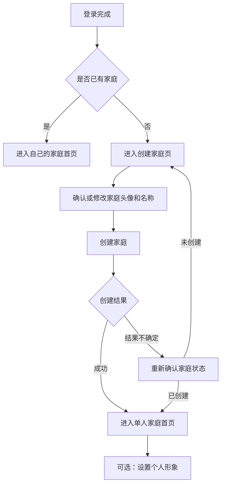

# PRD 003：创建家庭与初始形象

## 问题与目标

用户完成登录后，需要先拥有一个真实的家庭空间，才能继续邀请另一半和共同管理生活事项。当前阶段先跑通最小闭环：没有家庭的用户创建家庭，创建后成为家庭拥有者，并进入真实的单人家庭首页。

创建过程还需要给家庭和用户提供可辨认的头像、名称。默认形象由 AI 提前生成并随小程序提供，用户可以主动修改；创建过程不强制收集性别、微信头像或微信昵称。

## 用户流程

## 身份与权限

创建家庭前后使用以下身份。创建者是历史事实；创建家庭时，该用户同时成为首位家庭成员和家庭拥有者。

| 能力 | 未登录用户 | 已登录、无家庭 | 家庭拥有者 | 家庭成员（后续） |
| --- | --- | --- | --- | --- |
| 创建家庭 | 不可以 | 可以 | 不可以 | 不可以 |
| 查看当前家庭 | 不可以 | 不可以 | 可以 | 可以 |
| 修改自己的头像和昵称 | 不可以 | 不可以 | 可以 | 可以 |
| 修改家庭头像和名称 | 不可以 | 不可以 | 可以 | 可以 |
| 邀请和管理成员 | 不可以 | 不可以 | 后续开放 | 不可以 |
| 查看和处理家庭事项 | 不可以 | 不可以 | 后续开放 | 后续开放 |

家庭拥有者和普通成员在家庭资料及生活事项方面保持平等。拥有者身份不在页面上作为高低关系展示；后续仅用于邀请、转让等家庭管理能力。

## 产品要求

**进入与创建资格**

- R1. 已登录但尚未加入家庭的用户，进入产品后应看到创建家庭页，不应进入空白首页。
- R2. 已经属于某个家庭的用户，不再看到创建入口，也不能创建第二个家庭。
- R3. 用户离开创建页或关闭小程序不会产生家庭；再次进入时仍回到创建家庭页，并保留系统默认内容。

**家庭头像和名称**

- R4. 创建页默认展示一个 AI 生成的家庭头像，家庭名称预填“我们的小家”，用户可以直接创建。
- R5. 用户可以在创建前从内置家庭头像中选择，也可以从相册或相机选择自定义图片。自定义图片进入方形预览和裁剪，用户确认后才替换当前选择；取消时继续使用原头像，不影响创建。
- R6. 家庭名称为必填项，保存时去除首尾空格，不允许只有空格或包含换行。
- R7. 家庭名称最多 20 个用户看到的完整字符，组合表情整体按一个字符计算；页面和保存时使用同一规则，并显示剩余可输入数量。
- R8. 不同家庭可以使用相同名称，不需要用户反复尝试唯一名称。

**创建操作**

- R9. 用户提交后应看到“正在创建”状态，期间不能重复提交或修改表单。
- R10. 创建家庭、加入该家庭和成为家庭拥有者必须作为一个完整结果：要么全部成功，要么全部不生效。
- R11. 创建成功后直接进入正式家庭首页的单人状态，不增加单独的成功页。
- R12. 明确创建失败时，保留用户选择的头像和填写的名称，并给出可以理解、可以重试的提示。
- R13. 网络超时等结果不确定时，页面显示“正在确认创建结果”，期间禁止再次创建。产品应重新确认当前用户是否已经有家庭：已有家庭时按成功处理并进入首页；确认没有后才恢复创建按钮；确认本身失败时只提供“重新确认”和“稍后再试”，不能再次创建。
- R14. 连续点击、同时提交、超时后重试或重新进入产品，都只能得到同一个家庭和一份成员、拥有者关系。

**单人家庭首页**

- R15. 家庭首页以家庭头像和家庭名称作为主信息，显示“这个家暂时只有你一人”的真实状态。
- R16. 家庭首页展示当前用户的个人头像和昵称；未设置个人形象时，使用中性 AI 默认头像和称呼“小伙伴”。
- R17. 当前阶段不展示邀请入口、演示事项、事项统计和不可使用的快速添加按钮。
- R18. 点击家庭头像或名称可以编辑家庭资料；取消编辑时不保存本次修改，并继续显示编辑前的资料；保存失败时已保存资料保持不变，同时保留本次编辑内容供用户修改或重试。

**个人头像和昵称**

- R19. 点击个人头像或昵称后进入个人资料编辑状态，不在登录或创建家庭前强制索取资料。
- R20. 用户可以选择“小帅”“小美”“随机形象”或自定义资料；这些选项只代表展示偏好，产品不询问、不推断也不保存性别。
- R21. 选择“小帅”或“小美”时，使用对应的 AI 默认头像和昵称；头像保持可爱、中性，不使用服装、发型或颜色暗示固定性别。选择“随机形象”时，从中性 AI 默认形象中稳定选择一个，不因重新进入产品而变化。
- R22. 自定义时，用户可以主动选择微信头像，并选择微信昵称或手动填写昵称；头像和昵称可以分别修改。
- R23. 用户取消整个编辑时保留原资料；单独取消或无法使用微信头像、昵称选择时，也保留对应的当前资料，并允许继续修改另一项、手动填写昵称或使用默认形象。保存期间不能重复提交，失败时保留已选择或填写的内容并允许重试。
- R24. 个人昵称最多 12 个用户看到的完整字符，组合表情整体按一个字符计算；去除首尾空格后不能为空，不允许换行，页面和保存时使用同一规则。

**默认形象与内容安全**

- R25. 默认形象由 AI 在开发阶段提前生成并作为固定素材提供，不在用户创建家庭时临时生成。
- R26. 首版先准备 4 个中性个人头像和 3 个家庭头像，覆盖“小帅”“小美”“随机形象”和家庭默认展示；后续是否扩充根据真实使用情况决定。个人头像使用圆形，家庭头像使用圆角方形，确保用途容易区分。
- R27. 默认形象遵循现有品牌视觉标准，使用奶油白、薄荷绿和少量珊瑚色；不使用真人脸、明星形象、明显性别刻板印象、传统爱心或带烟囱房屋图案。
- R28. 用户填写的昵称、家庭名称以及选择的自定义图片需要通过内容检查后才能保存。提示必须指出是头像、昵称还是家庭名称未通过；创建过程中保留当前填写内容供用户修改，编辑已有资料时旧资料保持不变，同时保留编辑内容供用户修改后重试。
- R29. 内容检查进行中时显示明确状态并禁止重复保存。检查暂时不可用或结果不确定时，自定义内容不能保存；创建家庭的用户可以选择重新检查，或改用已经审核的默认头像和默认名称继续创建。
- R30. 自定义头像只接受常见图片，单张不超过 5 MB；选择后统一裁剪为正方形。图片无法识别、尺寸异常或上传失败时不替换现有头像，并提供重新选择入口。
- R31. 编辑家庭或个人资料时，如果存在未保存修改，点击返回或取消应先确认是否放弃；关闭小程序不会自动保存，重新进入后显示上一次已成功保存的资料。
- R32. 所有头像选择项同时提供文字名称和清楚的选中状态，不只依赖颜色或图片区分；可点击区域应适合手指操作，小屏幕或较大文字下可以换行或滚动，不遮挡保存、取消和错误提示。

**隐私与访问限制**

- R33. 用户只能修改自己的个人资料，不能修改另一名成员的头像或昵称。
- R34. 家庭头像、家庭名称和成员资料只对该家庭成员展示；其他账号即使直接尝试访问，也不能获得这些内容。自定义图片不能使用长期公开地址，查看图片时同样需要确认家庭归属。
- R35. 页面传来的用户或家庭编号不能作为权限依据，所有查看和修改都必须根据当前真实登录身份重新确认。
- R36. 内容检查只提交当前待检查的文字或图片，不附带不必要的用户和家庭资料；记录中不保存原始昵称、家庭名称或图片内容。
- R37. 头像替换成功后应清理不再使用的旧图片，只保留当前有效资料；后续开发退出家庭和账号注销时，必须同时明确相应资料的删除规则。

## 成功标准

- 新用户可以在一分钟内完成“登录 → 确认家庭资料 → 创建家庭 → 进入单人家庭首页”。
- 使用默认头像和默认名称时，用户不需要填写额外内容即可创建家庭。
- 创建后重新进入产品，仍然直接进入同一个家庭首页，不会再次要求创建。
- 空名称、纯空格、换行和超过 20 个字符的家庭名称无法提交；合法名称和表情可以正确保存。
- 连续点击、同时提交、成功结果未返回后重试等情况下，不会产生重复家庭或重复身份关系。
- 创建结果不会停留在“有家庭但用户未加入”或“用户已加入但家庭不存在”的残缺状态。
- 家庭首页展示真实家庭资料和单人状态，不展示演示事项或尚未开放的入口。
- 用户可以选择默认形象，或主动设置微信头像和昵称；跳过资料设置不影响使用。
- 用户可以修改家庭头像和名称，失败或取消时不会丢失原资料。
- 另一个未加入该家庭的账号无法查看或修改家庭及成员资料。
- 自定义图片超过大小限制、无法识别、检查未通过或检查暂时不可用时，不会替换已经保存的头像；用户仍能改用默认资料完成创建。
- 返回或关闭小程序不会意外保存未确认的家庭或个人资料。

## 范围边界

本阶段包含：

- 创建家庭页面和完整创建流程。
- AI 默认家庭头像、个人头像与默认称呼。
- 单人家庭首页及家庭资料编辑。
- 个人头像和昵称编辑。
- 创建、编辑过程中的等待、失败、取消和重复操作保护。
- 家庭及个人资料的最小访问限制。

本阶段不包含：

- 邀请码、邀请链接、微信分享和第二位成员加入。
- 成员移除、退出家庭、解散家庭和拥有者转让。
- 生活事项的新增、认领、完成和统计。
- 用户使用时实时生成 AI 头像。
- 性别资料、手机号、生日、地区和其他个人信息。

## 关键决定

- 先创建、后邀请：先验证用户能稳定建立自己的家庭空间，再扩展双人协作。
- 创建不依赖资料授权：默认头像和名称让用户可以直接完成主流程，个人资料编辑保持自愿。
- 形象偏好不等于性别：保留“小帅”“小美”的轻松表达，但不收集性别资料，也提供中性和自定义选择。
- 家庭资料由两名成员共同维护：家庭是共享空间，不把日常资料编辑做成上下级权限。
- 默认图片提前生成：保证页面立即可用，避免创建时等待、失败或产生额外费用。
- 创建后进入真实首页：不增加一次性成功页，也不使用演示事项伪装真实数据。
- 当前模块不单独面向真实情侣发布：邀请功能开放前，必须补上“两人已经分别创建单人家庭”时的恢复方案，避免双方都无法加入对方家庭。

## 前提与后续规划确认

- 登录功能已经能够识别“已登录、无家庭”并进入现有创建家庭说明页。
- 项目已经存在家庭首页入口，但当前内容仍是演示事项，本阶段需要将其替换为真实的单人家庭状态。
- 实施计划必须先确定每个真实登录身份只能拥有一份家庭归属，并保证重复或同时创建不会绕过这一限制。
- 微信头像、昵称选择能力及内容检查能力需要在目标微信版本和真机中验证；若平台能力不可用，默认形象和手动昵称仍应可用。
- 家庭成员共同编辑家庭资料时的冲突处理，在邀请功能开放前确定并纳入双账号验收；当前单人阶段不提前增加复杂协作处理。
- 具体页面拆分、保存方式、图片处理和检查方式在实施计划中结合现有项目确定，不改变本需求规定的用户体验和权限边界。

## 下一步

需求确认后进入实施计划，按“创建家庭主流程 → 单人家庭首页 → 个人与家庭资料编辑 → 默认形象与异常验证”的顺序拆分开发。
