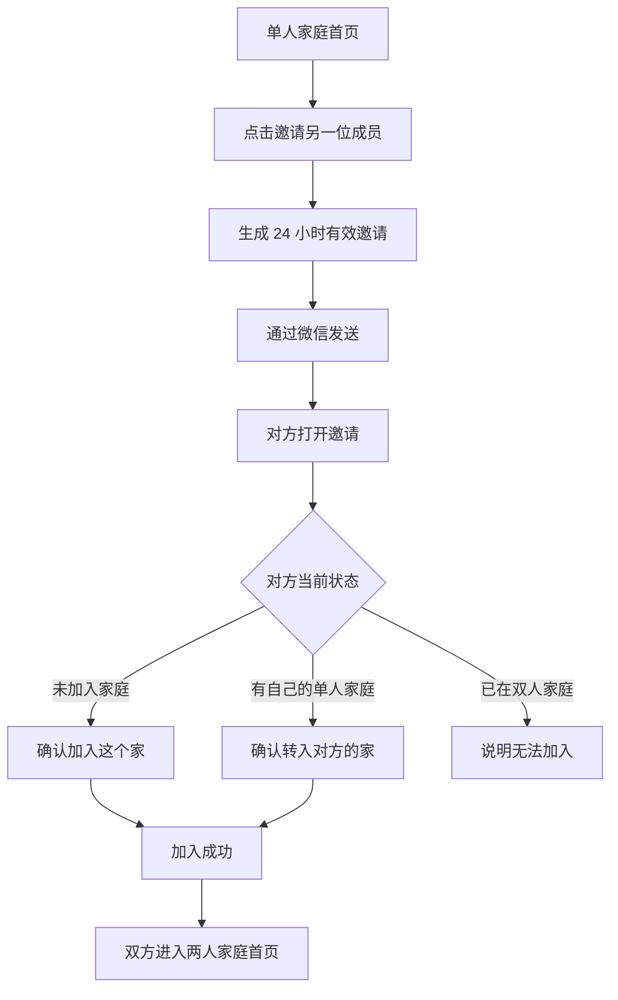

# PRD 004：邀请与加入家庭

## 问题与目标

创建家庭后，用户还不能和另一半共同使用产品。本需求要让一名已创建家庭的用户，能够通过微信邀请另一名用户加入；双方最终进入同一个、最多两人的家庭空间，为下一阶段的共同事项做准备。

本阶段的完整闭环是：创建者发出邀请 → 对方打开并确认加入 → 家庭从一人变为两人 → 两个人都能看到相同的家庭和成员资料。

## 核心规则

- 一个用户同一时间只能属于一个家庭。
- 一个家庭最多两名成员。
- 家庭创建者拥有发起和重新发送邀请的权限；两名成员在家庭资料和后续生活事项上保持平等。
- 一份邀请只可使用一次，有效期为 24 小时。
- 同一个家庭同时只保留一份有效邀请。重新发送会立即让旧邀请失效。
- 邀请通过微信分享发送，不提供手动输入邀请码的入口。
- 邀请链接只承载无法猜测的临时凭证，不能暴露成员身份或家庭内部资料。

## 用户流程

## 身份与权限

| 能力 | 未登录用户 | 已登录、无家庭 | 单人家庭创建者 | 双人家庭成员 |
| --- | --- | --- | --- | --- |
| 打开邀请 | 先登录后查看 | 可以 | 可以 | 可以 |
| 发起或重新发送邀请 | 不可以 | 不可以 | 可以 | 不可以 |
| 移除另一位成员 | 不可以 | 不可以 | 可以 | 不可以 |
| 确认加入邀请家庭 | 不可以 | 可以 | 不可以 | 不可以 |
| 从自己的单人家庭转入邀请家庭 | 不可以 | 不适用 | 可以 | 不可以 |
| 查看邀请状态 | 不可以 | 不可以 | 可以 | 不可以 |

创建者只是邀请管理的责任人，不在家庭首页显示为高低关系；加入后，两人的家庭资料编辑权限相同。

## 产品要求

### 邀请入口与发送

- R1. 家庭只有一名成员时，首页应显示明确可用的“邀请另一位成员”主按钮；家庭满两人后不再显示该按钮。
- R2. 点击后生成一份有效期为 24 小时的邀请，并调用微信分享；分享文案说明“邀请你加入我们的家”，不包含邀请凭证原文。
- R3. 生成成功后，首页显示“等待对方加入”以及失效时间，并提供“重新发送邀请”。
- R4. 重新发送前，应说明旧邀请会立即失效；用户确认后才生成新邀请。
- R5. 分享取消、网络失败或生成失败时，不改变当前家庭成员状态；若旧邀请仍有效，继续显示旧邀请的等待状态和重新发送入口。
- R6. 已有有效邀请时重复点击邀请，不生成第二份有效邀请，而是继续分享当前邀请。

### 打开邀请与确认加入

- R7. 受邀者打开分享后，如未登录，应先完成登录，再返回同一份邀请的确认页。
- R8. 邀请确认页展示邀请方的家庭头像、家庭名称和“目前 1 位成员”；不展示邀请方的账号或任何不必要的个人资料。
- R9. 未加入任何家庭的受邀者，点击“加入这个家”后成为第二位成员，并直接进入两人家庭首页。
- R10. 加入处理中禁止重复点击、返回后重复提交或通过多个页面同时确认。
- R11. 加入成功时，邀请立即失效，家庭成员数变为两人；创建者和新成员重新打开产品后都进入同一个家庭首页。
- R12. 加入失败时停留在确认页，保留邀请说明并给出可理解的原因和重试入口。

### 两个人都已创建单人家庭时的恢复方式

- R13. 如果受邀者已有且仅有一个人的家庭，不能直接静默加入。页面必须先显示“你也有一个只有自己的家”。
- R14. 页面提供两个明确选择：“暂不加入，保留我的家”和“加入对方的家”。默认不做任何改变。
- R15. 用户选择“加入对方的家”后，页面说明会放弃自己的单人家庭资料，但保留自己的昵称和个人头像；必须再次确认后才执行。
- R16. 转入只适用于受邀者家庭确实只有一名成员的情况。本阶段尚未有生活事项；事项上线后，转入规则必须重新确认，不能默认迁移或删除已有事项。
- R17. 转入成功后，受邀者的旧单人家庭不再保留，受邀者成为邀请家庭的第二位成员；邀请失效、家庭已满或操作失败时，旧家庭必须保持不变。
- R18. 两个人都已属于双人家庭时，不提供家庭合并、退出或强制加入；页面说明“你已经在另一个家中，暂时无法加入”。

### 邀请异常与结果不确定

- R19. 邀请不存在、格式异常、已失效、已被使用或家庭已满时，页面说明原因，并提供“请对方重新邀请”的提示；不自动跳到创建家庭页。
- R20. 创建者自己打开自己的邀请时，进入自己的家庭首页，不消费邀请。
- R21. 已属于邀请目标家庭的用户再次打开同一邀请时，直接进入家庭首页，不显示重复加入操作。
- R22. 两个用户同时确认同一份邀请时，只有第一个满足条件的用户成功加入；其他用户得到“这个家已经有两位成员”的结果。
- R23. 提交后页面未收到结果时，应先重新确认当前家庭和邀请状态。已经加入则按成功处理；确认仍未完成时，才允许用户重新尝试，不能造成第三位成员或重复归属。

### 首页与成员展示

- R24. 家庭满两人后，首页显示两名成员各自的头像、昵称和“我”的标记；不再显示“这个家暂时只有你一人”。
- R25. 单人家庭有等待中的邀请时，首页只展示真实的等待状态，不提前展示第二位成员的头像、昵称或事项数据。
- R26. 两人家庭首页暂不展示事项演示数据；下一份需求才开放“记下一件事”的真实入口。

### 创建者移除成员

- R27. 家庭已有两名成员时，只有创建者可以在成员资料页发起“移除成员”；普通成员看不到该操作，创建者也不能移除自己。
- R28. 发起移除时，页面必须显示被移除成员的头像和昵称，并明确说明“对方将不能再查看这个家，可重新创建自己的家”；用户再次确认后才执行。
- R29. 移除成功后，家庭立即恢复为单人状态，创建者可以再次邀请另一位成员；被移除者的昵称和个人头像保留，但不再能查看或修改原家庭资料。
- R30. 被移除者下次打开或刷新产品时，应看到“你已不在这个家中”的说明，并进入创建家庭页；不能继续看到旧家庭页面，也不能使用旧邀请重新加入。
- R31. 移除、成员数变更、旧邀请失效和访问权限更新必须作为一个完整结果：任一步失败时，成员关系与双方可见资料均保持原状。
- R32. 本阶段尚未有生活事项，因此移除不涉及事项归属。事项上线后，必须另行规定未完成事项、已完成记录和提醒如何处理，不能沿用本阶段直接移除的规则。

## 隐私与安全边界

- 邀请是否有效、家庭是否已满、用户能否加入，都由产品在提交时重新确认，不能只相信页面初次显示的结果。
- 非家庭成员不能通过猜测链接查看家庭头像、名称、成员资料或邀请状态。
- 邀请凭证不写入页面文案、普通日志或可被复制的错误信息；失效后不能恢复使用。
- 加入、转入、成员数更新和邀请失效必须作为一个完整结果：要么全部成功，要么都不改变。
- 只有当前真实登录用户能够确认自己的加入或转入，页面传来的用户、家庭或成员编号不能作为判断依据。

## 成功标准

- 创建者可在一分钟内发出一份微信邀请，并在首页看到真实的等待状态。
- 未加入家庭的受邀者可以顺利加入，双方随后都看到同一个两人家庭。
- 两个人分别创建单人家庭后，其中一人可以在充分确认后加入对方；失败、取消或条件不满足时，两边原有家庭都不受影响。
- 邀请失效、被使用、家庭满员、自己打开邀请和重复确认，均有明确结果，不会误创建家庭或产生第三位成员。
- 无关账号无法查看家庭资料、加入家庭或使用失效邀请。

## 范围边界

本阶段包括：

- 微信分享邀请、邀请等待状态、重新发送和失效。
- 受邀者登录后的确认加入。
- 从单人家庭安全转入邀请家庭的恢复流程。
- 创建者移除另一位成员，以及被移除者恢复为无家庭状态。
- 两人家庭首页的真实成员展示。
- 邀请相关的等待、取消、失败、过期、满员和重复操作提示。

本阶段不包括：

- 第三位及以上成员、多家庭、家庭合并。
- 退出家庭、解散家庭、拥有者转让。
- 邀请备注、聊天、推送提醒或通讯录推荐。
- 生活事项的新增、认领、完成、提醒和统计。
- 把已有生活事项从一个家庭迁移到另一个家庭。

## 关键决定

- 先邀请、后事项：先让两个人安全进入同一个家，再交付共同处理生活小事，避免单人待办先行而无法验证协作价值。
- 单人家庭可主动转入：当前尚未有事项数据时，允许用户明确选择放弃自己的单人家庭，解决双方分别创建后无法加入彼此的死结；绝不自动合并或删除。
- 创建者可移除成员：用于处理误加入或关系变化；操作必须二次确认，且只改变家庭归属，不删除对方个人资料。
- 邀请只有一份有效：减少用户分不清哪份邀请可用的情况，也避免同一家庭被多人同时加入。
- 家庭上限固定为两人：与产品面向情侣或年轻夫妻的首版定位一致；多人家庭另行评估。

## 下一步

本需求确认后，进入实施计划。建议按“邀请状态与分享 → 受邀者确认加入 → 单人家庭转入 → 两人首页与双账号验证”的顺序完成，并用两个真实账号验证所有加入和访问限制。
