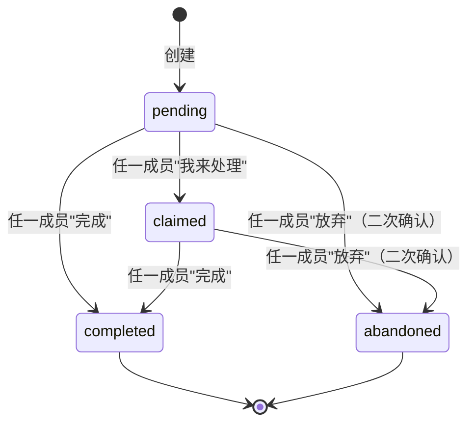
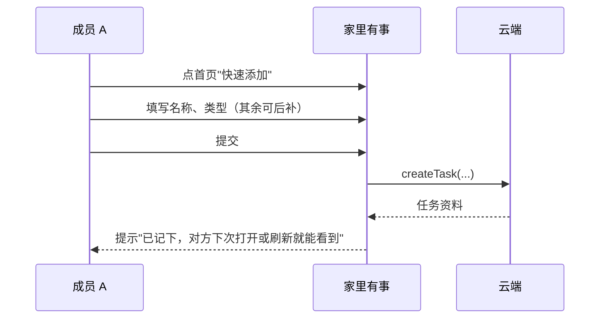
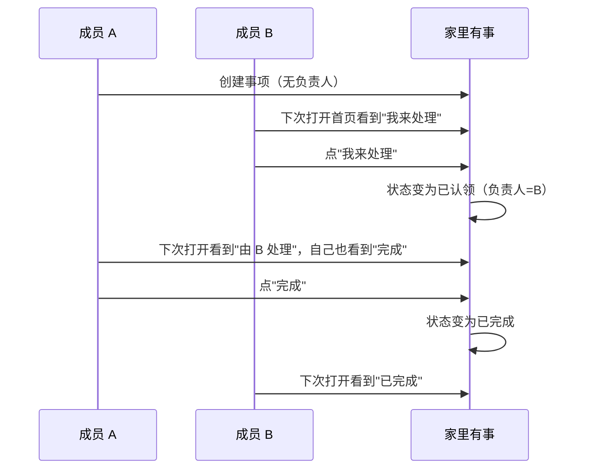
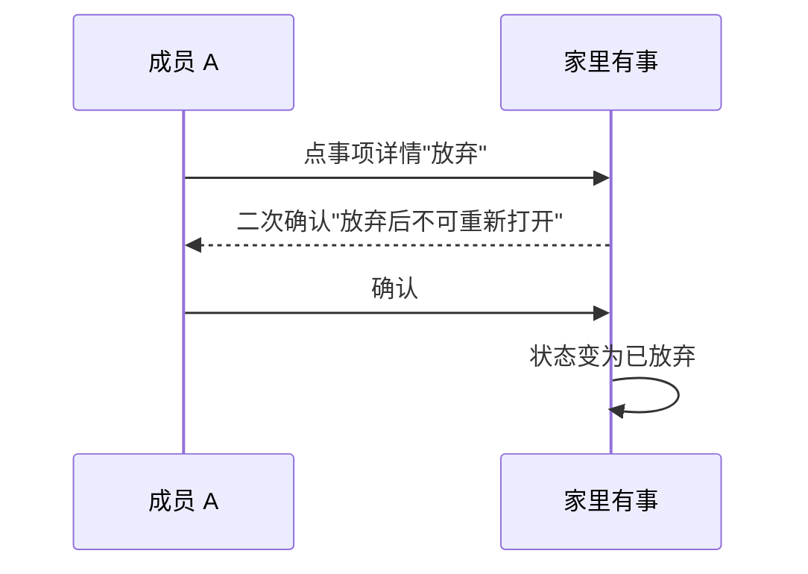

# PRD 005：共同事项的新增、认领、完成与放弃

## 问题与目标

邀请功能上线后，两个人已经能够进入同一个家，但家里还没有可以共同处理的事项。本需求要让两名家庭成员在同一个家里完成下面这件事：

```text
任一方新增事项 → 对方下次打开或刷新首页看到 → 任意一方认领 → 任意一方完成（或放弃）
```

第一版不追求"提醒"、"统计"、"积分"等扩展能力，只看两个真实成员能否在重复使用中顺畅完成上述闭环。

## 核心规则

- 家庭内事项对两名成员完全可见；非成员一律不可见。
- 任何家庭成员都能新增事项、认领未负责人的事项、完成已认领或未认领的事项、放弃任意未终止事项。
- 事项状态固定为四态：待处理 → 已认领 → 已完成；或 待处理 → 已认领 → 已放弃。已完成和已放弃是终态，不可重新打开。
- 不开放编辑、转交、删除；只有"完成"和"放弃"两个终止动作。
- 每次状态变化都生成不可伪造的操作记录，记录动作人和时间。
- 邀请规则与本需求保持一致：未加入家庭的人无法查看或修改家庭内任何事项。

## 概念与字段

### 事项类型

| 类型 | 适合记录的内容 | 首页分组 |
| --- | --- | --- |
| `low_stock` | 纸巾、洗衣液、垃圾袋、宠物用品 | 其他事项 → 快没了 |
| `to_handle` | 退货、维修、报销、预约、联系房东 | 其他事项 → 待处理 |
| `expiring` | 房租、会员、滤芯、保修、证件 | 其他事项 → 快到期 |

类型在创建时由用户选择；首版不允许修改。

### 事项字段

| 字段 | 必填 | 限制 |
| --- | --- | --- |
| 名称 | 是 | 1-20 个字符，受控文案校验 |
| 类型 | 是 | 上述三种之一 |
| 负责人 | 否 | 必须是当前家庭成员；未填写即"待处理" |
| 截止日期 | 否 | 仅日期（年-月-日），不允许具体时间 |
| 备注 | 否 | 最多 100 个字符 |

创建后字段不可修改。

### 状态

| 状态 | 含义 | 终态 |
| --- | --- | --- |
| `pending` | 待处理：无负责人 | 否 |
| `claimed` | 已认领：已有负责人 | 否 |
| `completed` | 已完成 | 是 |
| `abandoned` | 已放弃 | 是 |

状态机：



不允许的转移：completed/abandoned 之间或回到 pending/claimed（不重新打开）。

### 操作记录

每次状态变化写入一条 `taskEvent`：

| 字段 | 取值 |
| --- | --- |
| `kind` | `create` / `claim` / `complete` / `abandon` |
| `actorKey` | 发起动作的成员内部身份键 |
| `at` | 服务器时间 |

详情页底部按时间倒序展示"谁、什么时候、做了什么"，不展示内部身份键，只展示昵称。

## 用户流程

### 新增事项



### 认领与完成



### 放弃



### 移除成员后未完成事项

创建者移除另一名成员后，该成员的未完成事项**留在原家庭**（创建者继续看到），但被移除者不再能看到原家庭的任何事项，包括未完成事项的"待处理"列表。这与 PRD 003 的"个人资料保留、家庭资料不可见"对称。

## 身份与权限

| 能力 | 未登录 | 非家庭成员 | 单人家庭成员 | 双人家庭任一成员 |
| --- | --- | --- | --- | --- |
| 查看家庭内事项 | 不可以 | 不可以 | 可以 | 可以 |
| 新增事项 | 不可以 | 不可以 | 可以 | 可以 |
| 认领无负责人的事项 | 不可以 | 不可以 | 不适用 | 可以 |
| 完成事项 | 不可以 | 不可以 | 可以 | 可以 |
| 放弃事项 | 不可以 | 不可以 | 可以 | 可以 |
| 查看已完成/已放弃列表 | 不可以 | 不可以 | 可以 | 可以 |
| 编辑事项 | 不可以 | 不可以 | 不可以 | 不可以 |

权限由云端按当前登录身份和所属家庭身份键确认，前端不能伪造。

## 产品要求

### 新增

- R1. 首页在当前家庭有至少一名成员时，显示底部"快速添加"按钮；无家庭时该按钮不出现。
- R2. 添加页只要求事项名称和类型；负责人、截止日期、备注均可后补。
- R3. 创建时不可指定负责人——只能创建为"无负责人"（待处理），由后续成员"我来处理"或自己点"我来处理"成为负责人。
- R4. 提交后立即在首页看到该事项；对方下次打开或刷新即可看到。
- R5. 重复点击提交按钮只产生一个事项；网络失败时保留已填内容并提供重试。
- R6. 创建成功后提示"已记下，对方下次打开或刷新就能看到"；失败时停在添加页并说明原因。

### 认领

- R7. 无负责人的事项（待处理）首页显示"我来处理"；已认领的事项不显示该按钮。
- R8. "我来处理"点一次后状态变为已认领，负责人为当前用户；不可撤回、不可转交。
- R9. 同一事项的"我来处理"重复点击只产生一次状态变化；超时未确认时先查询当前状态再决定结果。

### 完成

- R10. 任一成员都能完成待处理或已认领事项；不限制为"仅负责人"。
- R11. 完成时不再弹二次确认；点一次即完成。
- R12. 完成后该事项从"待处理"列表移除，并进入"已完成"记录（永久保留，"我们的家→已完成"入口分页加载，每页 20 条）。
- R13. 实际完成人记入 `taskEvent`；UI 详情页显示"由 X 完成"。

### 放弃

- R14. 任一成员都能放弃待处理或已认领事项；点"放弃"必须弹二次确认"放弃后不可重新打开"。
- R15. 二次确认后状态变为已放弃，从"待处理"列表移除并进入"已完成/已放弃"记录。
- R16. 实际放弃人记入 `taskEvent`；UI 详情页显示"由 X 放弃"。

### 首页

- R17. 首页只显示未终止事项（待处理 + 已认领），分两组：
  - **优先处理**：截止日期是今天或已逾期的未完成事项。
  - **其他事项**：按类型分组（快没了 / 待处理 / 快到期）。
- R18. 同一事项在首页只显示一次：今天到期或已逾期的事项优先进入"优先处理"；其他按类型显示。
- R19. 排序规则：截止日期由近到远；无日期的排在同组最后。
- R20. 已完成和已放弃不在首页"待处理"区域展示；通过"我们的家→已完成"入口查看（永久保留，分页加载）。
- R21. 满 2 人但无未终止事项时，首页显示"先记下一件事"空状态；单人家庭仍显示邀请入口，事项区不显示。

### 详情页

- R22. 详情页顶部显示事项名称、类型、状态、截止日期。
- R23. 待处理：显示"我来处理"按钮（不显示负责人）。
- R24. 已认领：显示负责人昵称；两位成员都看到"完成"按钮。
- R25. 已完成：显示完成时间和实际完成人昵称；不显示完成按钮。
- R26. 已放弃：显示放弃时间和实际放弃人昵称；不显示完成/放弃按钮。
- R27. 详情页底部按时间倒序展示所有 `taskEvent`（创建、认领、完成、放弃）；每条只显示动作人昵称、动作、时间。

### 错误与边界

- R28. 网络失败时保留已填内容并提供重试；不假装成功。
- R29. 重复点击"我来处理"或"完成"或"放弃"按钮只产生一次状态变化。
- R30. 操作结果不确定（超时、丢失响应）时先重新查询当前事项状态：已生效则按成功处理；未生效才显示可重试。

## 隐私与安全边界

- 事项是否属于当前家庭、当前用户能否查看或修改，都由云端按当前微信身份确认；前端传来的事项编号或家庭编号不作为判断依据。
- 操作记录由系统生成，用户不能伪造或修改。
- 提交的家庭编号、用户身份和事项编号不作为判断依据。
- 完成、放弃、认领和创建必须在同一事务内完成；任一步失败时所有变化都不生效。
- 事项集合在数据库层面对小程序端完全不可读写，只能通过云函数访问。

## 成功标准

- 任一方新增事项后，对方下次打开或刷新首页即可看到。
- 双方都能认领无负责人的事项、都能完成任意未终止事项、都能放弃。
- 非家庭成员无法查看或修改任何家庭事项。
- 首页"优先处理"与"其他事项"分组规则按本 PRD 实现；同一事项在首页只显示一次。
- 已完成/已放弃事项在"我们的家→已完成"永久可查，按时间倒序分页加载。
- 重复点击和操作结果不确定不会产生重复事项、重复记录或错误状态。

## 双账号验收路径

> 与 PRD 004 同款,本节只补验收清单,不动需求。每项必须在测试云环境用两个真实微信账号走完。

1. **创建 → 双方可见。** A 创建三类事项各 1 个;B 刷新后能全部看到;A 自己也看到。
2. **认领闭环。** A 创建待处理事项;B 刷新后看到"我来处理",点击后状态变为已认领(负责人 B);A 刷新看到"由 B 处理",且 A 自己能点"完成"。
3. **完成闭环。** A 或 B 都能完成(任一成员);完成后该事项从"待处理"列表消失,进入"已完成",A 与 B 双方都能在"我们的家→已完成"看到,显示实际完成人。
4. **放弃闭环。** A 或 B 都能放弃,放弃需要二次确认;二次确认后才生效;放弃后双方都看不到该事项在"待处理"区,在"已完成"区能看到"由 X 放弃"。
5. **首页优先规则。** 同一家庭存在 4 个未终止事项,分别为:已逾期、今天到期、明天到期、本周到期。刷新后只看到 1 个"优先处理"和其余 3 个在"其他事项"按类型分组。
6. **重复点击保护。** 连续点 3 次"完成"按钮,只产生一条 `taskEvent`;事项状态只变更一次。
7. **超时后重试。** 提交认领时网络中断(DevTools 断网),页面停在"我来处理";恢复网络后重试,先查询当前状态,已生效则按成功处理。
8. **非成员访问。** 第三方账号 C(未加入任何家庭)直接打开分享链接或复制 URL,都看不到 A、B 家庭的事项详情;通过控制台拉取 `tasks` 集合的数据也只返回空(权限拒绝)。
9. **移除成员后归属。** A 创建双人家庭 → B 加入 → A 创建 3 个未终止事项 → A 移除 B → A 仍能看到这 3 个未终止事项;B 刷新后回到无家庭状态,看不到 A 的任何事项,包括这 3 个。
10. **历史保留与分页。** 累计创建 25 个事项,完成 25 个;打开"我们的家→已完成"翻页 2 次,看到 20 + 5 条,按时间倒序排列。

## 范围边界

本阶段包括:

- 三类事项的创建、认领、完成、放弃。
- 首页优先规则与按类型分组。
- 详情页与操作记录展示。
- 永久保留已完成/已放弃事项,分页加载。
- 移除成员后未完成事项的归属策略(留在原家庭变孤儿)。
- 网络失败、重复点击、操作结果不确定的明确提示。

本阶段不包括:

- 编辑事项(改名称、截止日期、备注)。
- 转交、重新打开。
- 删除未完成事项(只能放弃或完成)。
- 重复事项、模板、提醒、推送、附件。
- 多人家庭(>2 人)、统计、积分、排行。
- 把已有事项从一个家庭迁移到另一个家庭(PRD 004 R32 已确认本阶段不涉及)。

## 关键决定

- **任一成员都能完成和放弃,而不是仅限负责人。** 避免"等负责人不在就卡住"或"误建无法收场";代价是状态机多一个"已放弃"终止态。
- **认领只能是"我来处理",不开放创建时指定或转交。** 维持"不把人变成监督者"的承诺;代价是创建时不能预先分配负责人。
- **完成/放弃都需要二次确认(放弃),完成不需要(完成)。** 完成是高频正反馈,放弃是终止动作,需要护栏。
- **永久保留已完成/已放弃。** 重要的事不被时间抹掉;代价是云端多存储一些。
- **首页"优先处理"只算今天/逾期,不含未来 7 天。** 维持"现在该处理什么"的焦点;代价是明天到期的事项在"快到期"组里。
- **移除成员后未完成事项留在原家庭。** 与 PRD 003 的"个人资料保留、家庭资料不可见"对称;代价是被移除者不能带走自己的待办。

## 下一步

本需求确认后,进入实施计划(参见 `docs/plans/2026-08-14-003-feat-shared-task-plan.md`)。建议按"数据契约 → 云端 task 云函数 → 前端 task 状态与单飞 → 页面(添加/详情/首页)→ 部署与双账号验收"的顺序逐个单元交付,每单元完成跑 typecheck + 单元测试,真机/双账号验收留到最后。
