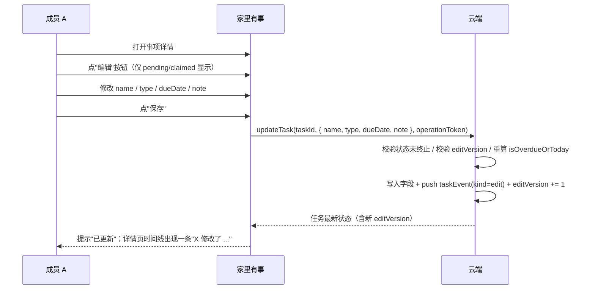
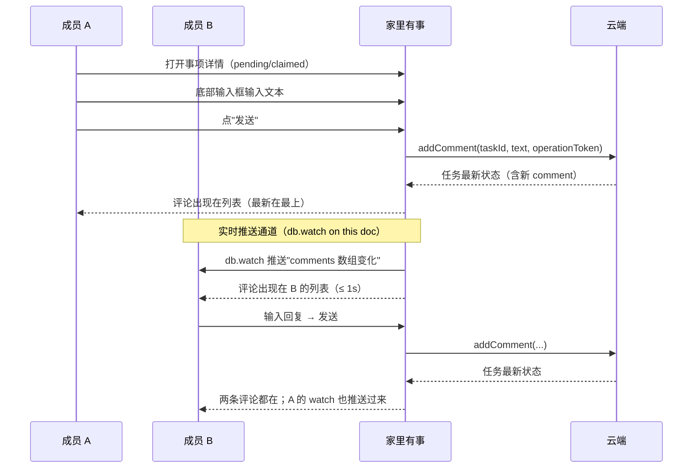
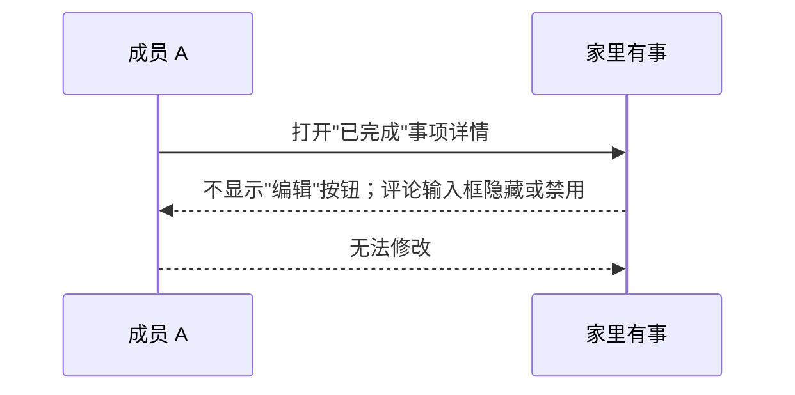

# PRD 006：事项的字段编辑与多人评论

## 问题与目标

PRD 005 把"创建 → 邀请 → 认领 → 完成 / 放弃 → 已完成记录"的闭环跑通后，在真实使用里立刻撞到两类高频痛点：

1. **打错字 / 写错日期 / 选错类型**——只能"放弃原事项 + 重新建一个"，信息会断。
2. **两个人想就同一件事聊几句**——比如"你真的要去这家店吗？""我下班顺路买"——现在只能打开微信单独聊，事项本身没有承载对话的位置。

本需求在 PRD 005 的状态机之上加两个能力：

- **编辑**：修改事项的名称、类型、截止日期、备注。
- **多人评论**：事项详情页底部增加一个不可改、不可删的对话流。

目标不是把 PRD 005 改造成另一个"任务管理工具"，而是用最小代价补齐上面两个最常被吐槽的体验裂缝。MVP 之外的"转交 / 重新打开 / 删除 / 重复事项 / 模板 / 提醒 / 附件"继续按 PRD 005 的"暂不做"清单保留，不在本期。

## 核心规则

- 编辑与评论都在 PRD 005 的 `pending → claimed → (completed | abandoned)` 状态机之外，属于**字段层 / 协作层**的能力；编辑不改变状态。
- 状态进入 `completed` 或 `abandoned` 后事项"封口"：**不能编辑任何字段，也不能继续添加评论**。这与 PRD 005 的"已完成不可重新打开"对称，避免"补一下时间"这种延迟修改。
- 任一家庭成员都能编辑或评论，跟 PRD 005 的"任一成员都能完成 / 放弃"对称——不把人变成监督者，承认"反正两个人都能完成，那也能改一下"。
- 评论一旦发出**不可修改、不可删除**。打错字就发一条新的"上一条修正"，保留原条以维持对话可追溯。
- 编辑行为本身在事项的事件流里留一条 `edit` 记录（哪个字段被改、谁改的、什么时候），与 create / claim / complete / abandon 处于同一时间线。
- 不开放编辑或转交负责人：负责人变更仍然只能通过"我来处理"产生；编辑只能改 PRD 005 已声明的字段（不含 assignee）。

## 概念与字段

### 事项新增字段

| 字段 | 类型 | 取值 | 来源 |
| --- | --- | --- | --- |
| `comments` | `TaskComment[]` | 每条 `{ id, actor, text, at }` | 本期新增 |
| `editVersion` | `number` | 整数，从 0 开始；每次编辑后 +1 | 本期新增 |

> `comments` 数组保存在事项文档内，不另起集合。理由：单事项评论数预期远低于云开发单文档 1 MB 软上限（按 200 字 × 200 条 ≈ 80 KB 估算仍有数倍冗余）；如未来需要分页再迁出。
> `editVersion` 用来在 updateTask 操作里做轻量乐观锁，避免两个成员同时编辑互相覆盖（详见 R41）。

### TaskComment 详情

| 字段 | 必填 | 限制 | 备注 |
| --- | --- | --- | --- |
| `id` | 是 | 云端生成的字符串 | 用于去重 / 客户端 key，不暴露内部编号 |
| `actor` | 是 | 必须是当前家庭成员 | 复用 `AssigneeDisplay`（昵称 + 内置头像） |
| `text` | 是 | 1-200 个字符；首尾去空白 | 受控文案校验，与 PRD 005 的 `note` 走同一份 `validateDisplayText` 工具 |
| `at` | 是 | ISO 时间 | 服务端写，不信任客户端 |

### 编辑事件 TaskEditEvent

| 字段 | 取值 | 备注 |
| --- | --- | --- |
| `kind` | `"edit"` | 复用现有 `TaskEvent` 的扩展点 |
| `actor` | AssigneeDisplay | 编辑人 |
| `at` | ISO 时间 | 服务端时间 |
| `changedFields` | `("name" \| "type" \| "dueDate" \| "note")[]` | 本次改了哪些字段的字段名数组；不改的字段不出现 |

> 不存旧值 / 新值。理由：MVP 暂不做"完整历史记录"（PRD 005 第 70 行已声明），存 diff 会扩大存储且需要设计 diff 展示；事件流只回答"谁、什么时候、改了哪些字段"。

## 用户流程

### 编辑字段

### 多人评论

> 编辑不接实时推送。编辑是低频动作，对方通过返回详情页 / onShow 刷新即可，不引入合并复杂度。

### 终态封口

## 身份与权限

| 能力 | 未登录 | 非家庭成员 | 家庭任一成员 | 仅当状态 |
| --- | --- | --- | --- | --- |
| 查看事项 | 不可以 | 不可以 | 可以 | 任何 |
| 查看评论 | 不可以 | 不可以 | 可以 | 任何 |
| 编辑字段 | 不可以 | 不可以 | 可以 | 仅 `pending` / `claimed` |
| 添加评论 | 不可以 | 不可以 | 可以 | 仅 `pending` / `claimed` |
| 编辑自己评论 | 不可以 | 不可以 | 不可以 | — |
| 删除自己评论 | 不可以 | 不可以 | 不可以 | — |

权限由云端按当前登录身份和所属家庭身份键确认，前端不能伪造。

## 产品要求

### 编辑

- R1. 事项详情页在状态为 `pending` 或 `claimed` 时，标题旁显示"编辑"按钮；`completed` / `abandoned` 状态下不显示该按钮。
- R2. 编辑入口在终端用户视角下与添加页一致：名称（1-20 字）、类型（三种选一）、截止日期（可选，yyyy-MM-dd）、备注（可选，1-100 字）。负责人字段**不**出现在编辑表单中。
- R3. 编辑表单与添加页的差别仅在标题（"编辑事项" vs "记一件事"）和提交按钮文案（"保存" vs "记下来"）；视觉与交互复用同一套 Wot UI 组件。
- R4. 同一时刻同一事项只允许一个未保存的编辑实例；用户在 A 详情页进入编辑后，B 端仍可点编辑入口（云端以 editVersion 拒绝冲突，后到的看到"已被 X 更新，请刷新"提示并返回只读详情）。
- R5. 编辑成功后在详情页时间线顶部追加一条 `edit` 事件，格式：`{actor} 在 {at} 修改了 {changedFields.join('、')}`。仅列出**有变化**的字段名；空操作（提交但字段未变）不产生事件。
- R6. 编辑后首页和"其他事项"分组按新的 `type` 重新归位；"优先处理"按新的 `dueDate` 重新判断"今天 / 逾期"；原"待处理 / 其他事项"显示位置同步刷新。
- R7. `note` 字段在编辑后保留云端校验（受控文案、≤100 字符），与创建时一致。
- R8. 编辑提交按钮在 `pending` / `claimed` 之外的状态下不可见；前端不再展示"保存"。

### 评论

- R9. 事项详情页在状态为 `pending` 或 `claimed` 时，底部显示评论输入框（多行文本框 + "发送"按钮）；`completed` / `abandoned` 状态下输入框隐藏。
- R10. 输入框为空或仅空白时"发送"按钮禁用。
- R11. 评论发送后立即在列表顶部出现（按时间倒序）；输入框清空；不刷新整页。
- R12. 评论列表空时显示"还没有留言"占位提示，不显示空数组容器。
- R13. 每条评论显示：发送人头像、发送人昵称、文本、相对时间（"刚刚 / X 分钟前 / yyyy-MM-dd HH:mm"）。
- R14. 评论**不可编辑、不可删除**。前端不提供编辑 / 删除入口；云端不开放 update / delete comment 动作。
- R15. 评论输入框在提交中（云端往返未结束）禁用"发送"按钮并显示 loading；提交失败时停在原输入文本、显示错误原因、提供重试。
- R16. 评论列表超过 50 条时改为按时间倒序分页加载（每页 20 条）；本期内大多数事项评论数远低于此，仅做接口预留，UI 默认一次拉完。

### 事件与时间线

- R17. 详情页底部时间线按时间倒序展示所有事件：`create` / `claim` / `complete` / `abandon` / `edit`（新增）。`comment` **不**进入时间线，作为独立区域展示。
- R18. 时间线中 `edit` 事件的展示文案：`{actor} 在 {at} 修改了 {changedFields.join('、')}`；`changedFields` 为空数组时不展示该事件（R5 兜底）。
- R19. `changedFields` 字段名展示为中文：`name → 名称`、`type → 类型`、`dueDate → 截止日期`、`note → 备注`。

### 错误与边界

- R20. 编辑或评论提交失败时，停留在当前编辑页 / 输入框，不假装成功。
- R21. 同一操作的重复点击只产生一次结果（沿用 PRD 005 的 `requestId + operationToken` 双凭证）。
- R22. 编辑 / 评论操作结果不确定（超时、丢失响应）时先重新查询当前事项状态：若事件已写入则按成功处理；否则显示可重试。
- R23. 前端传来的 `comments` 数组或 `editVersion` 不作为云端判断依据；只信任云端当前文档状态。
- R24. 评论内容、编辑内容、事件记录的写入必须在同一云函数调用内完成；任一子步骤失败时整笔回滚。

### 状态机扩展点

- R25. PRD 005 状态机不变；`edit` 与 `comment` 不在状态机内。
- R26. `editVersion` 字段独立于状态机；初始 0，每次 updateTask 成功 +1；前端在更新时携带当前 `editVersion` 供云端做 CAS 校验。

### 实时推送（仅评论）

> 编辑与状态变更不走实时推送。本节只约束"评论"在对方详情页"打开中"的实时同步。
> 选用 WeChat 云开发 `db.collection().doc().watch()` 实时数据推送（SSE 通道），不走裸 WebSocket，不新加 WS 云函数。

- R27. 详情页 `onLoad` 时，前端对当前任务文档建立 `db.collection('tasks').doc(taskId).watch({ onChange, onError })` 订阅；详情页 `onUnload` 时必须 `watcher.close()` 释放连接；不跨页面复用订阅。
- R28. 订阅回调收到的更新只用于**合并**到本地 `comments` 数组：以 `comment.id` 为去重键，已存在则忽略、不存在则按 `at` 倒序插入。**不**直接覆盖本地 `detail`，避免把本地正在编辑的字段、正在输入的评论草稿、刚发出去的乐观更新等本地状态一起冲掉。
- R29. 订阅回调触发时不需要重新拉取详情；只在"接收到的 `comments` 数组与本地不一致"时按 R28 合并。
- R30. 订阅断线（`onError` 触发、或 `onChange` 长时间不触发）时静默降级：详情页切回"下次 onShow 时强制拉一次"模式；不弹任何错误提示。重新进入详情页时再次尝试 `watch`。
- R31. 发起 `addComment` 的成员**不依赖** watch 来回显：云函数返回的最新文档就是 source of truth；watch 即使没回来，本地也已经是最新的。仅在"对方"侧，watch 是实时回显路径。
- R32. watch 的接入不影响 addComment / getTaskDetail 的幂等性与双凭证校验；不绕过云函数的内部键校验。
- R33. watch 回调里只读 `comments` 字段的更新用于合并；其他字段（`name` / `type` / `dueDate` / `note` / `events` / `editVersion`）的推送**忽略**，编辑仍然走"返回详情页 / onShow 拉取"路径，避免在 watch 里引入多字段合并复杂度。

## 隐私与安全边界

- 事项是否属于当前家庭、当前用户能否编辑或评论，都由云端按当前微信身份确认；前端传来的事项编号、家庭编号、用户身份键不作为判断依据。
- 评论写入由系统生成 `id` 与 `at`；客户端不可伪造。
- 编辑行为写入的 `edit` 事件不可由用户伪造或删除。
- 提交的家庭编号、用户身份、事项编号不作为判断依据。
- 编辑与评论写入必须在同一事务内完成；任一步失败时所有变化都不生效。
- 事项集合在数据库层面对小程序端完全不可读写，只能通过云函数访问。

## 成功标准

- 任一方编辑字段后，对方下次打开或刷新详情即可看到新值；首页和"其他事项"按新字段重新归位。
- 双方都能在 `pending` / `claimed` 状态添加评论；评论按时间倒序展示。
- 当 B 端的 task-detail 页处于"打开中"时，A 发出的评论 ≤ 1s 内出现在 B 的列表（实时推送通道工作）。
- 当 B 端 task-detail 页处于"未打开"（在首页或其他页）时，B 重新进入详情时拉取到 A 的评论（push 模式下用 onShow 拉取兜底）。
- 当 watch 断线时，详情页不报错、不弹 toast，静默回落到 onShow 拉取模式。
- `completed` / `abandoned` 状态下，"编辑"按钮和评论输入框均不出现，状态稳定。
- 评论一旦发出后**无任何**修改或删除入口（前端与云端均验证）。
- `edit` 事件正确出现在详情页时间线，列出本次有变化的字段。
- 重复点击编辑 / 评论按钮只产生一次结果；超时场景先查后判。
- 非家庭成员无法读取 / 编辑 / 评论任何家庭事项，也无法通过 `tasks` 集合直接读写（权限拒绝）。

## 双账号验收路径

> 与 PRD 005 / 004 同款，本节只补新增路径，不动旧路径。

1. **编辑后双方同步。** A 创建事项并填入 note；B 刷新后看到；A 把 name 改成"买 5L 装洗衣液"、把 type 从 `to_handle` 改成 `low_stock`、把 dueDate 改成今天；B 刷新后看到三个字段都变了，首页分组从"待处理"切到"快没了"且进入"优先处理"。
2. **编辑时间线。** A 改 name → 详情页时间线顶部出现"A 修改了 名称"；再改 dueDate → 多一条"A 修改了 截止日期"；空提交（不改任何字段）→ 不增加事件。
3. **编辑封口。** 事项进入 `completed` 后，"编辑"按钮不显示；此时前端通过修改 DOM 模拟显示并点保存，云端返回 `TASK_TERMINAL` 错误。
4. **评论按时间倒序。** A 发 3 条评论、B 发 2 条，详情页显示 5 条按时间倒序；最新发的人头像和昵称在最上。
5. **评论不可改不可删。** 详情页评论区不出现任何编辑 / 删除按钮 / 长按菜单；直接调云端 addComment 之外的 comment 写入动作返回 `TASK_INVALID_REQUEST`。
6. **评论封口。** 事项 `abandoned` 后，评论输入框不显示；B 调 addComment 云函数返回 `TASK_TERMINAL`。
7. **并发编辑。** A、B 同时打开编辑页，携带同一 `editVersion`；先保存的 OK，后保存的收到"已被更新"提示，详情自动刷新。
8. **评论 / 编辑与状态机解耦。** 编辑不改变 status；评论不改变 status；详情页 status chip 在编辑 / 评论前后保持一致。
9. **非成员读不到评论。** 第三方账号 C 直接调用 getTaskDetail 或 listCompleted，看到 `comments: []`（云端不返回非家庭成员的事项）；前端 service 校验也拒绝任何带 `_id` / `householdId` / `actorKey` 的评论。
10. **编辑触发的分组重排。** A 创建 dueDate=明天的事项，B 看到在"其他事项→快到期"；A 编辑成今天，A、B 双方都看到该事项移到"优先处理"。
11. **评论实时同步。** A、B 同时打开同一事项详情；A 发一条评论，B 端列表 ≤ 1s 内出现该评论（push 路径）；A 自己端列表也立即显示（write 路径，不依赖 push）。
12. **watch 断线降级。** DevTools 切到离线再恢复，A 发评论；B 端 watch 短暂断线时 B 看不到 → 切回前台后重新进入详情页 → onShow 强制拉取 → 看到评论；不弹错误提示。
13. **watch 范围控制。** 退出 task-detail 后（onUnload），watcher.close() 被调用；同一任务在首页 / 我的页等其他位置不再有 watch 订阅。云开发控制台"实时推送"调用计数与详情页访问次数基本一致，不应有过多冗余订阅。
14. **watch 不冲掉本地状态。** A 在详情页编辑框输入一半但没保存，此时 B 发评论；A 端 watch 回调触发 → 仅 comments 合并；编辑框内容、name/type/dueDate/note 字段值保持不变。

## 范围边界

本阶段包括：

- 字段层：编辑 name / type / dueDate / note；新增 `comments` 数组与 `editVersion` 乐观锁。
- 事件层：扩展 `TaskEvent` 增加 `edit` 类型；详情页时间线追加 `edit` 展示。
- 协作层：评论输入、评论列表、时间倒序、不可改不可删。
- 实时层：仅评论接 WeChat Cloud 实时数据推送（`db.watch`）；编辑不走实时，仍由 onShow / 详情返回拉取。
- 权限层：编辑 / 评论的云端鉴权，与 PRD 005 同样的"信任云端 + 拒绝内部键外泄"边界。

本阶段**不包括**：

- 转交负责人、重新打开、删除事项。
- 编辑 / 删除已发出的评论。
- 终态（`completed` / `abandoned`）后任何字段或评论的修改。
- 重复事项、模板、提醒 / 推送、附件、图片 / 视频。
- 多家庭（> 2 人）、统计、积分、排行。
- 完整编辑历史（含 diff 展示）。
- 编辑 / 状态变更的实时推送（仅评论走 watch；其他仍按 PRD 005 的 onShow 拉取模式）。

## 关键决定

- **编辑范围排除负责人变更。** 继续遵守 PRD 005 的"认领只能由'我来处理'产生"原则；编辑表单不含 assignee 字段，避免出现"我以为你接了结果是你以为我接了"这类沟通裂缝。代价：负责人想换人只能先放弃再认领。
- **终态全封口（编辑 + 评论都禁用）。** 简单且对称；不引入"封口后能加评论但不能改字段"这种半开放状态。代价：完成 / 放弃后不能追评。
- **评论完全不可改。** 与 Slack / Linear 等异步协作工具一致；短文本 + 即时对话场景下"打错字发一条新的"是更轻量的修复路径。代价：作者本人也无修改权。
- **`edit` 进时间线但 `comment` 不进。** 时间线回答"谁、什么时候、改了字段"（同步事件，关心顺序）；评论区是异步对话（关心内容本身）。混在一起会让时间线被评论淹没。
- **`editVersion` 乐观锁。** 不引入长事务；冲突时后到的成员看到提示并刷新，代价是同时编辑时第二个人的改动会丢失——但本场景下"两个人改同一份字段"本身就极罕见，可接受。
- **评论存在事项文档内，不另起集合。** 单文档 1 MB 软上限对"200 字 × 200 条"仍有数倍冗余；分页接口留口子但默认一次拉完。如未来评论数激增再迁出。
- **仅评论接实时推送，编辑不走。** "对话"是高频双向操作，watch 收益大；"编辑"是低频单向操作，对方下次 onShow / 返回详情就能看到。范围限定在 comments 字段上，watch 回调里**只**合并 comments，避免在 watch 里引入多字段合并冲突（编辑到一半被对方覆盖）。
- **实时推送走 WeChat Cloud `db.watch`，不新加 WebSocket 云函数。** WeChat 体系内最轻量的推送通道；前端 SDK 原生支持、自动重连；SSE 通道足够覆盖"评论同步"这种单向通知需求。

## 下一步

本 PRD 确认后，进入实施计划。建议按 PRD 005 同款的"数据契约 → 云端 task 云函数 → 前端 task 状态 → 页面（编辑 / 详情评论 / 首页）→ 双账号验收"逐单元交付；新增动作 `updateTask` / `addComment` 走与 `createTask` / `claimTask` 同样的身份键 + requestId + operationToken 三道闸门。`editVersion` 校验放在云端 domain 层，前端只读不写。
