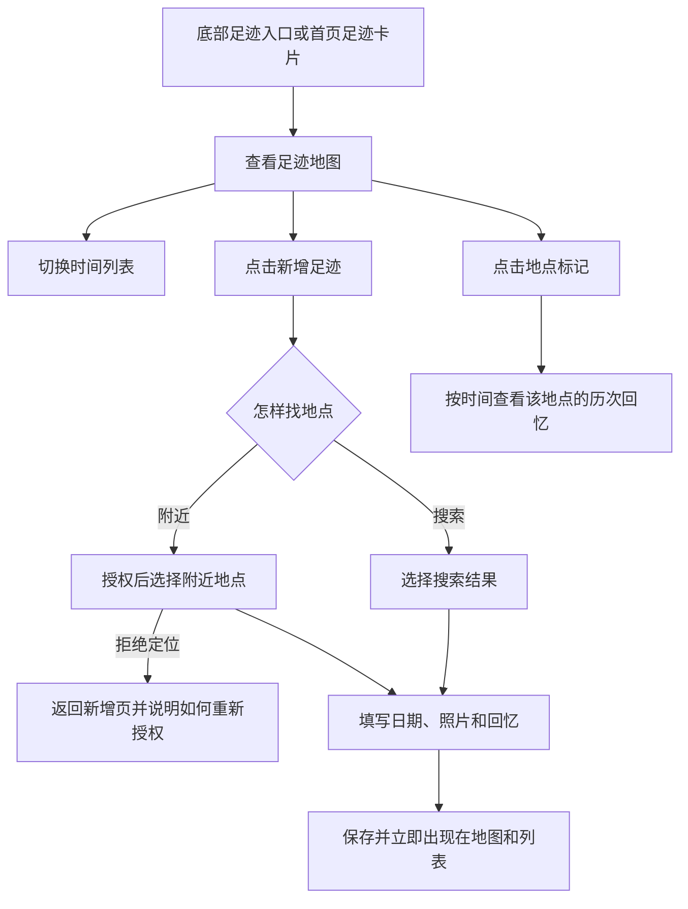

# PRD 011：我们的足迹（微信地图）

## 问题与目标

当前小程序能共同记事项和账目，但还不能保存“两个人一起去过哪里”的生活回忆。照片散落在手机相册里，地点、日期和当时的感受彼此分离，时间久了很难按地点重新找回。

本期增加“我们的足迹”：家庭成员可以在地图上搜索或选择地点，记录游玩日期、最多 3 张照片和一段回忆。地图负责回答“去过哪里”，时间列表负责回答“什么时候去了哪里”。同一地点重复游玩时，每次都保留为独立记录，不覆盖以前的回忆。

第一版只解决“共同保存并回看地点回忆”，不持续获取位置，也不记录移动路线。2026-09-03 用户追加的地点导航需求另见 PRD 012，不包含自动到达记录。

## 用户流程

## 核心规则

### 入口与总览

- R1. 底部增加“足迹”入口，现有底部入口保留，形成“首页 / 账本 / 足迹 / 我的”四个入口。
- R2. 首页增加“我们的足迹”卡片，展示累计地点数和游玩日期最近的一次足迹；点击后进入足迹页。补录较早的足迹不会顶替日期更近的记录。
- R3. “累计地点数”按地点去重计算；同一地点去了三次，累计地点数仍增加一次，但该地点显示三次游玩记录。
- R4. 足迹页默认显示地图，并提供“地图 / 列表”切换。切换只改变浏览方式，不改变当前家庭和数据范围。

### 地图与时间列表

- R5. 地图展示当前家庭所有未删除足迹的地点标记，并自动调整到能看见全部足迹的范围；没有足迹时展示引导新增的空状态。
- R6. 同一地点的多次记录在地图上合并为一个标记，标记显示去过次数。点击后按游玩日期从新到旧展示该地点的全部记录。
- R7. 时间列表按游玩日期从新到旧展示全部记录，每条至少显示地点名称、日期、首张照片（如有）和回忆摘要（如有）。
- R8. 地图或列表中的任一记录都能进入详情页，详情展示完整地点、日期、全部照片、完整回忆、创建者和最后修改时间。
- R9. 地图加载失败时，时间列表和已有足迹详情仍可访问；列表加载失败时，页面提供明确的失败提示和重试操作。

### 新增足迹

- R10. 用户点击“新增足迹”后，主动打开微信位置选择页；授权后可以搜索地点，也可以查看当前位置附近地点。
- R11. 用户拒绝或撤销定位权限后，仍能浏览地图和查看已有足迹；新增页明确说明需要位置权限才能打开微信位置选择，并只在用户再次主动点击时请求，不反复弹出授权。
- R12. 新增记录时，地点和游玩日期必填；照片与回忆文字选填。日期默认今天，可以补记过去的日期，不允许选择未来日期。
- R13. 每条记录最多上传 3 张照片；用户可以预览、替换和移除待上传照片。照片上传前移除可能携带的定位和设备信息；上传失败时不生成只有一部分内容的记录，已经上传的临时文件也必须清理。
- R14. 回忆文字最多 300 个完整字符，支持正常标点和换行；只填写地点和日期也可以保存。
- R15. 同一地点可以重复新增。每次新增都形成独立记录，保留各自的日期、照片和回忆。
- R16. 保存期间禁止重复提交；保存成功后，新记录立即出现在地图和时间列表中，首页累计地点数与最近足迹按规则重新计算。

### 共同维护与家庭变化

- R17. 当前家庭的所有成员看到同一份足迹，任何成员都可以新增、修改和删除任意足迹。
- R18. 删除前必须二次确认；删除成功后，双方的地图、列表、地点次数和首页统计同步更新。
- R19. 单人家庭也可以新增和维护足迹。新成员加入家庭后，可以看到并共同维护该家庭加入前的全部历史足迹。
- R20. 新成员首次打开已有历史足迹的家庭时，应明确提示“你将看到这个家庭此前保存的足迹”，避免把加入前的记录误解为双方共同经历。
- R21. 成员离开或被移出家庭后，不能继续查看、修改或删除原家庭足迹；足迹继续留在原家庭中。
- R22. 两名成员同时修改同一条记录时，后提交者不能静默覆盖先提交者的修改，应提示内容已有更新并要求重新确认。

### 隐私、费用与异常状态

- R23. 只有用户主动点击“查看附近地点”或“定位到当前位置”时才申请定位权限；打开首页、足迹页或查看历史记录时不自动获取当前位置，也不在后台持续定位。
- R24. 地点坐标、照片和回忆仅对当前家庭成员可见；用户身份和家庭归属由云端确认，不能信任前端传来的身份或家庭编号。微信位置选择只用于取得用户主动选中的地点名称、地址和坐标，并在隐私说明中告知用户用途。
- R25. 照片上传前应提示实际张数和失败状态；删除足迹后，小程序立即停止展示并停止签发新的照片访问地址，记录和照片在 30 天后完成物理清理。第一版不提供恢复入口。
- R26. 微信位置选择暂时不可用时，已有足迹仍能正常查看和维护，并明确提示“暂时无法选择地点”；本功能不接入第三方收费地图服务。
- R27. 页面必须覆盖正在加载、加载失败、空数据、定位被拒绝、搜索无结果、照片上传失败、保存中和重复点击等状态。
- R28. 新增或编辑页存在未保存内容时，用户返回前应获得放弃确认；主动放弃后清理本次尚未使用的照片文件。

## 页面行为

### 1. 首页“我们的足迹”卡片

- 有记录：显示“去过 X 个地方”、最近一次地点、日期和首张照片；没有照片时使用品牌化地点占位图。
- 无记录：显示“还没有共同足迹，去记录第一个地方吧”。
- 加载失败：卡片保留入口，并提供重试，不阻塞首页事项和账本内容。

### 2. 足迹页

- 顶部提供“地图 / 列表”切换和新增入口。
- 地图模式点击地点标记后，从页面下方展示地点摘要、去过次数和最近一次记录；继续点击可查看该地点的历次回忆。
- 列表模式以日期为主线，不按创建时间排序；补录去年的足迹应出现在去年对应位置。
- 页面记住用户本次使用中的地图或列表选择，重新进入小程序时仍以地图为默认视图。

### 3. 新增与编辑页

- 地点选择在前，日期、照片和回忆在后；没有选地点时不能保存。
- 编辑时允许更换地点、日期、照片和回忆；更换到已有地点后，该记录应归入新地点的历史中。
- 用户主动取消位置选择、图片选择或编辑，不产生半成品记录。
- 所有按钮、地图标记、切换项和照片操作区应满足微信小程序常用触控尺寸，并保持文字、图标和状态提示清晰可辨。

### 4. 详情页

- 同一地点的记录可以继续查看“这个地方还去过几次”。
- 照片支持逐张预览；没有照片或回忆时，不显示空白占位区域。
- 编辑和删除对所有当前家庭成员开放，删除操作必须再次确认地点和日期。

## 权限与可见性

| 场景 | 查看 | 新增 | 修改 | 删除 |
| --- | --- | --- | --- | --- |
| 当前家庭成员 | 可以 | 可以 | 可以 | 可以，需二次确认 |
| 单人家庭成员 | 可以 | 可以 | 可以 | 可以，需二次确认 |
| 新加入成员 | 可以查看全部历史 | 可以 | 可以修改全部历史 | 可以删除全部历史 |
| 已离开或被移出成员 | 不可以 | 不可以 | 不可以 | 不可以 |
| 未登录用户 | 不可以 | 不可以 | 不可以 | 不可以 |

## 验收标准

1. **双入口一致。** 从底部“足迹”和首页“我们的足迹”卡片进入，看到同一家庭、同一批记录；首页显示的累计地点数和最近足迹与足迹页一致。
2. **首条记录闭环。** 搜索并选择一个地点，填写过去日期、上传 3 张照片和回忆后保存；地图立即出现标记，列表按日期归位，首页同步更新。
3. **拒绝定位不影响回看。** 用户拒绝定位后，仍能正常查看地图、列表和详情；新增页说明需要位置权限，并提供再次主动尝试或打开设置的操作，再次进入页面不会自动申请定位。
4. **重复地点不覆盖。** 同一地点分别新增两次不同日期的记录；地图只显示一个地点标记并显示两次，地点详情保留两套照片和回忆，累计地点数只计算一次。
5. **共同编辑同步。** A 新增足迹后，B 能看到并修改；B 保存后，A 刷新地图、列表和详情均看到最新内容。
6. **共同删除同步。** B 删除 A 创建的足迹，确认后双方都无法再从地图、列表和详情访问；地点次数及首页统计正确减少。
7. **新成员历史可见。** 单人家庭先新增足迹，再邀请成员加入；新成员首次进入时看到历史提示，确认后可以查看、修改和删除这些记录。
8. **旧成员不可访问。** 成员离开或被移出家庭后，即使保留旧页面地址或记录编号，也不能读取原家庭的地点、照片和回忆。
9. **冲突不覆盖。** A、B 同时编辑同一记录，A 先保存后，B 的旧内容不能直接覆盖 A 的结果；B 收到更新提示并重新确认。
10. **位置选择故障可降级。** 微信位置选择失败时，已有足迹地图、时间列表、详情和编辑仍可使用，选择区域提供重试提示，不影响其他模块。
11. **异常上传不留残缺数据。** 3 张照片中任意一张上传失败时，页面明确指出失败照片并允许重试；未完整保存前，另一名成员看不到半成品记录。
12. **页面状态完整。** 实际检查加载、失败、空状态、无搜索结果、定位被拒绝、保存中和重复点击保护，文案与操作均可用。
13. **返回不误丢内容。** 新增或编辑到一半返回时出现放弃确认；选择继续编辑后内容仍在，确认放弃后不留下半成品记录或无主照片。

## 成功标准

- 两名家庭成员都能在不阅读说明的情况下，通过任一入口找到足迹页，并完成“选地点—填日期—加照片—保存—回看”的完整流程。
- 开启定位后可以搜索并选择地点；拒绝定位时已有足迹仍可完整回看，并能从新增页主动重新授权。
- 同一地点多次游玩的记录不会互相覆盖，地图次数、时间列表和首页统计始终一致。
- 第三方地点搜索或地图显示临时不可用时，用户仍能查看家庭已经保存的回忆。
- 正常网络下，只填写地点和日期的新增流程能够在一分钟内完成，避免足迹记录本身变成负担。

## 范围边界

本期明确不做：

- 自动记录移动轨迹、后台持续定位、路线回放。
- 自建导航、路线规划和交通信息；2026-09-03 追加的微信地图导航入口另见 PRD 012。
- “想去清单”、行程规划、提醒或待办联动。
- 地点分类、标签、评分、排行榜、勋章或城市统计。
- 评论、点赞、公开分享、朋友圈海报或家庭外访问。
- 视频、实况照片、原图长期保存或超过 3 张照片。
- AI 自动生成游记、图片识别地点或自动整理相册。
- 与账本自动关联消费记录。
- 同一家庭成员之间的部分可见、私密足迹或仅创建者可编辑。

## 关键决定

- **地图与列表并存。** 地图适合建立空间记忆，列表适合按时间回看，两者解决的是不同问题。
- **每次游玩独立记录。** 重复地点不覆盖旧回忆，同一地点在地图上合并，避免标记重叠。
- **两个入口。** 底部入口保证它是可持续使用的核心功能，首页卡片负责提醒和快速回看。
- **单人也可记录。** 家庭资料本身就是共享边界；新成员加入后继承完整历史，同时用首次提示避免语义误解。
- **双方共同维护。** 足迹属于家庭而非创建者，任何当前成员都能修正和删除，删除用二次确认降低误操作。
- **按需定位。** 只有用户主动新增或定位时才申请权限；拒绝定位不会影响查看已有回忆。
- **只使用微信原生位置能力。** 地图画面、地点搜索和附近地点均通过微信小程序原生能力完成，不接入高德或其他第三方收费地图服务。

## 依赖与假设

- 需要在微信小程序后台完成位置用途与隐私说明配置，并在真机上验证授权、拒绝和重新开启权限的完整流程。
- 微信原生位置选择返回地点名称、地址和坐标，不保证提供稳定的地点编号；同一地点合并规则需要由本项目根据名称、地址和坐标生成，并用测试防止误合并。
- 照片会占用微信云存储和下载流量；实施计划需要给出压缩、数量限制、清理和用量告警方案，不能把云存储视为永久免费。
- 足迹数据沿用当前家庭归属规则；若未来支持一个账号加入多个家庭，需要另开需求重新定义足迹归属。

## 待实施计划确认

- 地点的稳定去重规则，确保同一微信位置能合并，同时避免同名不同地点被误合并。
- 地图标记数量较多时的聚合与分页策略，以及主包体积是否仍满足项目预算。
- 照片压缩后的目标尺寸、单张上限和清理周期。
- 微信后台需要补充的隐私说明、服务域名和发布前检查项。

## 下一步

PRD 确认后，进入结构化实施计划；实施计划必须先完成微信位置隐私、地点去重和主包体积验证，再安排页面与数据开发。
