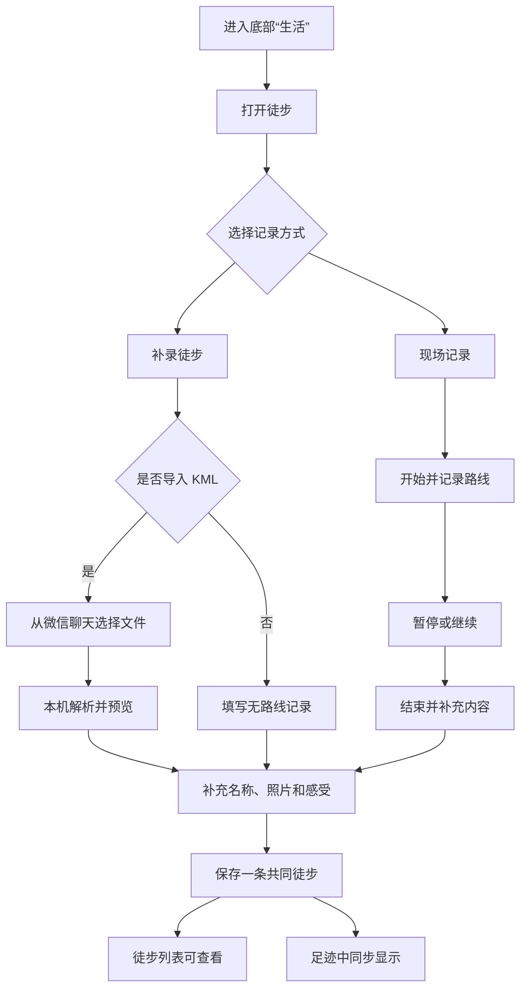

# PRD 016：“生活”入口与共同徒步记录

## 问题与目标

睦录已经可以共同记事项、账目和去过的地点，但现有足迹不能完整表达一次徒步走过的路线、距离、耗时和爬升。用户也希望有一个可以逐步承载减肥、骑行、徒步和追星等生活应用的入口，但这个入口仍然属于两个人的私密共同空间，不是公开社区。

本期增加第五个底部入口“生活”，第一版只开放徒步。用户可以在保持小程序打开时现场记录，也可以事后无路线补录，或从微信聊天导入 KML 路线。一次同行徒步只形成一条共同记录，保存后同时出现在徒步应用和现有足迹中。

第一版的核心目标是：无论路线来自现场记录、KML，还是根本没有路线，用户都能安全地保存一段共同徒步回忆；双方维护的是同一条内容，不需要在两个入口重复修改。

## 用户流程

## 核心规则

### “生活”入口

- R1. 底部增加第五个入口“生活”，用于展示两个人共同使用的生活应用，不出现陌生人动态、公开内容或社区互动。
- R2. 第一版固定展示“徒步、减肥、骑行、追星”四张应用卡片，不提供添加、移除、排序或个人常用列表。
- R3. “徒步”可以进入使用；减肥、骑行和追星明确显示“即将开放”，不能点击进入空页面。

### 共同徒步记录

- R4. 徒步记录属于当前家庭，保存后双方都能查看、补充照片、修改文字和更换 KML 路线。
- R5. 两个人同行时只产生一条共同记录，由其中一人负责现场记录；保存完成前，另一位成员看不到实时路线或当前位置。
- R6. 徒步首页提供“开始徒步”和“补录徒步”两个入口，并展示双方已保存的徒步；无家庭、加载中、加载失败、空记录、分页和重复点击都有明确反馈。
- R7. 现场记录和无路线补录支持名称、日期、地点、最多 3 张照片和感受。KML 导入只要求存在有效路线；缺少日期、地点或其他资料时仍可保存，对应位置显示“暂无数据”。

### 现场记录

- R8. 只有用户主动点击“开始徒步”并同意位置用途后，才开始记录。打开生活页、徒步页或历史详情时不得自动获取或持续记录位置。
- R9. 记录中展示当前路线、距离和有效徒步时长，并提供暂停、继续和结束。暂停期间不累计时长和平均速度，也不补画暂停空档。
- R10. 第一版以小程序保持打开时稳定记录为目标。用户离开小程序或定位中断后，返回时必须说明发生过中断；继续记录时新开一段，不能用直线连接两个未知位置。
- R11. 前台连续定位只有在当前小程序账号通过对应类目与接口审核、代码声明完整且真机验证通过后才开放。后台或锁屏记录不属于第一版完成条件，只有另行确认全部资格后才能作为增强能力开放。
- R12. 现场记录意外关闭、系统回收或手机重启时，在记录者本机保留最近一次完整草稿；再次打开后优先提示继续、结束并保存或放弃。放弃必须二次确认，未完成草稿不会共享给另一位成员，也不会进入足迹。

### 事后补录与 KML 导入

- R13. 事后补录不强制提供路线。无路线时可以填写名称、日期、地点、距离、时长、照片和感受；为了在足迹地图显示，无路线补录必须选择一个地点。没有海拔或其他可信成果时显示“暂无数据”。
- R14. 用户从微信客户端聊天会话选择 `.kml` 文件。文件先在记录者本机读取、解析和展示路线预览；用户确认保存前不得上传路线，也不得生成共同记录。
- R15. 第一版支持 KML 2.2/2.3 中含至少两个有效坐标的 `LineString`，多个 `LineString` 按分段路线处理。`gx:Track`、KMZ、Polygon、NetworkLink 和远程资源不在第一版范围。
- R16. KML 的公开限制为单文件不超过 5 MB、最多 20,000 个有效路线点、最多 100 段；地图展示最多使用 2,000 个抽稀点，但距离和可信海拔仍按完整的已接受路线计算。文件不能被静默截断。
- R17. KML 缺少日期、地点、时长、速度或海拔时，对应成果显示“暂无数据”，不强迫用户补填，也不猜测。首版 LineString 不从文件推测时长或速度；用户补填有效时长后才计算平均速度。
- R18. KML 一律按外部不可信文件处理：不访问外部地址、不执行文件内容、拒绝 DOCTYPE 和 ENTITY。文件损坏、无有效路线、坐标越界或超过限制时不生成记录，保留已填写内容并允许重新选择。
- R19. 保存后双方都能重新导入 KML。新路线必须先独立预览，只有用户确认且整条记录保存成功后才替换旧路线；失败、取消或版本冲突时继续保留原路线和原有内容。

### 成果与路线足迹

- R20. 有可信数据时展示距离、有效时长、平均速度、累计爬升、最高海拔和最低海拔；无可信数据时显示“暂无数据”，不能用默认值冒充实际成果。
- R21. 平均速度只使用有效徒步时长计算，手动暂停和未知中断时间不计入；第一版不自动判断用户是否休息。
- R22. KML 距离按完整 WGS 84 路线分段计算。只有 `altitudeMode=absolute` 且存在足够有效海拔点时，才计算 KML 海拔成果；贴地、相对地面或海拔噪声过大时显示“暂无数据”。
- R23. 徒步保存成功后自动成为一条路线足迹，不再要求用户重复确认或填写。足迹地图总览每条徒步只显示一个专属标记，完整路线只在详情中展开；无路线补录使用所选地点显示普通徒步标记。
- R24. 徒步应用和足迹展示的是同一条共同记录。任一入口修改名称、地点、照片、感受或路线后，另一入口保持一致。
- R25. 双方都能删除共同徒步。删除前必须二次确认，删除后徒步列表和足迹同时停止展示；记录、照片和路线资源沿用足迹 30 天清理规则。

### 隐私、权限与失败保护

- R26. 只有当前家庭成员能查看和修改已保存徒步。身份和家庭归属由云端按当前登录身份重新确认，不能相信手机提交的成员编号或家庭编号；成员离开家庭后不能继续取得记录或新的路线访问地址。
- R27. 位置权限拒绝、系统定位关闭或连续定位接口不可用时，页面说明受影响的能力，并继续提供手动补录和 KML 导入，不能阻塞整个徒步应用。
- R28. 保存、结束、替换路线和删除期间防止重复操作。两个人同时修改时，旧页面不能静默覆盖新内容，应提示记录已变化并保留当前草稿。
- R29. 定位信号弱、长时间没有有效位置或路线明显中断时，页面持续显示当前状态；用户仍能暂停、结束或暂存，未知位置不计入真实距离和爬升。
- R30. 普通日志不得记录完整坐标、KML 原文、路线临时地址、照片内容或徒步感受；只允许记录错误类型、文件大小、路线点数、段数和耗时等必要信息。
- R31. 每位成员默认 24 小时最多预约上传 10 条路线，同时最多保留 3 条未关联路线。达到限额只阻止新路线上传，不影响查看、编辑文字或删除已有记录。

## 页面行为

### 1. “生活”页

- 页面优先展示四张固定应用卡片，不加入应用市场、排行或推荐流。
- 徒步卡片明确可用；另外三张同时用文字和状态样式表达“即将开放”，不能只靠颜色区分。
- 底部栏目保持与现有页面相同的线稿图标、品牌颜色和切换行为。

### 2. 徒步首页

- 顶部说明这里保存两个人共同走过的路线和回忆。
- “开始徒步”和“补录徒步”是两个独立主入口。前台连续定位资格未确认时隐藏“开始徒步”，并说明当前可以补录或导入 KML。
- 列表只读取摘要与封面，不提前下载完整路线。没有日期、地点或成果时显示“暂无数据”。

### 3. 现场记录页

- 地图、距离、有效时长和信号状态始终可见；暂停、继续和结束不能只用图标表达。
- 位置被拒绝或持续失败时，提供重新授权或返回补录的操作，不反复自动弹窗。
- 主动退出时给出继续记录、暂存退出、放弃三个选择；放弃需要再次确认。

### 4. 补录与 KML 预览页

- 无路线补录先填写基本内容并选择地点；KML 导入先选文件、看路线、看可识别成果，再决定是否保存。
- KML 预览地图没有成功显示时，不开放最终保存；保留文件和填写内容，提供单独重试。
- 路线替换要明确展示将变化的路线和成果，取消时不改变旧记录。

### 5. 统一详情页

- 徒步首页、足迹列表和足迹地图标记进入同一个详情编号。
- 有路线时展示完整分段路线和成果；路线暂时加载失败时，文字、照片、编辑和删除仍可使用，并提供路线重试。
- 无路线时不显示空白地图，地点、成果、照片和感受按实际数据展示。

## 权限与可见性

| 场景 | 未完成现场草稿 | 已保存记录 | 修改/替换路线 | 删除 |
| --- | --- | --- | --- | --- |
| 记录者本人 | 本机可见 | 可以查看 | 可以 | 可以，需二次确认 |
| 当前家庭另一成员 | 不可见 | 可以查看 | 可以 | 可以，需二次确认 |
| 单人家庭成员 | 本机可见 | 可以查看 | 可以 | 可以，需二次确认 |
| 新加入成员 | 不可见历史草稿 | 可以查看家庭历史 | 可以 | 可以，需二次确认 |
| 已离开或被移出成员 | 不可见 | 不可见 | 不可以 | 不可以 |
| 未登录用户 | 不可见 | 不可见 | 不可以 | 不可以 |

## 验收标准

1. **入口清晰。** 五个底部入口能正确切换；生活页只有徒步可进入，另外三张卡片明确禁用。
2. **无路线补录。** 选择地点并填写最少内容即可保存；徒步和足迹出现同一个记录编号，没有路线和海拔时显示“暂无数据”。
3. **KML 本地预览。** 从微信聊天选择有效单段或多段 KML，保存前能看到路线和实际可识别成果；取消时不上传、不生成记录。
4. **不完整 KML 可保存。** 文件只有有效路线但没有日期、地点、时长或海拔时仍能保存，缺失信息不被猜测。
5. **恶意与超限文件安全失败。** 损坏、恶意实体、无路线、越界坐标和超限文件都不能卡死页面或生成记录，已填文字保持不变。
6. **现场记录闭环。** 在账号资格通过后，能完成开始、暂停、继续、结束、补充内容和保存；暂停与中断形成分段，未知空档不计距离。
7. **异常恢复。** 记录中强制关闭小程序或手机重启，再次进入能恢复最近完整草稿并选择继续、结束或放弃。
8. **保存前不共享。** 记录者未保存前，另一成员看不到路线或实时位置；保存后双方看到同一条记录。
9. **双入口一致。** 任一成员从任一入口修改文字、照片或路线，另一入口刷新后保持一致。
10. **替换失败保留旧路线。** 新 KML 解析、上传、保存或冲突失败时，旧路线和原有内容不变化，新草稿仍可恢复。
11. **共同删除。** 任一成员删除后，徒步和足迹同时停止展示，30 天清理后不留下孤立照片或路线。
12. **旧版本可用。** 云端先发布后，旧版小程序仍能正常查看原有地点足迹；只有新版请求才收到徒步联合数据。
13. **家庭边界。** 非成员和离开家庭成员不能读取记录或取得新的路线地址；已签发地址按最短可用期限失效。
14. **日志脱敏。** 自动搜索和人工检查确认日志中没有完整坐标、KML 原文、临时地址、照片或感受。
15. **真实环境分开验收。** 自动检查、微信开发者工具、云端配置、双账号和 iOS/Android 真机结果分别记录；跳过项不能写成通过。

## 成功标准

- 用户能从“生活”找到徒步，并理解这是两个人的共同记录工具，不是公开社区或实时位置监控。
- 用户可以补录没有路线的旧徒步，也可以导入 KML；在连续定位资格通过后，还能完成前台现场记录。
- 同一条徒步在徒步和足迹中的路线、成果、照片和感受始终一致，不出现两份需要分别维护的数据。
- 权限拒绝、接口未开通、文件缺资料、现场中断或网络失败时，用户仍能理解当前状态并保住已有内容。
- 第一版不依赖后台定位审批，也不依赖付费地图或外部文件处理服务。

## 范围边界

本期明确不做：

- 减肥、骑行、追星的实际功能。
- 公开路线、陌生人动态、好友关系、排行榜、点赞、评论或家庭外分享。
- 向另一位成员实时共享徒步中的位置、路线或安全状态。
- 自动休息、热量、分公里速度、运动训练或健康建议。
- 手动画路线、偏航提醒、离线地图、自建导航或救援功能。
- GPX、FIT、TCX、KMZ 或 `gx:Track` 导入。
- 手表、手机健康平台或其他运动应用同步。
- 未通过账号资格与真机验证时的锁屏、离开微信或后台持续记录。
- 需要自动付费的地图、运动分析或文件处理服务。

## 已确认决定

- 入口叫“生活”，不是“广场”；它承载私密共同生活应用，不暗示公开社区。
- 第一版只做徒步，另外三张卡片固定展示“即将开放”。
- 一次同行徒步只形成一条共同记录，由一人记录，保存后双方共同维护。
- 支持现场记录、无路线补录和 KML 导入，但现场记录受微信账号资格闸门控制。
- KML 先在本机解析和预览，原文不上传；无可信资料就显示“暂无数据”。
- 徒步保存后自动进入足迹，两个入口维护同一条记录。
- 足迹总览只显示一个徒步标记，完整路线只在详情展开。
- 不做实时伴侣定位，不把徒步扩成监督或安全监控功能。

## 依赖与假设

- 微信前台连续定位需要当前账号类目审核、接口开通、隐私说明和代码声明全部满足；当前账号状态仍需在微信公众平台实际确认。
- KML 只能从微信客户端会话选择，用户可能需要先把文件发到文件传输助手或聊天中。
- KML 使用 WGS 84，微信地图展示需要转换坐标；距离和海拔计算仍以原始已接受路线为准。
- 路线文件保存到私有云存储，只有云函数在重新确认家庭成员后签发短期访问地址。
- 文件上限与地图抽稀上限需要用中档 iOS/Android 真机压力测试；如需下调，必须先同步修改本 PRD、页面提示和测试。

## 实施前置状态

- 当前微信小程序账号是否已经开通 `startLocationUpdate` 与 `onLocationChange`，以及对应隐私声明是否完成。
- 本 PRD 已于 2026-09-17 由用户确认，作为本次开发的产品真相；连续定位资格未确认前，U6 保持关闭。

## 下一步

按 `docs/plans/2026-09-17-002-feat-hiking-life-app-plan.md` 从 U1 开始实现；U6 现场记录只有在平台能力闸门通过后才进入开发和验收。
